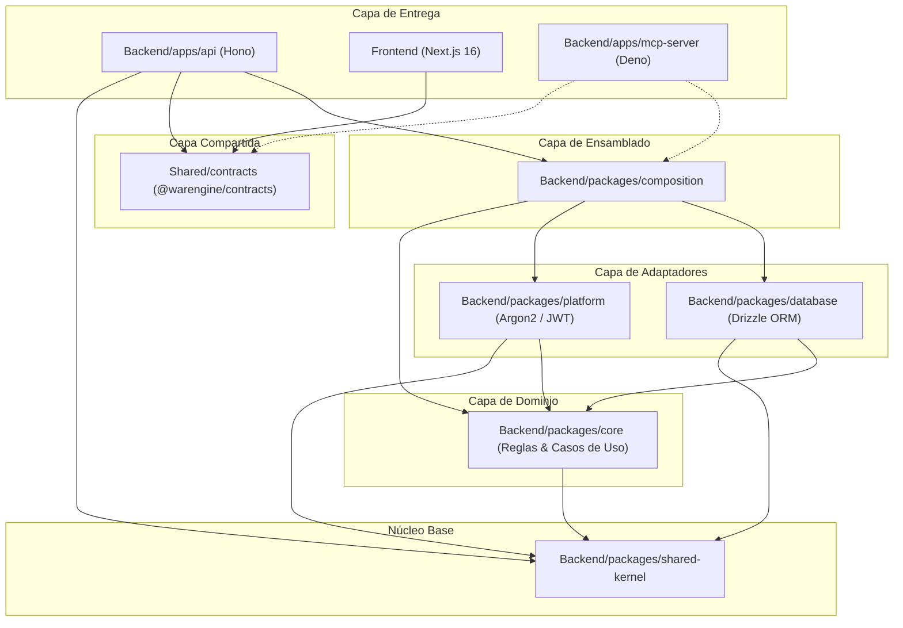

# Infraestructura y Arquitectura Técnica de Warengine

Este directorio documenta la arquitectura de capas, componentes técnicos, paquetes de infraestructura y contratos que dan soporte a los módulos de negocio de Warengine.

---

## 1. Índice de Documentos de Infraestructura

| Documento | Paquete / Ruta | Descripción |
|---|---|---|
| [Shared Kernel](./shared-kernel.md) | `Backend/packages/shared-kernel` | Primitivas universales sin dependencias (`Result<T,E>`, `DomainError`, `ResultadoPaginado<T>`). |
| [Base de Datos](./base-de-datos.md) | `Backend/packages/database` | Conexión MySQL con Drizzle ORM, esquemas tipados, repositorios, seeds y traductor de errores. |
| [Plataforma Técnica](./platform.md) | `Backend/packages/platform` | Adaptadores de seguridad y criptografía: Argon2 (hashing) y JWT HS256 (tokens). |
| [Composition Root](./composition.md) | `Backend/packages/composition` | Inyección de dependencias manual y determinista (`createContainer()`). Unifica core, database y platform. |
| [API REST](./api.md) | `Backend/apps/api` | Servidor HTTP Hono (puerto 8017), CORS estricto, authMiddleware, cookies HttpOnly y presenter de resultados. |
| [Contratos](./contratos.md) | `Shared/contracts` | Esquemas Zod compartidos entre Backend y Frontend, roles, permisos granulares y catálogo de auditoría. |
| [Frontend](./frontend.md) | `Frontend` | Arquitectura planificada en Next.js 16 (App Router), Feature-Sliced Design y aislamiento del backend. |

---

## 2. Diagrama de Dependencias Arquitectónicas

La arquitectura sigue los principios de la Arquitectura Limpia (Hexagonal / Clean Architecture). Las flechas indican dependencia directa de código (imports en TypeScript):

### Reglas de Dirección Inquebrantables:
1. `shared-kernel` tiene **cero** dependencias externas o internas.
2. `core` **nunca** importa de `database`, `platform`, `composition`, `apps` o `Frontend`. Solo conoce `shared-kernel`.
3. `Frontend` **nunca** importa código de `Backend/`. Se comunica exclusivamente por HTTP fetch y comparte tipos vía `Shared/contracts`.
4. `database` y `platform` implementan las interfaces (ports) definidas en `core`.
5. `composition` es el **único** paquete donde convergen `core`, `database` y `platform`.

---

## 3. Matriz Maestra de Variables de Entorno

A continuación se detalla cada una de las variables de entorno reconocidas y consumidas por el código fuente en el working tree actual:

| Variable | Requerida | Valor por Defecto | Consumidor en Código | Propósito y Reglas |
|---|---|---|---|---|
| `JWT_SECRET` | **SÍ** | *(Ninguno)* | [`Backend/packages/platform/src/config/jwt.config.ts`](../../Backend/packages/platform/src/config/jwt.config.ts) | Secreto criptográfico para firma de JWT (HS256). Debe tener al menos 32 caracteres; de lo contrario el arranque falla inmediatamente (RF-SA-D1). |
| `DB_HOST` | No | `'localhost'` | [`Backend/packages/database/src/client.ts`](../../Backend/packages/database/src/client.ts) | Host del servidor MySQL 8. |
| `DB_PORT` | No | `3306` | [`Backend/packages/database/src/client.ts`](../../Backend/packages/database/src/client.ts) | Puerto TCP de MySQL. |
| `DB_USER` | No | `'warengine_user'` | [`Backend/packages/database/src/client.ts`](../../Backend/packages/database/src/client.ts) | Nombre de usuario de MySQL. |
| `DB_PASSWORD` | No | `''` | [`Backend/packages/database/src/client.ts`](../../Backend/packages/database/src/client.ts) | Contraseña de acceso a MySQL. |
| `DB_NAME` | No | `'warengine'` | [`Backend/packages/database/src/client.ts`](../../Backend/packages/database/src/client.ts) | Nombre de la base de datos MySQL. |
| `NODE_ENV` | No | `'production'` | [`Backend/apps/api/src/utils/cookie.ts`](../../Backend/apps/api/src/utils/cookie.ts), [`seeds/run.ts`](../../Backend/packages/database/src/seeds/run.ts) | Si es `'development'`, relaja la directiva `secure` en cookies de sesión y habilita seeds de desarrollo. |
| `SEED_SUPERADMIN_PASSWORD` | Condicional | *(Ninguno)* | [`Backend/packages/database/src/seeds/super-admin.seed.ts`](../../Backend/packages/database/src/seeds/super-admin.seed.ts) | Contraseña inicial para el usuario super-admin al ejecutar `seed:dev`. Requiere mínimo 12 caracteres. |
| `CORS_ORIGENES` | No | `'http://localhost:3000'` | [`Backend/apps/api/src/main.ts`](../../Backend/apps/api/src/main.ts) | Lista de dominios permitidos separada por comas para habilitar credenciales CORS (RF-SA-D3). |
| `LOGIN_MAX_INTENTOS_CUENTA` | No | `5` | [`Backend/packages/composition/src/container.ts`](../../Backend/packages/composition/src/container.ts) | Número máximo de intentos fallidos antes de bloquear una cuenta. Debe ser entero > 0. |
| `LOGIN_VENTANA_CUENTA_MIN` | No | `5` | [`Backend/packages/composition/src/container.ts`](../../Backend/packages/composition/src/container.ts) | Ventana temporal (en minutos) para evaluar intentos fallidos por cuenta. Debe ser entero > 0. |
| `LOGIN_MAX_INTENTOS_IP` | No | `20` | [`Backend/packages/composition/src/container.ts`](../../Backend/packages/composition/src/container.ts) | Número máximo de intentos fallidos antes de bloquear una dirección IP. Debe ser entero > 0. |
| `LOGIN_VENTANA_IP_MIN` | No | `15` | [`Backend/packages/composition/src/container.ts`](../../Backend/packages/composition/src/container.ts) | Ventana temporal (en minutos) para evaluar intentos fallidos por dirección IP. Debe ser entero > 0. |
