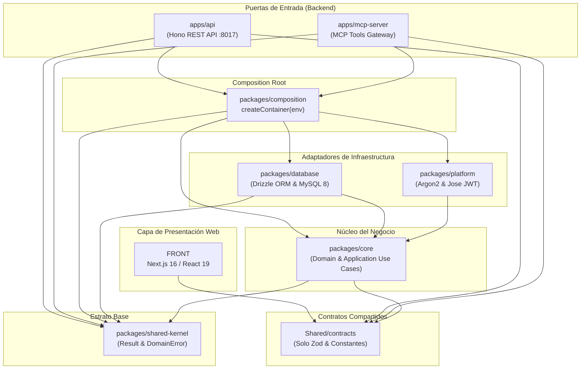

# Infraestructura Técnica — Warengine

Este directorio documenta los estratos técnicos, adaptadores, persistencia, contratos compartidos y puntos de entrada de Warengine. Cada documento refleja con fidelidad absoluta el código real existente en el repositorio.

---

## 1. Índice de Documentos de Infraestructura

| Documento | Paquete / Componente | Descripción Principal |
| :--- | :--- | :--- |
| [**shared-kernel.md**](./shared-kernel.md) | `packages/shared-kernel` | Bloques base puros de TypeScript: `Result<T, E>` y `DomainError`. Cero dependencias externas. |
| [**base-de-datos.md**](./base-de-datos.md) | `packages/database` | Persistencia Drizzle ORM sobre MySQL 8, conexión singleton UTC (`timezone: 'Z'`), tipo `varcharBin`, esquemas, mappers y seeds. |
| [**platform.md**](./platform.md) | `packages/platform` | Adaptadores técnicos: Hashing con Argon2id, Tokens JWT con `jose` (HS256, 15m), validación de secreto criptográfico. |
| [**composition.md**](./composition.md) | `packages/composition` | Composition Root (`createContainer`), inyección de dependencias, parseo defensivo de variables de entorno (`parseEnteroPositivo`). |
| [**api.md**](./api.md) | `apps/api` | API REST en Hono (Deno), middlewares de autenticación RBAC, CORS con lista blanca, cookies HttpOnly, presenters RFC 7807 y rutas. |
| [**contratos.md**](./contratos.md) | `Shared/contracts` | Fuente de verdad única: esquemas Zod, constantes de roles, permisos binarios, nombres de tools y catálogo de auditoría. |
| [**frontend.md**](./frontend.md) | `Frontend/` | Estado actual del cliente web en Next.js 16 / React 19 / Tailwind v4 (andamiaje inicial, stubs y estructura). |

---

## 2. Mapa Real de Dependencias entre Capas

---

## 3. Matriz Completa de Variables de Entorno

A continuación se consolidan todas las variables de entorno reconocidas activamente en el código fuente del working tree:

| Variable | Dónde se consume | Tipo / Formato | Valor por Defecto | Obligatoria en Prod | Propósito |
| :--- | :--- | :---: | :---: | :---: | :--- |
| `DB_HOST` | `packages/database/src/client.ts` `drizzle.config.ts` | String | `'localhost'` | No | Host de MySQL. |
| `DB_PORT` | `packages/database/src/client.ts` `drizzle.config.ts` | Entero | `3306` | No | Puerto TCP de MySQL. |
| `DB_USER` | `packages/database/src/client.ts` `drizzle.config.ts` | String | `'warengine_user'` | Sí | Usuario de conexión MySQL. |
| `DB_PASSWORD` | `packages/database/src/client.ts` `drizzle.config.ts` | String | `''` | Sí | Contraseña de MySQL. |
| `DB_NAME` | `packages/database/src/client.ts` `drizzle.config.ts` | String | `'warengine'` | Sí | Nombre de la base de datos. |
| `JWT_SECRET` | `packages/platform/src/config/jwt.config.ts` `packages/composition/src/container.ts` | String (>= 32 chars) | *(Ninguno)* | **SÍ** | Clave secreta para firma y verificación HS256 de tokens JWT. Falla si falta o es menor a 32 caracteres. |
| `NODE_ENV` | `apps/api/src/utils/cookie.ts` `database/src/seeds/run.ts` `database/src/seeds/super-admin.seed.ts` | String | *(Indefinido)* | Sí | Si es diferente de `'development'`, fuerza cookies HTTPS (`secure: true`). En seeds, bloquea contraseñas por defecto en producción. |
| `SEED_SUPERADMIN_PASSWORD` | `database/src/seeds/super-admin.seed.ts` | String | *(Ninguno en prod)* | Solo en seeds | Contraseña inicial para el usuario Super Administrador al ejecutar el seed. |
| `CORS_ORIGENES` | `apps/api/src/main.ts` | String (CSV) | `'http://localhost:3000'` | Sí | Lista separada por comas de URLs permitidas en la cabecera `Access-Control-Allow-Origin`. |
| `LOGIN_MAX_INTENTOS_CUENTA` | `packages/composition/src/container.ts` | Entero positivo | `5` | No | Umbral de intentos fallidos antes de bloquear una cuenta por correo. |
| `LOGIN_VENTANA_CUENTA_MIN` | `packages/composition/src/container.ts` | Entero positivo | `5` | No | Ventana de tiempo (en minutos) para conteo de fallos de cuenta. |
| `LOGIN_MAX_INTENTOS_IP` | `packages/composition/src/container.ts` | Entero positivo | `20` | No | Umbral de intentos fallidos antes de bloquear una dirección IP. |
| `LOGIN_VENTANA_IP_MIN` | `packages/composition/src/container.ts` | Entero positivo | `15` | No | Ventana de tiempo (en minutos) para conteo de fallos por IP. |

---

## 4. Puertos y Puntos de Servicio Predeterminados

- **API REST (apps/api):** `http://localhost:8017`
- **Base de Datos MySQL:** `localhost:3306` (Base de datos: `warengine`)
- **Frontend Web (FRONT):** `http://localhost:3000` (Dev server Next.js)
