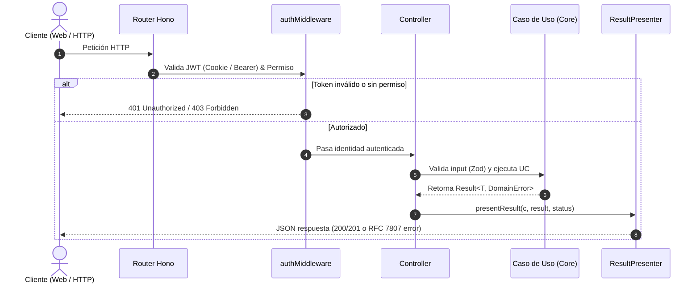

# API REST (`apps/api`)

Este documento describe la arquitectura, middlewares, manejo de seguridad, utilidades y enrutamiento del servidor HTTP de Warengine en `Backend/apps/api`.

---

## 1. Arquitectura General y Ciclo de Petición

La API REST está construida sobre **Hono** ejecutándose nativamente sobre el runtime de **Deno**. Su único rol es traducir peticiones HTTP a llamadas a casos de uso de dominio y presentar las respuestas o errores correspondientes.

### Punto de Entrada y Runtime
Ubicación: [`Backend/apps/api/src/main.ts`](../../Backend/apps/api/src/main.ts)
- Instancia el Composition Root: `const container = createContainer();`.
- Escucha peticiones en el puerto `8017` mediante `Deno.serve({ port: 8017 }, app.fetch)`.
- El entorno de ejecución backend corre bajo Deno, cuyos tipos globales de runtime residen en [`Backend/deno.d.ts`](../../Backend/deno.d.ts).



---

## 2. Política de Seguridad, CORS y Cookies

### 2.1 Lista Blanca de Orígenes (CORS)
- **Variable de Entorno:** `CORS_ORIGENES` (valor por defecto: `'http://localhost:3000'`). Permite una lista separada por comas.
- **Configuración:** Solo los orígenes presentes en la lista son aceptados en la cabecera `Access-Control-Allow-Origin`. No se utiliza comodín `*` cuando se envían credenciales (`credentials: true`).
- **Métodos y Cabeceras:** Permite `GET, POST, PUT, DELETE, OPTIONS` y cabeceras `Content-Type, Authorization`.

### 2.2 Gestión de Cookies de Autenticación (`cookie.ts`)
Ubicación: [`Backend/apps/api/src/utils/cookie.ts`](../../Backend/apps/api/src/utils/cookie.ts)

- **Nombres de Cookies:**
  - `access_token` (TTL: 15 minutos / 900 s).
  - `refresh_token` (TTL: 7 días / 604800 s).
- **Atributos de Seguridad:**
  - `httpOnly: true`: Inaccesibles para JavaScript en el navegador (mitigación XSS).
  - `sameSite: 'Lax'`: Protección ante ataques CSRF manteniendo compatibilidad de navegación.
  - `path: '/'`.
  - `secure: Deno.env.get('NODE_ENV') !== 'development'`: Transmisión forzada por HTTPS en producción; relajado solo si `NODE_ENV === 'development'`.

---

## 3. Middleware de Autenticación y Autorización (`auth.middleware.ts`)

Ubicación: [`Backend/apps/api/src/middlewares/auth.middleware.ts`](../../Backend/apps/api/src/middlewares/auth.middleware.ts)

```typescript
export function authMiddleware(container: AppContainer, permisoRequerido?: string)
```

1. **Resolución de Token:**
   - **Prioridad 1:** Lee la cookie HttpOnly `access_token`.
   - **Respaldo 2:** Si no hay cookie, inspecciona la cabecera `Authorization: Bearer <token>`.
   - Si no se encuentra ningún token, responde de inmediato con `401 Unauthorized`.
2. **Validación Criptográfica y de Permisos:**
   - Invoca `container.autenticacion.validarPermiso.execute(...)` enviando:
     - El token recibido.
     - El permiso requerido (opcional).
     - La IP de origen (`obtenerIp(c)`).
     - El método HTTP y la ruta de la petición.
3. **Auditoría de Acceso Denegado:** Si el usuario no tiene el permiso requerido, `ValidarPermisoUseCase` registra automáticamente un evento de acceso denegado en `logs_auditoria`.
4. **Inyección de Identidad:** Si la validación es exitosa, almacena `IdentidadAutenticada` en el contexto (`c.set(CLAVE_IDENTIDAD, result.value)`) para consumo de los controladores.

---

## 4. Presenter y Mapeo de Errores (`result.presenter.ts`)

Ubicación: [`Backend/apps/api/src/presenters/result.presenter.ts`](../../Backend/apps/api/src/presenters/result.presenter.ts)

Traduce las instancias de `Result<T, DomainError>` en respuestas JSON estandarizadas:

```typescript
export function presentResult<T>(
  c: Context,
  result: Result<T, DomainError>,
  successStatus: ContentfulStatusCode = 200,
)
```

### Tabla de Códigos de Estado HTTP según Error de Dominio

| Código de Estado HTTP | Errores de Dominio Mapeados |
| :---: | :--- |
| **`200 OK` / `201 Created`** | Operación exitosa (`result.isSuccess`). Devuelve el valor o `{ success: true }`. |
| **`401 Unauthorized`** | `CREDENCIALES_INVALIDAS`, `USUARIO_INACTIVO`, `TOKEN_INVALIDO`. |
| **`429 Too Many Requests`** | `LOGIN_BLOQUEADO` (bloqueo por exceso de intentos fallidos en IP o cuenta). |
| **`403 Forbidden`** | `PERMISO_DENEGADO` (rol o permisos insuficientes). |
| **`404 Not Found`** | `CATEGORIA_NO_ENCONTRADA`, `PROVEEDOR_NO_ENCONTRADO`, `SUCURSAL_NO_ENCONTRADA`, `USUARIO_NO_ENCONTRADO` o cualquier error que termine en `_NO_ENCONTRADO` / `_NO_ENCONTRADA`. |
| **`428 Precondition Required`** | `REQUIERE_2FA` (pendiente de implementación completa en use case). |
| **`422 Unprocessable Entity`** | `CLIENTE_B2B_DATOS_INCOMPLETOS` (violación de reglas de datos de cliente empresarial). |
| **`400 Bad Request`** | Errores de validación o violación de invariantes no clasificados arriba. |
| **`500 Internal Server Error`** | Excepciones no controladas atrapadas por `safeHandler`. |

Formato de respuesta de error:
```json
{
  "error": "CODIGO_DE_DOMINIO",
  "message": "Descripción clara del motivo del fallo"
}
```

---

## 5. Utilidades del Servidor (`src/utils/`)

| Utilidad | Ubicación | Responsabilidad |
| :--- | :--- | :--- |
| **`actor.ts`** | [`utils/actor.ts`](../../Backend/apps/api/src/utils/actor.ts) | Extrae `{ usuarioId, ip }` a partir de la identidad autenticada y la conexión TCP para poblar `ActorAuditoria`. |
| **`cookie.ts`** | [`utils/cookie.ts`](../../Backend/apps/api/src/utils/cookie.ts) | Operaciones de cookies HttpOnly (`setAuthCookies`, `clearAuthCookies`, `getTokensFromCookies`). |
| **`handler.ts`** | [`utils/handler.ts`](../../Backend/apps/api/src/utils/handler.ts) | `safeHandler(fn)` (atrapa excepciones y responde 500 uniforme) y `leerJson(c)` (lee body JSON de forma tolerante a fallos). |
| **`identidad.ts`**| [`utils/identidad.ts`](../../Backend/apps/api/src/utils/identidad.ts)| `obtenerIdentidad(c)`: Extrae de forma segura y tipada `IdentidadAutenticada` del contexto. |
| **`ip.ts`** | [`utils/ip.ts`](../../Backend/apps/api/src/utils/ip.ts) | `obtenerIp(c)`: Lee la IP de la conexión TCP directa (`getConnInfo(c).remote.address`). No confía en `X-Forwarded-For` para evitar suplantaciones en la auditoría. |

---

## 6. Enrutamiento y Prefijos de Rutas

El servidor monta los módulos bajo los siguientes prefijos en `main.ts`:

| Prefijo Base | Módulo | Función Creadora | Ubicación de Rutas |
| :--- | :--- | :--- | :--- |
| `/health` | Monitoreo | Directo en `main.ts` | Devuelve `Warengine API - OK`. |
| `/auth` | Autenticación | `createAutenticacionRoutes` | [`src/routes/autenticacion.routes.ts`](../../Backend/apps/api/src/routes/autenticacion.routes.ts) |
| `/administracion` | Administración & Auditoría | `createAdministracionRoutes` | [`src/routes/administracion.routes.ts`](../../Backend/apps/api/src/routes/administracion.routes.ts) |
| `/ventas` | Facturación *(Clientes)* | `createFacturacionRoutes` | [`src/routes/facturacion.routes.ts`](../../Backend/apps/api/src/routes/facturacion.routes.ts) |
| `/inventario` | Inventario *(Cat/Prov)* | `createInventarioRoutes` | [`src/routes/inventario.routes.ts`](../../Backend/apps/api/src/routes/inventario.routes.ts) |

*(Nota de Hallazgo: Las rutas de clientes están montadas bajo `/ventas/clientes` en lugar de `/facturacion/clientes`).*
