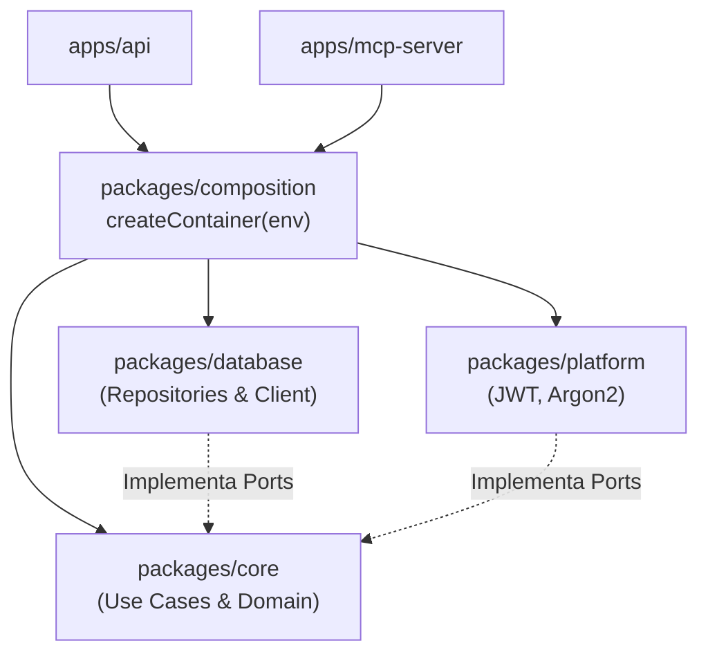

# Composición y Dependency Injection (`@warengine/composition`)

Este documento describe el **Composition Root** del backend de Warengine, ubicado en `Backend/packages/composition`.

---

## 1. Propósito y Principio Arquitectónico

Según la regla arquitectónica de dependencias limpias (ADR 0001), `composition` es el **único paquete del monorepo que conoce simultáneamente a `core`, `database` y `platform`**.

### Regla de Responsabilidad Única (SRP)
- **Cero lógica de negocio:** No toma decisiones empresariales ni evalúa reglas de dominio.
- **Cero HTTP o Web:** No contiene rutas, controladores ni middlewares.
- **Solo cableado (Wiring):** Su única función es instanciar repositorios, servicios técnicos y casos de uso, inyectando las dependencias necesarias y retornando el objeto contenedor tipado `AppContainer`.



---

## 2. Utilidades de Entorno (`env-parsers.ts`)

Ubicación: [`Backend/packages/composition/src/env-parsers.ts`](../../Backend/packages/composition/src/env-parsers.ts)

Función pura `parseEnteroPositivo(valor, nombreVar, valorPorDefecto)`:
- Valida que las variables numéricas de configuración sean enteros estrictamente positivos (`> 0`).
- Si la variable está ausente o en blanco, retorna el valor por defecto provisto.
- Si contiene texto no numérico, decimales, ceros o valores negativos, lanza un error impidiendo arrancar el sistema con configuraciones corruptas.

---

## 3. Función `createContainer(env)` y Árbol de Inyección

Ubicación: [`Backend/packages/composition/src/container.ts`](../../Backend/packages/composition/src/container.ts)

### Secuencia de Inicialización

1. **Persistencia (Database):**
   - Obtiene la instancia singleton de Drizzle ORM vía `getDatabase()`.
   - Instancia los 10 repositorios concretos:
     - `DrizzleUsuarioRepository`
     - `DrizzleRolRepository`
     - `DrizzleRefreshTokenRepository`
     - `DrizzleIntentoLoginRepository` (implementa tanto `IRegistroIntentosLogin` como `IControlIntentosLogin`)
     - `DrizzleSucursalRepository`
     - `DrizzleGestionUsuarioRepository`
     - `DrizzleClienteRepository`
     - `DrizzleCategoriaRepository`
     - `DrizzleProveedorRepository`
     - `DrizzleAuditoriaRepository`

2. **Servicios Técnicos (Platform):**
   - Valida el secreto JWT con `obtenerJwtSecret(_env)` (>= 32 caracteres).
   - Instancia `JwtTokenService(refreshTokenRepository, jwtSecret)`.
   - Instancia `Argon2PasswordHasher()`.

3. **Parámetros de Seguridad de Login:**
   - Lee y valida variables de entorno de bloqueo:
     - `LOGIN_MAX_INTENTOS_CUENTA` (def: 5)
     - `LOGIN_VENTANA_CUENTA_MIN` (def: 5)
     - `LOGIN_MAX_INTENTOS_IP` (def: 20)
     - `LOGIN_VENTANA_IP_MIN` (def: 15)
   - Construye la entidad de valor `PoliticaBloqueoLogin`.

4. **Casos de Uso (Core Application):**
   - Ensambla e inyecta cada caso de uso con sus repositorios y servicios correspondientes.
   - En casos de uso de mutación, inyecta `auditoriaRepository` para cumplir la regla de auditoría transversal (ADR 0002).

---

## 4. Estructura de `AppContainer`

La interfaz `AppContainer` expone los casos de uso organizados modularmente:

```typescript
export interface AppContainer {
  autenticacion: {
    login: LoginUseCase;
    logout: LogoutUseCase;
    validarPermiso: ValidarPermisoUseCase;
    renovarToken: RenovarTokenUseCase;
  };
  administracion: {
    listarSucursales: ListarSucursalesUseCase;
    crearSucursal: CrearSucursalUseCase;
    editarSucursal: EditarSucursalUseCase;
    listarUsuarios: ListarUsuariosUseCase;
    crearUsuario: CrearUsuarioUseCase;
    cambiarRolUsuario: CambiarRolUsuarioUseCase;
    cambiarEstadoUsuario: CambiarEstadoUsuarioUseCase;
    consultarAuditoria: ConsultarAuditoriaUseCase;
    restablecerPasswordUsuario: RestablecerPasswordUsuarioUseCase;
  };
  inventario: {
    listarCategorias: ListarCategoriasUseCase;
    obtenerCategoriaPorId: ObtenerCategoriaPorIdUseCase;
    crearCategoria: CrearCategoriaUseCase;
    editarCategoria: EditarCategoriaUseCase;
    inactivarCategoria: InactivarCategoriaUseCase;
    reactivarCategoria: ReactivarCategoriaUseCase;
    cambiarEstadoCategoria: CambiarEstadoCategoriaUseCase;
    listarProveedores: ListarProveedoresUseCase;
    obtenerProveedorPorId: ObtenerProveedorPorIdUseCase;
    crearProveedor: CrearProveedorUseCase;
    editarProveedor: EditarProveedorUseCase;
    inactivarProveedor: InactivarProveedorUseCase;
    reactivarProveedor: ReactivarProveedorUseCase;
    cambiarEstadoProveedor: CambiarEstadoProveedorUseCase;
  };
  facturacion: {
    registrarCliente: RegistrarClienteUseCase;
    buscarClientes: BuscarClientesUseCase;
  };
}
```

---

## 5. Pruebas Unitarias

Ubicación: `Backend/packages/composition/tests/container.test.ts`
- Valida que `createContainer` retorne correctamente todos los casos de uso instanciados y que responda ante configuraciones válidas o excepciones de entorno.
