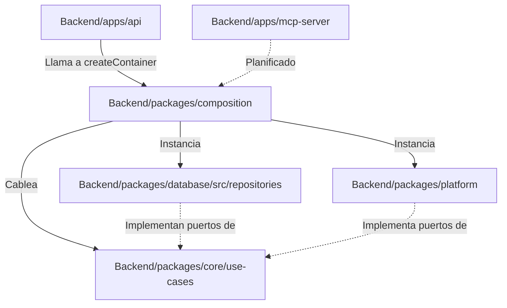

# Infraestructura: Composition Root (`@warengine/composition`)

> **Paquete:** `Backend/packages/composition`  
> **Dependencias:** `@warengine/core`, `Backend/packages/database`, `Backend/packages/platform`  
> **Regla de oro:** Es el **ÚNICO** lugar de todo el monorepo donde `core`, `database` y `platform` se conocen mutuamente. Aquí se cablea la inyección de dependencias manual.

---

## 1. Propósito y Filosofía de Diseño

Warengine no utiliza un contenedor de inyección de dependencias dinámico o basado en decoradores pesados (como NestJS o InversifyJS). En su lugar, utiliza el patrón **Pure DI / Composition Root** explícito en TypeScript:
1. Todas las dependencias son fuertemente tipadas y resueltas en tiempo de compilación.
2. La inicialización es determinista y no depende de reflexión o magia de runtime.
3. Se facilita el testing unitario y de integración al no existir estados globales ocultos.

---

## 2. Estructura y Funcionamiento

### 2.1 Punto de Entrada
- **Archivo:** [`Backend/packages/composition/mod.ts`](../../Backend/packages/composition/mod.ts)
- Reexporta todo el contenido de [`src/container.ts`](../../Backend/packages/composition/src/container.ts).

### 2.2 Interfaz `AppContainer`
Define el contrato de todos los casos de uso expuestos a los puntos de entrada (API REST o MCP Server), agrupados por contexto de negocio:

```ts
export interface AppContainer {
  autenticacion: {
    login: LoginUseCase;
    logout: LogoutUseCase;
    validarPermiso: ValidarPermisoUseCase;
    renovarToken: RenovarTokenUseCase;
  };
  administracion: {
    listarSucursales: ListarSucursalesUseCase;
    crearSucursal: CrearSucursalUseCase;
    editarSucursal: EditarSucursalUseCase;
    listarUsuarios: ListarUsuariosUseCase;
    crearUsuario: CrearUsuarioUseCase;
    cambiarRolUsuario: CambiarRolUsuarioUseCase;
    cambiarEstadoUsuario: CambiarEstadoUsuarioUseCase;
    consultarAuditoria: ConsultarAuditoriaUseCase;
    restablecerPasswordUsuario: RestablecerPasswordUsuarioUseCase;
    asignarSucursalesUsuario: AsignarSucursalesUsuarioUseCase;
    obtenerSucursalesUsuario: ObtenerSucursalesUsuarioUseCase;
  };
  inventario: {
    listarCategorias: ListarCategoriasUseCase;
    obtenerCategoriaPorId: ObtenerCategoriaPorIdUseCase;
    crearCategoria: CrearCategoriaUseCase;
    editarCategoria: EditarCategoriaUseCase;
    inactivarCategoria: InactivarCategoriaUseCase;
    reactivarCategoria: ReactivarCategoriaUseCase;
    cambiarEstadoCategoria: CambiarEstadoCategoriaUseCase;
    listarProveedores: ListarProveedoresUseCase;
    obtenerProveedorPorId: ObtenerProveedorPorIdUseCase;
    crearProveedor: CrearProveedorUseCase;
    editarProveedor: EditarProveedorUseCase;
    inactivarProveedor: InactivarProveedorUseCase;
    reactivarProveedor: ReactivarProveedorUseCase;
    cambiarEstadoProveedor: CambiarEstadoProveedorUseCase;
    listarProductos: ListarProductosUseCase;
    obtenerProductoPorId: ObtenerProductoPorIdUseCase;
    crearProducto: CrearProductoUseCase;
    editarProducto: EditarProductoUseCase;
    inactivarProducto: InactivarProductoUseCase;
    reactivarProducto: ReactivarProductoUseCase;
    cambiarEstadoProducto: CambiarEstadoProductoUseCase;
  };
  facturacion: {
    registrarCliente: RegistrarClienteUseCase;
    buscarClientes: BuscarClientesUseCase;
    abrirTurnoCaja: AbrirTurnoCajaUseCase;
    obtenerTurnoActual: ObtenerTurnoActualUseCase;
  };
}
```

---

## 3. Flujo de Inicialización: `createContainer()`

La función fábrica [`createContainer(_env?: Record<string, string>): AppContainer`](../../Backend/packages/composition/src/container.ts#L147) sigue 4 fases secuenciales:

### Fase 1: Carga y Validación de Configuración
Utiliza la función auxiliar interna `leerEnteroPositivo(valor, porDefecto, nombreVariable)` que garantiza que las variables numéricas sean enteros estrictamente positivos (`> 0`), lanzando excepción en caso contrario:
- `LOGIN_MAX_INTENTOS_CUENTA`: Límite de fallos por cuenta (default: `5`).
- `LOGIN_VENTANA_CUENTA_MIN`: Ventana de tiempo por cuenta en minutos (default: `5`).
- `LOGIN_MAX_INTENTOS_IP`: Límite de fallos por IP (default: `20`).
- `LOGIN_VENTANA_IP_MIN`: Ventana de tiempo por IP en minutos (default: `15`).
- Valida `JWT_SECRET` mediante [`validarYObtenerJwtSecret`](../../Backend/packages/platform/src/config/jwt.config.ts) (requerida, mínimo 32 caracteres).

### Fase 2: Instanciación de Repositorios
Obtiene la instancia de conexión singleton de base de datos con `getDatabase()` e instancia los repositorios concretos de Drizzle:
1. `DrizzleUsuarioRepository`
2. `DrizzleRolRepository`
3. `DrizzleRefreshTokenRepository`
4. `DrizzleIntentoLoginRepository` (usado tanto como lector y registrador de intentos fallidos)
5. `DrizzleSucursalRepository`
6. `DrizzleGestionUsuarioRepository`
7. `DrizzleClienteRepository`
8. `DrizzleCategoriaRepository`
9. `DrizzleProveedorRepository`
10. `DrizzleProductoRepository`
11. `DrizzleUsuarioSucursalRepository`
12. `DrizzleAuditoriaRepository`
13. `DrizzleTurnoCajaRepository`
14. `DrizzleSucursalOperadorRepository`

### Fase 3: Instanciación de Adaptadores Técnicos
Instancia los servicios de plataforma técnica:
- `JwtTokenService`: recibe `refreshTokenRepository` y `jwtSecret`.
- `Argon2PasswordHasher`: hashing de contraseñas con Argon2.

### Fase 4: Composición de Casos de Uso
Conecta cada caso de uso inyectando sus puertos requeridos:
- Casos de uso de mutación reciben su repositorio de dominio + `auditoriaRepository` para trazabilidad inmediata.
- Casos de cambio de estado de inventario (`CambiarEstadoCategoriaUseCase`, etc.) reciben los casos especializados de inactivación y reactivación.
- Casos de administración de usuarios reciben `passwordHasher` para aplicar derivación segura de credenciales temporales o nuevas.

---

## 4. Diagrama de Relación de Paquetes en Composition


