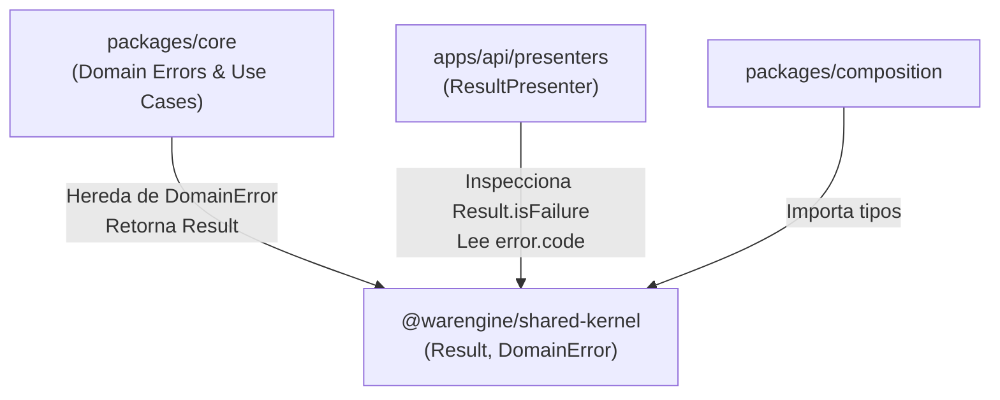

# Shared Kernel (`@warengine/shared-kernel`)

Este documento describe la arquitectura, componentes y reglas de diseño del paquete `Backend/packages/shared-kernel`.

---

## 1. Propósito y Reglas Arquitectónicas

El `shared-kernel` constituye el estrato base de todo el backend de Warengine. Provee tipos fundamentales y patrones esenciales para el modelado de dominio sin acoplarse a frameworks, bases de datos o librerías de terceros.

### Reglas de Pureza
- **Cero dependencias externas:** No importa `zod`, Drizzle ORM, MySQL, Oak/Hono, ni módulos de la standard library de Deno o Node.
- **Portabilidad total:** Es TypeScript puro. Puede ser copiado a cualquier entorno de ejecución TypeScript sin requerir ajustes.
- **Inmutabilidad de flujo:** Evita el uso de excepciones (`throw`) para errores previstos de negocio, forzando a los casos de uso a retornar tipos explícitos mediante el patrón `Result`.

---

## 2. Componentes Implementados en el Working Tree

El paquete expone dos clases fundamentales a través de su punto de entrada [`Backend/packages/shared-kernel/mod.ts`](../../Backend/packages/shared-kernel/mod.ts):

### 2.1 `DomainError`
Ubicación: [`Backend/packages/shared-kernel/src/DomainError.ts`](../../Backend/packages/shared-kernel/src/DomainError.ts)

Clase base abstracta de la cual heredan todos los errores de negocio de Warengine:

```typescript
export abstract class DomainError extends Error {
  public abstract readonly code: string;

  constructor(message: string) {
    super(message);
    this.name = this.constructor.name;
    Object.setPrototypeOf(this, new.target.prototype);
  }
}
```

- Obliga a cada error de dominio concreto a especificar una propiedad `code` inmutable (ej.: `'CREDENCIALES_INVALIDAS'`, `'SUCURSAL_NO_ENCONTRADA'`).
- Preserva la cadena de prototipos (`Object.setPrototypeOf`) para asegurar que comprobaciones con `instanceof` funcionen de manera consistente tras la transpilación.

### 2.2 `Result<T, E>`
Ubicación: [`Backend/packages/shared-kernel/src/Result.ts`](../../Backend/packages/shared-kernel/src/Result.ts)

Implementación del patrón Result tipado:

```typescript
export class Result<T, E extends DomainError = DomainError> {
  public get isSuccess(): boolean;
  public get isFailure(): boolean;
  public get value(): T;
  public get error(): E;

  public static ok<T, E extends DomainError = DomainError>(value: T): Result<T, E>;
  public static ok<T = void, E extends DomainError = DomainError>(): Result<T, E>;
  public static fail<T = void, E extends DomainError = DomainError>(error: E): Result<T, E>;
}
```

- **Acceso seguro:** Invocar `.value` sobre un resultado fallido o `.error` sobre un resultado exitoso lanza un error explicativo en tiempo de ejecución, forzando a validar primero `result.isSuccess` o `result.isFailure`.
- **Sobrecargas tipadas:** Permite `Result.ok()` para operaciones de tipo `void` (como comandos de actualización o eliminación) y `Result.ok(entidad)` cuando se retorna una entidad o DTO.

---

## 3. Estado de Componentes: Existentes vs. Planeados

En la documentación conceptual previa (`Docs/context/proyecto-warengine.md` y `README.md` del paquete) se mencionaba la presencia de abstracciones adicionales. La siguiente tabla contrasta lo existente en código contra lo pendiente:

| Componente | Estado en Código | Detalle / Observación |
| :--- | :---: | :--- |
| `DomainError` | **EXISTE** | Clase abstracta base en `src/DomainError.ts`. |
| `Result<T, E>` | **EXISTE** | Implementación completa con métodos estáticos `ok()` y `fail()` en `src/Result.ts`. |
| `Entity<T>` | **PENDIENTE** | No implementado. Las entidades en `packages/core` se declaran como clases independientes. |
| `ValueObject<T>` | **PENDIENTE** | No implementado. |
| `Money` | **PENDIENTE** | No implementado. Las operaciones monetarias actuales emplean tipos primitivos `number` o `string` decimal. |
| `Clock` | **PENDIENTE** | No implementado. |
| `Pagination` | **PENDIENTE** | No implementado en el kernel; la paginación de auditoría se define localmente en contratos/repositorio. |
| `ids` (UUID) | **PENDIENTE** | No implementado en el kernel. |

---

## 4. Consumo por Otras Capas



- **`packages/core`:** Todos los errores de dominio de cada módulo (`AutenticacionErrors.ts`, `AdministracionErrors.ts`, `InventarioErrors.ts`, `FacturacionErrors.ts`) extienden directamente `DomainError`. Todos los casos de uso retornan `Promise<Result<DTO, DomainError>>`.
- **`apps/api`:** El presenter [`ResultPresenter`](../../Backend/apps/api/src/presenters/result.presenter.ts) evalúa `result.isFailure` para transformar el `DomainError` recibido en una respuesta HTTP RFC 7807/9457 con el código de estado correspondiente.
