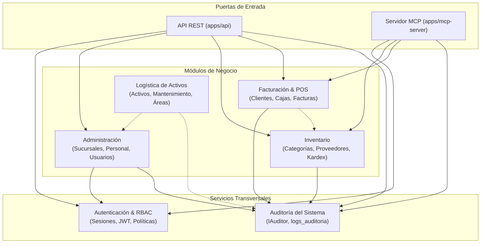

# Módulos de Negocio — Warengine

Este directorio contiene la documentación técnica detallada de cada módulo funcional y transversal de Warengine. Cada documento refleja con fidelidad total el estado actual del código en el repositorio, diferenciando rigurosamente lo implementado de lo pendiente.

---

## 1. Mapa de Módulos y Relaciones

El siguiente diagrama ilustra las dependencias y relaciones funcionales entre los módulos del sistema:

---

## 2. Tabla de Estado de los Módulos

| Módulo | Estado Actual | Alcance Implementado en Código | Pendientes Principales (SRS) | Documentación Técnica |
| :--- | :---: | :--- | :--- | :---: |
| **Autenticación** | `IMPLEMENTADO` | Login, Logout con revocación, Control de intentos y bloqueo (cuenta/IP), Refresh tokens con hash SHA-256, Middleware RBAC, Invalidación global de sesiones (`tokens_invalidados_en`). | 2FA TOTP (RF-AUTH-04), Recuperación por correo (RF-AUTH-05). | [autenticacion.md](./autenticacion.md) |
| **Administración** | `PARCIAL` | Gestión de Sucursales (CRUD completo), Gestión de Usuarios y Empleados (creación atómica, cambio de rol, activación/inactivación, reseteo de contraseña admin), Protección de último Super Admin. | Alertas administrativas (RF-ADM-04), Historial salarial (RF-ADM-06), Dashboard de métricas (RF-ADM-07). | [administracion.md](./administracion.md) |
| **Auditoría** | `IMPLEMENTADO` *(Transversal)* | Puerto `IAuditor`, sanitización estricta de credenciales (`sanitizarDetalles`), persistencia en `logs_auditoria`, consulta paginada y filtrada, triggers de inmutabilidad en BD. | Exportación a CSV/PDF (RF-AUD-03), Visualización de diffs JSON en frontend. | [auditoria.md](./auditoria.md) |
| **Inventario** | `PARCIAL` | Gestión completa de Categorías (7 casos de uso) y Proveedores (7 casos de uso): crear, listar, buscar por ID, actualizar, inactivar, reactivar y cambiar estado. | Productos, Stock por sucursal, Kardex, Alertas de stock bajo, Movimientos manuales (RF-INV-01 a RF-INV-07). | [inventario.md](./inventario.md) |
| **Facturación** | `PARCIAL` | Gestión de Clientes B2B y B2C (registro con validación de documento y tipo de persona, reutilización transparente de existentes con `yaExistia: true`, búsqueda por documento/término). | Apertura/cierre de turnos de caja, Emisión de facturas POS, Anulaciones, Devoluciones, Notas crédito (RF-FAC-01 a RF-FAC-08). | [facturacion.md](./facturacion.md) |
| **Logística** | `SOLO ESQUEMA` | Tablas creadas en base de datos (`activos`, `asignaciones_activos`, `mantenimientos_activos`, `areas`) con 6 triggers activos que controlan ciclo de vida. | Toda la capa de software (dominio, aplicación, repositorios, controladores, rutas) — RF-LOG-01 a RF-LOG-07. | [logistica.md](./logistica.md) |
| **Asistente IA (MCP)** | `ESQUELETO` | Estructura de servidor `apps/mcp-server`, catálogo de nombres (`tool-names.ts`), tabla de auditoría en BD (`logs_mcp_tools`). | Gateway de autorización, sesión JWT en MCP, Implementación de las 12 Tools operativas (RF-SA-i1 a RF-SA-i12). | [mcp.md](./mcp.md) |

---

## 3. Principios y Pautas de los Módulos

1. **Aislamiento de Dominio (Clean Architecture):** Cada módulo en `packages/core/src/modules/<modulo>` encapsula sus propias entidades, errores de dominio, puertos y casos de uso. No se permite que un módulo de dominio importe entidades de otro módulo directamente sin pasar por puertos o contratos compartidos.
2. **Auditoría Semántica por Evento (ADR 0002):** Ninguna operación de escritura se audita de forma ciega por middleware HTTP. Cada caso de uso de mutación inyecta `IAuditor` y registra explícitamente el evento con la estructura estándar `{ antes, despues }` únicamente tras completar la persistencia exitosa.
3. **Manejo de Errores con `Result<T, E>`:** Los casos de uso nunca lanzan excepciones no controladas (`throw`). Retornan instancias de `Result.ok(valor)` o `Result.fail(DomainError)`. Los controladores HTTP y el presenter (`result.presenter.ts`) traducen estos errores directamente a códigos de estado HTTP conformes a RFC 7807 / RFC 9457.
4. **Respeto a las Reglas de Base de Datos (Golden Rules):** En los módulos transaccionales (como facturación e inventario), los movimientos de stock provocados por venta o devolución son operados por triggers MySQL inmutables; el software jamás intenta duplicar dichos movimientos mediante inserciones manuales en `movimientos_inventario`.
