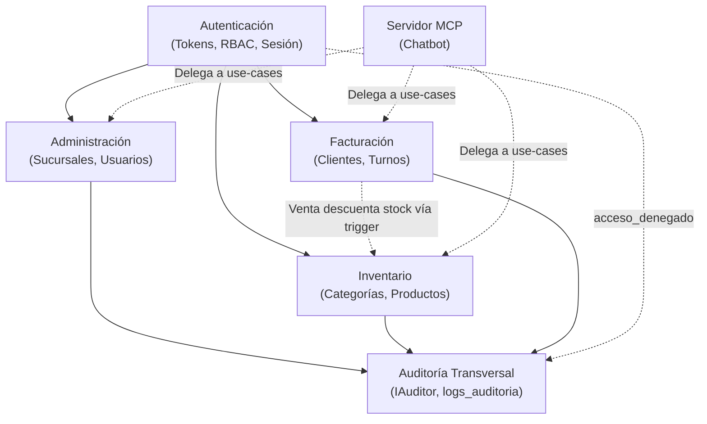

# Módulos de Negocio — Warengine

Este directorio contiene la documentación técnica detallada de cada módulo de negocio de Warengine. Cada documento ha sido verificado al 100% contra el código fuente en el working tree actual y sigue la plantilla estándar de Clean Architecture.

---

## Tabla de Estado de los Módulos

| Documento | Módulo | Estado Real | Resumen de Alcance Implementado | Alcance Pendiente |
|---|---|---|---|---|
| [autenticacion.md](autenticacion.md) | **Autenticación y Autorización** | **IMPLEMENTADO** | Login con rate limiting/bloqueo por cuenta e IP, doble token (JWT + Refresh con hash SHA-256), cookies HttpOnly, validación en tiempo real de `tokens_invalidados_en`, logout y RBAC granular por permisos. | Segundo factor (TOTP 2FA), recuperación de contraseña por email, contexto de sucursal en JWT. |
| [administracion.md](administracion.md) | **Administración** | **IMPLEMENTADO** (Parcial) | CRUD de sucursales con unicidad case-insensitive, gestión atómica de usuarios y empleados, cambio de rol y estado con protección del último Super Admin, reseteo de contraseñas y asignación multi-sucursal (`usuario_sucursales`). | Gestión de áreas, edición aislada de empleados, alertas administrativas, historial salarial y dashboard de métricas. |
| [auditoria.md](auditoria.md) | **Auditoría (Transversal)** | **IMPLEMENTADO** | Puerto `IAuditor`, catálogo tipado de acciones y entidades, función pura `sanitizarDetalles` con límite de recursión, inserción best-effort con respaldo en consola, triggers de solo inserción en BD y consulta paginada. | Columna `sucursal_id` para aislamiento de consultas de administradores locales; registro de invocaciones de Tools MCP. |
| [inventario.md](inventario.md) | **Inventario** | **PARCIAL** | Catálogo maestro de categorías, proveedores y productos con SKU único, validación cruzada de estado activo, auditoría diferencial con `cambioPrecio` y listados paginados. | Stock por sucursal (`inventario_sucursal`), entradas por compras, salidas manuales por merma/daño, ajustes de inventario y consulta histórica del kardex. |
| [facturacion.md](facturacion.md) | **Facturación y POS** | **PARCIAL** | Directorio de clientes con régimen B2C/B2B (dirección y teléfono obligatorios), reutilización por documento sin duplicados, apertura de turnos de caja con fondo inicial y control de concurrencia. | Cierre de turno con arqueo, emisión transaccional de facturas, ítems, pagos divididos, crédito corporativo, anulación y devoluciones de ventas. |
| [logistica.md](logistica.md) | **Logística y Activos Fijos** | **SOLO ESQUEMA** | Tablas `activos`, `asignaciones_activos` y `mantenimientos_activos` gobernadas por 7 triggers y restricciones CHECK en base de datos. Sin código en Core ni adaptadores. | Esquema Drizzle ORM, entidades de dominio, casos de uso, repositorios, controladores y rutas HTTP. |
| [mcp.md](mcp.md) | **Servidor MCP y Asistente IA** | **ESQUELETO** | Catálogo tipado de nombres de Tools (`TOOL_NAMES`) y permisos RBAC en contratos. Aplicación `main.ts` en esqueleto con TODO. | Integración del SDK de MCP, Gateway de Autorización, controladores de Tools, presenters MCP y telemetría en `logs_mcp_tools`. |

---

## Relaciones y Dependencias Cruzadas entre Módulos

---

## Enlaces a la Documentación de Infraestructura

Para comprender las capas transversales sobre las que se ejecutan estos módulos, consulte el índice de [Infraestructura](../../Docs/infraestructura/README.md):
- [Shared Kernel](../../Docs/infraestructura/shared-kernel.md)
- [Base de Datos](../../Docs/infraestructura/base-de-datos.md)
- [Platform](../../Docs/infraestructura/platform.md)
- [Composition Root](../../Docs/infraestructura/composition.md)
- [API REST](../../Docs/infraestructura/api.md)
- [Contratos Compartidos](../../Docs/infraestructura/contratos.md)
- [Frontend](../../Docs/infraestructura/frontend.md)
