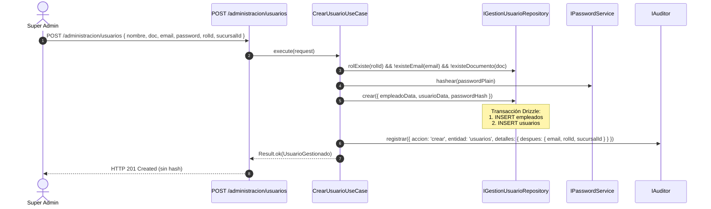
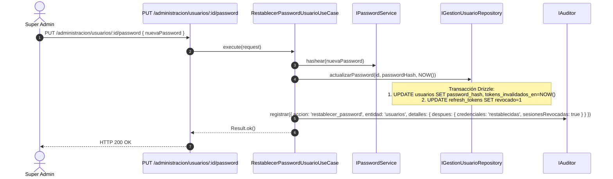

# Módulo de Administración — Warengine

> **Estado del módulo:** PARCIAL  
> **Stack técnico:** Deno · TypeScript · Drizzle ORM · MySQL 8 · Hono · Argon2  
> **Arquitectura:** Clean Architecture + SOLID + Inversión de Dependencias (DIP)  

---

## Índice

1. [Propósito y Estado](#1-propósito-y-estado)
2. [Cobertura del SRS](#2-cobertura-del-srs)
3. [Mapa de Archivos](#3-mapa-de-archivos)
4. [Dominio](#4-dominio)
5. [Casos de Uso](#5-casos-de-uso)
6. [Persistencia](#6-persistencia)
7. [API REST](#7-api-rest)
8. [Contratos (SHARED)](#8-contratos-shared)
9. [Permisos y Roles](#9-permisos-y-roles)
10. [Pruebas](#10-pruebas)
11. [Flujos Clave](#11-flujos-clave)
12. [Pendientes y Deuda Técnica](#12-pendientes-y-deuda-técnica)
13. [Cómo Probar Manualmente](#13-cómo-probar-manualmente)

---

## 1. Propósito y Estado

**Estado:** `PARCIAL`

El módulo de Administración gestiona las entidades troncales del sistema corporativo:
- Gestión completa de sedes físicas ([`sucursales`](../../Backend/packages/database/src/schema/administracion.schema.ts)).
- Gestión de personal y cuentas ([`empleados`](../../Backend/packages/database/src/schema/administracion.schema.ts) y [`usuarios`](../../Backend/packages/database/src/schema/autenticacion.schema.ts)), garantizando creación atómica de empleado y usuario dentro de una sola transacción.
- Asignación y cambio de roles RBAC con invalidación automática de sesiones existentes.
- Activación e inactivación de usuarios, asegurando la regla de negocio de protección del último `super-admin` activo.
- Restablecimiento forzado de contraseñas con hash Argon2, invalidación temporal de tokens y revocación de refresh tokens.
- Trazabilidad y auditoría integral de cada mutación conectada con el módulo de [Auditoría](auditoria.md).

Funcionalidades pendientes: asignación multi-sucursal (`usuario_sucursales`), edición general de empleados, alertas administrativas (`alertas_admin`), histórico salarial (`historial_salarios`) y dashboard de métricas globales.

---

## 2. Cobertura del SRS

| Requerimiento (RF / RNF) | Descripción Corta | Estado | Dónde está en el código |
|---|---|---|---|
| **RF-ADM-C1** | Listar sucursales registradas | IMPLEMENTADO | [`ListarSucursalesUseCase.ts`](../../Backend/packages/core/src/modules/administracion/application/use-cases/ListarSucursalesUseCase.ts) |
| **RF-ADM-C2** | Crear nueva sucursal con validación de nombre único | IMPLEMENTADO | [`CrearSucursalUseCase.ts`](../../Backend/packages/core/src/modules/administracion/application/use-cases/CrearSucursalUseCase.ts) |
| **RF-ADM-C3** | Editar sucursal existente (nombre, dirección, contacto, estado) | IMPLEMENTADO | [`EditarSucursalUseCase.ts`](../../Backend/packages/core/src/modules/administracion/application/use-cases/EditarSucursalUseCase.ts) |
| **RF-ADM-C4** | Asignación de usuarios a múltiples sucursales | PENDIENTE | Tabla `usuario_sucursales` en BD; casos de uso pendientes. |
| **RF-ADM-C5** | Listado de usuarios con filtros por rol y sucursal | IMPLEMENTADO | [`ListarUsuariosUseCase.ts`](../../Backend/packages/core/src/modules/administracion/application/use-cases/ListarUsuariosUseCase.ts) |
| **RF-ADM-C6** | Crear usuario con creación atómica de empleado y hash seguro | IMPLEMENTADO | [`CrearUsuarioUseCase.ts`](../../Backend/packages/core/src/modules/administracion/application/use-cases/CrearUsuarioUseCase.ts) |
| **RF-ADM-C7** | Cambiar rol de usuario con protección del último Super Admin | IMPLEMENTADO | [`CambiarRolUsuarioUseCase.ts`](../../Backend/packages/core/src/modules/administracion/application/use-cases/CambiarRolUsuarioUseCase.ts) |
| **RF-ADM-C8** | Inactivar o reactivar usuario con protección del último Super Admin | IMPLEMENTADO | [`CambiarEstadoUsuarioUseCase.ts`](../../Backend/packages/core/src/modules/administracion/application/use-cases/CambiarEstadoUsuarioUseCase.ts) |
| **RF-ADM-C9** | Restablecer contraseña de usuario e invalidar sus sesiones | IMPLEMENTADO | [`RestablecerPasswordUsuarioUseCase.ts`](../../Backend/packages/core/src/modules/administracion/application/use-cases/RestablecerPasswordUsuarioUseCase.ts) |
| **RF-ADM-C10** | Edición de ficha de empleado independiente de la cuenta | PENDIENTE | Tabla `empleados` en BD; falta caso de uso específico. |
| **RF-ADM-C11** | Consulta y filtro de bitácora de auditoría | IMPLEMENTADO | Documentado en [auditoria.md](auditoria.md); expuesto en `/administracion/auditoria`. |
| **RF-ADM-C12** | Historial de salarios y cambio de sueldos | PENDIENTE | Tabla `historial_salarios` y trigger `trg_historial_salarios_sync` en BD; casos de uso pendientes. |
| **RF-ADM-C13** | Dashboard de métricas corporativas y por sucursal | PENDIENTE | No iniciado en backend ni frontend. |
| **RF-ADM-C14** | Gestión de alertas administrativas (`alertas_admin`) | PENDIENTE | Tabla `alertas_admin` en BD; casos de uso pendientes. |

---

## 3. Mapa de Archivos

```
Backend/
├── packages/
│   ├── core/src/modules/administracion/
│   │   ├── domain/
│   │   │   ├── entities/
│   │   │   │   ├── Sucursal.ts
│   │   │   │   └── UsuarioGestionado.ts
│   │   │   ├── errors/
│   │   │   │   └── AdministracionErrors.ts
│   │   │   └── repositories/
│   │   │       ├── ISucursalRepository.ts
│   │   │       └── IGestionUsuarioRepository.ts
│   │   └── application/
│   │       └── use-cases/
│   │           ├── ListarSucursalesUseCase.ts
│   │           ├── CrearSucursalUseCase.ts
│   │           ├── EditarSucursalUseCase.ts
│   │           ├── ListarUsuariosUseCase.ts
│   │           ├── CrearUsuarioUseCase.ts
│   │           ├── CambiarRolUsuarioUseCase.ts
│   │           ├── CambiarEstadoUsuarioUseCase.ts
│   │           └── RestablecerPasswordUsuarioUseCase.ts
│   ├── database/src/
│   │   ├── schema/
│   │   │   └── administracion.schema.ts
│   │   ├── repositories/administracion/
│   │   │   ├── drizzle-sucursal.repository.ts
│   │   │   └── drizzle-gestion-usuario.repository.ts
│   │   └── mappers/administracion/
│   │       ├── sucursal.mapper.ts
│   │       └── usuario-gestionado.mapper.ts
│   └── core/tests/administracion/
│       ├── auditoria-operaciones.use-case.test.ts
│       └── restablecer-password-usuario.use-case.test.ts
├── apps/api/src/
│   ├── routes/
│   │   └── administracion.routes.ts
│   └── controllers/administracion/
│       ├── sucursal.controller.ts
│       ├── usuario.controller.ts
│       └── auditoria.controller.ts
Shared/
└── contracts/src/
    └── administracion/
        ├── sucursal.schema.ts
        └── usuario.schema.ts
```

---

## 4. Dominio

### 4.1 Entidades

#### `Sucursal`
Archivo: [`Sucursal.ts`](../../Backend/packages/core/src/modules/administracion/domain/entities/Sucursal.ts)

Campos:
- `id: number`
- `nombre: string`
- `direccion: string | null`
- `contacto: string | null`
- `isActive: boolean`

#### `UsuarioGestionado`
Archivo: [`UsuarioGestionado.ts`](../../Backend/packages/core/src/modules/administracion/domain/entities/UsuarioGestionado.ts)

Modelo de lectura para la administración del sistema. Nunca expone el hash ni credenciales sensibles.
Campos:
- `id: string` (UUID)
- `nombre: string`
- `email: string`
- `rolId: number`
- `rolNombre: string`
- `sucursalId: number`
- `sucursalNombre: string`
- `isActive: boolean`

Métodos de negocio:
- `esSuperAdmin: boolean`: Retorna `true` si `rolNombre === 'super-admin'`.

### 4.2 Interfaces de Repositorio (Ports)

#### `ISucursalRepository`
Archivo: [`ISucursalRepository.ts`](../../Backend/packages/core/src/modules/administracion/domain/repositories/ISucursalRepository.ts)

```typescript
export interface DatosSucursal {
  nombre: string;
  direccion?: string | null;
  contacto?: string | null;
}

export interface ISucursalRepository {
  listar(): Promise<Sucursal[]>;
  findById(id: number): Promise<Sucursal | null>;
  findByNombre(nombre: string): Promise<Sucursal | null>;
  crear(datos: DatosSucursal): Promise<Sucursal>;
  actualizar(id: number, cambios: Partial<DatosSucursal> & { isActive?: boolean }): Promise<Sucursal>;
}
```

#### `IGestionUsuarioRepository`
Archivo: [`IGestionUsuarioRepository.ts`](../../Backend/packages/core/src/modules/administracion/domain/repositories/IGestionUsuarioRepository.ts)

```typescript
export interface FiltrosUsuarios {
  rolId?: number;
  sucursalId?: number;
}

export interface NuevoUsuarioData {
  nombre: string;
  tipoDocumento: 'CC' | 'CE';
  numeroDocumento: string;
  cargo: string | null;
  sucursalId: number;
  email: string;
  passwordHash: string;
  rolId: number;
}

export interface IGestionUsuarioRepository {
  listar(filtros: FiltrosUsuarios): Promise<UsuarioGestionado[]>;
  findById(id: string): Promise<UsuarioGestionado | null>;
  existeEmail(email: string): Promise<boolean>;
  existeDocumento(tipo: string, numero: string): Promise<boolean>;
  rolExiste(rolId: number): Promise<boolean>;
  contarSuperAdminsActivos(): Promise<number>;
  crear(data: NuevoUsuarioData): Promise<UsuarioGestionado>;
  actualizarRol(id: string, rolId: number, invalidarTokensEn: Date): Promise<void>;
  actualizarEstado(id: string, isActive: boolean, invalidarTokensEn: Date): Promise<void>;
  actualizarPassword(id: string, passwordHash: string, invalidarTokensEn: Date): Promise<void>;
}
```

### 4.3 Errores de Dominio

Archivo: [`AdministracionErrors.ts`](../../Backend/packages/core/src/modules/administracion/domain/errors/AdministracionErrors.ts)

| Clase de Error | `code` | Mensaje por Defecto | Código HTTP (Presenter) |
|---|---|---|---|
| `SucursalNoEncontradaError` | `SUCURSAL_NO_ENCONTRADA` | "La sucursal no existe." | 404 Not Found |
| `SucursalDuplicadaError` | `SUCURSAL_DUPLICADA` | "Ya existe una sucursal con el nombre \"{nombre}\"." | 400 Bad Request |
| `SucursalInactivaError` | `SUCURSAL_INACTIVA` | "No se puede asignar una sucursal inactiva." | 400 Bad Request |
| `UsuarioNoEncontradoError` | `USUARIO_NO_ENCONTRADO` | "El usuario no existe." | 404 Not Found |
| `RolNoEncontradoError` | `ROL_NO_ENCONTRADO` | "El rol indicado no existe." | 400 Bad Request |
| `EmailYaRegistradoError` | `EMAIL_YA_REGISTRADO` | "Ya existe un usuario con ese correo." | 400 Bad Request |
| `DocumentoYaRegistradoError` | `DOCUMENTO_YA_REGISTRADO` | "Ya existe un empleado con ese documento." | 400 Bad Request |
| `UltimoSuperAdminError` | `ULTIMO_SUPER_ADMIN` | "No puedes quitar el rol ni desactivar al único Super Admin activo." | 400 Bad Request |

---

## 5. Casos de Uso

### 5.1 `ListarSucursalesUseCase`
- **Archivo:** [`ListarSucursalesUseCase.ts`](../../Backend/packages/core/src/modules/administracion/application/use-cases/ListarSucursalesUseCase.ts)
- **Dependencias:** `ISucursalRepository`
- **Entrada:** Sin parámetros
- **Salida:** `Result<Sucursal[], DomainError>`
- **Reglas:** Retorna todas las sucursales ordenadas alfabéticamente por nombre.
- **Auditoría:** No audita (política de lecturas ordinarias).
- **Pruebas:** Cubierto por pruebas de repositorio y tests manuales `.http`.

### 5.2 `CrearSucursalUseCase`
- **Archivo:** [`CrearSucursalUseCase.ts`](../../Backend/packages/core/src/modules/administracion/application/use-cases/CrearSucursalUseCase.ts)
- **Dependencias:** `ISucursalRepository`, `IAuditor`
- **Entrada:** `CrearSucursalRequest { nombre: string, direccion?: string, contacto?: string, actor: ActorAuditoria }`
- **Salida:** `Result<Sucursal, DomainError>`
- **Reglas:** Verifica unicidad de nombre de sucursal (case-insensitive). Si ya existe, falla con `SucursalDuplicadaError`.
- **Auditoría:** Registra acción `crear`, entidad `sucursales`, `detalles.despues: { nombre, direccion, contacto }`.
- **Pruebas:** [`auditoria-operaciones.use-case.test.ts`](../../Backend/packages/core/tests/administracion/auditoria-operaciones.use-case.test.ts).

### 5.3 `EditarSucursalUseCase`
- **Archivo:** [`EditarSucursalUseCase.ts`](../../Backend/packages/core/src/modules/administracion/application/use-cases/EditarSucursalUseCase.ts)
- **Dependencias:** `ISucursalRepository`, `IAuditor`
- **Entrada:** `EditarSucursalRequest { id: number, nombre?: string, direccion?: string, contacto?: string, isActive?: boolean, actor: ActorAuditoria }`
- **Salida:** `Result<Sucursal, DomainError>`
- **Reglas:** Comprueba existencia de la sucursal. Actualiza únicamente los campos suministrados.
- **Auditoría:** Registra acción `editar`, entidad `sucursales`, auditando exclusivamente los campos mutados bajo `{ antes, despues }`.
- **Pruebas:** [`auditoria-operaciones.use-case.test.ts`](../../Backend/packages/core/tests/administracion/auditoria-operaciones.use-case.test.ts).

### 5.4 `ListarUsuariosUseCase`
- **Archivo:** [`ListarUsuariosUseCase.ts`](../../Backend/packages/core/src/modules/administracion/application/use-cases/ListarUsuariosUseCase.ts)
- **Dependencias:** `IGestionUsuarioRepository`
- **Entrada:** `FiltrosUsuarios { rolId?: number, sucursalId?: number }`
- **Salida:** `Result<UsuarioGestionado[], DomainError>`
- **Reglas:** Retorna la proyección de usuarios con datos de empleado, sucursal y rol, filtrando opcionalmente por rol o sucursal.
- **Auditoría:** No audita (lectura estándar).
- **Pruebas:** Cubierto por pruebas de integración y HTTP.

### 5.5 `CrearUsuarioUseCase`
- **Archivo:** [`CrearUsuarioUseCase.ts`](../../Backend/packages/core/src/modules/administracion/application/use-cases/CrearUsuarioUseCase.ts)
- **Dependencias:** `IGestionUsuarioRepository`, `ISucursalRepository`, `IPasswordService`, `IAuditor`
- **Entrada:** `CrearUsuarioRequest { nombre: string, tipoDocumento: 'CC' | 'CE', numeroDocumento: string, email: string, passwordPlain: string, rolId: number, sucursalId: number, cargo?: string, actor: ActorAuditoria }`
- **Salida:** `Result<UsuarioGestionado, DomainError>`
- **Reglas de Negocio:**
  1. Verifica que la sucursal exista y esté activa (`isActive = true`). Si no, falla con `SucursalNoEncontradaError` o `SucursalInactivaError`.
  2. Valida que el rol exista en el catálogo (`rolExiste`).
  3. Comprueba que el email no esté registrado (`existeEmail`).
  4. Comprueba que el documento no esté duplicado (`existeDocumento`).
  5. Hashea la contraseña con `IPasswordService` (Argon2id).
  6. Crea atómicamente el empleado y el usuario en una única transacción de BD.
- **Auditoría:** Registra acción `crear`, entidad `usuarios`, `detalles.despues: { email, rolId, sucursalId }`. **Nunca registra contraseñas, hashes ni números de identificación confidenciales.**
- **Pruebas:** [`auditoria-operaciones.use-case.test.ts`](../../Backend/packages/core/tests/administracion/auditoria-operaciones.use-case.test.ts).

### 5.6 `CambiarRolUsuarioUseCase`
- **Archivo:** [`CambiarRolUsuarioUseCase.ts`](../../Backend/packages/core/src/modules/administracion/application/use-cases/CambiarRolUsuarioUseCase.ts)
- **Dependencias:** `IGestionUsuarioRepository`, `IAuditor`
- **Entrada:** `CambiarRolUsuarioRequest { usuarioId: string, rolId: number, actor: ActorAuditoria }`
- **Salida:** `Result<UsuarioGestionado, DomainError>`
- **Reglas de Negocio:**
  1. Verifica existencia del usuario y del nuevo rol.
  2. Si el rol es el mismo, es no-op idempotente y no audita.
  3. **Protección Super Admin:** Si el usuario es `super-admin` activo y el nuevo rol es diferente, consulta `contarSuperAdminsActivos()`. Si el total <= 1, bloquea la acción con `UltimoSuperAdminError`.
  4. Actualiza rol, establece `tokens_invalidados_en = NOW()` e invalida los refresh tokens en base de datos.
- **Auditoría:** Registra acción `cambiar_rol`, entidad `usuarios`, `{ antes: { rolId }, despues: { rolId } }`.
- **Pruebas:** [`auditoria-operaciones.use-case.test.ts`](../../Backend/packages/core/tests/administracion/auditoria-operaciones.use-case.test.ts).

### 5.7 `CambiarEstadoUsuarioUseCase`
- **Archivo:** [`CambiarEstadoUsuarioUseCase.ts`](../../Backend/packages/core/src/modules/administracion/application/use-cases/CambiarEstadoUsuarioUseCase.ts)
- **Dependencias:** `IGestionUsuarioRepository`, `IAuditor`
- **Entrada:** `CambiarEstadoUsuarioRequest { usuarioId: string, isActive: boolean, actor: ActorAuditoria }`
- **Salida:** `Result<UsuarioGestionado, DomainError>`
- **Reglas de Negocio:**
  1. Verifica existencia del usuario. Si el estado ya es el solicitado, no realiza cambios ni audita.
  2. **Protección Super Admin:** Si se intenta desactivar (`isActive = false`) a un `super-admin` y `contarSuperAdminsActivos() <= 1`, aborta con `UltimoSuperAdminError`.
  3. Actualiza estado, fija `tokens_invalidados_en = NOW()` y revoca los refresh tokens activos (`revocado = 1`).
- **Auditoría:** Registra acción `activar` o `inactivar`, entidad `usuarios`, `{ antes: { isActive }, despues: { isActive } }`.
- **Pruebas:** [`auditoria-operaciones.use-case.test.ts`](../../Backend/packages/core/tests/administracion/auditoria-operaciones.use-case.test.ts).

### 5.8 `RestablecerPasswordUsuarioUseCase`
- **Archivo:** [`RestablecerPasswordUsuarioUseCase.ts`](../../Backend/packages/core/src/modules/administracion/application/use-cases/RestablecerPasswordUsuarioUseCase.ts)
- **Dependencias:** `IGestionUsuarioRepository`, `IPasswordService`, `IAuditor`
- **Entrada:** `RestablecerPasswordUsuarioRequest { usuarioId: string, nuevaPassword: string, actor: ActorAuditoria }`
- **Salida:** `Result<void, DomainError>`
- **Reglas de Negocio:**
  1. Verifica que el usuario exista (permite restablecer incluso a usuarios inactivos).
  2. Hashea la nueva contraseña con Argon2.
  3. Actualiza `password_hash`, establece `tokens_invalidados_en = NOW()` y revoca todos los refresh tokens del usuario en la misma transacción.
- **Auditoría:** Registra acción `restablecer_password`, entidad `usuarios`, `detalles.despues: { credenciales: 'restablecidas', sesionesRevocadas: true }`. Jamás almacena la clave ni el hash.
- **Pruebas:** [`restablecer-password-usuario.use-case.test.ts`](../../Backend/packages/core/tests/administracion/restablecer-password-usuario.use-case.test.ts) (4 tests).

---

## 6. Persistencia

### 6.1 Tablas Drizzle
Archivo: [`administracion.schema.ts`](../../Backend/packages/database/src/schema/administracion.schema.ts)
- `sucursales`: `id_sucursal`, `nombre`, `direccion`, `contacto`, `is_active`.
- `areas`: `id_area`, `nombre`, `sucursal_id` (FK sucursales ON DELETE RESTRICT).
- `empleados`: `id_empleado` (UUID), `tipo_documento`, `numero_documento` (VARCHAR BINARY), `nombre`, `telefono`, `direccion`, `cargo`, `area_id` (FK areas ON DELETE SET NULL), `sucursal_id` (FK sucursales ON DELETE RESTRICT), `fecha_ingreso`, `sueldo_actual`, `is_active`, `created_at`.
  - Constraint: `chk_empleados_tipo_documento CHECK (tipo_documento IN ('CC','CE'))`.
  - Unique Index: `uq_empleados_documento (tipo_documento, numero_documento)`.

### 6.2 Repositorios y Mappers
- [`DrizzleSucursalRepository`](../../Backend/packages/database/src/repositories/administracion/drizzle-sucursal.repository.ts): implementa `ISucursalRepository`. Utiliza [`sucursal.mapper.ts`](../../Backend/packages/database/src/mappers/administracion/sucursal.mapper.ts). Realiza búsquedas de nombre case-insensitive con `LOWER(nombre)`.
- [`DrizzleGestionUsuarioRepository`](../../Backend/packages/database/src/repositories/administracion/drizzle-gestion-usuario.repository.ts): implementa `IGestionUsuarioRepository`. Utiliza [`usuario-gestionado.mapper.ts`](../../Backend/packages/database/src/mappers/administracion/usuario-gestionado.mapper.ts). Ejecuta transacciones Drizzle atómicas para inserción conjunta `empleados` + `usuarios` y para invalidación simultánea de `tokens_invalidados_en` + `refresh_tokens.revocado = 1`.

### 6.3 Reglas de BD
Fuente: `Docs/database/WARENGINE_FULL_BD.sql`
- `trg_usuarios_marca_invalidacion_token`: Si cambia rol o estado, MySQL actualiza `tokens_invalidados_en = NOW()`.
- `trg_usucursales_marca_invalidacion_insert` y `delete`: Modificaciones en `usuario_sucursales` actualizan `tokens_invalidados_en = NOW()`.
- `trg_historial_salarios_sync` (AFTER INSERT en `historial_salarios`): Sincroniza automáticamente `empleados.sueldo_actual = NEW.sueldo`.
- `ON DELETE RESTRICT`: Una sucursal con empleados o áreas asignadas no puede ser borrada físicamente. Requiere soft delete (`is_active = 0`).

---

## 7. API REST

Prefijo base registrado en [`main.ts`](../../Backend/apps/api/src/main.ts): `/administracion`

| Método | Ruta Completa | Permiso Requerido | Controlador | Caso de Uso | Schema Zod | Códigos HTTP |
|---|---|---|---|---|---|---|
| `GET` | `/administracion/sucursales` | `administracion:gestionar-sucursales` | [`listarSucursalesController`](../../Backend/apps/api/src/controllers/administracion/sucursal.controller.ts) | `ListarSucursalesUseCase` | Ninguno | 200, 401, 403, 500 |
| `POST` | `/administracion/sucursales` | `administracion:gestionar-sucursales` | [`crearSucursalController`](../../Backend/apps/api/src/controllers/administracion/sucursal.controller.ts) | `CrearSucursalUseCase` | `crearSucursalSchema` | 201, 400, 401, 403, 500 |
| `PUT` | `/administracion/sucursales/:id` | `administracion:gestionar-sucursales` | [`editarSucursalController`](../../Backend/apps/api/src/controllers/administracion/sucursal.controller.ts) | `EditarSucursalUseCase` | `editarSucursalSchema` | 200, 400, 401, 403, 404, 500 |
| `GET` | `/administracion/usuarios` | `autenticacion:gestionar-usuarios` | [`listarUsuariosController`](../../Backend/apps/api/src/controllers/administracion/usuario.controller.ts) | `ListarUsuariosUseCase` | `filtrosUsuariosSchema` | 200, 400, 401, 403, 500 |
| `POST` | `/administracion/usuarios` | `autenticacion:gestionar-usuarios` | [`crearUsuarioController`](../../Backend/apps/api/src/controllers/administracion/usuario.controller.ts) | `CrearUsuarioUseCase` | `crearUsuarioSchema` | 201, 400, 401, 403, 500 |
| `PUT` | `/administracion/usuarios/:id/rol` | `autenticacion:asignar-roles` | [`cambiarRolUsuarioController`](../../Backend/apps/api/src/controllers/administracion/usuario.controller.ts) | `CambiarRolUsuarioUseCase` | `cambiarRolSchema` | 200, 400, 401, 403, 404, 500 |
| `PUT` | `/administracion/usuarios/:id/estado` | `autenticacion:gestionar-usuarios` | [`cambiarEstadoUsuarioController`](../../Backend/apps/api/src/controllers/administracion/usuario.controller.ts) | `CambiarEstadoUsuarioUseCase` | `cambiarEstadoSchema` | 200, 400, 401, 403, 404, 500 |
| `PUT` | `/administracion/usuarios/:id/password` | `autenticacion:gestionar-usuarios` | [`restablecerPasswordUsuarioController`](../../Backend/apps/api/src/controllers/administracion/usuario.controller.ts) | `RestablecerPasswordUsuarioUseCase` | `restablecerPasswordSchema` | 200, 400, 401, 403, 404, 500 |
| `GET` | `/administracion/auditoria` | `autenticacion:ver-auditoria` | [`consultarAuditoriaController`](../../Backend/apps/api/src/controllers/administracion/auditoria.controller.ts) | `ConsultarAuditoriaUseCase` | `filtrosAuditoriaSchema` | 200, 400, 401, 403, 500 |

---

## 8. Contratos (SHARED)

Ubicación: `Shared/contracts/src/administracion/`

### 8.1 Sucursales
Archivo: [`sucursal.schema.ts`](../../Shared/contracts/src/administracion/sucursal.schema.ts)
- `crearSucursalSchema`:
  - `nombre`: string mín. 3, máx. 150 caracteres.
  - `direccion`: string máx. 255 (opcional).
  - `contacto`: string máx. 100 (opcional).
- `editarSucursalSchema`: campos opcionales más `isActive: z.boolean().optional()`.

### 8.2 Usuarios
Archivo: [`usuario.schema.ts`](../../Shared/contracts/src/administracion/usuario.schema.ts)
- `crearUsuarioSchema`:
  - `nombre`: string mín. 3, máx. 150 caracteres.
  - `tipoDocumento`: `z.enum(['CC', 'CE'])`.
  - `numeroDocumento`: string alfanumérico mín. 4, máx. 30 caracteres.
  - `cargo`: string máx. 100 (opcional).
  - `sucursalId`: entero positivo.
  - `email`: formato email válido, máx. 150 caracteres.
  - `password`: mín. 8, máx. 100 caracteres.
  - `rolId`: entero positivo.
- `cambiarRolSchema`: `rolId` entero positivo.
- `cambiarEstadoSchema`: `isActive` booleano.
- `restablecerPasswordSchema`: `nuevaPassword` mín. 8, máx. 100 caracteres.
- `filtrosUsuariosSchema`: `rolId` y `sucursalId` enteros opcionales.

---

## 9. Permisos y Roles

| Permiso | Descripción en Seed | Roles con el Permiso |
|---|---|---|
| `administracion:gestionar-sucursales` | Crear y configurar sucursales y áreas | Exclusivo `super-admin` |
| `autenticacion:gestionar-usuarios` | Crear o desactivar usuarios, resetear credenciales | Exclusivo `super-admin` |
| `autenticacion:asignar-roles` | Asignar roles a usuarios | Exclusivo `super-admin` |
| `autenticacion:ver-auditoria` | Ver auditoría de logins e intentos fallidos / operaciones | Exclusivo `super-admin` |

*Nota:* Ni `admin-sucursal` ni `cajero-vendedor` poseen permisos para gestionar sucursales, usuarios o roles.

---

## 10. Pruebas

### 10.1 Cobertura
- [`auditoria-operaciones.use-case.test.ts`](../../Backend/packages/core/tests/administracion/auditoria-operaciones.use-case.test.ts): 8 tests.
  - Creación y edición de sucursales con auditoría de cambios `{ antes, despues }`.
  - Creación de usuarios verificando que no se registren contraseñas ni documentos.
  - Cambios de rol con auditoría y bloqueo ante intento de degradar al último Super Admin.
  - Inactivación de usuario con bloqueo ante intento de desactivar al último Super Admin.
- [`restablecer-password-usuario.use-case.test.ts`](../../Backend/packages/core/tests/administracion/restablecer-password-usuario.use-case.test.ts): 4 tests.
  - Persistencia del hash Argon2 y no del texto plano.
  - Invalidación de sesiones (`tokens_invalidados_en` y revocación de refresh tokens).
  - Auditoría sin contraseñas ni hashes (`credenciales: 'restablecidas'`).
  - Fallo ante usuario inexistente y soporte para usuarios inactivos.

### 10.2 Brechas Conocidas
- Falta test unitario dedicado a `ListarSucursalesUseCase` y `ListarUsuariosUseCase` (se validan por integración).

### 10.3 Cómo Ejecutar las Pruebas
```bash
cd BACK
deno test packages/core/tests/administracion/
```

---

## 11. Flujos Clave

### Flujo 1: Creación Atómica de Empleado y Cuenta de Usuario


### Flujo 2: Restablecimiento de Contraseña e Invalidación de Sesiones


---

## 12. Pendientes y Deuda Técnica

1. **Multi-sucursal (RF-ADM-C4):** El esquema SQL contiene la tabla intermedia `usuario_sucursales`, pero la lógica actual asigna la sucursal únicamente a través de la columna `empleados.sucursal_id`.
2. **Edición de Empleados (RF-ADM-C10):** No existe un caso de uso para modificar teléfono, dirección o cargo de un empleado sin tocar su cuenta de usuario.
3. **Gestión de Salarios (RF-ADM-C12):** La tabla `historial_salarios` y su trigger existen en MySQL, pero no hay caso de uso ni endpoints para registrar o consultar variaciones salariales.
4. **Alertas Administrativas (RF-ADM-C14):** La tabla `alertas_admin` está definida en el SQL completo, pero carece de implementación en el core.

---

## 13. Cómo Probar Manualmente

Archivos de prueba:
- [`Http/02-sucursales.http`](../../Http/02-sucursales.http): CRUD completo de sucursales (listar, crear, validar duplicados, editar datos, inactivar).
- [`Http/03-usuarios.http`](../../Http/03-usuarios.http): Creación de empleados y usuarios, listado con filtros, cambio de rol, cambio de estado, restablecimiento forzado de contraseña y validación de protección del último Super Admin.
