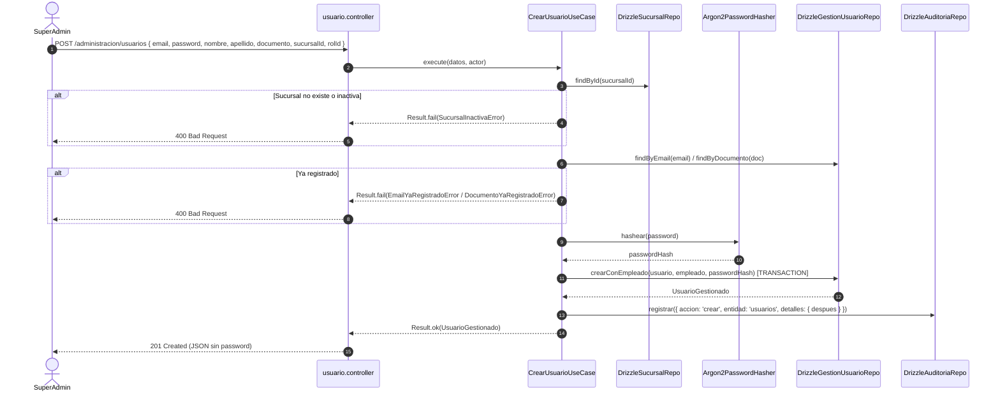
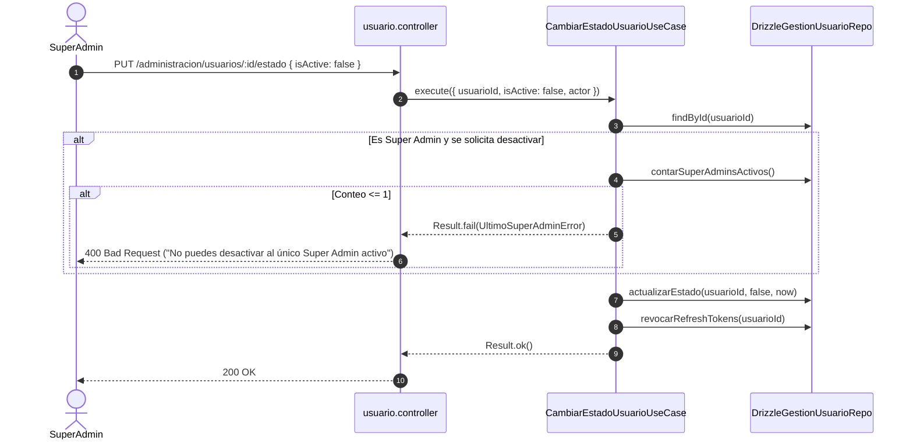

# Módulo de Administración — Warengine

> **Propósito y estado:** **IMPLEMENTADO** (Sucursales, Gestión de Usuarios, Asignación de Sucursales; Resto Pendiente)  
> **Stack:** Deno · TypeScript · Drizzle ORM · MySQL 8 · Hono · Zod · Argon2  
> **Arquitectura:** Clean Architecture + Ports & Adapters + Auditoría Inmutable + RBAC

---

## Índice

1. [Propósito y estado](#1-propósito-y-estado)
2. [Cobertura del SRS](#2-cobertura-del-srs)
3. [Mapa de archivos](#3-mapa-de-archivos)
4. [Dominio](#4-dominio)
5. [Casos de uso](#5-casos-de-uso)
6. [Persistencia](#6-persistencia)
7. [API REST](#7-api-rest)
8. [Contratos (Shared)](#8-contratos-shared)
9. [Permisos y roles](#9-permisos-y-roles)
10. [Pruebas](#10-pruebas)
11. [Flujos clave](#11-flujos-clave)
12. [Pendientes y deuda técnica](#12-pendientes-y-deuda-técnica)
13. [Cómo probar manualmente](#13-cómo-probar-manualmente)

---

## 1. Propósito y Estado

El módulo de **Administración** centraliza la estructura organizativa de la empresa en Warengine: la gestión física de **sucursales**, la administración de cuentas de **usuarios y empleados** vinculados, la **asignación multisede** de sucursales autorizadas y la protección institucional (bloqueo ante la desactivación o degradación del último Super Admin activo). Cada mutación emite eventos estructurados al sistema transversal de [Auditoría](auditoria.md).

**Estado actual:** **IMPLEMENTADO** (en sucursales, usuarios atómicos con empleado, roles, estados, contraseñas y asignación multi-sucursal; áreas, edición de empleados, alertas, historial salarial y dashboard permanecen PENDIENTES).

---

## 2. Cobertura del SRS

| Requisito | Descripción corta | Estado | Dónde está en el código |
|---|---|---|---|
| **RF-ADM-C1** | Listar sucursales activas e inactivas | IMPLEMENTADO | [ListarSucursalesUseCase.ts](../../Backend/packages/core/src/modules/administracion/application/use-cases/ListarSucursalesUseCase.ts) |
| **RF-ADM-C2** | Crear nueva sucursal con validación de nombre único | IMPLEMENTADO | [CrearSucursalUseCase.ts](../../Backend/packages/core/src/modules/administracion/application/use-cases/CrearSucursalUseCase.ts) |
| **RF-ADM-C3** | Editar sucursal existente (nombre, dirección, teléfono, estado) | IMPLEMENTADO | [EditarSucursalUseCase.ts](../../Backend/packages/core/src/modules/administracion/application/use-cases/EditarSucursalUseCase.ts) |
| **RF-ADM-C4** | Gestión de áreas por sucursal | PENDIENTE | Tabla `areas` existe en BD y esquema Drizzle; sin casos de uso ni endpoints en Backend. |
| **RF-ADM-C5** | Listar usuarios con filtros combinables (`rolId`, `sucursalId`) | IMPLEMENTADO | [ListarUsuariosUseCase.ts](../../Backend/packages/core/src/modules/administracion/application/use-cases/ListarUsuariosUseCase.ts) |
| **RF-ADM-C6** | Crear usuario con empleado atómico (transacción BD) y hash Argon2id | IMPLEMENTADO | [CrearUsuarioUseCase.ts](../../Backend/packages/core/src/modules/administracion/application/use-cases/CrearUsuarioUseCase.ts) |
| **RF-ADM-C7** | Cambiar rol de usuario con protección de último Super Admin | IMPLEMENTADO | [CambiarRolUsuarioUseCase.ts](../../Backend/packages/core/src/modules/administracion/application/use-cases/CambiarRolUsuarioUseCase.ts) |
| **RF-ADM-C8** | Cambiar estado de usuario (activar/desactivar) con protección | IMPLEMENTADO | [CambiarEstadoUsuarioUseCase.ts](../../Backend/packages/core/src/modules/administracion/application/use-cases/CambiarEstadoUsuarioUseCase.ts) |
| **RF-ADM-C9** | Restablecer contraseña administrativamente e invalidar sesiones | IMPLEMENTADO | [RestablecerPasswordUsuarioUseCase.ts](../../Backend/packages/core/src/modules/administracion/application/use-cases/RestablecerPasswordUsuarioUseCase.ts) |
| **RF-ADM-C10** | Asignación multisede (`usuario_sucursales`) e invalidación de JWT | IMPLEMENTADO | [AsignarSucursalesUsuarioUseCase.ts](../../Backend/packages/core/src/modules/administracion/application/use-cases/AsignarSucursalesUsuarioUseCase.ts), [ObtenerSucursalesUsuarioUseCase.ts](../../Backend/packages/core/src/modules/administracion/application/use-cases/ObtenerSucursalesUsuarioUseCase.ts) |
| **RF-ADM-C11** | Registro auditable de mutaciones y accesos denegados | IMPLEMENTADO | Integración con [auditoria.md](auditoria.md) vía `IAuditor` |
| **RF-ADM-C12** | Edición independiente de datos de empleados | PENDIENTE | Solo se crea empleado en la creación atómica de usuario; no hay caso de uso para modificar datos personales. |
| **RF-ADM-C13** | Gestión de alertas administrativas (`alertas_admin`) | PENDIENTE | Tabla y CHECK existen en BD; sin casos de uso de crear/atender alertas. |
| **RF-ADM-C14** | Historial de salarios de empleados (`historial_salarios`) | PENDIENTE | Tabla y trigger existen en BD; sin endpoints ni lógica en Core. |
| **RF-ADM-C15** | Dashboard de métricas globales y por sucursal | PENDIENTE | Permisos `administracion:ver-metricas-*` definidos; sin implementación. |

---

## 3. Mapa de Archivos

```
Backend/
├── apps/api/src/
│   ├── controllers/administracion/
│   │   ├── sucursal.controller.ts
│   │   ├── usuario.controller.ts
│   │   └── usuario-sucursal.controller.ts
│   └── routes/
│       └── administracion.routes.ts
├── packages/
│   ├── core/
│   │   ├── src/modules/administracion/
│   │   │   ├── application/use-cases/
│   │   │   │   ├── AsignarSucursalesUsuarioUseCase.ts
│   │   │   │   ├── CambiarEstadoUsuarioUseCase.ts
│   │   │   │   ├── CambiarRolUsuarioUseCase.ts
│   │   │   │   ├── CrearSucursalUseCase.ts
│   │   │   │   ├── CrearUsuarioUseCase.ts
│   │   │   │   ├── EditarSucursalUseCase.ts
│   │   │   │   ├── ListarSucursalesUseCase.ts
│   │   │   │   ├── ListarUsuariosUseCase.ts
│   │   │   │   ├── ObtenerSucursalesUsuarioUseCase.ts
│   │   │   │   └── RestablecerPasswordUsuarioUseCase.ts
│   │   │   ├── domain/
│   │   │   │   ├── entities/
│   │   │   │   │   ├── Sucursal.ts
│   │   │   │   │   └── UsuarioGestionado.ts
│   │   │   │   ├── errors/
│   │   │   │   │   └── AdministracionErrors.ts
│   │   │   │   └── repositories/
│   │   │   │       ├── IGestionUsuarioRepository.ts
│   │   │   │       ├── ISucursalRepository.ts
│   │   │   │       └── IUsuarioSucursalRepository.ts
│   │   └── tests/administracion/
│   │       ├── asignar-sucursales-usuario.use-case.test.ts
│   │       ├── auditoria-operaciones.use-case.test.ts
│   │       ├── consultar-auditoria.use-case.test.ts
│   │       └── restablecer-password-usuario.use-case.test.ts
│   ├── database/src/
│   │   ├── schema/
│   │   │   └── administracion.schema.ts
│   │   ├── repositories/administracion/
│   │   │   ├── drizzle-gestion-usuario.repository.ts
│   │   │   ├── drizzle-sucursal.repository.ts
│   │   │   └── drizzle-usuario-sucursal.repository.ts
│   │   └── mappers/administracion/
│   │       ├── sucursal.mapper.ts
│   │       └── usuario-gestionado.mapper.ts
│   └── composition/src/
│       └── container.ts
Shared/contracts/src/administracion/
├── asignacion-sucursales.schema.ts
├── sucursal.schema.ts
└── usuario.schema.ts
Http/
├── 02-sucursales.http
├── 03-usuarios.http
└── 07-usuario-sucursales.http
```

---

## 4. Dominio

### 4.1 Entidades

#### `Sucursal` ([Sucursal.ts](../../Backend/packages/core/src/modules/administracion/domain/entities/Sucursal.ts))
Representa una sede física operativa:
- **Campos:**
  - `id: number` (identificador autoincremental)
  - `nombre: string` (nombre comercial único)
  - `direccion: string` (ubicación física)
  - `telefono: string` (contacto de la sede)
  - `isActive: boolean` (indicador operativo activo/inactivo)
  - `creadoEn: Date`
- **Métodos de negocio:**
  - `activar(): void`: asigna `isActive = true`.
  - `inactivar(): void`: asigna `isActive = false`.
  - `actualizarDatos(nombre, direccion, telefono): void`: actualiza los datos básicos.

#### `UsuarioGestionado` ([UsuarioGestionado.ts](../../Backend/packages/core/src/modules/administracion/domain/entities/UsuarioGestionado.ts))
Representa la vista agregada de una cuenta de usuario junto con su empleado vinculado y sus sedes:
- **Campos:**
  - `id: string` (UUID v4 de `usuarios`)
  - `email: string` (correo institucional)
  - `rolId: number` (id del rol asignado)
  - `nombreRol: string` (nombre legible del rol: 'super-admin', etc.)
  - `isActive: boolean` (cuenta habilitada o suspendida)
  - `empleadoId: number` (id en tabla `empleados`)
  - `nombreEmpleado: string`, `apellidoEmpleado: string`, `documentoEmpleado: string`
  - `sucursalId: number` (sucursal principal asignada al empleado)
  - `nombreSucursal: string` (nombre de la sucursal principal)
  - `sucursalesAdicionalesIds: number[]` (sedes autorizadas en `usuario_sucursales`)
  - `creadoEn: Date`

### 4.2 Interfaces de Repositorio (Ports)

- **`ISucursalRepository`** ([ISucursalRepository.ts](../../Backend/packages/core/src/modules/administracion/domain/repositories/ISucursalRepository.ts)):
  ```typescript
  listar(): Promise<Sucursal[]>;
  findById(id: number): Promise<Sucursal | null>;
  findByNombre(nombre: string): Promise<Sucursal | null>; // Case-insensitive
  crear(sucursal: Omit<Sucursal, 'id' | 'creadoEn'>): Promise<Sucursal>;
  actualizar(sucursal: Sucursal): Promise<void>;
  ```
- **`IGestionUsuarioRepository`** ([IGestionUsuarioRepository.ts](../../Backend/packages/core/src/modules/administracion/domain/repositories/IGestionUsuarioRepository.ts)):
  ```typescript
  listar(filtros?: { rolId?: number; sucursalId?: number }): Promise<UsuarioGestionado[]>;
  findById(id: string): Promise<UsuarioGestionado | null>;
  findByEmail(email: string): Promise<UsuarioGestionado | null>;
  findByDocumento(documento: string): Promise<boolean>;
  crearConEmpleado(
    usuario: { email: string; rolId: number },
    empleado: { nombre: string; apellido: string; tipoDocumento: string; numeroDocumento: string; sucursalId: number },
    passwordHash: string,
  ): Promise<UsuarioGestionado>;
  actualizarRol(usuarioId: string, nuevoRolId: number, fechaInvalidacion: Date): Promise<void>;
  actualizarEstado(usuarioId: string, isActive: boolean, fechaInvalidacion: Date): Promise<void>;
  actualizarPassword(usuarioId: string, passwordHash: string, fechaInvalidacion: Date): Promise<void>;
  contarSuperAdminsActivos(): Promise<number>;
  revocarRefreshTokens(usuarioId: string): Promise<void>;
  ```
- **`IUsuarioSucursalRepository`** ([IUsuarioSucursalRepository.ts](../../Backend/packages/core/src/modules/administracion/domain/repositories/IUsuarioSucursalRepository.ts)):
  ```typescript
  obtenerIdsAdicionales(usuarioId: string): Promise<number[]>;
  reemplazarSucursales(usuarioId: string, principalId: number, adicionalesIds: number[], fechaInvalidacion: Date): Promise<void>;
  ```

### 4.3 Errores de Dominio ([AdministracionErrors.ts](../../Backend/packages/core/src/modules/administracion/domain/errors/AdministracionErrors.ts))

| Clase | Code | Mensaje | HTTP Presenter |
|---|---|---|---|
| `SucursalNoEncontradaError` | `SUCURSAL_NO_ENCONTRADA` | "La sucursal no existe." | 404 Not Found |
| `SucursalDuplicadaError` | `SUCURSAL_DUPLICADA` | "Ya existe una sucursal con el nombre \"{nombre}\"." | 400 Bad Request |
| `SucursalInactivaError` | `SUCURSAL_INACTIVA` | "No se puede asignar una sucursal inactiva." | 400 Bad Request |
| `UsuarioNoEncontradoError` | `USUARIO_NO_ENCONTRADO` | "El usuario no existe." | 404 Not Found |
| `RolNoEncontradoError` | `ROL_NO_ENCONTRADO` | "El rol indicado no existe." | 400 Bad Request |
| `EmailYaRegistradoError` | `EMAIL_YA_REGISTRADO` | "Ya existe un usuario con ese correo." | 400 Bad Request |
| `DocumentoYaRegistradoError` | `DOCUMENTO_YA_REGISTRADO` | "Ya existe un empleado con ese documento." | 400 Bad Request |
| `UltimoSuperAdminError` | `ULTIMO_SUPER_ADMIN` | "No puedes quitar el rol ni desactivar al único Super Admin activo." | 400 Bad Request |

---

## 5. Casos de Uso

### 5.1 `ListarSucursalesUseCase`
- **Archivo:** [ListarSucursalesUseCase.ts](../../Backend/packages/core/src/modules/administracion/application/use-cases/ListarSucursalesUseCase.ts)
- **Dependencias:** `ISucursalRepository`
- **Entrada:** `void`
- **Salida:** `Result<Sucursal[], DomainError>`
- **Reglas:** Retorna todas las sedes registradas ordenadas. No audita (consulta GET estándar).
- **Pruebas:** Cubierto por pruebas de integración HTTP.

### 5.2 `CrearSucursalUseCase`
- **Archivo:** [CrearSucursalUseCase.ts](../../Backend/packages/core/src/modules/administracion/application/use-cases/CrearSucursalUseCase.ts)
- **Dependencias:** `ISucursalRepository`, `IAuditor`
- **Entrada:** `{ nombre: string; direccion: string; telefono: string; actor: ActorAuditoria }`
- **Salida:** `Result<Sucursal, DomainError>`
- **Reglas:**
  1. Verifica que no exista otra sucursal con el mismo nombre (*case-insensitive* vía `LOWER(TRIM(nombre))`). Si existe, falla con `SucursalDuplicadaError`.
  2. Inserta la sucursal con `isActive = true`.
  3. Emite evento de auditoría: `{ accion: 'crear', entidad: 'sucursales', detalles: { despues: { id, nombre, direccion, telefono, isActive: true } } }`.
- **Pruebas:** [auditoria-operaciones.use-case.test.ts](../../Backend/packages/core/tests/administracion/auditoria-operaciones.use-case.test.ts).

### 5.3 `EditarSucursalUseCase`
- **Archivo:** [EditarSucursalUseCase.ts](../../Backend/packages/core/src/modules/administracion/application/use-cases/EditarSucursalUseCase.ts)
- **Dependencias:** `ISucursalRepository`, `IAuditor`
- **Entrada:** `{ id: number; nombre?: string; direccion?: string; telefono?: string; isActive?: boolean; actor: ActorAuditoria }`
- **Salida:** `Result<Sucursal, DomainError>`
- **Reglas:**
  1. Carga la sucursal. Falla con `SucursalNoEncontradaError` si no existe.
  2. Si cambia de nombre, verifica unicidad insensible a mayúsculas contra otras sedes.
  3. Modifica únicamente los campos provistos.
  4. Emite evento de auditoría `{ accion: 'editar', entidad: 'sucursales', detalles: { antes, despues } }` registrando exclusivamente los campos que mutaron.
- **Pruebas:** [auditoria-operaciones.use-case.test.ts](../../Backend/packages/core/tests/administracion/auditoria-operaciones.use-case.test.ts).

### 5.4 `ListarUsuariosUseCase`
- **Archivo:** [ListarUsuariosUseCase.ts](../../Backend/packages/core/src/modules/administracion/application/use-cases/ListarUsuariosUseCase.ts)
- **Dependencias:** `IGestionUsuarioRepository`
- **Entrada:** `{ rolId?: number; sucursalId?: number }`
- **Salida:** `Result<UsuarioGestionado[], DomainError>`
- **Reglas:** Retorna la lista agregada de usuarios aplicando los filtros solicitados (si se filtra por `sucursalId`, incluye a quienes la tienen como sede principal o en `usuario_sucursales`). No audita.

### 5.5 `CrearUsuarioUseCase`
- **Archivo:** [CrearUsuarioUseCase.ts](../../Backend/packages/core/src/modules/administracion/application/use-cases/CrearUsuarioUseCase.ts)
- **Dependencias:** `IGestionUsuarioRepository`, `ISucursalRepository`, `IPasswordService`, `IAuditor`
- **Entrada:** `{ email: string; password: string; rolId: number; nombre: string; apellido: string; tipoDocumento: string; numeroDocumento: string; sucursalId: number; actor: ActorAuditoria }`
- **Salida:** `Result<UsuarioGestionado, DomainError>`
- **Reglas:**
  1. Valida que la sucursal exista y esté activa (`isActive = true`). Falla con `SucursalNoEncontradaError` o `SucursalInactivaError`.
  2. Verifica que el correo no esté registrado (`EmailYaRegistradoError`).
  3. Verifica que el número de documento no esté registrado (`DocumentoYaRegistradoError`).
  4. Hashea la contraseña con Argon2id.
  5. Ejecuta en **transacción atómica** la creación del registro en `empleados` y su cuenta en `usuarios`.
  6. Emite evento de auditoría: `{ accion: 'crear', entidad: 'usuarios', detalles: { despues: { ...datosSinPassword } } }`. La contraseña nunca se registra (es sanitizada).
- **Pruebas:** [auditoria-operaciones.use-case.test.ts](../../Backend/packages/core/tests/administracion/auditoria-operaciones.use-case.test.ts).

### 5.6 `CambiarRolUsuarioUseCase`
- **Archivo:** [CambiarRolUsuarioUseCase.ts](../../Backend/packages/core/src/modules/administracion/application/use-cases/CambiarRolUsuarioUseCase.ts)
- **Dependencias:** `IGestionUsuarioRepository`, `IAuditor`
- **Entrada:** `{ usuarioId: string; nuevoRolId: number; actor: ActorAuditoria }`
- **Salida:** `Result<void, DomainError>`
- **Reglas:**
  1. Carga al usuario. Falla con `UsuarioNoEncontradoError`.
  2. Si el usuario es Super Admin y se le pretende cambiar a otro rol, consulta `contarSuperAdminsActivos()`. Si solo queda 1, **bloquea la operación** con `UltimoSuperAdminError`.
  3. Actualiza `rol_id`, fija `tokens_invalidados_en = new Date()` y revoca todos los refresh tokens activos.
  4. Emite evento de auditoría: `{ accion: 'cambiar_rol', entidad: 'usuarios', detalles: { antes: { rolId }, despues: { rolId: nuevoRolId } } }`.
- **Pruebas:** [auditoria-operaciones.use-case.test.ts](../../Backend/packages/core/tests/administracion/auditoria-operaciones.use-case.test.ts).

### 5.7 `CambiarEstadoUsuarioUseCase`
- **Archivo:** [CambiarEstadoUsuarioUseCase.ts](../../Backend/packages/core/src/modules/administracion/application/use-cases/CambiarEstadoUsuarioUseCase.ts)
- **Dependencias:** `IGestionUsuarioRepository`, `IAuditor`
- **Entrada:** `{ usuarioId: string; isActive: boolean; actor: ActorAuditoria }`
- **Salida:** `Result<void, DomainError>`
- **Reglas:**
  1. Carga al usuario. Falla con `UsuarioNoEncontradoError`.
  2. Si se intenta desactivar (`isActive = false`) a un Super Admin, comprueba `contarSuperAdminsActivos()`. Si es el último, falla con `UltimoSuperAdminError`.
  3. Actualiza `is_active`, fija `tokens_invalidados_en = new Date()` y revoca todos los refresh tokens.
  4. Emite evento de auditoría `{ accion: isActive ? 'activar' : 'inactivar', entidad: 'usuarios', detalles: { antes: { isActive: !val }, despues: { isActive: val } } }`.
- **Pruebas:** [auditoria-operaciones.use-case.test.ts](../../Backend/packages/core/tests/administracion/auditoria-operaciones.use-case.test.ts).

### 5.8 `RestablecerPasswordUsuarioUseCase`
- **Archivo:** [RestablecerPasswordUsuarioUseCase.ts](../../Backend/packages/core/src/modules/administracion/application/use-cases/RestablecerPasswordUsuarioUseCase.ts)
- **Dependencias:** `IGestionUsuarioRepository`, `IPasswordService`, `IAuditor`
- **Entrada:** `{ usuarioId: string; nuevoPassword: string; actor: ActorAuditoria }`
- **Salida:** `Result<void, DomainError>`
- **Reglas:**
  1. Carga al usuario. Falla con `UsuarioNoEncontradoError`.
  2. Hashea la nueva contraseña con Argon2id.
  3. Actualiza `password_hash`, asigna `tokens_invalidados_en = new Date()` e invalida refresh tokens en BD.
  4. Emite auditoría: `{ accion: 'editar', entidad: 'usuarios', detalles: { despues: { credenciales: 'restablecidas', sesionesRevocadas: true } } }` (sin incluir la clave ni el hash).
- **Pruebas:** [restablecer-password-usuario.use-case.test.ts](../../Backend/packages/core/tests/administracion/restablecer-password-usuario.use-case.test.ts) (4 tests).

### 5.9 `AsignarSucursalesUsuarioUseCase`
- **Archivo:** [AsignarSucursalesUsuarioUseCase.ts](../../Backend/packages/core/src/modules/administracion/application/use-cases/AsignarSucursalesUsuarioUseCase.ts)
- **Dependencias:** `IGestionUsuarioRepository`, `ISucursalRepository`, `IUsuarioSucursalRepository`, `IAuditor`
- **Entrada:** `{ usuarioId: string; sucursalPrincipalId: number; sucursalesAdicionalesIds: number[]; actor: ActorAuditoria }`
- **Salida:** `Result<AsignacionSucursales, DomainError>`
- **Reglas:**
  1. Verifica existencia del usuario.
  2. Depura sucursales: descarta repetidos y excluye la principal de las adicionales.
  3. Si no hay cambios reales frente al estado actual en BD, retorna éxito sin tocar tokens ni auditar.
  4. Verifica que cada sucursal **nueva** exista y esté activa (`isActive = true`).
  5. Reemplaza la asignación en `usuario_sucursales` y actualiza la sucursal del empleado atómicamente, fijando `tokens_invalidados_en = new Date()`.
  6. Emite auditoría `{ accion: 'editar', entidad: 'usuarios', detalles: { antes, despues } }`.
- **Pruebas:** [asignar-sucursales-usuario.use-case.test.ts](../../Backend/packages/core/tests/administracion/asignar-sucursales-usuario.use-case.test.ts) (5 tests).

### 5.10 `ObtenerSucursalesUsuarioUseCase`
- **Archivo:** [ObtenerSucursalesUsuarioUseCase.ts](../../Backend/packages/core/src/modules/administracion/application/use-cases/ObtenerSucursalesUsuarioUseCase.ts)
- **Dependencias:** `IGestionUsuarioRepository`, `IUsuarioSucursalRepository`
- **Entrada:** `{ usuarioId: string }`
- **Salida:** `Result<AsignacionSucursales, DomainError>`
- **Reglas:** Consulta y devuelve la sucursal principal y las adicionales del usuario. No audita.

---

## 6. Persistencia

### 6.1 Tablas Drizzle ([administracion.schema.ts](../../Backend/packages/database/src/schema/administracion.schema.ts))

- **`sucursales`**: `id_sucursal` (int PK auto), `nombre` (varchar 100 unique), `direccion` (varchar 255), `telefono` (varchar 20), `is_active` (boolean def 1), `creado_en`, `actualizado_en`.
- **`areas`**: `id_area` (int PK auto), `sucursal_id` (FK sucursales), `nombre` (varchar 100).
- **`empleados`**: `id_empleado` (int PK auto), `nombre` (varchar 100), `apellido` (varchar 100), `tipo_documento` (enum 'CC', 'CE'), `numero_documento` (`varcharBin(30)` unique), `sucursal_id` (FK sucursales), `area_id` (FK areas nullable), `sueldo_actual` (decimal 12,2), `creado_en`.
- **`usuario_sucursales`**: `usuario_id` (char 36 FK usuarios), `sucursal_id` (int FK sucursales), PK compuesta (`usuario_id`, `sucursal_id`).
- **`historial_salarios`**: `id` (bigint PK), `empleado_id` (FK empleados), `sueldo_anterior`, `sueldo_nuevo`, `motivo`, `registrado_por`, `fecha`.
- **`alertas_admin`**: `id` (bigint PK), `sucursal_id`, `tipo`, `mensaje`, `prioridad` (enum 'urgente', 'normal'), `atendida` (boolean), `fecha_creacion`.

### 6.2 Reglas de Base de Datos (Triggers y Constraints)
- **`trg_usuarios_marca_invalidacion_token`**: Actualiza `tokens_invalidados_en` ante cambios en usuarios.
- **`trg_usucursales_marca_invalidacion_insert` / `delete`**: Actualiza `tokens_invalidados_en` en el usuario al asociar o retirar sedes en `usuario_sucursales`.
- **`trg_historial_salarios_sync`**: Sincroniza automáticamente `empleados.sueldo_actual` tras insertar en `historial_salarios`.
- **`chk_empleados_tipo_documento`**: Exige `tipo_documento IN ('CC', 'CE')`.
- **`chk_alertas_prioridad`**: Exige `prioridad IN ('urgente', 'normal')`.

---

## 7. API REST

Prefijo general de montaje en `main.ts`: `/administracion`.

| Método | Ruta completa | Permiso requerido | Controlador | Caso de uso | Schema Zod | Códigos HTTP |
|---|---|---|---|---|---|---|
| `GET` | `/administracion/sucursales` | `administracion:gestionar-sucursales` | `listarSucursalesController` | `ListarSucursalesUseCase` | Ninguno | 200, 401, 403 |
| `POST` | `/administracion/sucursales` | `administracion:gestionar-sucursales` | `crearSucursalController` | `CrearSucursalUseCase` | `crearSucursalSchema` | 201, 400, 401, 403 |
| `PUT` | `/administracion/sucursales/:id` | `administracion:gestionar-sucursales` | `editarSucursalController` | `EditarSucursalUseCase` | `editarSucursalSchema` | 200, 400, 401, 403, 404 |
| `GET` | `/administracion/usuarios` | `autenticacion:gestionar-usuarios` | `listarUsuariosController` | `ListarUsuariosUseCase` | `listarUsuariosQuerySchema` | 200, 400, 401, 403 |
| `POST` | `/administracion/usuarios` | `autenticacion:gestionar-usuarios` | `crearUsuarioController` | `CrearUsuarioUseCase` | `crearUsuarioSchema` | 201, 400, 401, 403 |
| `PUT` | `/administracion/usuarios/:id/rol` | `autenticacion:asignar-roles` | `cambiarRolUsuarioController` | `CambiarRolUsuarioUseCase` | `cambiarRolSchema` | 200, 400, 401, 403, 404 |
| `PUT` | `/administracion/usuarios/:id/estado` | `autenticacion:gestionar-usuarios` | `cambiarEstadoUsuarioController` | `CambiarEstadoUsuarioUseCase` | `cambiarEstadoUsuarioSchema` | 200, 400, 401, 403, 404 |
| `PUT` | `/administracion/usuarios/:id/password` | `autenticacion:gestionar-usuarios` | `restablecerPasswordUsuarioController` | `RestablecerPasswordUsuarioUseCase` | `restablecerPasswordSchema` | 200, 400, 401, 403, 404 |
| `GET` | `/administracion/usuarios/:id/sucursales` | `autenticacion:gestionar-usuarios` | `obtenerSucursalesUsuarioController` | `ObtenerSucursalesUsuarioUseCase` | Ninguno | 200, 401, 403, 404 |
| `PUT` | `/administracion/usuarios/:id/sucursales` | `autenticacion:gestionar-usuarios` | `asignarSucursalesUsuarioController` | `AsignarSucursalesUsuarioUseCase` | `asignarSucursalesSchema` | 200, 400, 401, 403, 404 |

---

## 8. Contratos (Shared)

- **Sucursales** ([sucursal.schema.ts](../../Shared/contracts/src/administracion/sucursal.schema.ts)):
  - `crearSucursalSchema`: `{ nombre: min(2), direccion: min(5), telefono: min(7) }`
  - `editarSucursalSchema`: `{ nombre?, direccion?, telefono?, isActive? }` (exige al menos un campo).
- **Usuarios** ([usuario.schema.ts](../../Shared/contracts/src/administracion/usuario.schema.ts)):
  - `crearUsuarioSchema`: `{ email, password: min(8), rolId, nombre: min(2), apellido: min(2), tipoDocumento: enum('CC', 'CE'), numeroDocumento: min(5), sucursalId }`
  - `cambiarRolSchema`: `{ rolId: int > 0 }`
  - `cambiarEstadoUsuarioSchema`: `{ isActive: boolean }`
  - `restablecerPasswordSchema`: `{ nuevoPassword: min(8) }`
  - `listarUsuariosQuerySchema`: `{ rolId?: coerce.number, sucursalId?: coerce.number }`
- **Asignación de Sedes** ([asignacion-sucursales.schema.ts](../../Shared/contracts/src/administracion/asignacion-sucursales.schema.ts)):
  - `asignarSucursalesSchema`: `{ sucursalPrincipalId: int > 0, sucursalesAdicionalesIds: array(int > 0) }`

---

## 9. Permisos y Roles

Permisos requeridos por el módulo según el seed ([autenticacion.seed.ts](../../Backend/packages/database/src/seeds/autenticacion.seed.ts)):
- `administracion:gestionar-sucursales`: Exclusivo de `super-admin`.
- `autenticacion:gestionar-usuarios`: Exclusivo de `super-admin`.
- `autenticacion:asignar-roles`: Exclusivo de `super-admin`.

Roles con acceso:
- `super-admin`: Acceso completo a todas las rutas administrativas.
- `admin-sucursal`: No posee permisos sobre estos endpoints (recibe HTTP 403).
- `cajero-vendedor`: Sin acceso (recibe HTTP 403).

---

## 10. Pruebas

### Archivos de Test y Cobertura
1. [asignar-sucursales-usuario.use-case.test.ts](../../Backend/packages/core/tests/administracion/asignar-sucursales-usuario.use-case.test.ts) (5 tests):
   - Asignación exitosa, depuración de repetidos y emisión de auditoría.
   - Idempotencia: no toca tokens ni audita si no hay cambios.
   - Rechazo si la sede nueva no existe o está inactiva.
   - Rechazo si el usuario no existe.
2. [auditoria-operaciones.use-case.test.ts](../../Backend/packages/core/tests/administracion/auditoria-operaciones.use-case.test.ts) (covers use cases with audit):
   - Creación y edición de sucursal con diferencias `antes/despues`.
   - Creación de usuario y comprobación de que la contraseña esté ausente o redactada.
   - Cambio de rol y cambio de estado registrando valores previos.
   - Bloqueo de último Super Admin sin emitir auditoría.
3. [restablecer-password-usuario.use-case.test.ts](../../Backend/packages/core/tests/administracion/restablecer-password-usuario.use-case.test.ts) (4 tests):
   - Hasheo con Argon2id, invalidación de tokens y auditoría `{ credenciales: 'restablecidas' }`.
   - Falla si el usuario no existe.

### Brechas Conocidas
- `ListarSucursalesUseCase` y `ListarUsuariosUseCase` no tienen archivo de test unitario exclusivo en `core/tests/` (cubiertos por HTTP/integración).

### Cómo ejecutarlas
```bash
deno test --allow-all Backend/packages/core/tests/administracion/
```

---

## 11. Flujos Clave

### Flujo 1: Creación Atómica de Empleado y Cuenta de Usuario



### Flujo 2: Protección del Último Super Admin



---

## 12. Pendientes y Deuda Técnica

1. **Gestión de Áreas por Sucursal (RF-ADM-C4):** La tabla `areas` existe en BD y en el esquema Drizzle, pero no tiene CRUD en Core ni endpoints en API.
2. **Edición independiente de datos de empleados (RF-ADM-C12):** No hay endpoints para actualizar teléfono, dirección o sueldo de un empleado sin recrear el usuario.
3. **Gestión de Alertas (`alertas_admin`, RF-ADM-C13):** Tablas creadas, faltan use cases para emitir alertas automáticas (ej. quiebre de stock) y marcarlas como atendidas.
4. **Historial de Salarios (`historial_salarios`, RF-ADM-C14):** Faltan use cases y endpoints para consultar la trayectoria salarial.
5. **Dashboard de Métricas (RF-ADM-C15):** Sin casos de uso de agregación de métricas.

---

## 13. Cómo Probar Manualmente

- [Http/02-sucursales.http](../../Http/02-sucursales.http): Creación de sedes, edición, unicidad insensible a mayúsculas y validaciones.
- [Http/03-usuarios.http](../../Http/03-usuarios.http): Creación atómica empleado/usuario, filtros, cambio de rol, protección del último Super Admin y reseteo de clave.
- [Http/07-usuario-sucursales.http](../../Http/07-usuario-sucursales.http): Asignación y consulta de sucursales autorizadas e invalidación de sesiones.
