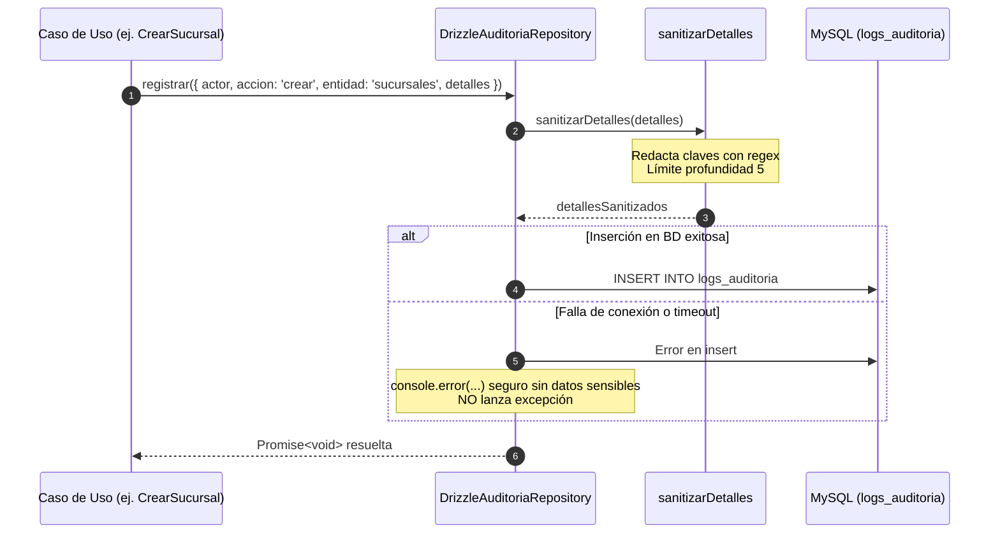
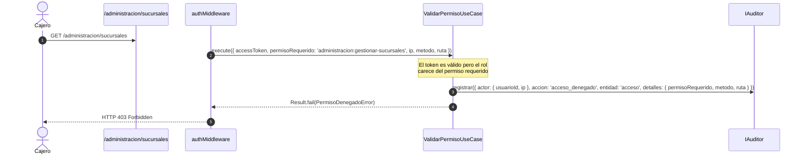

# Módulo de Auditoría — Warengine

> **Estado del módulo:** IMPLEMENTADO (Transversal)  
> **Stack técnico:** Deno · TypeScript · Drizzle ORM · MySQL 8 · Hono  
> **Arquitectura:** Clean Architecture + Inversión de Dependencias (DIP) + ADR 0002  

---

## Índice

1. [Propósito y Estado](#1-propósito-y-estado)
2. [Cobertura del SRS](#2-cobertura-del-srs)
3. [Mapa de Archivos](#3-mapa-de-archivos)
4. [Dominio](#4-dominio)
5. [Casos de Uso](#5-casos-de-uso)
6. [Persistencia](#6-persistencia)
7. [API REST](#7-api-rest)
8. [Contratos (SHARED)](#8-contratos-shared)
9. [Permisos y Roles](#9-permisos-y-roles)
10. [Pruebas](#10-pruebas)
11. [Flujos Clave](#11-flujos-clave)
12. [Pendientes y Deuda Técnica](#12-pendientes-y-deuda-técnica)
13. [Cómo Probar Manualmente](#13-cómo-probar-manualmente)

---

## 1. Propósito y Estado

**Estado:** `IMPLEMENTADO`

El módulo de Auditoría es un componente transversal unificado ([ADR 0002](../../Docs/adr/0002-auditoria.md)) que garantiza la trazabilidad e inmutabilidad de todas las mutaciones de negocio y de los eventos de seguridad del sistema.
- Provee un puerto único y minimalista ([`IAuditor`](../../Backend/packages/core/src/modules/auditoria/domain/repositories/IAuditoriaRepository.ts)) que todos los casos de uso inyectan.
- Aplica el principio de **auditar por semántica de evento de negocio dentro del caso de uso y no por verbo HTTP**.
- Sanitiza de forma recursiva cualquier información confidencial antes de llegar a la base de datos ([`sanitizarDetalles`](../../Backend/packages/core/src/modules/auditoria/domain/services/sanitizar-detalles.ts)).
- Opera bajo política **best-effort**: una falla al escribir en la bitácora jamás hace fallar la transacción de negocio principal.
- Expone un caso de uso de consulta paginada y filtrable para el Super Administrador.
- Está blindado a nivel de motor MySQL mediante triggers de **solo inserción** (append-only) que impiden modificaciones o eliminaciones.

---

## 2. Cobertura del SRS

| Requerimiento (RF / RNF) | Descripción Corta | Estado | Dónde está en el código |
|---|---|---|---|
| **RNF-06 / RNF-ADM-02** | Registro inmutable de operaciones de negocio (creación, edición, activación, inactivación) | IMPLEMENTADO | [`DrizzleAuditoriaRepository.ts`](../../Backend/packages/database/src/repositories/administracion/drizzle-auditoria.repository.ts), triggers en `WARENGINE_FULL_BD.sql` |
| **RF-ADM-C11** | Consulta de bitácora con filtros por usuario, acción, entidad y fechas | IMPLEMENTADO | [`ConsultarAuditoriaUseCase.ts`](../../Backend/packages/core/src/modules/auditoria/application/use-cases/ConsultarAuditoriaUseCase.ts) |
| **RF-ADM-C11 (Seguridad)** | Auditoría de intentos de acceso no autorizado (HTTP 403) | IMPLEMENTADO | [`ValidarPermisoUseCase.ts`](../../Backend/packages/core/src/modules/autenticacion/application/use-cases/ValidarPermisoUseCase.ts) registra acción `acceso_denegado` |
| **RF-SA-F4 / RF-SA-F5** | Auditoría de intentos de autenticación exitosos y fallidos | IMPLEMENTADO | [`drizzle-intento-login.repository.ts`](../../Backend/packages/database/src/repositories/autenticacion/drizzle-intento-login.repository.ts) (destino `intentos_login`) |
| **RF-SA-i9** | Auditoría de invocaciones del asistente IA en `logs_mcp_tools` | PENDIENTE | Tabla `logs_mcp_tools` en BD; repositorio y puerto en `core/src/modules/mcp-audit` pendientes de implementación |
| **RNF-ADM-04** | Aislamiento de auditoría por sucursal | PENDIENTE | La tabla `logs_auditoria` actual no tiene columna `sucursal_id` |

---

## 3. Mapa de Archivos

```
Backend/
├── packages/
│   ├── core/src/modules/auditoria/
│   │   ├── domain/
│   │   │   ├── entities/
│   │   │   │   └── LogAuditoria.ts
│   │   │   ├── errors/
│   │   │   │   └── AuditoriaErrors.ts
│   │   │   ├── repositories/
│   │   │   │   └── IAuditoriaRepository.ts
│   │   │   └── services/
│   │   │       └── sanitizar-detalles.ts
│   │   └── application/
│   │       └── use-cases/
│   │           └── ConsultarAuditoriaUseCase.ts
│   ├── database/src/
│   │   ├── schema/
│   │   │   └── auditoria.schema.ts
│   │   ├── repositories/administracion/
│   │   │   └── drizzle-auditoria.repository.ts
│   │   └── mappers/administracion/
│   │       └── log-auditoria.mapper.ts
│   └── core/tests/
│       ├── auditoria/
│       │   └── sanitizar-detalles.test.ts
│       └── administracion/
│           └── consultar-auditoria.use-case.test.ts
├── apps/api/src/
│   ├── routes/
│   │   └── administracion.routes.ts
│   ├── controllers/administracion/
│   │   └── auditoria.controller.ts
│   └── utils/
│       ├── actor.ts
│       └── ip.ts
Shared/
└── contracts/src/
    └── administracion/
        ├── auditoria.catalogo.ts
        └── auditoria.schema.ts
```

*Nota sobre la organización del repositorio:* Por razones históricas de desarrollo, la implementación de persistencia [`drizzle-auditoria.repository.ts`](../../Backend/packages/database/src/repositories/administracion/drizzle-auditoria.repository.ts) y su mapper se ubican en el subdirectorio `database/src/repositories/administracion/`, aunque implementan el puerto transversal `IAuditoriaRepository` de `@warengine/core`.

---

## 4. Dominio

### 4.1 Entidades y Constantes

Archivo: [`LogAuditoria.ts`](../../Backend/packages/core/src/modules/auditoria/domain/entities/LogAuditoria.ts)

```typescript
export const ACCIONES_AUDITORIA = {
  CREAR: 'crear',
  EDITAR: 'editar',
  ACTIVAR: 'activar',
  INACTIVAR: 'inactivar',
  CAMBIAR_ROL: 'cambiar_rol',
  ACCESO_DENEGADO: 'acceso_denegado',
  RESTABLECER_PASSWORD: 'restablecer_password',
} as const;

export const ENTIDADES_AUDITORIA = {
  SUCURSALES: 'sucursales',
  USUARIOS: 'usuarios',
  CATEGORIAS: 'categorias',
  PROVEEDORES: 'proveedores',
  CLIENTES: 'clientes',
  ACCESO: 'acceso',
} as const;

export interface ActorAuditoria {
  usuarioId: string;
  ip: string | null;
}

export class LogAuditoria {
  constructor(
    public readonly id: string,
    public readonly usuarioId: string | null,
    public readonly usuarioNombre: string | null,
    public readonly accion: string,
    public readonly entidad: string,
    public readonly entidadId: string | null,
    public readonly detalles: Record<string, unknown> | null,
    public readonly ip: string | null,
    public readonly fecha: Date,
  ) {}
}
```

### 4.2 Servicio de Dominio: `sanitizarDetalles`

Archivo: [`sanitizar-detalles.ts`](../../Backend/packages/core/src/modules/auditoria/domain/services/sanitizar-detalles.ts)

Función pura ejecutada antes de insertar en base de datos:
- **Patrón sensible:** `/pass|clave|hash|token|secret|totp|otp/i`.
- **Comportamiento:**
  - Si una clave coincide con la expresión regular (sin importar mayúsculas o minúsculas), su valor se reemplaza por `'[REDACTADO]'`.
  - Opera recursivamente sobre objetos anidados y arreglos.
  - No muta el objeto original (genera una copia profunda limpia).
  - Límite de seguridad: profundidad máxima de 5 niveles para evitar desbordamiento por ciclos (`'[PROFUNDIDAD_MAXIMA_EXCEDIDA]'`).
  - Si recibe `null` o `undefined`, devuelve `null`.

### 4.3 Interfaces de Puerto

Archivo: [`IAuditoriaRepository.ts`](../../Backend/packages/core/src/modules/auditoria/domain/repositories/IAuditoriaRepository.ts)

```typescript
export interface EventoAuditoria {
  actor: ActorAuditoria;
  accion: string;
  entidad: string;
  entidadId?: string | null;
  detalles?: Record<string, unknown> | null;
}

/** Puerto mínimo para casos de uso que solo registran eventos (ISP) */
export interface IAuditor {
  registrar(evento: EventoAuditoria): Promise<void>;
}

export interface FiltrosAuditoria {
  usuarioId?: string;
  accion?: string;
  entidad?: string;
  desde?: Date;
  hasta?: Date;
  limite: number;
  offset: number;
}

export interface PaginaAuditoria {
  items: LogAuditoria[];
  total: number;
}

export interface IAuditoriaRepository extends IAuditor {
  listar(filtros: FiltrosAuditoria): Promise<PaginaAuditoria>;
}
```

### 4.4 Errores de Dominio

Archivo: [`AuditoriaErrors.ts`](../../Backend/packages/core/src/modules/auditoria/domain/errors/AuditoriaErrors.ts)

| Clase de Error | `code` | Mensaje por Defecto | Código HTTP |
|---|---|---|---|
| `FiltroAuditoriaInvalidoError` | `FILTRO_AUDITORIA_INVALIDO` | Variable (ej. 'La fecha "desde" no puede ser posterior a "hasta".') | 400 Bad Request |

---

## 5. Casos de Uso

### 5.1 `ConsultarAuditoriaUseCase`
- **Archivo:** [`ConsultarAuditoriaUseCase.ts`](../../Backend/packages/core/src/modules/auditoria/application/use-cases/ConsultarAuditoriaUseCase.ts)
- **Dependencias:** `IAuditoriaRepository`
- **Entrada:** `ConsultarAuditoriaRequest { usuarioId?: string, accion?: string, entidad?: string, desde?: Date, hasta?: Date, pagina?: number, limite?: number }`
- **Salida:** `Result<PaginaAuditoriaResponse, DomainError>` (`{ items, total, pagina, limite, totalPaginas }`)
- **Reglas de Negocio:**
  1. Si `desde` es posterior a `hasta`, falla con `FiltroAuditoriaInvalidoError`.
  2. Página por defecto: 1 (mínimo 1).
  3. Límite por defecto: 50. Límite máximo: 200.
  4. Calcula `offset = (pagina - 1) * limite`.
  5. Consulta `IAuditoriaRepository.listar` y calcula `totalPaginas`.
- **Auditoría:** No genera registros en `logs_auditoria` (la consulta ordinaria no es mutación).
- **Pruebas:** [`consultar-auditoria.use-case.test.ts`](../../Backend/packages/core/tests/administracion/consultar-auditoria.use-case.test.ts) (6 tests).

---

## 6. Persistencia

### 6.1 Tabla Drizzle
Archivo: [`auditoria.schema.ts`](../../Backend/packages/database/src/schema/auditoria.schema.ts)
```typescript
export const logs_auditoria = mysqlTable('logs_auditoria', {
  id_log_auditoria: char('id_log_auditoria', { length: 36 }).notNull().default(sql.raw('(UUID())')).primaryKey(),
  usuario_id: char('usuario_id', { length: 36 }).references(() => usuarios.id_usuario, { onDelete: 'set null' }),
  accion: varchar('accion', { length: 50 }).notNull(),
  entidad: varchar('entidad', { length: 100 }).notNull(),
  entidad_id: varchar('entidad_id', { length: 100 }),
  detalles: json('detalles'),
  ip: varchar('ip', { length: 45 }),
  fecha: datetime('fecha', { mode: 'date' }).notNull().default(sql.raw('CURRENT_TIMESTAMP')),
});
```

### 6.2 Repositorio y Política Best-Effort
Archivo: [`drizzle-auditoria.repository.ts`](../../Backend/packages/database/src/repositories/administracion/drizzle-auditoria.repository.ts)
- En `registrar(evento)`:
  - Invoca `sanitizarDetalles(evento.detalles)`.
  - Ejecuta `this.db.insert(logs_auditoria)`.
  - Envuelto en bloque `try / catch`: si ocurre cualquier fallo de conectividad o base de datos, emite `console.error` con metadatos seguros (`accion`, `entidad`, `usuarioId`) **sin lanzar la excepción**, protegiendo la operación de negocio original.
- En `listar(filtros)`:
  - Realiza `LEFT JOIN usuarios` y `LEFT JOIN empleados` para proyectar el nombre legible del empleado que ejecutó la acción.
  - Ordena de forma descendente por `fecha` y por `id_log_auditoria`.

### 6.3 Los Tres Destinos Especializados de Auditoría
El backend de Warengine distribuye la auditoría en 3 destinos según su ciclo de vida y volumen:
1. `logs_auditoria`: Mutaciones de negocio (creación, edición, activación, roles) y accesos denegados autenticados.
2. `intentos_login`: Registro de autenticaciones exitosas y fallidas (evita saturar la tabla principal).
3. `logs_mcp_tools`: Invocaciones de tools por el modelo de IA (esquema creado, pendiente de implementación).

### 6.4 Integridad en BD (Solo Inserción)
Fuente: `WARENGINE_FULL_BD.sql` y `001-logs-auditoria-solo-insercion.sql`
- `trg_logs_auditoria_bloquea_update`: Dispara `SIGNAL SQLSTATE '45000'` ante cualquier intento de `UPDATE`.
- `trg_logs_auditoria_bloquea_delete`: Dispara `SIGNAL SQLSTATE '45000'` ante cualquier intento de `DELETE`.
- `ON DELETE SET NULL`: Si se borra un usuario del sistema, el registro de auditoría se conserva intacto con `usuario_id = NULL`.

---

## 7. API REST

Ruta registrada dentro de [`administracion.routes.ts`](../../Backend/apps/api/src/routes/administracion.routes.ts):

| Método | Ruta Completa | Permiso Requerido | Controlador | Caso de Uso | Schema Zod | Códigos HTTP |
|---|---|---|---|---|---|---|
| `GET` | `/administracion/auditoria` | `autenticacion:ver-auditoria` | [`consultarAuditoriaController`](../../Backend/apps/api/src/controllers/administracion/auditoria.controller.ts) | `ConsultarAuditoriaUseCase` | `filtrosAuditoriaSchema` | 200, 400, 401, 403, 500 |

### Parámetros Query soportados:
- `usuarioId`: UUID opcional
- `accion`: una de `ACCIONES_AUDITORIA_VALORES` (`crear`, `editar`, `activar`, `inactivar`, `cambiar_rol`, `acceso_denegado`, `restablecer_password`)
- `entidad`: una de `ENTIDADES_AUDITORIA_VALORES` (`sucursales`, `usuarios`, `categorias`, `proveedores`, `clientes`, `acceso`)
- `desde`: ISO 8601 string parseado a Date
- `hasta`: ISO 8601 string parseado a Date
- `pagina`: número entero positivo
- `limite`: número entero positivo (máx. 200)

---

## 8. Contratos (SHARED)

Ubicación: `Shared/contracts/src/administracion/`

- [`auditoria.catalogo.ts`](../../Shared/contracts/src/administracion/auditoria.catalogo.ts):
  - `ACCIONES_AUDITORIA_VALORES`: `['crear', 'editar', 'activar', 'inactivar', 'cambiar_rol', 'acceso_denegado', 'restablecer_password']`
  - `ENTIDADES_AUDITORIA_VALORES`: `['sucursales', 'usuarios', 'categorias', 'proveedores', 'clientes', 'acceso']`
- [`auditoria.schema.ts`](../../Shared/contracts/src/administracion/auditoria.schema.ts):
  - Valida estrictamente que `accion` pertenezca al catálogo permitido.
  - Valida estrictamente que `entidad` pertenezca al catálogo permitido.
  - Coacciona `pagina` y `limite` a enteros positivos.

---

## 9. Permisos y Roles

- Permiso: `autenticacion:ver-auditoria`.
- Roles autorizados: **Únicamente `super-admin`**.
- Ni `admin-sucursal` ni `cajero-vendedor` pueden consultar la bitácora de auditoría.

---

## 10. Pruebas

- [`sanitizar-detalles.test.ts`](../../Backend/packages/core/tests/auditoria/sanitizar-detalles.test.ts): 5 tests.
  - Retorno de null para null/undefined.
  - Preservación de objetos sin datos sensibles.
  - Redacción case-insensitive de claves (`password`, `Hash`, `token`, `secret`, `otp`, `clave`).
  - Redacción profunda en objetos anidados y arrays sin mutación del original.
  - Límite de profundidad máxima para evitar desbordamiento.
- [`consultar-auditoria.use-case.test.ts`](../../Backend/packages/core/tests/administracion/consultar-auditoria.use-case.test.ts): 6 tests.
  - Valores por defecto (página 1, límite 50).
  - Cálculo de offset.
  - Límite de tamaño máximo (200).
  - Paso de filtros de usuario, fechas, entidad y acción.
  - Rechazo de rango inválido (`desde > hasta`).
  - Validación del esquema Zod contra el catálogo.
- [`auditoria-operaciones.use-case.test.ts`](../../Backend/packages/core/tests/administracion/auditoria-operaciones.use-case.test.ts): Valida que cada caso de uso de administración invoque a `IAuditor.registrar` con los detalles esperados.

### Cómo Ejecutar
```bash
cd BACK
deno test packages/core/tests/auditoria/
deno test packages/core/tests/administracion/consultar-auditoria.use-case.test.ts
```

---

## 11. Flujos Clave

### Flujo 1: Registro Best-Effort con Sanitización Automática


### Flujo 2: Auditoría de Acceso Denegado (HTTP 403)


---

## 12. Pendientes y Deuda Técnica

1. **Aislamiento por Sucursal (RNF-ADM-04):** Actualmente `logs_auditoria` no almacena `sucursal_id`. Para que los administradores de sucursal puedan auditar su propia sede en el futuro sin ver eventos globales, se requerirá añadir la columna y filtrar en el repositorio.
2. **Registro Atómico con `unit-of-work.ts`:** Si una transacción de facturación requiere que la auditoría sea transaccional e indivisible respecto a la venta, se requerirá pasar el contexto de transacción al repositorio.
3. **Persistencia de `logs_mcp_tools`:** Implementar el puerto y repositorio para la auditoría de tools del modelo conversacional.

---

## 13. Cómo Probar Manualmente

Archivo de prueba: [`Http/04-auditoria.http`](../../Http/04-auditoria.http)

Pasos:
1. Iniciar sesión como `superadmin@warengine.local`.
2. Enviar peticiones a `/administracion/auditoria` sin filtros para inspeccionar la página 1.
3. Probar filtros por entidad (`?entidad=sucursales` o `?entidad=usuarios`).
4. Probar filtros por acción (`?accion=crear`, `?accion=cambiar_rol` o `?accion=acceso_denegado`).
5. Generar un acceso denegado intentando invocar una ruta protegida con un token de `cajero-vendedor` y consultar la bitácora para verificar el registro de `acceso_denegado`.
