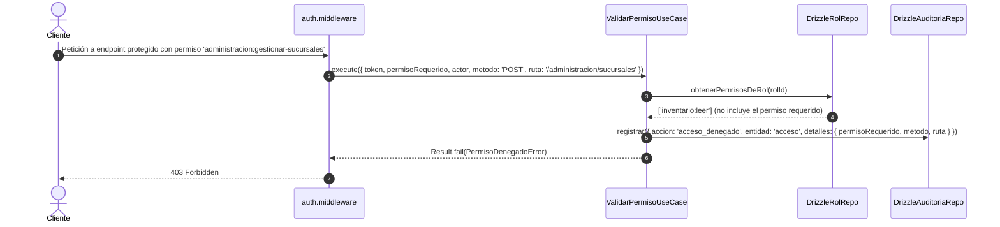

# Módulo Transversal de Auditoría — Warengine

> **Propósito y estado:** **IMPLEMENTADO** (Módulo transversal de trazabilidad inmutable y forense)  
> **Stack:** Deno · TypeScript · Drizzle ORM · MySQL 8 · Triggers de solo inserción · Hono  
> **Arquitectura:** Clean Architecture + Ports & Adapters + ADR 0002

---

## Índice

1. [Propósito y estado](#1-propósito-y-estado)
2. [Cobertura del SRS](#2-cobertura-del-srs)
3. [Mapa de archivos](#3-mapa-de-archivos)
4. [Dominio](#4-dominio)
5. [Casos de uso](#5-casos-de-uso)
6. [Persistencia](#6-persistencia)
7. [API REST](#7-api-rest)
8. [Contratos (Shared)](#8-contratos-shared)
9. [Permisos y roles](#9-permisos-y-roles)
10. [Pruebas](#10-pruebas)
11. [Flujos clave](#11-flujos-clave)
12. [Pendientes y deuda técnica](#12-pendientes-y-deuda-técnica)
13. [Cómo probar manualmente](#13-cómo-probar-manualmente)

---

## 1. Propósito y Estado

El módulo de **Auditoría** provee la infraestructura transversal y el contrato unificado para el registro forense e inmutable de todas las mutaciones del sistema, eventos de seguridad y accesos denegados en Warengine. Su diseño responde al [ADR 0002](../../Docs/adr/0002-auditoria.md): opera bajo una política **best-effort** (la falla de inserción del log nunca aborta la transacción de negocio principal), garantiza inmutabilidad estricta a nivel de motor de base de datos (triggers de solo inserción) y aplica sanitización recursiva automática de credenciales y secretos en memoria antes de persistir.

**Estado actual:** **IMPLEMENTADO**  
El puerto `IAuditor` está inyectado en todos los casos de uso que mutan datos en Administración, Inventario y Facturación. La bitácora cuenta con consulta paginada vía API REST y protección contra manipulación.

---

## 2. Cobertura del SRS

| Requisito | Descripción corta | Estado | Dónde está en el código |
|---|---|---|---|
| **RNF-ADM-02** | Registro inmutable de auditoría (crear, editar, activar, inactivar, cambiar rol) | IMPLEMENTADO | [drizzle-auditoria.repository.ts](../../Backend/packages/database/src/repositories/administracion/drizzle-auditoria.repository.ts), Triggers en SQL |
| **RNF-06** | Trazabilidad de operaciones críticas con usuario, IP, fecha y cambios | IMPLEMENTADO | [LogAuditoria.ts](../../Backend/packages/core/src/modules/auditoria/domain/entities/LogAuditoria.ts) |
| **RF-ADM-C11** | Registro auditable de accesos denegados (HTTP 403) con ruta y permiso | IMPLEMENTADO | [ValidarPermisoUseCase.ts](../../Backend/packages/core/src/modules/autenticacion/application/use-cases/ValidarPermisoUseCase.ts) |
| **RF-SA-F4** | Registro de intentos de login (separado de logs de negocio) | IMPLEMENTADO | [drizzle-intento-login.repository.ts](../../Backend/packages/database/src/repositories/autenticacion/drizzle-intento-login.repository.ts) (tabla `intentos_login`) |
| **RF-SA-i9** | Registro auditable de invocaciones de Tools del servidor MCP | PENDIENTE | Tabla `logs_mcp_tools` existe en BD y Drizzle; pendiente de instanciación en `apps/mcp-server`. |
| **RNF-ADM-04** | Aislamiento de consulta de auditoría por sucursal | PENDIENTE | `logs_auditoria` carece de columna `sucursal_id`; Super Admin consulta todos los registros. |

---

## 3. Mapa de Archivos

```
Backend/
├── apps/api/src/
│   ├── controllers/administracion/
│   │   └── auditoria.controller.ts
│   ├── routes/
│   │   └── administracion.routes.ts   # Registra GET /administracion/auditoria
│   └── presenters/
│       └── result.presenter.ts
├── packages/
│   ├── core/
│   │   ├── src/modules/auditoria/
│   │   │   ├── application/use-cases/
│   │   │   │   └── ConsultarAuditoriaUseCase.ts
│   │   │   ├── domain/
│   │   │   │   ├── entities/
│   │   │   │   │   └── LogAuditoria.ts
│   │   │   │   ├── errors/
│   │   │   │   │   └── AuditoriaErrors.ts
│   │   │   │   ├── repositories/
│   │   │   │   │   └── IAuditoriaRepository.ts  # Contiene IAuditor e IAuditoriaRepository
│   │   │   │   └── services/
│   │   │   │       └── sanitizar-detalles.ts
│   │   └── tests/
│   │       ├── administracion/
│   │       │   ├── auditoria-operaciones.use-case.test.ts
│   │       │   └── consultar-auditoria.use-case.test.ts
│   │       └── auditoria/
│   │           └── sanitizar-detalles.test.ts
│   ├── database/src/
│   │   ├── schema/
│   │   │   └── auditoria.schema.ts
│   │   ├── repositories/administracion/
│   │   │   └── drizzle-auditoria.repository.ts
│   │   └── mappers/administracion/
│   │       └── log-auditoria.mapper.ts
│   └── composition/src/
│       └── container.ts
Shared/contracts/src/administracion/
├── auditoria.catalogo.ts
└── auditoria.schema.ts
Http/
└── 04-auditoria.http
```

---

## 4. Dominio

### 4.1 Entidades y Enums ([LogAuditoria.ts](../../Backend/packages/core/src/modules/auditoria/domain/entities/LogAuditoria.ts))

- **`ACCIONES_AUDITORIA`**:
  - `'crear'`: Alta de entidades.
  - `'editar'`: Modificación de atributos.
  - `'activar'`: Cambio de estado operativo a activo.
  - `'inactivar'`: Cambio de estado operativo a inactivo.
  - `'cambiar_rol'`: Reasignación de rol de acceso.
  - `'acceso_denegado'`: Rechazo en middleware de permisos (HTTP 403).
- **`ENTIDADES_AUDITORIA`**:
  - `'sucursales'`, `'usuarios'`, `'categorias'`, `'proveedores'`, `'clientes'`, `'productos'`, `'acceso'`.
- **`ActorAuditoria`**:
  - `usuarioId: string` (UUID del operador autenticado)
  - `ip?: string` (dirección IP de origen)
  - `email?: string`
- **`EventoAuditoria`**:
  - `actor: ActorAuditoria`
  - `accion: AccionAuditoria`
  - `entidad: EntidadAuditoria`
  - `entidadId?: string | number | null`
  - `detalles?: Record<string, unknown>` (estructura `{ antes?: {...}, despues?: {...} }`)
- **`LogAuditoria`**:
  - Representa el registro persistido con `id: number`, `fecha: Date`, `actor`, `accion`, `entidad`, `entidadId`, `detalles`.

### 4.2 Interfaces (Ports) ([IAuditoriaRepository.ts](../../Backend/packages/core/src/modules/auditoria/domain/repositories/IAuditoriaRepository.ts))

- **`IAuditor` (Puerto de Emisión)**:
  ```typescript
  registrar(evento: EventoAuditoria): Promise<void>;
  ```
  Inyectado en los casos de uso para reportar mutaciones de negocio.

- **`IAuditoriaRepository` (Puerto de Lectura y Persistencia)**:
  ```typescript
  consultar(filtros: FiltrosAuditoria): Promise<PaginaAuditoria>;
  ```
  Donde `FiltrosAuditoria` incluye: `usuarioId?`, `accion?`, `entidad?`, `desde?`, `hasta?`, `limite` (def: 50, max: 100), `offset` (def: 0).

### 4.3 Servicio Puro de Sanitización ([sanitizar-detalles.ts](../../Backend/packages/core/src/modules/auditoria/domain/services/sanitizar-detalles.ts))

- **Patrón sensible exacto**: `/pass|clave|hash|token|secret|totp|otp/i`
- **Regla:** Recorre recursivamente todas las propiedades del objeto `detalles`. Si una clave coincide con el patrón insensible a mayúsculas, sustituye su valor por la cadena literal `'[REDACTADO]'`.
- **Protección de pila:** Aplica un límite de profundidad de recursión (máximo 8 niveles) para evitar desbordamientos de pila (*stack overflow*) ante estructuras circulares o anidadas.

### 4.4 Errores de Dominio ([AuditoriaErrors.ts](../../Backend/packages/core/src/modules/auditoria/domain/errors/AuditoriaErrors.ts))

| Clase | Code | Mensaje | HTTP Presenter |
|---|---|---|---|
| `FiltroAuditoriaInvalidoError` | `FILTRO_AUDITORIA_INVALIDO` | Mensaje descriptivo (ej. "La fecha final no puede ser anterior a la inicial") | 400 Bad Request |

---

## 5. Casos de Uso

### 5.1 `ConsultarAuditoriaUseCase`
- **Archivo:** [ConsultarAuditoriaUseCase.ts](../../Backend/packages/core/src/modules/auditoria/application/use-cases/ConsultarAuditoriaUseCase.ts)
- **Dependencias:** `IAuditoriaRepository`
- **Entrada:** `FiltrosAuditoria` (`usuarioId?`, `accion?`, `entidad?`, `desde?`, `hasta?`, `limite`, `offset`)
- **Salida:** `Result<PaginaAuditoria, DomainError>` (`{ items: LogAuditoria[], total: number, limite: number, offset: number }`)
- **Reglas:**
  1. Si se especifican `desde` y `hasta`, valida que `desde <= hasta`. Si `hasta < desde`, falla con `FiltroAuditoriaInvalidoError`.
  2. Ajusta `limite` a un máximo de 100 registros por página para proteger la memoria de la API.
  3. Ejecuta la consulta paginada en el repositorio.
- **Evento de auditoría:** No emite auditoría sobre sí mismo (consultar el log de auditoría no genera un nuevo registro de auditoría, para evitar bucles infinitos de auto-registro en la bitácora).
- **Pruebas que lo cubren:** [consultar-auditoria.use-case.test.ts](../../Backend/packages/core/tests/administracion/consultar-auditoria.use-case.test.ts) (7 tests).

### 5.2 Emisión desde otros módulos vía `IAuditor.registrar`
Todos los casos de uso que mutan datos inyectan `IAuditor` en su constructor y ejecutan:
```typescript
await this.auditor.registrar({
  actor: request.actor,
  accion: ACCIONES_AUDITORIA.CREAR, // o EDITAR, ACTIVAR, INACTIVAR, CAMBIAR_ROL
  entidad: ENTIDADES_AUDITORIA.SUCURSALES,
  entidadId: sucursal.id,
  detalles: { despues: { ... } }, // o { antes, despues }
});
```

---

## 6. Persistencia

### 6.1 Tres Destinos Especializados (ADR 0002)

1. **`logs_auditoria`**: Bitácora principal de negocio y accesos denegados.
   - Columnas: `id` (bigint auto PK), `fecha` (timestamp def CURRENT_TIMESTAMP), `usuario_id` (char 36), `ip` (varchar 45), `accion` (varchar 30), `entidad` (varchar 50), `entidad_id` (varchar 100), `detalles` (json).
   - Índices: `idx_logs_auditoria_fecha`, `idx_logs_auditoria_usuario`, `idx_logs_auditoria_accion_entidad`.
2. **`intentos_login`**: Trazabilidad de autenticación (RF-SA-F4). Separa la frecuencia alta de logins de la auditoría de negocio.
3. **`logs_mcp_tools`**: Auditoría de invocaciones de herramientas de IA (RF-SA-i9).

### 6.2 Política Best-Effort con Respaldo en Consola
Implementada en [drizzle-auditoria.repository.ts](../../Backend/packages/database/src/repositories/administracion/drizzle-auditoria.repository.ts):
```typescript
try {
  const detallesSanitizados = evento.detalles ? sanitizarDetalles(evento.detalles) : null;
  await this.db.insert(logs_auditoria).values({ ... });
} catch (error) {
  // Política best-effort: la auditoría nunca debe abortar la operación de negocio
  console.error('[AUDITORIA_FALLO_PERSISTENCIA]', {
    accion: evento.accion,
    entidad: evento.entidad,
    usuarioId: evento.actor.usuarioId,
    error: error instanceof Error ? error.message : String(error),
  });
}
```

### 6.3 Inmutabilidad Estricta (Triggers MySQL)
Para dar cumplimiento a **RNF-ADM-02**, la base de datos bloquea cualquier intento de alteración física en `logs_auditoria`:
- **`trg_logs_auditoria_bloquea_update` (BEFORE UPDATE)**:
  ```sql
  SIGNAL SQLSTATE '45000' SET MESSAGE_TEXT = 'Operación denegada: logs_auditoria es de solo inserción (inmutable).';
  ```
- **`trg_logs_auditoria_bloquea_delete` (BEFORE DELETE)**:
  ```sql
  SIGNAL SQLSTATE '45000' SET MESSAGE_TEXT = 'Operación denegada: logs_auditoria es de solo inserción (inmutable).';
  ```

### 6.4 Política de Peticiones GET
- **Regla general:** Las peticiones GET ordinarias **NO se auditan** (RNF-06 y RNF-ADM-02). Auditar cada lectura saturaría el almacenamiento y degradaría el tiempo de respuesta.
- **Excepciones auditables en lectura:**
  1. Lecturas de datos confidenciales (sueldos o estados financieros).
  2. Todo acceso denegado (HTTP 403), independientemente del método HTTP (`GET`, `POST`, `PUT`, `DELETE`).

---

## 7. API REST

Prefijo general de montaje en `main.ts`: `/administracion`.

| Método | Ruta completa | Permiso requerido | Controlador | Caso de uso | Schema Zod | Códigos HTTP |
|---|---|---|---|---|---|---|
| `GET` | `/administracion/auditoria` | `autenticacion:ver-auditoria` | `consultarAuditoriaController` | `ConsultarAuditoriaUseCase` | `consultarAuditoriaSchema` | 200, 400, 401, 403 |

**Parámetros de consulta (Query params):**
- `usuarioId`: UUID opcional del actor.
- `accion`: `crear`, `editar`, `activar`, `inactivar`, `cambiar_rol`, `acceso_denegado`.
- `entidad`: `sucursales`, `usuarios`, `categorias`, `proveedores`, `clientes`, `productos`, `acceso`.
- `desde`: ISO 8601 string.
- `hasta`: ISO 8601 string.
- `limite`: Entero entre 1 y 100 (def: 50).
- `offset`: Entero >= 0 (def: 0).

---

## 8. Contratos (Shared)

- **`auditoria.catalogo.ts`** ([auditoria.catalogo.ts](../../Shared/contracts/src/administracion/auditoria.catalogo.ts)):
  Define las listas tipadas `ACCIONES_AUDITORIA` y `ENTIDADES_AUDITORIA`.
- **`consultarAuditoriaSchema`** ([auditoria.schema.ts](../../Shared/contracts/src/administracion/auditoria.schema.ts)):
  ```typescript
  z.object({
    usuarioId: z.string().uuid().optional(),
    accion: z.enum(ACCIONES_AUDITORIA).optional(),
    entidad: z.enum(ENTIDADES_AUDITORIA).optional(),
    desde: z.string().datetime().optional(),
    hasta: z.string().datetime().optional(),
    limite: z.coerce.number().int().min(1).max(100).default(50),
    offset: z.coerce.number().int().min(0).default(0),
  }).refine((data) => !data.desde || !data.hasta || new Date(data.desde) <= new Date(data.hasta), {
    message: 'La fecha final no puede ser anterior a la inicial',
    path: ['hasta'],
  })
  ```

---

## 9. Permisos y Roles

- **Permiso requerido:** `autenticacion:ver-auditoria`
- **Asignación en seed:**
  - `super-admin`: Posee el permiso y es el único autorizado para consultar la bitácora.
  - `admin-sucursal`: No posee acceso (recibe HTTP 403).
  - `cajero-vendedor`: No posee acceso (recibe HTTP 403).

---

## 10. Pruebas

### Archivos de Test y Cobertura
1. [sanitizar-detalles.test.ts](../../Backend/packages/core/tests/auditoria/sanitizar-detalles.test.ts) (10 tests):
   - Redacta contraseñas, tokens, secretos TOTP, hashes Argon2 y API keys.
   - Aplica reemplazo insensible a mayúsculas (`password`, `PASSWORD`, `HashClave`).
   - Mantiene intactos atributos legítimos (`nombre`, `email`, `isActive`, `rolId`).
   - Soporta estructuras anidadas profundas y arrays de objetos.
   - Previene *stack overflow* con límite de profundidad de recursión.
2. [consultar-auditoria.use-case.test.ts](../../Backend/packages/core/tests/administracion/consultar-auditoria.use-case.test.ts) (7 tests):
   - Consulta paginada con límite y offset.
   - Filtros por `usuarioId`, `accion`, `entidad` y rango de fechas.
   - Rechazo de rango de fechas invertido (`hasta < desde`).
   - Clamping de límite máximo a 100.
3. [auditoria-operaciones.use-case.test.ts](../../Backend/packages/core/tests/administracion/auditoria-operaciones.use-case.test.ts) (7 tests):
   - Verifica que cada caso de uso administrativo invoque `IAuditor.registrar` con la acción, entidad y convención `antes/despues` correcta.
   - Constata que las fallas de validación de negocio NO emitan auditoría espuria.

### Cómo ejecutarlas
```bash
deno test --allow-all Backend/packages/core/tests/auditoria/ Backend/packages/core/tests/administracion/consultar-auditoria.use-case.test.ts
```

---

## 11. Flujos Clave

### Flujo 1: Emisión Best-Effort con Sanitización Automática

```mermaid
sequenceDiagram
    autonumber
    participant UC as CasoDeUso (ej. CrearUsuario)
    participant Aud as DrizzleAuditoriaRepository
    participant San as sanitizarDetalles (función pura)
    participant DB as MySQL (logs_auditoria)

    UC->>Aud: registrar({ actor, accion: 'crear', entidad: 'usuarios', detalles })
    Aud->>San: sanitizarDetalles(detalles)
    Note over San: Redacta con '[REDACTADO]' cualquier campo coincidente con /pass|clave|hash|token|secret/i
    San-->>Aud: detallesSanitizados
    Aud->>DB: INSERT INTO logs_auditoria (...)
    alt Inserción exitosa
        DB-->>Aud: OK
    else Error de conexión / timeout en MySQL
        DB-->>Aud: Error de BD
        Aud->>Aud: console.error('[AUDITORIA_FALLO_PERSISTENCIA]', metadatosSeguros)
        Note over Aud: NO arroja excepción; la operación de negocio continúa
    end
    Aud-->>UC: Promise<void> resuelta
```

### Flujo 2: Registro de Acceso Denegado (403) en ValidarPermiso



---

## 12. Pendientes y Deuda Técnica

1. **Particionamiento por Sucursal (RNF-ADM-04):** Agregar columna `sucursal_id` en `logs_auditoria` para permitir que administradores de sucursal consulten únicamente las operaciones de su sede sin ver las globales.
2. **Registro de Tools del Servidor MCP (`logs_mcp_tools`):** Conectar el puerto y repositorio de auditoría de Tools cuando se implemente el servidor MCP.
3. **Transaccionalidad Atómica Conjunta con Unit of Work:** Aunque la auditoría es best-effort para mutaciones normales, ciertas operaciones de alta sensibilidad legal requerirán transacción atómica conjunta (negocio + auditoría) mediante `UnitOfWork`.

---

## 13. Cómo Probar Manualmente

El archivo [Http/04-auditoria.http](../../Http/04-auditoria.http) permite probar la bitácora:
1. **Consulta general:** `GET /administracion/auditoria` paginada.
2. **Filtros combinados:** Filtrar por `accion=crear` y `entidad=sucursales`.
3. **Verificación de inmutabilidad:** Intento directo de `UPDATE` o `DELETE` sobre `logs_auditoria` en base de datos para comprobar el rechazo del trigger MySQL.
4. **Verificación de sanitización:** Inspeccionar registros de creación de usuarios para constatar que el atributo de contraseña no existe o está marcado como `[REDACTADO]`.
