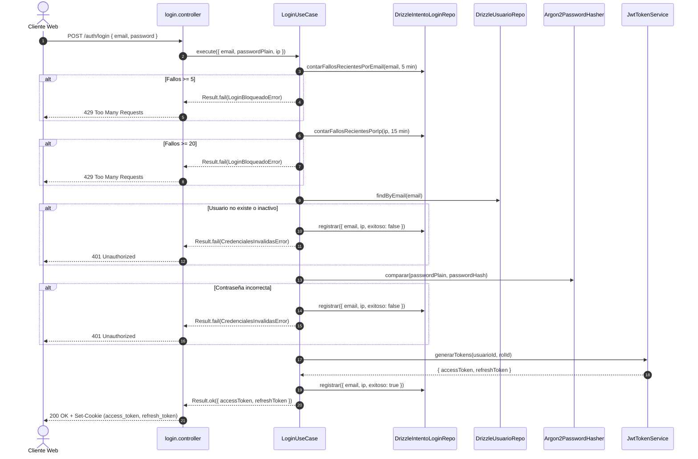
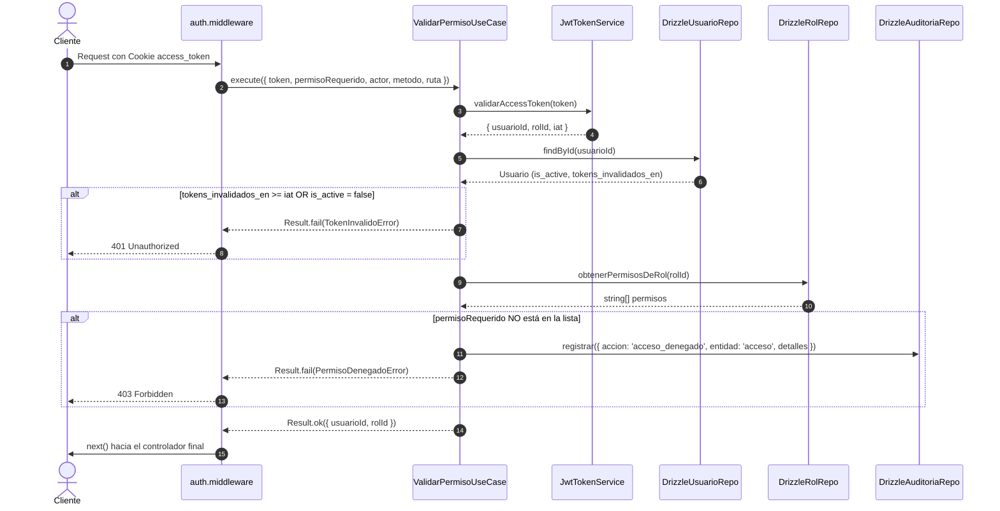

# Módulo de Autenticación y Autorización — Warengine

> **Propósito y estado:** **IMPLEMENTADO** (Fases 0–8 + Endurecimiento de Seguridad)  
> **Stack:** Deno · TypeScript · Drizzle ORM · MySQL 8 · Hono · Jose (JWT) · Argon2  
> **Arquitectura:** Clean Architecture + Ports & Adapters + RBAC granular por permisos

---

## Índice

1. [Propósito y estado](#1-propósito-y-estado)
2. [Cobertura del SRS](#2-cobertura-del-srs)
3. [Mapa de archivos](#3-mapa-de-archivos)
4. [Dominio](#4-dominio)
5. [Casos de uso](#5-casos-de-uso)
6. [Persistencia](#6-persistencia)
7. [API REST](#7-api-rest)
8. [Contratos (Shared)](#8-contratos-shared)
9. [Permisos y roles](#9-permisos-y-roles)
10. [Pruebas](#10-pruebas)
11. [Flujos clave](#11-flujos-clave)
12. [Pendientes y deuda técnica](#12-pendientes-y-deuda-técnica)
13. [Cómo probar manualmente](#13-cómo-probar-manualmente)

---

## 1. Propósito y Estado

El módulo de Autenticación y Autorización de Warengine gestiona la identidad, el acceso y la seguridad perimetral de la plataforma mediante un esquema de doble token (**Access Token JWT de 15 minutos** y **Refresh Token rotativo de 7 días con hash SHA-256**) transmitidos en cookies `HttpOnly` y cabeceras `Authorization`. El control de acceso está sustentado en un modelo **RBAC granular por permisos**, donde los roles agrupan permisos directos sobre acciones específicas.

**Estado actual:** **IMPLEMENTADO**  
Cubre el ciclo de vida completo de autenticación de usuario (login con política de mitigación de fuerza bruta por cuenta e IP, renovación de tokens con rotación estricta, logout idempotente con revocación en base de datos, validación centralizada de credenciales revocadas en tiempo real y autorización por permisos).

---

## 2. Cobertura del SRS

| Requisito | Descripción corta | Estado | Dónde está en el código |
|---|---|---|---|
| **RF-SA-D1** | Login seguro con correo y contraseña | IMPLEMENTADO | [LoginUseCase.ts](../../Backend/packages/core/src/modules/autenticacion/application/use-cases/LoginUseCase.ts) |
| **RF-SA-D2** | Emisión de tokens de sesión (JWT) | IMPLEMENTADO | [jwt-token-service.ts](../../Backend/packages/platform/src/jwt/jwt-token-service.ts) |
| **RF-SA-D3** | Almacenamiento seguro en cookies HttpOnly/SameSite | IMPLEMENTADO | [cookie.ts](../../Backend/apps/api/src/utils/cookie.ts), [login.controller.ts](../../Backend/apps/api/src/controllers/autenticacion/login.controller.ts) |
| **RF-SA-D4** | Identidad y contexto de usuario en sesión | PARCIAL | Payload incluye `usuarioId` y `rolId`. Sucursal en JWT pendiente de definición de multi-sucursal. |
| **RF-SA-D5** | Renovación de tokens sin reingreso de contraseña | IMPLEMENTADO | [RenovarTokenUseCase.ts](../../Backend/packages/core/src/modules/autenticacion/application/use-cases/RenovarTokenUseCase.ts) |
| **RF-SA-D6** | Rotación de Refresh Token ante cada renovación | IMPLEMENTADO | [jwt-token-service.ts](../../Backend/packages/platform/src/jwt/jwt-token-service.ts), [drizzle-refresh-token.repository.ts](../../Backend/packages/database/src/repositories/autenticacion/drizzle-refresh-token.repository.ts) |
| **RF-SA-D7** | Cierre de sesión y revocación de tokens | IMPLEMENTADO | [LogoutUseCase.ts](../../Backend/packages/core/src/modules/autenticacion/application/use-cases/LogoutUseCase.ts), [logout.controller.ts](../../Backend/apps/api/src/controllers/autenticacion/logout.controller.ts) |
| **RF-SA-D8** | Validación de permisos antes de cada operación (RBAC) | IMPLEMENTADO | [ValidarPermisoUseCase.ts](../../Backend/packages/core/src/modules/autenticacion/application/use-cases/ValidarPermisoUseCase.ts), [auth.middleware.ts](../../Backend/apps/api/src/middlewares/auth.middleware.ts) |
| **RF-SA-D9** | Rechazo y código 403 ante permiso insuficiente | IMPLEMENTADO | [auth.middleware.ts](../../Backend/apps/api/src/middlewares/auth.middleware.ts), [result.presenter.ts](../../Backend/apps/api/src/presenters/result.presenter.ts) |
| **RF-SA-D10** | Detección de cuentas inactivas en tiempo real | IMPLEMENTADO | [Usuario.ts](../../Backend/packages/core/src/modules/autenticacion/domain/entities/Usuario.ts), [ValidarPermisoUseCase.ts](../../Backend/packages/core/src/modules/autenticacion/application/use-cases/ValidarPermisoUseCase.ts) |
| **RF-SA-D11** | Invalidación inmediata de tokens emitidos previa modificación | IMPLEMENTADO | Trigger `trg_usuarios_marca_invalidacion_token` en BD + chequeo en [Usuario.ts](../../Backend/packages/core/src/modules/autenticacion/domain/entities/Usuario.ts) |
| **RF-SA-F1** | Bloqueo por intentos fallidos de login por cuenta (5 intentos / 5 min) | IMPLEMENTADO | [PoliticaBloqueoLogin.ts](../../Backend/packages/core/src/modules/autenticacion/domain/value-objects/PoliticaBloqueoLogin.ts), [LoginUseCase.ts](../../Backend/packages/core/src/modules/autenticacion/application/use-cases/LoginUseCase.ts) |
| **RF-SA-F2** | Bloqueo por intentos fallidos de login por IP (20 intentos / 15 min) | IMPLEMENTADO | [drizzle-intento-login.repository.ts](../../Backend/packages/database/src/repositories/autenticacion/drizzle-intento-login.repository.ts), [LoginUseCase.ts](../../Backend/packages/core/src/modules/autenticacion/application/use-cases/LoginUseCase.ts) |
| **RF-SA-F3** | Código HTTP 429 ante bloqueo de autenticación | IMPLEMENTADO | [result.presenter.ts](../../Backend/apps/api/src/presenters/result.presenter.ts) (`LOGIN_BLOQUEADO` -> 429) |
| **RF-SA-F4** | Registro auditable de intentos exitosos y fallidos | IMPLEMENTADO | [drizzle-intento-login.repository.ts](../../Backend/packages/database/src/repositories/autenticacion/drizzle-intento-login.repository.ts) (tabla `intentos_login`) |
| **RF-SA-F5** | Desbloqueo automático tras expirar la ventana deslizante | IMPLEMENTADO | Consultas `WHERE fecha >= NOW() - INTERVAL ...` en [drizzle-intento-login.repository.ts](../../Backend/packages/database/src/repositories/autenticacion/drizzle-intento-login.repository.ts) |
| **RF-SA-G1** | Hasheo de refresh tokens con SHA-256 en base de datos | IMPLEMENTADO | [drizzle-refresh-token.repository.ts](../../Backend/packages/database/src/repositories/autenticacion/drizzle-refresh-token.repository.ts) (`token_hash`) |
| **RF-SA-D12** | Autenticación de doble factor (TOTP 2FA) | PENDIENTE | Entidad tiene `requiere2fa` y `totpSecret`, caso de uso devuelve error `REQUIERE_2FA` (428). Flujo de configuración y verificación pendiente. |
| **RF-SA-D13** | Recuperación de contraseña por email | PENDIENTE | Requiere integración de mailer en `platform`. |
| **RF-SA-D14** | Selección y fijación de sucursal activa en sesión | PENDIENTE | Pendiente de definir política en contratos y frontend. |

---

## 3. Mapa de Archivos

```
Backend/
├── apps/api/src/
│   ├── controllers/autenticacion/
│   │   ├── login.controller.ts
│   │   ├── logout.controller.ts
│   │   └── renovar-token.controller.ts
│   ├── middlewares/
│   │   └── auth.middleware.ts
│   ├── routes/
│   │   └── autenticacion.routes.ts
│   ├── presenters/
│   │   └── result.presenter.ts
│   └── utils/
│       ├── actor.ts
│       ├── cookie.ts
│       └── ip.ts
├── packages/
│   ├── core/
│   │   ├── src/modules/autenticacion/
│   │   │   ├── application/use-cases/
│   │   │   │   ├── LoginUseCase.ts
│   │   │   │   ├── LogoutUseCase.ts
│   │   │   │   ├── RenovarTokenUseCase.ts
│   │   │   │   └── ValidarPermisoUseCase.ts
│   │   │   ├── domain/
│   │   │   │   ├── entities/
│   │   │   │   │   └── Usuario.ts
│   │   │   │   ├── errors/
│   │   │   │   │   └── AutenticacionErrors.ts
│   │   │   │   ├── repositories/
│   │   │   │   │   ├── IControlIntentosLogin.ts
│   │   │   │   │   ├── IRefreshTokenRepository.ts
│   │   │   │   │   ├── IRegistroIntentosLogin.ts
│   │   │   │   │   ├── IRolRepository.ts
│   │   │   │   │   └── IUsuarioRepository.ts
│   │   │   │   ├── services/
│   │   │   │   │   ├── IPasswordService.ts
│   │   │   │   │   └── ITokenService.ts
│   │   │   │   └── value-objects/
│   │   │   │       └── PoliticaBloqueoLogin.ts
│   │   └── tests/autenticacion/
│   │       ├── login.use-case.test.ts
│   │       ├── logout.use-case.test.ts
│   │       ├── renovar-token.use-case.test.ts
│   │       ├── usuario.entity.test.ts
│   │       ├── validar-permiso-identidad.use-case.test.ts
│   │       └── validar-permiso.use-case.test.ts
│   ├── database/src/
│   │   ├── schema/
│   │   │   ├── autenticacion.schema.ts
│   │   │   └── column-types.ts
│   │   ├── repositories/autenticacion/
│   │   │   ├── drizzle-intento-login.repository.ts
│   │   │   ├── drizzle-refresh-token.repository.ts
│   │   │   ├── drizzle-rol.repository.ts
│   │   │   └── drizzle-usuario.repository.ts
│   │   ├── mappers/autenticacion/
│   │   │   └── usuario.mapper.ts
│   │   └── seeds/
│   │       ├── autenticacion.seed.ts
│   │       ├── super-admin.seed.ts
│   │       └── run.ts
│   ├── platform/src/
│   │   ├── hashing/
│   │   │   └── argon2-password-hasher.ts
│   │   ├── jwt/
│   │   │   └── jwt-token-service.ts
│   │   └── config/
│   │       └── jwt.config.ts
│   └── composition/src/
│       └── container.ts
Shared/contracts/src/
├── autenticacion/
│   ├── login.schema.ts
│   └── renovar-token.schema.ts
├── roles.ts
└── permissions.ts
Http/
└── 01-autenticacion.http
```

---

## 4. Dominio

### 4.1 Entidades

#### `Usuario` ([Usuario.ts](../../Backend/packages/core/src/modules/autenticacion/domain/entities/Usuario.ts))
Representa la cuenta de acceso de un empleado al sistema:
- **Campos:**
  - `id: string` (UUID v4 de la cuenta)
  - `email: string` (dirección única normalizada)
  - `passwordHash: string` (hash generado con Argon2id)
  - `rolId: number` (clave foránea a la tabla `roles`)
  - `isActive: boolean` (indicador de estado operativo)
  - `requiere2fa: boolean` (flag que indica si debe completar segundo factor)
  - `totpSecret: string | null` (secreto en base32 cifrado)
  - `tokensInvalidadosEn: Date | null` (marca temporal UTC de última invalidación de credenciales)
- **Métodos de negocio:**
  - `credencialesFueronInvalidadas(tokenIssuedAtSeconds: number): boolean`: Devuelve `true` si `tokensInvalidadosEn` no es nulo y la fecha de invalidación (en segundos) es mayor o igual a `tokenIssuedAtSeconds` (`Math.floor(tokensInvalidadosEn.getTime() / 1000) >= tokenIssuedAtSeconds`).

### 4.2 Interfaces de Repositorio y Servicios (Ports)

- **`IUsuarioRepository`** ([IUsuarioRepository.ts](../../Backend/packages/core/src/modules/autenticacion/domain/repositories/IUsuarioRepository.ts)):
  ```typescript
  findByEmail(email: string): Promise<Usuario | null>;
  findById(id: string): Promise<Usuario | null>;
  ```
- **`IRolRepository`** ([IRolRepository.ts](../../Backend/packages/core/src/modules/autenticacion/domain/repositories/IRolRepository.ts)):
  ```typescript
  obtenerPermisosDeRol(rolId: number): Promise<string[]>;
  ```
- **`IRefreshTokenRepository`** ([IRefreshTokenRepository.ts](../../Backend/packages/core/src/modules/autenticacion/domain/repositories/IRefreshTokenRepository.ts)):
  ```typescript
  guardar(usuarioId: string, token: string, expiraEn: Date): Promise<void>;
  validar(token: string): Promise<string | null>; // Retorna usuarioId si es válido y no expirado
  revocar(token: string): Promise<void>;
  ```
- **`IRegistroIntentosLogin`** ([IRegistroIntentosLogin.ts](../../Backend/packages/core/src/modules/autenticacion/domain/repositories/IRegistroIntentosLogin.ts)):
  ```typescript
  registrar(intento: { email: string; ip: string | null; exitoso: boolean; fecha?: Date }): Promise<void>;
  ```
- **`IControlIntentosLogin`** ([IControlIntentosLogin.ts](../../Backend/packages/core/src/modules/autenticacion/domain/repositories/IControlIntentosLogin.ts)):
  ```typescript
  contarFallosRecientesPorEmail(email: string, ventanaMinutos: number): Promise<number>;
  contarFallosRecientesPorIp(ip: string, ventanaMinutos: number): Promise<number>;
  ```
- **`IPasswordService`** ([IPasswordService.ts](../../Backend/packages/core/src/modules/autenticacion/domain/services/IPasswordService.ts)):
  ```typescript
  hashear(passwordPlana: string): Promise<string>;
  comparar(passwordPlana: string, hash: string): Promise<boolean>;
  ```
- **`ITokenService`** ([ITokenService.ts](../../Backend/packages/core/src/modules/autenticacion/domain/services/ITokenService.ts)):
  ```typescript
  generarTokens(usuarioId: string, rolId: number): Promise<{ accessToken: string; refreshToken: string }>;
  validarAccessToken(token: string): Promise<{ usuarioId: string; rolId: number; iat: number } | null>;
  validarRefreshToken(token: string): Promise<string | null>; // usuarioId
  revocarRefreshToken(token: string): Promise<void>;
  ```

### 4.3 Errores de Dominio ([AutenticacionErrors.ts](../../Backend/packages/core/src/modules/autenticacion/domain/errors/AutenticacionErrors.ts))

| Clase | Code | Mensaje | HTTP Presenter |
|---|---|---|---|
| `CredencialesInvalidasError` | `CREDENCIALES_INVALIDAS` | "Email o contraseña incorrectos." | 401 Unauthorized |
| `UsuarioInactivoError` | `USUARIO_INACTIVO` | "El usuario se encuentra inactivo." | 401 Unauthorized |
| `PermisoDenegadoError` | `PERMISO_DENEGADO` | "No tienes permiso para ejecutar la acción: {accion}" | 403 Forbidden |
| `TokenInvalidoError` | `TOKEN_INVALIDO` | "Token inválido o expirado." | 401 Unauthorized |
| `Requiere2FAError` | `REQUIERE_2FA` | "Se requiere código de autenticación de dos factores." | 428 Precondition Required |
| `LoginBloqueadoError` | `LOGIN_BLOQUEADO` | "Demasiados intentos fallidos. Intenta de nuevo en unos minutos." | 429 Too Many Requests |

---

## 5. Casos de Uso

### 5.1 `LoginUseCase`
- **Archivo:** [LoginUseCase.ts](../../Backend/packages/core/src/modules/autenticacion/application/use-cases/LoginUseCase.ts)
- **Dependencias inyectadas:** `IUsuarioRepository`, `IPasswordService`, `ITokenService`, `IRegistroIntentosLogin`, `IControlIntentosLogin`, `PoliticaBloqueoLogin`
- **Entrada:** `{ email: string; passwordPlain: string; ip?: string | null }`
- **Salida:** `Result<{ accessToken: string; refreshToken: string }, DomainError>`
- **Reglas de negocio:**
  1. Verifica si la cuenta (`email`) está bloqueada por exceder `maxIntentosCuenta` (def: 5) en `ventanaCuentaMinutos` (def: 5 min). Si excede, falla con `LoginBloqueadoError` **sin insertar en intentos_login**.
  2. Si la IP es válida (no nula ni `'desconocida'`), verifica si excede `maxIntentosIp` (def: 20) en `ventanaIpMinutos` (def: 15 min). Si excede, falla con `LoginBloqueadoError` sin insertar.
  3. Busca usuario por email. Si no existe, registra intento fallido en `intentos_login` y falla con `CredencialesInvalidasError`.
  4. Valida `usuario.isActive`. Si es inactivo, registra intento fallido y falla con `UsuarioInactivoError`.
  5. Compara contraseña con Argon2id. Si no coincide, registra intento fallido y falla con `CredencialesInvalidasError`.
  6. Si `usuario.requiere2fa` es verdadero, registra intento fallido y falla con `Requiere2FAError`.
  7. Genera par de tokens (`accessToken` y `refreshToken`), registra intento exitoso en `intentos_login` (lo cual resetea el contador de fallos por cuenta) y retorna éxito.
- **Evento de auditoría:** No audita en `logs_auditoria`. Persiste en la tabla especializada `intentos_login` mediante `IRegistroIntentosLogin` (ADR 0002, Sección 4).
- **Pruebas que lo cubren:** [login.use-case.test.ts](../../Backend/packages/core/tests/autenticacion/login.use-case.test.ts) (11 tests).

### 5.2 `LogoutUseCase`
- **Archivo:** [LogoutUseCase.ts](../../Backend/packages/core/src/modules/autenticacion/application/use-cases/LogoutUseCase.ts)
- **Dependencias inyectadas:** `ITokenService`
- **Entrada:** `{ refreshToken?: string | null }`
- **Salida:** `Result<void, DomainError>`
- **Reglas de negocio:**
  1. Si `refreshToken` está ausente o en blanco, retorna `Result.ok()`.
  2. Si está presente, delega a `ITokenService.revocarRefreshToken(token)`.
  3. La operación es idempotente: revocar un token ya revocado o inexistente no arroja error.
- **Evento de auditoría:** No audita. La gestión y cierre de sesión no constituye mutación de datos de negocio (ADR 0002, Sección 6).
- **Pruebas que lo cubren:** [logout.use-case.test.ts](../../Backend/packages/core/tests/autenticacion/logout.use-case.test.ts) (3 tests).

### 5.3 `RenovarTokenUseCase`
- **Archivo:** [RenovarTokenUseCase.ts](../../Backend/packages/core/src/modules/autenticacion/application/use-cases/RenovarTokenUseCase.ts)
- **Dependencias inyectadas:** `ITokenService`, `IUsuarioRepository`
- **Entrada:** `{ refreshToken: string }`
- **Salida:** `Result<{ accessToken: string; refreshToken: string }, DomainError>`
- **Reglas de negocio:**
  1. Valida el token contra `ITokenService.validarRefreshToken(token)` (comprobando existencia, hash SHA-256, `revocado = 0` y fecha de expiración).
  2. Carga al usuario por id. Si no existe, falla con `TokenInvalidoError`.
  3. Comprueba `usuario.isActive`. Si fue inactivado, falla con `UsuarioInactivoError`.
  4. Revoca el refresh token presentado (rotación obligatoria).
  5. Emite un nuevo par (`accessToken` y nuevo `refreshToken`) leyendo el `rolId` vigente de la base de datos.
- **Evento de auditoría:** No audita (gestión de sesión stateless/rotación).
- **Pruebas que lo cubren:** [renovar-token.use-case.test.ts](../../Backend/packages/core/tests/autenticacion/renovar-token.use-case.test.ts) (4 tests).

### 5.4 `ValidarPermisoUseCase`
- **Archivo:** [ValidarPermisoUseCase.ts](../../Backend/packages/core/src/modules/autenticacion/application/use-cases/ValidarPermisoUseCase.ts)
- **Dependencias inyectadas:** `ITokenService`, `IUsuarioRepository`, `IRolRepository`, `IAuditor?`
- **Entrada:** `{ token: string; permisoRequerido?: string; actor?: ActorAuditoria; metodo?: string; ruta?: string }`
- **Salida:** `Result<ValidarPermisoOutput, DomainError>` (retorna `{ usuarioId, rolId }`)
- **Reglas de negocio:**
  1. Valida la firma criptográfica y expiración del JWT (`ITokenService.validarAccessToken`).
  2. Carga al usuario de la BD en tiempo real.
  3. Verifica que `usuario.isActive` sea verdadero.
  4. Ejecuta `usuario.credencialesFueronInvalidadas(payload.iat)`. Si `iat <= tokens_invalidados_en`, rechaza con `TokenInvalidoError`.
  5. Si no se solicitó un permiso específico, aprueba y retorna identidad.
  6. Si se solicitó permiso, obtiene la lista de permisos del rol actual desde `IRolRepository`.
  7. Si el rol no posee el permiso, emite evento de auditoría `{ accion: 'acceso_denegado', entidad: 'acceso', detalles: { permisoRequerido, metodo, ruta } }` y rechaza con `PermisoDenegadoError`.
- **Evento de auditoría:** Emite `ACCIONES_AUDITORIA.ACCESO_DENEGADO` hacia `ENTIDADES_AUDITORIA.ACCESO` si y solo si la verificación es rechazada por permiso insuficiente (RF-ADM-C11). Las verificaciones aprobadas no se auditan.
- **Pruebas que lo cubren:** [validar-permiso.use-case.test.ts](../../Backend/packages/core/tests/autenticacion/validar-permiso.use-case.test.ts) (6 tests) y [validar-permiso-identidad.use-case.test.ts](../../Backend/packages/core/tests/autenticacion/validar-permiso-identidad.use-case.test.ts) (2 tests).

---

## 6. Persistencia

### 6.1 Tablas Drizzle ([autenticacion.schema.ts](../../Backend/packages/database/src/schema/autenticacion.schema.ts))

- **`roles`**: `id_rol` (PK), `nombre` (varchar 50 unique), `descripcion`.
- **`permisos`**: `id_permiso` (PK), `codigo` (`varcharBin(100)` unique con `COLLATE utf8mb4_bin`), `modulo`, `descripcion`.
- **`rol_permisos`**: `rol_id` (FK roles), `permiso_id` (FK permisos), PK compuesta (`rol_id`, `permiso_id`).
- **`usuarios`**: `id_usuario` (char 36 PK UUID), `empleado_id` (int unique FK empleados), `email` (varchar 150 unique), `password_hash` (`varcharBin(255)`), `rol_id` (int FK roles), `is_active` (boolean def 1), `requiere_2fa` (boolean def 0), `totp_secret` (varchar 64), `tokens_invalidados_en` (timestamp), `creado_en`, `actualizado_en`.
- **`refresh_tokens`**: `id` (bigint PK), `usuario_id` (char 36 FK usuarios), `token_hash` (`varcharBin(64)` SHA-256), `expira_en` (timestamp), `revocado` (boolean def 0), `creado_en`.
- **`intentos_login`**: `id` (bigint PK), `email` (varchar 150, con índice `idx_intentos_login_email`), `ip` (varchar 45, con índice `idx_intentos_login_ip`), `exitoso` (boolean), `fecha` (timestamp def current_timestamp).

### 6.2 Reglas de Base de Datos (Triggers y Constraints)
- **`trg_usuarios_marca_invalidacion_token` (BEFORE UPDATE)**: Si se modifica `rol_id` o `is_active` en `usuarios`, MySQL automáticamente asigna `NEW.tokens_invalidados_en = CURRENT_TIMESTAMP`.
- **`trg_usucursales_marca_invalidacion_insert` / `delete`**: Modificaciones sobre `usuario_sucursales` marcan automáticamente `tokens_invalidados_en = CURRENT_TIMESTAMP` en el usuario afectado.
- **Collation Binaria (`varcharBin`)**: Las columnas `codigo` en `permisos`, `password_hash` y `token_hash` utilizan `COLLATE utf8mb4_bin` para impedir discrepancias por mayúsculas/minúsculas o acentos en comparaciones de seguridad.

---

## 7. API REST

Prefijo general de montaje en `main.ts`: `/auth`.

| Método | Ruta completa | Permiso requerido | Controlador | Caso de uso | Schema Zod | Códigos HTTP |
|---|---|---|---|---|---|---|
| `POST` | `/auth/login` | Ninguno (público) | `loginController` | `LoginUseCase` | `loginSchema` | 200, 400, 401, 428, 429 |
| `POST` | `/auth/renovar-token` | Ninguno (usa cookie/body) | `renovarTokenController` | `RenovarTokenUseCase` | `renovarTokenSchema` (opcional en body si viene en cookie) | 200, 401 |
| `POST` | `/auth/logout` | Ninguno (idempotente) | `logoutController` | `LogoutUseCase` | Ninguno (lee cookie) | 200 |
| `GET` | `/auth/verificar` | Token válido (cualquier rol) | inline handler | `ValidarPermisoUseCase` | Ninguno | 200, 401 |

*Notas sobre Cookies y Headers:*
- `/auth/login` responde con JSON `{ accessToken, refreshToken }` y setea las cookies `access_token` (Max-Age: 900s, `HttpOnly`, `SameSite=Lax`) y `refresh_token` (Max-Age: 604800s, `HttpOnly`, `SameSite=Lax`). En producción (`NODE_ENV !== 'development'`), activa `secure: true`.
- `/auth/logout` limpia ambas cookies (`Max-Age=0`).
- `/auth/renovar-token` lee el token preferentemente de la cookie `refresh_token`, o alternativamente de `{ refreshToken }` en el cuerpo JSON.

---

## 8. Contratos (Shared)

- **`loginSchema`** ([login.schema.ts](../../Shared/contracts/src/autenticacion/login.schema.ts)):
  ```typescript
  z.object({
    email: z.string().trim().email('Formato de email inválido'),
    password: z.string().min(1, 'La contraseña es requerida'),
  })
  ```
- **`renovarTokenSchema`** ([renovar-token.schema.ts](../../Shared/contracts/src/autenticacion/renovar-token.schema.ts)):
  ```typescript
  z.object({
    refreshToken: z.string().min(1, 'El refresh token es requerido'),
  })
  ```

---

## 9. Permisos y Roles

Permisos del módulo en la tabla `permisos`:
- `autenticacion:gestionar-usuarios` (SuperAdmin)
- `autenticacion:asignar-roles` (SuperAdmin)
- `autenticacion:ver-auditoria` (SuperAdmin)

Asignación por rol según el seed ([autenticacion.seed.ts](../../Backend/packages/database/src/seeds/autenticacion.seed.ts)):
- `super-admin`: Posee todos los permisos de autenticación (y los 26 del sistema).
- `admin-sucursal`: No posee permisos directos sobre el catálogo de autenticación.
- `cajero-vendedor`: No posee permisos sobre autenticación.

---

## 10. Pruebas

### Archivos de Test y Cobertura
1. [usuario.entity.test.ts](../../Backend/packages/core/tests/autenticacion/usuario.entity.test.ts) (4 tests):
   - Token válido sin fecha de invalidación.
   - Token inválido emitido ANTES de la invalidación.
   - Token inválido emitido en el MISMO INSTANTE (segundo) de la invalidación.
   - Token válido emitido DESPUÉS de la invalidación.
2. [login.use-case.test.ts](../../Backend/packages/core/tests/autenticacion/login.use-case.test.ts) (11 tests):
   - Login exitoso y registro en `intentos_login`.
   - Credenciales inválidas por email inexistente o clave errónea.
   - Usuario inactivo y requerimiento de 2FA.
   - Bloqueo tras 5 fallos por cuenta (devuelve `LOGIN_BLOQUEADO` sin evaluar contraseña).
   - Bloqueo tras 20 fallos por IP (incluso con diferentes correos).
   - Reseteo de contador de cuenta tras éxito, preservación de contador de IP.
3. [logout.use-case.test.ts](../../Backend/packages/core/tests/autenticacion/logout.use-case.test.ts) (3 tests):
   - Revocación efectiva del token.
   - Manejo de token ausente o vacío (idempotente).
   - Token desconocido o ya revocado (éxito 200).
4. [renovar-token.use-case.test.ts](../../Backend/packages/core/tests/autenticacion/renovar-token.use-case.test.ts) (4 tests):
   - Rotación exitosa y generación de nuevo par de tokens.
   - Rechazo por refresh token inválido o expirado.
   - Rechazo si el usuario ya no existe o fue desactivado.
5. [validar-permiso.use-case.test.ts](../../Backend/packages/core/tests/autenticacion/validar-permiso.use-case.test.ts) (6 tests):
   - Permiso concedido sin auditoría.
   - Permiso denegado con registro auditable `acceso_denegado`.
   - Token inválido / credenciales invalidadas.
   - Aprobación sin permiso específico requerido.
   - Rechazo por usuario inactivo.
6. [validar-permiso-identidad.use-case.test.ts](../../Backend/packages/core/tests/autenticacion/validar-permiso-identidad.use-case.test.ts) (2 tests):
   - Retorno de `usuarioId` y `rolId` extraídos de BD fresca (no del payload stale del token).

### Cómo ejecutarlas
```bash
deno test --allow-all Backend/packages/core/tests/autenticacion/
```

---

## 11. Flujos Clave

### Flujo 1: Login con Mitigación de Fuerza Bruta y Bloqueo



### Flujo 2: Verificación de Permiso e Invalidación de Tokens



---

## 12. Pendientes y Deuda Técnica

1. **Flujo completo de 2FA (RF-SA-D12):** La base de datos y la entidad contemplan `requiere_2fa` y `totp_secret`, pero no existen los casos de uso para escanear el código QR (secreto base32), validar el primer código OTP para activar el flag, ni validar el código durante el segundo paso del login.
2. **Códigos de respaldo para 2FA (RF-SA-D12):** No hay tabla ni columnas para almacenar códigos de respaldo (scratch codes) hasheados para recuperación ante pérdida del dispositivo autenticador.
3. **Recuperación de contraseña por correo (RF-SA-D13):** Casos de uso `SolicitarRecuperacionPasswordUseCase` y `RestablecerPasswordConTokenUseCase` pendientes. Requiere configuración del puerto `Mailer` en `platform`.
4. **Contexto de Sucursal en JWT (RF-SA-D4):** Actualmente el payload del token solo incluye `usuarioId` y `rolId`. Cuando se defina la política de usuario multi-sucursal, debe determinarse si se almacena una lista `sucursalIds` o una sucursal fijada en la cookie.

---

## 13. Cómo Probar Manualmente

El archivo [01-autenticacion.http](../../Http/01-autenticacion.http) contiene escenarios listos para la extensión REST Client de VS Code:
1. **Login como super-admin:** `POST /auth/login` con credenciales de desarrollo.
2. **Verificar sesión:** `GET /auth/verificar` usando la cookie generada.
3. **Renovar token:** `POST /auth/renovar-token` verificando la rotación.
4. **Logout:** `POST /auth/logout` y posterior intento en `/auth/verificar` para comprobar el 401.
5. **Mitigación de fuerza bruta:** Envío de 6 peticiones fallidas consecutivas para constatar el código `429 Too Many Requests`.
