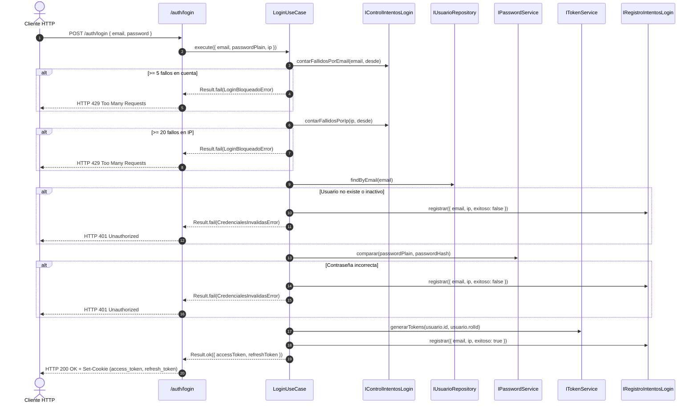
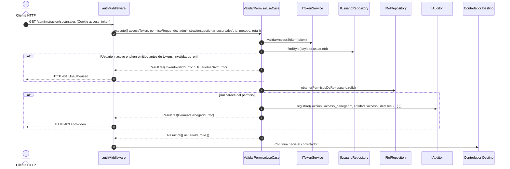

# Módulo de Autenticación y Autorización — Warengine

> **Estado del módulo:** IMPLEMENTADO (con extensiones de seguridad del working tree)  
> **Stack técnico:** Deno · TypeScript · Drizzle ORM · MySQL 8 · Hono · Jose (JWT HMAC-SHA256) · Argon2 · Web Crypto API (SHA-256)  
> **Arquitectura:** Clean Architecture + SOLID + RBAC granular por permisos  

---

## Índice

1. [Propósito y Estado](#1-propósito-y-estado)
2. [Cobertura del SRS](#2-cobertura-del-srs)
3. [Mapa de Archivos](#3-mapa-de-archivos)
4. [Dominio](#4-dominio)
5. [Casos de Uso](#5-casos-de-uso)
6. [Persistencia](#6-persistencia)
7. [API REST](#7-api-rest)
8. [Contratos (SHARED)](#8-contratos-shared)
9. [Permisos y Roles](#9-permisos-y-roles)
10. [Pruebas](#10-pruebas)
11. [Flujos Clave](#11-flujos-clave)
12. [Pendientes y Deuda Técnica](#12-pendientes-y-deuda-técnica)
13. [Cómo Probar Manualmente](#13-cómo-probar-manualmente)

---

## 1. Propósito y Estado

**Estado:** `IMPLEMENTADO`

El módulo de Autenticación y Autorización es la primera línea de defensa de Warengine. Proporciona:
- Autenticación mediante credenciales (email y contraseña con hash Argon2).
- Gestión de sesiones stateless con pares de JSON Web Tokens (Access Token de 15 minutos en cookie HttpOnly y Refresh Token de 7 días rotativo en cookie HttpOnly).
- Almacenamiento seguro de tokens de renovación mediante resúmenes criptográficos SHA-256.
- Control de acceso basado en permisos granulares (RBAC por permisos individuales, desacoplado de nombres de roles estáticos).
- Mitigación de ataques de fuerza bruta mediante políticas de bloqueo configurable por cuenta y por dirección IP sobre la tabla `intentos_login`.
- Cierre de sesión idempotente con revocación en base de datos.
- Invalidación inmediata de tokens activos cuando cambian el rol, el estado del usuario o sus credenciales (`tokens_invalidados_en`).
- Registro en auditoría de accesos denegados a usuarios autenticados.

---

## 2. Cobertura del SRS

| Requerimiento (RF / RNF) | Descripción Corta | Estado | Dónde está en el código |
|---|---|---|---|
| **RF-SA-A1** | Inicio de sesión con correo y contraseña | IMPLEMENTADO | [`LoginUseCase.ts`](../../Backend/packages/core/src/modules/autenticacion/application/use-cases/LoginUseCase.ts) |
| **RF-SA-A2** | Emisión de tokens de acceso (JWT, 15 min) | IMPLEMENTADO | [`jwt-token-service.ts`](../../Backend/packages/platform/src/jwt/jwt-token-service.ts) |
| **RF-SA-A3** | Emisión y persistencia de refresh tokens (7 días) con hash SHA-256 | IMPLEMENTADO | [`drizzle-refresh-token.repository.ts`](../../Backend/packages/database/src/repositories/autenticacion/drizzle-refresh-token.repository.ts) |
| **RF-SA-A4** | Carga de rol y permisos en la sesión | IMPLEMENTADO | [`ValidarPermisoUseCase.ts`](../../Backend/packages/core/src/modules/autenticacion/application/use-cases/ValidarPermisoUseCase.ts), [`drizzle-rol.repository.ts`](../../Backend/packages/database/src/repositories/autenticacion/drizzle-rol.repository.ts) |
| **RF-SA-B1** | Autenticación de dos factores (TOTP) requerida | PENDIENTE | Campo `requiere_2fa` en entidad y BD; [`LoginUseCase.ts`](../../Backend/packages/core/src/modules/autenticacion/application/use-cases/LoginUseCase.ts) devuelve `Requiere2FAError` (428). Flujo de verificación TOTP pendiente. |
| **RF-SA-B2** | Cifrado reversible AES-256 de secreto TOTP en reposo | PENDIENTE | Columna `totp_secret` presente en BD; servicio de cifrado pendiente en `platform/src/totp/`. |
| **RF-SA-C1** | Solicitud de recuperación de contraseña por correo | PENDIENTE | Tabla `password_reset_tokens` en BD; caso de uso y servicio de correo pendientes. |
| **RF-SA-C2** | Validación de token de recuperación de un solo uso | PENDIENTE | Tabla `password_reset_tokens` en BD; lógica pendiente. |
| **RF-SA-D4** | Inclusión de sucursal en el payload del JWT | PENDIENTE | Tabla `usuario_sucursales` (N:N) definida en BD; decisión pendiente sobre selección de sucursal activa en token. |
| **RF-SA-D5** | Renovación de access token mediante rotación de refresh token | IMPLEMENTADO | [`RenovarTokenUseCase.ts`](../../Backend/packages/core/src/modules/autenticacion/application/use-cases/RenovarTokenUseCase.ts) |
| **RF-SA-D10** | Validación de permisos granulares por endpoint (RBAC) | IMPLEMENTADO | [`auth.middleware.ts`](../../Backend/apps/api/src/middlewares/auth.middleware.ts), [`ValidarPermisoUseCase.ts`](../../Backend/packages/core/src/modules/autenticacion/application/use-cases/ValidarPermisoUseCase.ts) |
| **RF-SA-D11** | Invalidación de tokens activos ante cambios de rol, estado o reseteo | IMPLEMENTADO | [`Usuario.ts`](../../Backend/packages/core/src/modules/autenticacion/domain/entities/Usuario.ts), [`ValidarPermisoUseCase.ts`](../../Backend/packages/core/src/modules/autenticacion/application/use-cases/ValidarPermisoUseCase.ts), triggers `trg_usuarios_marca_invalidacion_token` |
| **RF-SA-F1** | Bloqueo por fallos en cuenta (5 fallos en 5 min → 429) | IMPLEMENTADO | [`LoginUseCase.ts`](../../Backend/packages/core/src/modules/autenticacion/application/use-cases/LoginUseCase.ts), [`PoliticaBloqueoLogin.ts`](../../Backend/packages/core/src/modules/autenticacion/domain/entities/PoliticaBloqueoLogin.ts) |
| **RF-SA-F2** | Bloqueo por fallos en IP (20 fallos en 15 min → 429) | IMPLEMENTADO | [`LoginUseCase.ts`](../../Backend/packages/core/src/modules/autenticacion/application/use-cases/LoginUseCase.ts), [`drizzle-intento-login.repository.ts`](../../Backend/packages/database/src/repositories/autenticacion/drizzle-intento-login.repository.ts) |
| **RF-SA-F3** | Prevención de enumeración de cuentas en bloqueo | IMPLEMENTADO | [`LoginUseCase.ts`](../../Backend/packages/core/src/modules/autenticacion/application/use-cases/LoginUseCase.ts) evalúa el email recibido sin revelar si existe |
| **RF-SA-F4** | Registro de auditoría de intentos de login exitosos | IMPLEMENTADO | [`drizzle-intento-login.repository.ts`](../../Backend/packages/database/src/repositories/autenticacion/drizzle-intento-login.repository.ts), [`LoginUseCase.ts`](../../Backend/packages/core/src/modules/autenticacion/application/use-cases/LoginUseCase.ts) |
| **RF-SA-F5** | Registro de auditoría de intentos de login fallidos | IMPLEMENTADO | [`drizzle-intento-login.repository.ts`](../../Backend/packages/database/src/repositories/autenticacion/drizzle-intento-login.repository.ts), [`LoginUseCase.ts`](../../Backend/packages/core/src/modules/autenticacion/application/use-cases/LoginUseCase.ts) |
| **RF-SA-G1** | Cierre de sesión con revocación de refresh token y limpieza de cookies | IMPLEMENTADO | [`LogoutUseCase.ts`](../../Backend/packages/core/src/modules/autenticacion/application/use-cases/LogoutUseCase.ts), [`logout.controller.ts`](../../Backend/apps/api/src/controllers/autenticacion/logout.controller.ts) |
| **RNF-06 / RNF-ADM-02** | Auditoría de accesos denegados (HTTP 403) | IMPLEMENTADO | [`ValidarPermisoUseCase.ts`](../../Backend/packages/core/src/modules/autenticacion/application/use-cases/ValidarPermisoUseCase.ts) registra en `logs_auditoria` con entidad `acceso` |

---

## 3. Mapa de Archivos

```
Backend/
├── packages/
│   ├── core/src/modules/autenticacion/
│   │   ├── domain/
│   │   │   ├── entities/
│   │   │   │   ├── Usuario.ts
│   │   │   │   └── PoliticaBloqueoLogin.ts
│   │   │   ├── errors/
│   │   │   │   └── AutenticacionErrors.ts
│   │   │   ├── repositories/
│   │   │   │   ├── IUsuarioRepository.ts
│   │   │   │   ├── IRolRepository.ts
│   │   │   │   ├── IRefreshTokenRepository.ts
│   │   │   │   ├── IRegistroIntentosLogin.ts
│   │   │   │   └── IControlIntentosLogin.ts
│   │   │   └── services/
│   │   │       ├── IPasswordService.ts
│   │   │       └── ITokenService.ts
│   │   └── application/
│   │       └── use-cases/
│   │           ├── LoginUseCase.ts
│   │           ├── LogoutUseCase.ts
│   │           ├── RenovarTokenUseCase.ts
│   │           └── ValidarPermisoUseCase.ts
│   ├── database/src/
│   │   ├── schema/
│   │   │   └── autenticacion.schema.ts
│   │   ├── repositories/autenticacion/
│   │   │   ├── drizzle-usuario.repository.ts
│   │   │   ├── drizzle-rol.repository.ts
│   │   │   ├── drizzle-refresh-token.repository.ts
│   │   │   └── drizzle-intento-login.repository.ts
│   │   ├── mappers/autenticacion/
│   │   │   └── usuario.mapper.ts
│   │   └── seeds/
│   │       ├── autenticacion.seed.ts
│   │       ├── super-admin.seed.ts
│   │       └── run.ts
│   ├── platform/src/
│   │   ├── config/
│   │   │   └── jwt.config.ts
│   │   ├── hashing/
│   │   │   └── argon2-password-hasher.ts
│   │   └── jwt/
│   │       └── jwt-token-service.ts
│   └── core/tests/autenticacion/
│       ├── usuario.entity.test.ts
│       ├── login.use-case.test.ts
│       ├── logout.use-case.test.ts
│       ├── renovar-token.use-case.test.ts
│       ├── validar-permiso.use-case.test.ts
│       └── validar-permiso-identidad.use-case.test.ts
├── apps/api/src/
│   ├── routes/
│   │   └── autenticacion.routes.ts
│   ├── controllers/autenticacion/
│   │   ├── login.controller.ts
│   │   ├── logout.controller.ts
│   │   └── renovar-token.controller.ts
│   ├── middlewares/
│   │   └── auth.middleware.ts
│   └── utils/
│       ├── cookie.ts
│       ├── ip.ts
│       ├── actor.ts
│       └── identidad.ts
Shared/
└── contracts/src/
    ├── autenticacion/
    │   ├── login.schema.ts
    │   └── renovar-token.schema.ts
    ├── roles.ts
    └── permissions.ts
```

---

## 4. Dominio

### 4.1 Entidades

#### `Usuario`
Archivo: [`Usuario.ts`](../../Backend/packages/core/src/modules/autenticacion/domain/entities/Usuario.ts)

Campos:
- `id: string` (UUID)
- `email: string`
- `passwordHash: string` (Argon2id con collation binario)
- `rolId: number`
- `isActive: boolean`
- `requiere2fa: boolean`
- `tokensInvalidadosEn: Date | null`

Métodos de negocio:
- `credencialesFueronInvalidadas(tokenIat: Date): boolean`: Compara la fecha de emisión del token (`iat`) con `tokensInvalidadosEn`. Si `tokenIat <= tokensInvalidadosEn`, retorna `true` (falla del lado seguro ante granularidad de segundos).

#### `PoliticaBloqueoLogin`
Archivo: [`PoliticaBloqueoLogin.ts`](../../Backend/packages/core/src/modules/autenticacion/domain/entities/PoliticaBloqueoLogin.ts)

Contrato de configuración inyectable:
- `maxIntentosCuenta: number` (por defecto: 5)
- `ventanaCuentaMinutos: number` (por defecto: 5)
- `maxIntentosIp: number` (por defecto: 20)
- `ventanaIpMinutos: number` (por defecto: 15)

### 4.2 Interfaces de Repositorio y Servicios (Ports)

```typescript
export interface IUsuarioRepository {
  findByEmail(email: string): Promise<Usuario | null>;
  findById(id: string): Promise<Usuario | null>;
}

export interface IRolRepository {
  obtenerPermisosDeRol(rolId: number): Promise<string[]>;
}

export interface IRefreshTokenRepository {
  guardar(usuarioId: string, token: string, expiraEn: Date): Promise<void>;
  validar(token: string): Promise<{ usuarioId: string } | null>;
  revocar(token: string): Promise<void>;
}

export interface IRegistroIntentosLogin {
  registrar(datos: { email: string; ip: string; exitoso: boolean }): Promise<void>;
}

export interface IControlIntentosLogin {
  contarFallidosPorEmail(email: string, desde: Date): Promise<number>;
  contarFallidosPorIp(ip: string, desde: Date): Promise<number>;
}

export interface IPasswordService {
  comparar(plain: string, hash: string): Promise<boolean>;
  hashear(plain: string): Promise<string>;
}

export interface ITokenService {
  generarTokens(usuarioId: string, rolId: number): Promise<AuthTokens>;
  validarAccessToken(token: string): Promise<AccessTokenPayload>;
  validarRefreshToken(token: string): Promise<{ usuarioId: string }>;
  revocarRefreshToken(token: string): Promise<void>;
}
```

### 4.3 Errores de Dominio

| Clase de Error | `code` | Mensaje por Defecto | Código HTTP (Presenter) |
|---|---|---|---|
| `CredencialesInvalidasError` | `CREDENCIALES_INVALIDAS` | "Email o contraseña incorrectos." | 401 Unauthorized |
| `UsuarioInactivoError` | `USUARIO_INACTIVO` | "El usuario se encuentra inactivo." | 401 Unauthorized |
| `TokenInvalidoError` | `TOKEN_INVALIDO` | "Token inválido o expirado." | 401 Unauthorized |
| `PermisoDenegadoError` | `PERMISO_DENEGADO` | "No tienes permiso para ejecutar la acción: {accion}" | 403 Forbidden |
| `Requiere2FAError` | `REQUIERE_2FA` | "Se requiere código de autenticación de dos factores." | 428 Precondition Required |
| `LoginBloqueadoError` | `LOGIN_BLOQUEADO` | "Demasiados intentos fallidos. Intenta de nuevo en unos minutos." | 429 Too Many Requests |

---

## 5. Casos de Uso

### 5.1 `LoginUseCase`
- **Archivo:** [`LoginUseCase.ts`](../../Backend/packages/core/src/modules/autenticacion/application/use-cases/LoginUseCase.ts)
- **Dependencias:** `IUsuarioRepository`, `IPasswordService`, `ITokenService`, `IRegistroIntentosLogin`, `IControlIntentosLogin`, `PoliticaBloqueoLogin`
- **Entrada:** `LoginRequest { email: string, passwordPlain: string, ip?: string | null }`
- **Salida:** `Result<AuthTokens, DomainError>` (`{ accessToken: string, refreshToken: string }`)
- **Reglas de Negocio:**
  1. Comprueba fallos en cuenta: si fallos en los últimos `ventanaCuentaMinutos` >= `maxIntentosCuenta`, retorna `LoginBloqueadoError` (429) de inmediato sin verificar el usuario ni registrar un nuevo intento en BD (evita extender el bloqueo indefinidamente).
  2. Comprueba fallos en IP: si la IP es válida y fallos en `ventanaIpMinutos` >= `maxIntentosIp`, retorna `LoginBloqueadoError` (429). Si la IP es nula o `'desconocida'`, se omite el bloqueo por IP.
  3. Busca usuario por email. Si no existe, registra intento fallido en `intentos_login` y retorna `CredencialesInvalidasError`.
  4. Verifica `isActive`. Si está inactivo, registra intento fallido y retorna `UsuarioInactivoError`.
  5. Compara contraseña con hash Argon2. Si no coincide, registra intento fallido y retorna `CredencialesInvalidasError`.
  6. Si `requiere2fa` es verdadero, registra intento fallido y retorna `Requiere2FAError` (428).
  7. Genera tokens, registra intento exitoso (`exitoso: true` en `intentos_login`) y retorna `AuthTokens`.
- **Auditoría:** No audita en `logs_auditoria` (las mutaciones de negocio van a `logs_auditoria`, pero la autenticación usa su bitácora especializada `intentos_login` para evitar saturación de la tabla principal).
- **Pruebas:** [`login.use-case.test.ts`](../../Backend/packages/core/tests/autenticacion/login.use-case.test.ts) (11 tests).

### 5.2 `LogoutUseCase`
- **Archivo:** [`LogoutUseCase.ts`](../../Backend/packages/core/src/modules/autenticacion/application/use-cases/LogoutUseCase.ts)
- **Dependencias:** `ITokenService`
- **Entrada:** `LogoutRequest { refreshToken?: string | null }`
- **Salida:** `Result<void, DomainError>`
- **Reglas de Negocio:**
  1. Si se proporciona `refreshToken`, solicita a `ITokenService.revocarRefreshToken` marcarlo como `revocado = 1` en base de datos.
  2. Es estrictamente idempotente: si el token no viene, no existe en la BD o ya estaba revocado, la operación concluye exitosamente.
  3. No modifica `tokens_invalidados_en` (solo revoca la sesión actual; no cierra sesiones en otros dispositivos). El access token emitido continuará siendo válido hasta su expiración (15 min) por ser stateless.
- **Auditoría:** No audita (ADR 0002, sección 6: operaciones de sesión no constituyen mutaciones de negocio).
- **Pruebas:** [`logout.use-case.test.ts`](../../Backend/packages/core/tests/autenticacion/logout.use-case.test.ts) (3 tests).

### 5.3 `RenovarTokenUseCase`
- **Archivo:** [`RenovarTokenUseCase.ts`](../../Backend/packages/core/src/modules/autenticacion/application/use-cases/RenovarTokenUseCase.ts)
- **Dependencias:** `ITokenService`, `IUsuarioRepository`
- **Entrada:** `RenovarTokenRequest { refreshToken: string }`
- **Salida:** `Result<AuthTokens, DomainError>`
- **Reglas de Negocio:**
  1. Valida firma, vigencia y hash del refresh token contra la tabla `refresh_tokens`.
  2. Consulta al usuario en la BD para verificar que siga existiendo y permanezca activo (`isActive = 1`).
  3. **Rotación:** Revoca inmediatamente el refresh token presentado (`revocado = 1`).
  4. Genera un nuevo par de tokens (Access Token + nuevo Refresh Token) con el rol vigente del usuario.
- **Auditoría:** No audita (gestión de sesión stateless).
- **Pruebas:** [`renovar-token.use-case.test.ts`](../../Backend/packages/core/tests/autenticacion/renovar-token.use-case.test.ts) (4 tests).

### 5.4 `ValidarPermisoUseCase`
- **Archivo:** [`ValidarPermisoUseCase.ts`](../../Backend/packages/core/src/modules/autenticacion/application/use-cases/ValidarPermisoUseCase.ts)
- **Dependencias:** `ITokenService`, `IUsuarioRepository`, `IRolRepository`, `IAuditor`
- **Entrada:** `ValidarPermisoRequest { accessToken: string, permisoRequerido?: string, ip?: string | null, metodo?: string, ruta?: string }`
- **Salida:** `Result<IdentidadAutenticada, DomainError>` (`{ usuarioId: string, rolId: number }`)
- **Reglas de Negocio:**
  1. Valida firma criptográfica y expiración del Access Token con `ITokenService`.
  2. Carga al usuario desde la BD (`IUsuarioRepository.findById`). Si no existe en BD, retorna `TokenInvalidoError`.
  3. Comprueba que el usuario esté activo (`isActive = 1`). Si está inactivo, retorna `UsuarioInactivoError`.
  4. Comprueba `usuario.credencialesFueronInvalidadas(payload.iat)`. Si `iat <= tokensInvalidadosEn`, retorna `TokenInvalidoError`.
  5. Si se solicitó un `permisoRequerido`, obtiene la lista de permisos del rol en BD (`IRolRepository.obtenerPermisosDeRol`).
  6. Si el permiso no está presente: emite evento de auditoría de acceso denegado y retorna `PermisoDenegadoError` (403).
  7. Retorna la identidad verificada `{ usuarioId, rolId }`.
- **Auditoría:** **Sí audita cuando hay acceso denegado.** Registra:
  - Acción: `ACCIONES_AUDITORIA.ACCESO_DENEGADO` (`'acceso_denegado'`)
  - Entidad: `ENTIDADES_AUDITORIA.ACCESO` (`'acceso'`)
  - Detalles: `{ permisoRequerido, metodo, ruta }`
  - Actor: `{ usuarioId: usuario.id, ip }`
- **Pruebas:** [`validar-permiso.use-case.test.ts`](../../Backend/packages/core/tests/autenticacion/validar-permiso.use-case.test.ts) y [`validar-permiso-identidad.use-case.test.ts`](../../Backend/packages/core/tests/autenticacion/validar-permiso-identidad.use-case.test.ts) (8 tests).

---

## 6. Persistencia

### 6.1 Tablas Drizzle Utilizadas
Archivo: [`autenticacion.schema.ts`](../../Backend/packages/database/src/schema/autenticacion.schema.ts)
- `roles`: `id_rol`, `nombre` (UNIQUE), `descripcion`.
- `permisos`: `id_permiso`, `codigo` (VARCHAR BINARY, UNIQUE), `modulo`, `descripcion`.
- `rol_permisos`: `rol_id` (FK roles ON DELETE CASCADE), `permiso_id` (FK permisos ON DELETE CASCADE). PK compuesta.
- `usuarios`: `id_usuario` (UUID), `empleado_id` (FK empleados ON DELETE RESTRICT, UNIQUE), `email` (UNIQUE), `password_hash` (VARCHAR BINARY), `rol_id` (FK roles ON DELETE RESTRICT), `is_active`, `requiere_2fa`, `totp_secret`, `tokens_invalidados_en`, `created_at`.
- `usuario_sucursales`: `usuario_id` (FK usuarios ON DELETE CASCADE), `sucursal_id` (FK sucursales ON DELETE CASCADE). PK compuesta.
- `refresh_tokens`: `id_refresh_token` (UUID), `usuario_id` (FK usuarios ON DELETE CASCADE), `token_hash` (VARCHAR BINARY, SHA-256 hex), `expira_en`, `revocado` (TINYINT).
- `intentos_login`: `id_intento_login` (UUID), `email`, `ip`, `exitoso` (TINYINT), `fecha` (TIMESTAMP). Sin FK hacia usuarios intencionalmente para admitir intentos con emails inexistentes.

### 6.2 Repositorios y Mappers
- [`DrizzleUsuarioRepository`](../../Backend/packages/database/src/repositories/autenticacion/drizzle-usuario.repository.ts): implementa `IUsuarioRepository`. Utiliza [`usuario.mapper.ts`](../../Backend/packages/database/src/mappers/autenticacion/usuario.mapper.ts).
- [`DrizzleRolRepository`](../../Backend/packages/database/src/repositories/autenticacion/drizzle-rol.repository.ts): implementa `IRolRepository`. Realiza INNER JOIN entre `rol_permisos` y `permisos`.
- [`DrizzleRefreshTokenRepository`](../../Backend/packages/database/src/repositories/autenticacion/drizzle-refresh-token.repository.ts): implementa `IRefreshTokenRepository`. Aplica `crypto.subtle.digest('SHA-256')` tanto en guardado como en validación y revocación.
- [`DrizzleIntentoLoginRepository`](../../Backend/packages/database/src/repositories/autenticacion/drizzle-intento-login.repository.ts): implementa `IRegistroIntentosLogin` y `IControlIntentosLogin`.
  - Conteo por cuenta: consulta el último login exitoso de ese email; si existió un éxito dentro de la ventana, solo cuenta los fallos posteriores a ese éxito (un login válido reinicia el contador de cuenta).
  - Conteo por IP: cuenta todos los fallos desde la fecha inicial sin reinicio por logins válidos (previene evasión intercalando cuentas válidas).

### 6.3 Reglas de BD (SQL Triggers y Constraints)
Fuente: `Docs/database/WARENGINE_FULL_BD.sql`
- `trg_usuarios_marca_invalidacion_token` (BEFORE UPDATE en `usuarios`): Si `NEW.rol_id <> OLD.rol_id` o `NEW.is_active <> OLD.is_active`, ejecuta `SET NEW.tokens_invalidados_en = NOW()`.
- `trg_usucursales_marca_invalidacion_insert` (AFTER INSERT en `usuario_sucursales`): Ejecuta `UPDATE usuarios SET tokens_invalidados_en = NOW() WHERE id_usuario = NEW.usuario_id`.
- `trg_usucursales_marca_invalidacion_delete` (AFTER DELETE en `usuario_sucursales`): Ejecuta `UPDATE usuarios SET tokens_invalidados_en = NOW() WHERE id_usuario = OLD.usuario_id`.
- `COLLATE utf8mb4_bin`: `permisos.codigo`, `usuarios.password_hash`, `usuarios.totp_secret`, `refresh_tokens.token_hash`. Comparación exacta byte a byte.
- `ON DELETE CASCADE`: Borrado de rol elimina sus relaciones en `rol_permisos`; borrado de usuario elimina sus `refresh_tokens` y `usuario_sucursales`.
- `ON DELETE RESTRICT`: La FK `usuarios.empleado_id` impide borrar un empleado que posea cuenta de usuario.

---

## 7. API REST

Prefijo base registrado en [`main.ts`](../../Backend/apps/api/src/main.ts): `/auth`

| Método | Ruta Completa | Permiso Requerido | Controlador | Caso de Uso | Schema Zod | Códigos HTTP |
|---|---|---|---|---|---|---|
| `POST` | `/auth/login` | Público | [`loginController`](../../Backend/apps/api/src/controllers/autenticacion/login.controller.ts) | `LoginUseCase` | `loginSchema` | 200, 400, 401, 428, 429, 500 |
| `POST` | `/auth/renovar-token` | Público (cookie `refresh_token` o body) | [`renovarTokenController`](../../Backend/apps/api/src/controllers/autenticacion/renovar-token.controller.ts) | `RenovarTokenUseCase` | `renovarTokenSchema` (opcional en body si viene cookie) | 200, 400, 401, 500 |
| `POST` | `/auth/logout` | Público (cookie `refresh_token` o body) | [`logoutController`](../../Backend/apps/api/src/controllers/autenticacion/logout.controller.ts) | `LogoutUseCase` | Ninguno (lee cookie / body opcional) | 200, 500 |
| `GET` | `/auth/verificar` | Requiere token válido (sin permiso específico) | Handler en [`autenticacion.routes.ts`](../../Backend/apps/api/src/routes/autenticacion.routes.ts) | `ValidarPermisoUseCase` | Ninguno | 200, 401, 500 |

### Manejo de Cookies
Archivo: [`cookie.ts`](../../Backend/apps/api/src/utils/cookie.ts)
- Las cookies `access_token` y `refresh_token` se configuran con:
  - `httpOnly: true` (inaccesibles desde JavaScript en el navegador).
  - `sameSite: 'Lax'`.
  - `path: '/'`.
  - `secure`: `true` por defecto (cerrado por seguridad). Se relaja a `false` únicamente si `NODE_ENV === 'development'`.
  - `maxAge`: 15 minutos para `access_token` (900 s), 7 días para `refresh_token` (604,800 s).

---

## 8. Contratos (SHARED)

Ubicación: `Shared/contracts/src/autenticacion/`

### 8.1 `loginSchema`
Archivo: [`login.schema.ts`](../../Shared/contracts/src/autenticacion/login.schema.ts)
- `email`: `z.string().email('El correo electrónico no es válido.').max(150)`
- `password`: `z.string().min(8, 'La contraseña debe tener al menos 8 caracteres.').max(100)`

### 8.2 `renovarTokenSchema`
Archivo: [`renovar-token.schema.ts`](../../Shared/contracts/src/autenticacion/renovar-token.schema.ts)
- `refreshToken`: `z.string().min(1, 'El token de actualización es requerido.')`

---

## 9. Permisos y Roles

Catálogo definido en el seed ([`autenticacion.seed.ts`](../../Backend/packages/database/src/seeds/autenticacion.seed.ts)):

| Rol | Permisos de Autenticación Asignados |
|---|---|
| `super-admin` | `autenticacion:gestionar-usuarios`, `autenticacion:asignar-roles`, `autenticacion:ver-auditoria` (además de todos los demás permisos del sistema) |
| `admin-sucursal` | Ninguno del módulo de autenticación (no puede gestionar usuarios ni roles) |
| `cajero-vendedor` | Ninguno del módulo de autenticación |

---

## 10. Pruebas

### 10.1 Archivos de Prueba
- [`login.use-case.test.ts`](../../Backend/packages/core/tests/autenticacion/login.use-case.test.ts): 11 tests. Cubre credenciales válidas, email inexistente, contraseña errónea, usuario inactivo, 2FA pendiente, bloqueo tras 5 intentos fallidos por cuenta, bloqueo por IP (20 fallos), reinicio de contador tras login exitoso, expiración de ventana y manejo de IP nula.
- [`logout.use-case.test.ts`](../../Backend/packages/core/tests/autenticacion/logout.use-case.test.ts): 3 tests. Revocación de refresh token, tolerancia ante token ausente y tolerancia ante token desconocido/ya revocado (idempotencia).
- [`renovar-token.use-case.test.ts`](../../Backend/packages/core/tests/autenticacion/renovar-token.use-case.test.ts): 4 tests. Rotación exitosa de token, rechazo de token corrupto/expirado, rechazo de usuario inexistente y rechazo de usuario inactivo.
- [`usuario.entity.test.ts`](../../Backend/packages/core/tests/autenticacion/usuario.entity.test.ts): 4 tests. Lógica de `credencialesFueronInvalidadas` comparando `iat` contra `tokens_invalidados_en` (anterior, mismo segundo y posterior).
- [`validar-permiso.use-case.test.ts`](../../Backend/packages/core/tests/autenticacion/validar-permiso.use-case.test.ts): 6 tests. Permiso aprobado sin auditar, permiso denegado con registro de auditoría, token inválido sin auditoría, credenciales invalidadas por fecha, validación sin permiso requerido y usuario inactivo.
- [`validar-permiso-identidad.use-case.test.ts`](../../Backend/packages/core/tests/autenticacion/validar-permiso-identidad.use-case.test.ts): 2 tests. Extracción de identidad (`usuarioId`, `rolId`) desde la BD y no del token no verificado.
- [`jwt-config.test.ts`](../../Backend/packages/platform/tests/jwt-config.test.ts): 4 tests. Rechazo por variable no definida, rechazo por longitud menor a 32 caracteres, aceptación con 32+ caracteres.

### 10.2 Brechas Conocidas
- Faltan tests de integración HTTP en `apps/api` contra servidor en ejecución (se suplen con el suite manual `.http`).
- Pruebas del flujo completo de 2FA TOTP (pendiente de implementación del caso de uso).

### 10.3 Cómo Ejecutar las Pruebas
```bash
cd BACK
deno test packages/core/tests/autenticacion/
deno test packages/platform/tests/
```

---

## 11. Flujos Clave

### Flujo 1: Inicio de Sesión con Protección contra Fuerza Bruta


### Flujo 2: Petición Protegida con Verificación de Permiso y Revocación


---

## 12. Pendientes y Deuda Técnica

1. **Segundo Factor TOTP (RF-SA-B1, RF-SA-B2):** Columna `totp_secret` y flag `requiere_2fa` existen en el esquema, pero no existe el caso de uso `Verificar2faUseCase` ni el servicio de cifrado reversible AES-256-GCM para almacenar la clave simétrica.
2. **Recuperación de Contraseña por Correo (RF-SA-C1..C3):** La tabla `password_reset_tokens` existe en el esquema, pero no se ha implementado el caso de uso de solicitud, generación de token con expiración ni la plantilla de envío por email (`platform/mailer`).
3. **Sucursal en el JWT (RF-SA-D4):** La tabla `usuario_sucursales` permite relación muchos-a-muchos. Falta definir en contratos y en el payload del JWT si se almacena un arreglo `sucursalIds: number[]` o una sucursal activa seleccionada por el usuario.
4. **Códigos de Respaldo 2FA:** El esquema SQL v2 actual no cuenta con tabla ni columna para almacenar códigos de respaldo (backup codes) para usuarios con 2FA activo.

---

## 13. Cómo Probar Manualmente

Archivo de prueba: [`Http/01-autenticacion.http`](../../Http/01-autenticacion.http) y suite integrada en [`api.rest`](../../api.rest).

Pasos de prueba:
1. Asegurar la base de datos MySQL levantada con seeds (`deno task seed:dev`).
2. Iniciar la API REST (`deno task dev-api`).
3. Abrir `Http/01-autenticacion.http` en VS Code con la extensión REST Client.
4. Ejecutar petición `Login Superadmin`:
   - Correo: `superadmin@warengine.local`
   - Contraseña: valor configurado en `SEED_SUPERADMIN_PASSWORD` (por defecto `Warengine.Admin.2026!`).
   - Verifica respuesta 200 y recepción de cookies HttpOnly.
5. Ejecutar petición `Verificar sesión activa` (`GET /auth/verificar`).
6. Ejecutar petición `Renovar token` (`POST /auth/renovar-token`).
7. Ejecutar petición `Cerrar sesión` (`POST /auth/logout`) y comprobar borrado de cookies.
8. Probar bloqueo por intentos fallidos enviando 5 contraseñas erróneas seguidas: el sexto intento debe responder `HTTP 429 Too Many Requests`.
