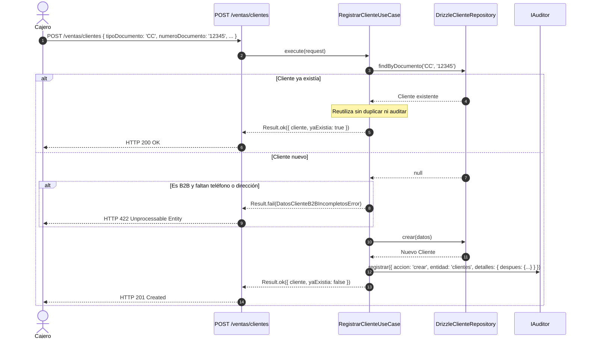

# Módulo de Facturación y Ventas (POS) — Warengine

> **Estado del módulo:** PARCIAL  
> **Stack técnico:** Deno · TypeScript · Drizzle ORM · MySQL 8 · Hono  
> **Arquitectura:** Clean Architecture + Inversión de Dependencias (DIP) + Transaccionalidad ACID  

---

## Índice

1. [Propósito y Estado](#1-propósito-y-estado)
2. [Cobertura del SRS](#2-cobertura-del-srs)
3. [Mapa de Archivos](#3-mapa-de-archivos)
4. [Dominio](#4-dominio)
5. [Casos de Uso](#5-casos-de-uso)
6. [Persistencia y Reglas de Base de Datos](#6-persistencia-y-reglas-de-base-de-datos)
7. [API REST](#7-api-rest)
8. [Contratos (SHARED)](#8-contratos-shared)
9. [Permisos y Roles](#9-permisos-y-roles)
10. [Pruebas](#10-pruebas)
11. [Flujos Clave](#11-flujos-clave)
12. [Pendientes y Deuda Técnica](#12-pendientes-y-deuda-técnica)
13. [Cómo Probar Manualmente](#13-cómo-probar-manualmente)

---

## 1. Propósito y Estado

**Estado:** `PARCIAL`

El módulo de Facturación gobierna las ventas en mostrador (POS), la atención corporativa y el directorio de clientes:
- **Implementado en código:** Directorio integral de **Clientes** (personas naturales B2C y empresas B2B), búsqueda y filtrado ágil en caja, registro validado con reglas B2B obligatorias (dirección y teléfono), y **reutilización transparente de clientes preexistentes** para evitar duplicidad de registros.
- **Pendiente en código (definido en esquema SQL y triggers):** Apertura y cierre de turnos de caja con arqueo ciego (`turnos_caja`), emisión transaccional de facturas con cálculo de impuestos y desglose de pagos (`facturas`, `factura_items`, `factura_pagos`), crédito corporativo condicionado, anulaciones con reingreso automático al Kardex y devoluciones de ventas.

---

## 2. Cobertura del SRS

| Requerimiento (RF / RNF) | Descripción Corta | Estado | Dónde está en el código |
|---|---|---|---|
| **RF-FMC-B4** | Clasificación de clientes en consumo final (B2C) y corporativos (B2B) | IMPLEMENTADO | [`Cliente.ts`](../../Backend/packages/core/src/modules/facturacion/domain/entities/Cliente.ts), [`cliente.schema.ts`](../../Shared/contracts/src/facturacion/cliente.schema.ts) |
| **RF-FMC-B5** | Validación obligatoria de dirección y teléfono para clientes corporativos B2B | IMPLEMENTADO | [`RegistrarClienteUseCase.ts`](../../Backend/packages/core/src/modules/facturacion/application/use-cases/RegistrarClienteUseCase.ts), CHECK `chk_clientes_datos_b2b` |
| **RF-FMC-D1..D4** | Directorio y búsqueda de clientes por nombre o documento | IMPLEMENTADO | [`BuscarClientesUseCase.ts`](../../Backend/packages/core/src/modules/facturacion/application/use-cases/BuscarClientesUseCase.ts), [`drizzle-cliente.repository.ts`](../../Backend/packages/database/src/repositories/facturacion/drizzle-cliente.repository.ts) |
| **RF-FMC-D10 / RF-FMC-D2** | Prevención de duplicados por documento y reutilización transparente | IMPLEMENTADO | [`RegistrarClienteUseCase.ts`](../../Backend/packages/core/src/modules/facturacion/application/use-cases/RegistrarClienteUseCase.ts) retorna `{ cliente, yaExistia: true }` |
| **RF-FMC-E2** | Crédito corporativo condicionado a clientes B2B con crédito habilitado | PENDIENTE (Código) / ACTIVO (BD) | Campo `credito_habilitado` en `Cliente.ts`; trigger `trg_factura_pagos_check_credito` en BD |
| **RF-FMC-A1..A4** | Apertura y cierre de turnos de caja con cálculo de diferencia | PENDIENTE | Tabla `turnos_caja` y trigger `trg_turnos_caja_calcula_diferencia` en BD; casos de uso pendientes |
| **RF-FMC-B1..B3** | Emisión de facturas con ítems y pagos en una sola transacción | PENDIENTE | Tablas `facturas`, `factura_items`, `factura_pagos` en BD; caso de uso pendiente |
| **RF-FMC-B8** | Pagos divididos (múltiples medios) controlados por total | PENDIENTE | Trigger `trg_factura_pagos_check_total` en BD; caso de uso pendiente |
| **RF-FMC-C1..C5** | Anulación irreversible de facturas con reversión de stock | PENDIENTE | Triggers `trg_facturas_bloquea_reversion` y `trg_facturas_anula_reingresa_stock` en BD |
| **RF-FMC-D5..D9** | Devolución de ventas con reingreso condicional de stock | PENDIENTE | Triggers `trg_devoluciones_check_cantidad` y `trg_devoluciones_genera_entrada` en BD |

---

## 3. Mapa de Archivos

```
Backend/
├── packages/
│   ├── core/src/modules/facturacion/
│   │   ├── domain/
│   │   │   ├── entities/
│   │   │   │   └── Cliente.ts
│   │   │   ├── errors/
│   │   │   │   └── FacturacionErrors.ts
│   │   │   └── repositories/
│   │   │       └── IClienteRepository.ts
│   │   └── application/
│   │       └── use-cases/
│   │           ├── BuscarClientesUseCase.ts
│   │           └── RegistrarClienteUseCase.ts
│   ├── database/src/
│   │   ├── schema/
│   │   │   └── facturacion.schema.ts
│   │   ├── repositories/facturacion/
│   │   │   └── drizzle-cliente.repository.ts
│   │   └── mappers/facturacion/
│   │       └── cliente.mapper.ts
│   └── core/tests/facturacion/
│       └── registrar-cliente.use-case.test.ts
├── apps/api/src/
│   ├── routes/
│   │   └── facturacion.routes.ts
│   └── controllers/facturacion/
│       └── cliente.controller.ts
Shared/
└── contracts/src/
    └── facturacion/
        └── cliente.schema.ts
```

---

## 4. Dominio

### 4.1 Entidades

#### `Cliente`
Archivo: [`Cliente.ts`](../../Backend/packages/core/src/modules/facturacion/domain/entities/Cliente.ts)

Campos:
- `id: string` (UUID)
- `tipoDocumento: 'CC' | 'NIT' | 'RUT'`
- `numeroDocumento: string` (VARCHAR BINARY)
- `nombreRazonSocial: string`
- `tipoCliente: 'B2C' | 'B2B'`
- `email: string | null`
- `telefono: string | null`
- `direccion: string | null`
- `creditoHabilitado: boolean`

Métodos de negocio:
- `esB2B: boolean`: Retorna `true` si `tipoCliente === 'B2B'`.
- `puedePagarConCredito: boolean`: Retorna `true` si `this.esB2B && this.creditoHabilitado` (RF-FMC-E2).

### 4.2 Interfaces de Puerto

Archivo: [`IClienteRepository.ts`](../../Backend/packages/core/src/modules/facturacion/domain/repositories/IClienteRepository.ts)

```typescript
export interface DatosCliente {
  tipoDocumento: TipoDocumentoCliente;
  numeroDocumento: string;
  nombreRazonSocial: string;
  tipoCliente: TipoCliente;
  email: string | null;
  telefono: string | null;
  direccion: string | null;
}

export interface FiltrosClientes {
  texto?: string;
  tipoDocumento?: TipoDocumentoCliente;
  limite: number;
}

export interface IClienteRepository {
  buscar(filtros: FiltrosClientes): Promise<Cliente[]>;
  findByDocumento(tipo: TipoDocumentoCliente, numero: string): Promise<Cliente | null>;
  crear(datos: DatosCliente): Promise<Cliente>;
}
```

### 4.3 Errores de Dominio

Archivo: [`FacturacionErrors.ts`](../../Backend/packages/core/src/modules/facturacion/domain/errors/FacturacionErrors.ts)

| Clase de Error | `code` | Mensaje por Defecto | HTTP |
|---|---|---|---|
| `DatosClienteB2BIncompletosError` | `CLIENTE_B2B_DATOS_INCOMPLETOS` | "Un cliente B2B requiere dirección y teléfono." | 422 Unprocessable Entity |
| `ClienteNoEncontradoError` | `CLIENTE_NO_ENCONTRADO` | "El cliente no existe." | 404 Not Found |
| `DocumentoClienteYaRegistradoError` | `DOCUMENTO_CLIENTE_YA_REGISTRADO` | "Ya existe un cliente con ese tipo y número de documento." | 400 Bad Request |
| `CreditoNoHabilitadoError` | `CREDITO_NO_HABILITADO` | "Este cliente no tiene crédito corporativo habilitado." | 422 Unprocessable Entity |

---

## 5. Casos de Uso

### 5.1 `RegistrarClienteUseCase`
- **Archivo:** [`RegistrarClienteUseCase.ts`](../../Backend/packages/core/src/modules/facturacion/application/use-cases/RegistrarClienteUseCase.ts)
- **Dependencias:** `IClienteRepository`, `IAuditor`
- **Entrada:** `RegistrarClienteRequest { tipoDocumento, numeroDocumento, nombreRazonSocial, tipoCliente, email?, telefono?, direccion?, actor }`
- **Salida:** `Result<{ cliente: Cliente, yaExistia: boolean }, DomainError>`
- **Reglas de Negocio:**
  1. Comprueba si ya existe un cliente con ese tipo y número de documento (`findByDocumento`).
  2. Si existe (RF-FMC-D10 / RF-FMC-D2), **reutiliza el cliente existente**, responde éxito con `{ cliente, yaExistia: true }` y **NO audita** (evita duplicidad y registros espurios).
  3. Si no existe y `tipoCliente === 'B2B'`, verifica que `direccion` y `telefono` no sean nulos ni cadenas vacías. Si falta alguno, falla con `DatosClienteB2BIncompletosError` (422) y no audita.
  4. Crea el cliente mediante `IClienteRepository.crear`.
  5. Audita la creación en el sistema de auditoría con acción `crear`, entidad `clientes`.
  6. Devuelve `{ cliente, yaExistia: false }`.
- **Auditoría:** Registra `ACCIONES_AUDITORIA.CREAR`, `ENTIDADES_AUDITORIA.CLIENTES`, `detalles.despues: { tipoDocumento, nombreRazonSocial, tipoCliente, email, telefono, direccion }`.
- **Pruebas:** [`registrar-cliente.use-case.test.ts`](../../Backend/packages/core/tests/facturacion/registrar-cliente.use-case.test.ts) (3 tests).

### 5.2 `BuscarClientesUseCase`
- **Archivo:** [`BuscarClientesUseCase.ts`](../../Backend/packages/core/src/modules/facturacion/application/use-cases/BuscarClientesUseCase.ts)
- **Dependencias:** `IClienteRepository`
- **Entrada:** `BuscarClientesRequest { texto?: string, tipoDocumento?: TipoDocumentoCliente, limite?: number }`
- **Salida:** `Result<Cliente[], DomainError>`
- **Reglas:** Escapa comodines `%` y `_`, aplica coincidencia sobre `nombre_razon_social` o `numero_documento`, y acota el límite entre 1 y 50 resultados (defecto: 20).
- **Auditoría:** No audita (consulta de lectura).
- **Pruebas:** Cubierto por pruebas de integración y HTTP.

---

## 6. Persistencia y Reglas de Base de Datos

### 6.1 Tabla Drizzle Implementada
Archivo: [`facturacion.schema.ts`](../../Backend/packages/database/src/schema/facturacion.schema.ts)
- `clientes`: `id_cliente` (UUID PK), `tipo_documento` (VARCHAR 10), `numero_documento` (VARCHAR BINARY 30), `nombre_razon_social` (VARCHAR 200), `tipo_cliente` (VARCHAR 10 default 'B2C'), `email`, `telefono`, `direccion`, `credito_habilitado` (TINYINT default 0), `deleted_at`.
- Constraints:
  - `chk_clientes_tipo`: `tipo_cliente IN ('B2C','B2B')`.
  - `chk_clientes_tipo_documento`: `tipo_documento IN ('CC','NIT','RUT')`.
  - `chk_clientes_datos_b2b`: Si es B2B, `direccion` y `telefono` no pueden ser NULL.
  - Unique Index: `uq_clientes_documento (tipo_documento, numero_documento)`.
- Manejo de concurrencia: [`drizzle-cliente.repository.ts`](../../Backend/packages/database/src/repositories/facturacion/drizzle-cliente.repository.ts) captura errores de clave duplicada (MySQL 1062) ante inserciones simultáneas de dos cajeros, re-consultando y devolviendo el cliente ganador de la carrera sin fallar la venta.

### 6.2 Reglas de BD para Tablas Pendientes
Fuente: `WARENGINE_FULL_BD.sql`
- **`trg_factura_items_check_stock`** (BEFORE INSERT en `factura_items`): Verifica existencias en `inventario_sucursal` de la sede de la factura antes de vender.
- **`trg_factura_items_genera_salida`** (AFTER INSERT en `factura_items`): Inserta automáticamente la `salida` en `movimientos_inventario` con motivo "Venta - factura". El backend **nunca** debe insertar salidas a mano.
- **`trg_factura_pagos_check_total`** (AFTER INSERT en `factura_pagos`): Impide que la suma de pagos supere el total de la factura.
- **`trg_factura_pagos_check_credito`** (BEFORE INSERT en `factura_pagos`): Bloquea el medio `credito_corporativo` si el cliente no es B2B o no tiene `credito_habilitado = 1`.
- **`trg_turnos_caja_calcula_diferencia`** (BEFORE UPDATE en `turnos_caja`): Al cerrar el turno exige `fondo_final` y calcula `diferencia = fondo_final - (fondo_inicial + efectivo_vendido)`.
- **`trg_facturas_bloquea_reversion`** y **`trg_facturas_anula_reingresa_stock`**: Una factura anulada es irreversible y reingresa el stock automáticamente al Kardex.

---

## 7. API REST

> **Prefijo de montaje:** En [`main.ts`](../../Backend/apps/api/src/main.ts), las rutas de facturación se encuentran agrupadas bajo el prefijo **/ventas** (`app.route('/ventas', facturacionRoutes)`).

| Método | Ruta Completa | Permiso Requerido | Controlador | Caso de Uso | Schema Zod | Códigos HTTP |
|---|---|---|---|---|---|---|
| `GET` | `/ventas/clientes` | `facturacion:consultar` | [`buscarClientesController`](../../Backend/apps/api/src/controllers/facturacion/cliente.controller.ts) | `BuscarClientesUseCase` | `buscarClientesSchema` | 200, 400, 401, 403, 500 |
| `POST` | `/ventas/clientes` | `facturacion:gestionar-clientes` | [`registrarClienteController`](../../Backend/apps/api/src/controllers/facturacion/cliente.controller.ts) | `RegistrarClienteUseCase` | `registrarClienteSchema` | 201, 400, 401, 403, 422, 500 |

*Nota:* Si un cliente ya existía con el mismo documento, `POST /ventas/clientes` responde `HTTP 200 OK` (en lugar de 201) con `{ cliente, yaExistia: true }`.

---

## 8. Contratos (SHARED)

Ubicación: `Shared/contracts/src/facturacion/`

Archivo: [`cliente.schema.ts`](../../Shared/contracts/src/facturacion/cliente.schema.ts)
- `registrarClienteSchema`:
  - `tipoDocumento`: `z.enum(['CC', 'NIT', 'RUT'])`.
  - `numeroDocumento`: string mín. 3, máx. 30 caracteres.
  - `nombreRazonSocial`: string mín. 3, máx. 200 caracteres.
  - `tipoCliente`: `z.enum(['B2C', 'B2B'])`.
  - `email`: email opcional máx. 150 caracteres.
  - `telefono`: string opcional máx. 30 caracteres.
  - `direccion`: string opcional máx. 255 caracteres.
- `buscarClientesSchema`:
  - `texto`: string opcional.
  - `tipoDocumento`: enum opcional.
  - `limite`: coaccionado a entero (máx. 50).

---

## 9. Permisos y Roles

| Permiso | Propósito | Roles con Acceso en Seed |
|---|---|---|
| `facturacion:consultar` | Buscar clientes y ver histórico de ventas/facturas | `super-admin`, `admin-sucursal`, `cajero-vendedor` |
| `facturacion:gestionar-clientes` | Registrar y actualizar datos de clientes | `super-admin`, `admin-sucursal`, `cajero-vendedor` |
| `facturacion:facturar` | Abrir turnos, emitir facturas y cobrar *(pendiente)* | `super-admin`, `admin-sucursal`, `cajero-vendedor` |
| `facturacion:anular` | Anular facturas emitidas *(pendiente)* | `super-admin`, `admin-sucursal` (`cajero-vendedor` recibe 403) |
| `facturacion:devolucion` | Registrar devoluciones de ventas *(pendiente)* | `super-admin`, `admin-sucursal` (`cajero-vendedor` recibe 403) |

---

## 10. Pruebas

- [`registrar-cliente.use-case.test.ts`](../../Backend/packages/core/tests/facturacion/registrar-cliente.use-case.test.ts): 3 tests.
  1. Reutilización de cliente preexistente (`yaExistia: true`) sin registrar auditoría duplicada.
  2. Alta de cliente B2C nuevo sin teléfono/dirección registrando auditoría `{ despues: {...} }`.
  3. Rechazo de cliente B2B sin dirección con error de dominio `DatosClienteB2BIncompletosError` y sin emitir auditoría.

### Brechas Conocidas
- `BuscarClientesUseCase` carece de archivo unitario independiente (validado por pruebas de integración Drizzle).

### Cómo Ejecutar
```bash
cd BACK
deno test packages/core/tests/facturacion/
```

---

## 11. Flujos Clave

### Flujo 1: Registro o Reutilización Transparente de Cliente en Caja


---

## 12. Pendientes y Deuda Técnica

1. **Gestión de Turnos de Caja (RF-FMC-A1..A4):** Falta implementar casos de uso para `AbrirTurnoCaja` y `CerrarTurnoCaja`. La base de datos requiere obligatoriamente `fondo_final` para calcular `diferencia`.
2. **Generación de Consecutivos:** `facturas` tiene `UNIQUE (sucursal_id, consecutivo)`. Falta diseñar el mecanismo concurrente seguro (tabla auxiliar de consecutivos bloqueada con `FOR UPDATE`).
3. **Emisión de Facturas Transaccional (RF-FMC-B1..B3):** Requiere implementar `unit-of-work.ts` para ejecutar en una sola transacción: verificación de turno abierto, validación de stock, inserción de factura, líneas y pagos.
4. **Respetar Triggers de Stock:** Al implementar la emisión, el caso de uso no debe insertar salidas en `movimientos_inventario`, ya que `trg_factura_items_genera_salida` lo hace automáticamente.

---

## 13. Cómo Probar Manualmente

Archivo de prueba: [`Http/04-clientes.http`](../../Http/04-clientes.http)

Pasos:
1. Iniciar sesión con un usuario que tenga `facturacion:gestionar-clientes` (ej. cajero o superadmin).
2. Registrar cliente B2C básico (`POST /ventas/clientes`).
3. Intentar registrar un cliente B2B omitiendo dirección o teléfono y verificar error 422.
4. Registrar el mismo documento por segunda vez y comprobar respuesta 200 con `yaExistia: true`.
5. Consultar el directorio con filtros (`GET /ventas/clientes?texto=...`).
