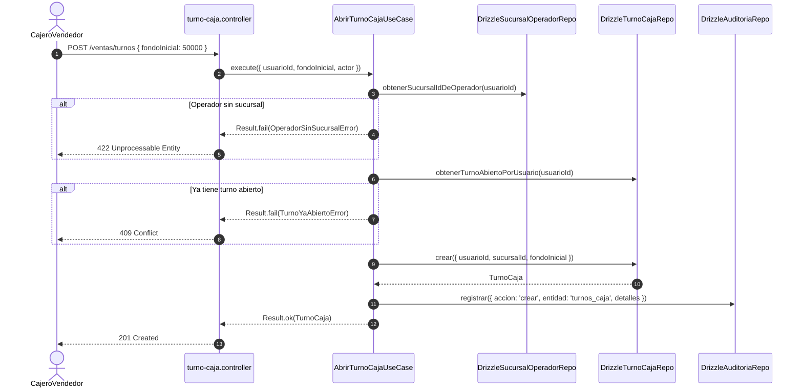

# Módulo de Facturación y POS — Warengine

> **Propósito y estado:** **PARCIAL** (Directorio de Clientes y Apertura de Turnos de Caja implementados; Facturas, Pagos, Devoluciones y Cierre de Turno pendientes)  
> **Stack:** Deno · TypeScript · Drizzle ORM · MySQL 8 · Hono · Zod · Decimal  
> **Arquitectura:** Clean Architecture + Ports & Adapters + Transacciones gobernadas por BD

---

## Índice

1. [Propósito y estado](#1-propósito-y-estado)
2. [Cobertura del SRS](#2-cobertura-del-srs)
3. [Mapa de archivos](#3-mapa-de-archivos)
4. [Dominio](#4-dominio)
5. [Casos de uso](#5-casos-de-uso)
6. [Persistencia](#6-persistencia)
7. [API REST](#7-api-rest)
8. [Contratos (Shared)](#8-contratos-shared)
9. [Permisos y roles](#9-permisos-y-roles)
10. [Pruebas](#10-pruebas)
11. [Flujos clave](#11-flujos-clave)
12. [Pendientes y deuda técnica](#12-pendientes-y-deuda-técnica)
13. [Cómo probar manualmente](#13-cómo-probar-manualmente)

---

## 1. Propósito y Estado

El módulo de **Facturación y Punto de Venta (POS)** de Warengine gestiona la interacción comercial con clientes finales y corporativos, el control operativo de turnos de caja y el ciclo de vida de emisión, cobro, anulación y devolución de comprobantes de venta.

**Estado actual:** **PARCIAL**  
- **Implementado en código:** Directorio de clientes con validación estricta de régimen B2B (dirección y teléfono obligatorios), prevención de duplicación silenciosa y reutilización de clientes existentes, así como apertura y consulta del turno actual de caja con control de concurrencia y fondo inicial.
- **Pendiente:** Cierre de turno con arqueo, emisión transaccional de facturas con ítems y pagos divididos, crédito corporativo, anulación con reversión de stock y devoluciones de venta.

---

## 2. Cobertura del SRS

| Requisito | Descripción corta | Estado | Dónde está en el código |
|---|---|---|---|
| **RF-FMC-B4** | Identificación de cliente en ventas (B2C o B2B) | IMPLEMENTADO | [cliente.controller.ts](../../Backend/apps/api/src/controllers/facturacion/cliente.controller.ts), [RegistrarClienteUseCase.ts](../../Backend/packages/core/src/modules/facturacion/application/use-cases/RegistrarClienteUseCase.ts) |
| **RF-FMC-B5** | Validación estricta de clientes corporativos B2B (NIT/RUT, dirección, teléfono) | IMPLEMENTADO | [Cliente.ts](../../Backend/packages/core/src/modules/facturacion/domain/entities/Cliente.ts), [RegistrarClienteUseCase.ts](../../Backend/packages/core/src/modules/facturacion/application/use-cases/RegistrarClienteUseCase.ts) |
| **RF-FMC-B7** | Reutilización de clientes existentes por documento | IMPLEMENTADO | [RegistrarClienteUseCase.ts](../../Backend/packages/core/src/modules/facturacion/application/use-cases/RegistrarClienteUseCase.ts) |
| **RF-FMC-D1** | Búsqueda y filtrado de clientes en tiempo real | IMPLEMENTADO | [BuscarClientesUseCase.ts](../../Backend/packages/core/src/modules/facturacion/application/use-cases/BuscarClientesUseCase.ts) |
| **RF-FMC-A1** | Apertura de turno de caja con fondo inicial y sucursal | IMPLEMENTADO | [AbrirTurnoCajaUseCase.ts](../../Backend/packages/core/src/modules/facturacion/application/use-cases/AbrirTurnoCajaUseCase.ts) |
| **RF-FMC-A2** | Un solo turno abierto por operador simultáneamente | IMPLEMENTADO | [AbrirTurnoCajaUseCase.ts](../../Backend/packages/core/src/modules/facturacion/application/use-cases/AbrirTurnoCajaUseCase.ts), Trigger SQL `002-turnos-un-abierto-por-usuario.sql` |
| **RF-FMC-A3** | Consulta del turno de caja activo del operador | IMPLEMENTADO | [ObtenerTurnoActualUseCase.ts](../../Backend/packages/core/src/modules/facturacion/application/use-cases/ObtenerTurnoActualUseCase.ts) |
| **RF-FMC-A4** | Cierre de turno de caja con arqueo y cálculo de diferencia | PENDIENTE | Trigger `trg_turnos_caja_calcula_diferencia` existe en BD; caso de uso `CerrarTurnoCajaUseCase` pendiente. |
| **RF-FMC-B1..B3** | Emisión de factura con ítems y verificación de stock | PENDIENTE | Triggers de stock existen en BD; caso de uso `EmitirFacturaUseCase` pendiente. |
| **RF-FMC-C1..C5** | Pagos divididos y medios de pago (efectivo, tarjeta, transferencia) | PENDIENTE | Tablas y triggers de pagos existen; lógica de aplicación pendiente. |
| **RF-FMC-E1..E2** | Crédito corporativo para clientes B2B habilitados | PENDIENTE | `trg_factura_pagos_check_credito` en BD; lógica de cobro pendiente. |
| **RF-FMC-F1** | Anulación de facturas con reingreso automático al kardex | PENDIENTE | `trg_facturas_anula_reingresa_stock` en BD; caso de uso pendiente. |
| **RF-FMC-G1** | Devolución de ventas y reingreso opcional de existencias | PENDIENTE | `trg_devoluciones_genera_entrada` en BD; caso de uso pendiente. |

---

## 3. Mapa de Archivos

```
Backend/
├── apps/api/src/
│   ├── controllers/facturacion/
│   │   ├── cliente.controller.ts
│   │   └── turno-caja.controller.ts
│   └── routes/
│       └── facturacion.routes.ts   # Montado bajo el prefijo /ventas en main.ts
├── packages/
│   ├── core/
│   │   ├── src/modules/facturacion/
│   │   │   ├── application/use-cases/
│   │   │   │   ├── AbrirTurnoCajaUseCase.ts
│   │   │   │   ├── BuscarClientesUseCase.ts
│   │   │   │   ├── ObtenerTurnoActualUseCase.ts
│   │   │   │   └── RegistrarClienteUseCase.ts
│   │   │   ├── domain/
│   │   │   │   ├── entities/
│   │   │   │   │   ├── Cliente.ts
│   │   │   │   │   └── TurnoCaja.ts
│   │   │   │   ├── errors/
│   │   │   │   │   ├── FacturacionErrors.ts
│   │   │   │   │   └── TurnoCajaErrors.ts
│   │   │   │   └── repositories/
│   │   │   │       ├── IClienteRepository.ts
│   │   │   │       ├── ISucursalOperadorRepository.ts
│   │   │   │       └── ITurnoCajaRepository.ts
│   │   └── tests/facturacion/
│   │       ├── abrir-turno-caja.use-case.test.ts
│   │       └── registrar-cliente.use-case.test.ts
│   ├── database/src/
│   │   ├── schema/
│   │   │   ├── facturacion.schema.ts
│   │   │   └── turnos-caja.schema.ts
│   │   ├── repositories/facturacion/
│   │   │   ├── drizzle-cliente.repository.ts
│   │   │   ├── drizzle-sucursal-operador.repository.ts
│   │   │   └── drizzle-turno-caja.repository.ts
│   │   └── mappers/facturacion/
│   │       ├── cliente.mapper.ts
│   │       └── turno-caja.mapper.ts
│   └── composition/src/
│       └── container.ts
Shared/contracts/src/facturacion/
├── cliente.schema.ts
└── turno-caja.schema.ts
Http/
└── 05-clientes.http
```

---

## 4. Dominio

### 4.1 Entidades

#### `Cliente` ([Cliente.ts](../../Backend/packages/core/src/modules/facturacion/domain/entities/Cliente.ts))
Representa al comprador final o corporativo:
- **Campos:**
  - `id: number` (PK autoincremental)
  - `tipo: 'B2C' | 'B2B'`
  - `nombre: string` (nombre o razón social)
  - `tipoDocumento: 'CC' | 'NIT' | 'RUT'`
  - `numeroDocumento: string`
  - `direccion: string | null`
  - `telefono: string | null`
  - `email: string | null`
  - `creditoHabilitado: boolean`
  - `limiteCredito: number`
  - `plazoDias: number`
  - `creadoEn: Date`
- **Métodos de negocio:**
  - `validarDatosB2B(): boolean`: Si `tipo === 'B2B'`, exige que `direccion` y `telefono` no sean nulos ni cadenas vacías. Retorna `false` si alguno falta.
  - `esValidoParaCredito(monto: number): boolean`: Verifica si `creditoHabilitado` es verdadero y si el monto no sobrepasa `limiteCredito`.

#### `TurnoCaja` ([TurnoCaja.ts](../../Backend/packages/core/src/modules/facturacion/domain/entities/TurnoCaja.ts))
Representa una jornada de facturación de un cajero:
- **Campos:**
  - `id: number`
  - `usuarioId: string` (cajero operador)
  - `sucursalId: number` (sede física donde opera la caja)
  - `fechaApertura: Date`
  - `fechaCierre: Date | null`
  - `fondoInicial: number` (saldo base para cambio/vuelto)
  - `fondoFinal: number | null` (declarado al cierre)
  - `diferencia: number | null` (calculado por trigger)
  - `observaciones: string | null`
  - `creadoEn: Date`
- **Métodos de negocio:**
  - `estaAbierto(): boolean`: Devuelve `fechaCierre === null`.

### 4.2 Interfaces de Repositorio (Ports)

- **`IClienteRepository`** ([IClienteRepository.ts](../../Backend/packages/core/src/modules/facturacion/domain/repositories/IClienteRepository.ts)):
  ```typescript
  guardar(cliente: Cliente): Promise<Cliente>;
  buscarPorDocumento(tipoDocumento: string, numeroDocumento: string): Promise<Cliente | null>;
  buscarPorId(id: number): Promise<Cliente | null>;
  buscar(filtros: { termino?: string; tipo?: 'B2C' | 'B2B'; limite?: number; offset?: number }): Promise<Cliente[]>;
  ```
- **`ITurnoCajaRepository`** ([ITurnoCajaRepository.ts](../../Backend/packages/core/src/modules/facturacion/domain/repositories/ITurnoCajaRepository.ts)):
  ```typescript
  obtenerTurnoAbiertoPorUsuario(usuarioId: string): Promise<TurnoCaja | null>;
  crear(turno: Omit<TurnoCaja, 'id' | 'creadoEn'>): Promise<TurnoCaja>;
  ```
- **`ISucursalOperadorRepository`** ([ISucursalOperadorRepository.ts](../../Backend/packages/core/src/modules/facturacion/domain/repositories/ISucursalOperadorRepository.ts)):
  ```typescript
  obtenerSucursalIdDeOperador(usuarioId: string): Promise<number | null>;
  ```

### 4.3 Errores de Dominio

#### [FacturacionErrors.ts](../../Backend/packages/core/src/modules/facturacion/domain/errors/FacturacionErrors.ts):
| Clase | Code | Mensaje | HTTP Presenter |
|---|---|---|---|
| `DatosClienteB2BIncompletosError` | `CLIENTE_B2B_DATOS_INCOMPLETOS` | "Un cliente B2B requiere dirección y teléfono." | 422 Unprocessable Entity |
| `ClienteNoEncontradoError` | `CLIENTE_NO_ENCONTRADO` | "El cliente no existe." | 404 Not Found |
| `DocumentoClienteYaRegistradoError` | `DOCUMENTO_CLIENTE_YA_REGISTRADO` | "Ya existe un cliente con ese tipo y número de documento." | 400 Bad Request |
| `CreditoNoHabilitadoError` | `CREDITO_NO_HABILITADO` | "Este cliente no tiene crédito corporativo habilitado." | 400 Bad Request |

#### [TurnoCajaErrors.ts](../../Backend/packages/core/src/modules/facturacion/domain/errors/TurnoCajaErrors.ts):
| Clase | Code | Mensaje | HTTP Presenter |
|---|---|---|---|
| `TurnoYaAbiertoError` | `TURNO_YA_ABIERTO` | "Ya tienes un turno de caja abierto. Ciérralo antes de abrir uno nuevo." | 409 Conflict |
| `FondoInicialInvalidoError` | `FONDO_INICIAL_INVALIDO` | "El fondo inicial debe ser un número mayor o igual a cero." | 400 Bad Request |
| `OperadorSinSucursalError` | `OPERADOR_SIN_SUCURSAL` | "No se pudo determinar la sucursal del operador." | 422 Unprocessable Entity |

---

## 5. Casos de Uso

### 5.1 `RegistrarClienteUseCase`
- **Archivo:** [RegistrarClienteUseCase.ts](../../Backend/packages/core/src/modules/facturacion/application/use-cases/RegistrarClienteUseCase.ts)
- **Dependencias:** `IClienteRepository`, `IAuditor`
- **Entrada:** `{ tipo: 'B2C' | 'B2B'; nombre: string; tipoDocumento: 'CC' | 'NIT' | 'RUT'; numeroDocumento: string; direccion?: string | null; telefono?: string | null; email?: string | null; actor: ActorAuditoria }`
- **Salida:** `Result<{ cliente: Cliente; yaExistia: boolean }, DomainError>`
- **Reglas de negocio:**
  1. Si `tipo === 'B2B'`, valida que `direccion` y `telefono` no sean vacíos ni nulos. Si faltan, falla con `DatosClienteB2BIncompletosError`.
  2. Consulta si ya existe un cliente con el mismo `tipoDocumento` y `numeroDocumento`.
  3. **Comportamiento idéntico / Reutilización (RF-FMC-B7):** Si el cliente ya existía, retorna `{ cliente: existente, yaExistia: true }` con éxito y **NO emite auditoría** (evita duplicar registros durante ventas rápidas).
  4. Si es nuevo, lo guarda y emite auditoría `{ accion: 'crear', entidad: 'clientes', detalles: { despues: { ... } } }`.
- **Pruebas:** [registrar-cliente.use-case.test.ts](../../Backend/packages/core/tests/facturacion/registrar-cliente.use-case.test.ts) (3 tests).

### 5.2 `BuscarClientesUseCase`
- **Archivo:** [BuscarClientesUseCase.ts](../../Backend/packages/core/src/modules/facturacion/application/use-cases/BuscarClientesUseCase.ts)
- **Dependencias:** `IClienteRepository`
- **Entrada:** `{ termino?: string; tipo?: 'B2C' | 'B2B'; limite?: number; offset?: number }`
- **Salida:** `Result<Cliente[], DomainError>`
- **Reglas:** Búsqueda flexible por coincidencia parcial en nombre, número de documento, correo o teléfono. No audita.

### 5.3 `AbrirTurnoCajaUseCase`
- **Archivo:** [AbrirTurnoCajaUseCase.ts](../../Backend/packages/core/src/modules/facturacion/application/use-cases/AbrirTurnoCajaUseCase.ts)
- **Dependencias:** `ITurnoCajaRepository`, `ISucursalOperadorRepository`, `IAuditor`
- **Entrada:** `{ usuarioId: string; fondoInicial: number; observaciones?: string | null; sucursalId?: number; actor: ActorAuditoria }`
- **Salida:** `Result<TurnoCaja, DomainError>`
- **Reglas de negocio:**
  1. Valida que `fondoInicial >= 0`. Redondea a 2 decimales. Si es negativo, falla con `FondoInicialInvalidoError`.
  2. Determina la sucursal del operador (usa la provista o la consulta en `ISucursalOperadorRepository`). Si no tiene sede asociada, falla con `OperadorSinSucursalError`.
  3. Consulta si el usuario ya tiene un turno abierto. Si lo tiene, falla con `TurnoYaAbiertoError`.
  4. Inserta el turno en `turnos_caja`.
  5. Maneja carrera concurrente: si la base de datos lanza error por restricción de unicidad de turno abierto, traduce a `TurnoYaAbiertoError`.
  6. Emite auditoría `{ accion: 'crear', entidad: 'turnos_caja', detalles: { despues: { turnoId, fondoInicial, sucursalId } } }`.
- **Pruebas:** [abrir-turno-caja.use-case.test.ts](../../Backend/packages/core/tests/facturacion/abrir-turno-caja.use-case.test.ts) (5 tests).

### 5.4 `ObtenerTurnoActualUseCase`
- **Archivo:** [ObtenerTurnoActualUseCase.ts](../../Backend/packages/core/src/modules/facturacion/application/use-cases/ObtenerTurnoActualUseCase.ts)
- **Dependencias:** `ITurnoCajaRepository`
- **Entrada:** `{ usuarioId: string }`
- **Salida:** `Result<TurnoCaja | null, DomainError>`
- **Reglas:** Retorna el turno abierto del operador o `null` si no tiene turno activo. No audita.

---

## 6. Persistencia

### 6.1 Tablas Drizzle ([facturacion.schema.ts](../../Backend/packages/database/src/schema/facturacion.schema.ts) y [turnos-caja.schema.ts](../../Backend/packages/database/src/schema/turnos-caja.schema.ts))

- **`clientes`**: `id_cliente` (int PK auto), `tipo` (enum 'B2C', 'B2B'), `nombre`, `tipo_documento` (enum 'CC', 'NIT', 'RUT'), `numero_documento` (`varcharBin(30)`), `direccion`, `telefono`, `email`, `credito_habilitado` (boolean def 0), `limite_credito` (decimal 12,2), `plazo_dias` (int), `creado_en`.
  - Índice único: `idx_clientes_documento_unico` (`tipo_documento`, `numero_documento`).
- **`turnos_caja`**: `id_turno` (int PK auto), `usuario_id` (FK usuarios), `sucursal_id` (FK sucursales), `fecha_apertura` (timestamp def current_timestamp), `fecha_cierre` (timestamp nullable), `fondo_inicial` (decimal 12,2), `fondo_final` (decimal 12,2 nullable), `diferencia` (decimal 12,2 nullable), `observaciones` (text).
- **Tablas de Facturación en Esquema (Pendientes de use cases):**
  - `facturas`: `id_factura`, `numero_factura`, `sucursal_id`, `usuario_id`, `cliente_id`, `turno_id`, `subtotal`, `impuestos`, `total`, `estado` ('emitida', 'anulada'), `anulada_por`, `motivo_anulacion`.
  - `factura_items`: `id_item`, `factura_id`, `producto_id`, `cantidad`, `precio_unitario`, `subtotal`.
  - `factura_pagos`: `id_pago`, `factura_id`, `medio_pago` ('efectivo', 'tarjeta', 'transferencia', 'credito_corporativo'), `monto`, `referencia_transaccion`.
  - `devoluciones_ventas`: `id_devolucion`, `factura_id`, `producto_id`, `cantidad`, `reembolso`, `reingresa_stock`, `motivo`.

### 6.2 Reglas de Base de Datos (Triggers y Constraints)
- **`chk_clientes_datos_b2b`**: En MySQL, restringe que si `tipo = 'B2B'`, `direccion` y `telefono` no sean NULL.
- **`trg_turnos_caja_un_abierto_por_usuario`**: Impide que un mismo usuario tenga más de una fila con `fecha_cierre IS NULL`.
- **`trg_turnos_caja_calcula_diferencia`**: Al cerrar el turno (`BEFORE UPDATE`), exige `fondo_final` y calcula la diferencia matemática frente a las ventas en efectivo.
- **`trg_factura_items_genera_salida`**: Al insertar en `factura_items`, la BD genera automáticamente el movimiento de `salida` en `movimientos_inventario`.
- **`trg_facturas_anula_reingresa_stock`**: Al pasar una factura a `anulada`, reingresa automáticamente las cantidades al kardex.
- **`trg_factura_pagos_check_credito`**: Bloquea pagos con `credito_corporativo` si `clientes.credito_habilitado != 1`.

---

## 7. API REST

Prefijo general de montaje en `main.ts`: `/ventas`.

| Método | Ruta completa | Permiso requerido | Controlador | Caso de uso | Schema Zod | Códigos HTTP |
|---|---|---|---|---|---|---|
| `GET` | `/ventas/clientes` | `facturacion:consultar` | `buscarClientesController` | `BuscarClientesUseCase` | `buscarClientesQuerySchema` | 200, 401, 403 |
| `POST` | `/ventas/clientes` | `facturacion:gestionar-clientes` | `registrarClienteController` | `RegistrarClienteUseCase` | `registrarClienteSchema` | 200, 201, 400, 401, 403, 422 |
| `POST` | `/ventas/turnos` | `facturacion:facturar` | `abrirTurnoCajaController` | `AbrirTurnoCajaUseCase` | `abrirTurnoCajaSchema` | 201, 400, 401, 403, 409, 422 |
| `GET` | `/ventas/turnos/actual` | `facturacion:facturar` | `obtenerTurnoActualController` | `ObtenerTurnoActualUseCase` | Ninguno | 200, 401, 403 |

*Nota sobre códigos de respuesta en clientes:*
- Si el cliente es nuevo, responde `201 Created` con `{ cliente, yaExistia: false }`.
- Si el cliente ya existía, responde `200 OK` con `{ cliente, yaExistia: true }`.

---

## 8. Contratos (Shared)

- **Clientes** ([cliente.schema.ts](../../Shared/contracts/src/facturacion/cliente.schema.ts)):
  ```typescript
  export const registrarClienteSchema = z.object({
    tipo: z.enum(['B2C', 'B2B']),
    nombre: z.string().trim().min(2),
    tipoDocumento: z.enum(['CC', 'NIT', 'RUT']),
    numeroDocumento: z.string().trim().min(5),
    direccion: z.string().trim().nullable().optional(),
    telefono: z.string().trim().nullable().optional(),
    email: z.string().trim().email().nullable().optional(),
  }).superRefine((datos, ctx) => {
    if (datos.tipo === 'B2B') {
      if (!datos.direccion?.trim()) ctx.addIssue({ code: 'custom', message: 'Dirección obligatoria para B2B', path: ['direccion'] });
      if (!datos.telefono?.trim()) ctx.addIssue({ code: 'custom', message: 'Teléfono obligatorio para B2B', path: ['telefono'] });
    }
  });
  ```
- **Turnos de Caja** ([turno-caja.schema.ts](../../Shared/contracts/src/facturacion/turno-caja.schema.ts)):
  ```typescript
  export const abrirTurnoCajaSchema = z.object({
    fondoInicial: z.number().min(0, 'El fondo inicial debe ser >= 0'),
    observaciones: z.string().trim().max(500).nullable().optional(),
    sucursalId: z.number().int().positive().optional(),
  });
  ```

---

## 9. Permisos y Roles

- `facturacion:consultar`: Búsqueda de clientes y consulta de turnos.
  - Asignado a: `super-admin`, `admin-sucursal`, `cajero-vendedor`.
- `facturacion:gestionar-clientes`: Crear y actualizar directorio de clientes.
  - Asignado a: `super-admin`, `admin-sucursal`, `cajero-vendedor`.
- `facturacion:facturar`: Apertura/cierre de turnos y emisión de ventas.
  - Asignado a: `super-admin`, `admin-sucursal`, `cajero-vendedor`.
- `facturacion:anular` y `facturacion:devolucion`: Reservados en el seed para `super-admin` y `admin-sucursal` (cajero recibe 403).

---

## 10. Pruebas

### Archivos de Test y Cobertura
1. [registrar-cliente.use-case.test.ts](../../Backend/packages/core/tests/facturacion/registrar-cliente.use-case.test.ts) (3 tests):
   - Reutilización de cliente preexistente sin auditar.
   - Creación exitosa de B2C sin dirección/teléfono con auditoría diferencial `despues`.
   - Rechazo de B2B sin dirección con `CLIENTE_B2B_DATOS_INCOMPLETOS` y sin auditar.
2. [abrir-turno-caja.use-case.test.ts](../../Backend/packages/core/tests/facturacion/abrir-turno-caja.use-case.test.ts) (5 tests):
   - Apertura exitosa, redondeo de fondo inicial y auditoría.
   - Rechazo de fondo inicial negativo.
   - Rechazo si el operador ya tiene un turno abierto (`TURNO_YA_ABIERTO`).
   - Manejo de carrera concurrente en BD.
   - Rechazo si el operador no tiene sucursal asignada (`OPERADOR_SIN_SUCURSAL`).

### Brechas Conocidas
- `BuscarClientesUseCase` y `ObtenerTurnoActualUseCase` no cuentan con archivo de prueba unitaria independiente en `core/tests/` (cubiertos mediante HTTP).

### Cómo ejecutarlas
```bash
deno test --allow-all Backend/packages/core/tests/facturacion/
```

---

## 11. Flujos Clave

### Flujo: Apertura de Turno de Caja con Validación de Sede



---

## 12. Pendientes y Deuda Técnica

1. **Cierre de Turno de Caja (`cerrar-turno`, RF-FMC-A4):** Falta caso de uso que reciba `fondoFinal` y ejecute el cálculo de arqueo frente a los pagos en efectivo registrados.
2. **Emisión de Facturas (`emitir-factura`, RF-FMC-B1..B7):** Falta transacción que inserte en `facturas`, `factura_items` y `factura_pagos`.
3. **Manejo de Pagos Divididos y Crédito:** Faltan use cases para registrar combinaciones de tarjeta, efectivo y crédito con validación de límite de crédito corporativo.
4. **Anulación y Devolución:** Casos de uso `anular-factura` y `registrar-devolucion` pendientes de codificación.
5. **Integración con Facturación Electrónica:** Pendiente de desarrollo de adaptadores de plataforma para DIAN u operadores fiscales.

---

## 13. Cómo Probar Manualmente

El archivo [Http/05-clientes.http](../../Http/05-clientes.http) incluye pruebas para:
1. Registrar cliente B2C básico.
2. Intentar registrar cliente B2B sin dirección o teléfono (esperando HTTP 422).
3. Registrar cliente B2B completo con NIT.
4. Enviar documento duplicado para comprobar la reutilización (HTTP 200 `{ yaExistia: true }`).
5. Búsqueda y paginación con filtros en `/ventas/clientes`.
