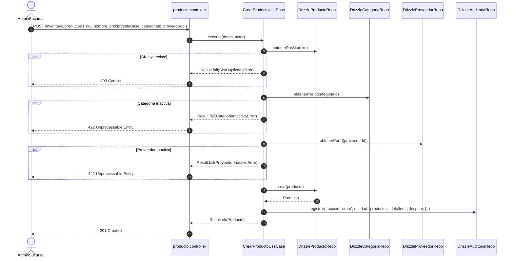

# Módulo de Inventario — Warengine

> **Propósito y estado:** **PARCIAL** (Categorías, Proveedores y Productos implementados; Stock, Movimientos y Kardex pendientes)  
> **Stack:** Deno · TypeScript · Drizzle ORM · MySQL 8 · Hono · Zod · Decimal  
> **Arquitectura:** Clean Architecture + Ports & Adapters + Kardex gobernado por BD

---

## Índice

1. [Propósito y estado](#1-propósito-y-estado)
2. [Cobertura del SRS](#2-cobertura-del-srs)
3. [Mapa de archivos](#3-mapa-de-archivos)
4. [Dominio](#4-dominio)
5. [Casos de uso](#5-casos-de-uso)
6. [Persistencia](#6-persistencia)
7. [API REST](#7-api-rest)
8. [Contratos (Shared)](#8-contratos-shared)
9. [Permisos y roles](#9-permisos-y-roles)
10. [Pruebas](#10-pruebas)
11. [Flujos clave](#11-flujos-clave)
12. [Pendientes y deuda técnica](#12-pendientes-y-deuda-técnica)
13. [Cómo probar manualmente](#13-cómo-probar-manualmente)

---

## 1. Propósito y Estado

El módulo de **Inventario** administra el catálogo maestro de artículos, categorías taxonómicas, proveedores comerciales y el control de existencias de Warengine. Su núcleo conceptual se basa en la **Regla de Oro del Stock**: la tabla `movimientos_inventario` (el kardex) es la única fuente de verdad sobre las existencias, y es la propia base de datos mediante triggers la encargada de mantener `inventario_sucursal.stock_actual` e impedir saldos negativos.

**Estado actual:** **PARCIAL**  
- **Implementado en código:** Gestión completa de **Categorías**, **Proveedores** y catálogo maestro de **Productos** (creación, edición, activación/inactivación idempotente, listados paginados y consulta por ID, con auditoría diferencial).
- **Pendiente:** Control de existencias por sede (`inventario_sucursal`), registro de entradas por compras, salidas manuales (merma/daño), ajustes de inventario y consulta histórica del kardex.

---

## 2. Cobertura del SRS

| Requisito | Descripción corta | Estado | Dónde está en el código |
|---|---|---|---|
| **RF-ADM-B5** | Gestión de Categorías (crear, editar, activar, inactivar, listar) | IMPLEMENTADO | [categoria.controller.ts](../../Backend/apps/api/src/controllers/inventario/categoria.controller.ts), Use Cases en `core` |
| **RF-ADM-B6** | Gestión de Proveedores (crear, editar, activar, inactivar, listar) | IMPLEMENTADO | [proveedor.controller.ts](../../Backend/apps/api/src/controllers/inventario/proveedor.controller.ts), Use Cases en `core` |
| **RF-ADM-B1** | Catálogo maestro de productos con SKU único y precios | IMPLEMENTADO | [producto.controller.ts](../../Backend/apps/api/src/controllers/inventario/producto.controller.ts), Use Cases en `core` |
| **RF-ADM-B2** | Modificación de productos y auditoría de cambio de precio | IMPLEMENTADO | [EditarProductoUseCase.ts](../../Backend/packages/core/src/modules/inventario/application/use-cases/EditarProductoUseCase.ts) |
| **RF-ADM-B3** | Activación y desactivación de productos | IMPLEMENTADO | [CambiarEstadoProductoUseCase.ts](../../Backend/packages/core/src/modules/inventario/application/use-cases/CambiarEstadoProductoUseCase.ts) |
| **RF-ADM-B4** | Consulta paginada y búsqueda de productos con filtros | IMPLEMENTADO | [ListarProductosUseCase.ts](../../Backend/packages/core/src/modules/inventario/application/use-cases/ListarProductosUseCase.ts) |
| **RF-FMC-C6** | Registro de fecha de actualización de precio corporativo | IMPLEMENTADO | Trigger `trg_productos_precio_corporativo_fecha` en BD |
| **RF-ADM-B7** | Registro de compras a proveedores (entradas de stock) | PENDIENTE | Caso de uso `registrar-entrada` pendiente de implementar. |
| **RF-ADM-B8** | Salidas manuales de stock por merma o daño con motivo | PENDIENTE | Caso de uso `registrar-salida` pendiente de implementar. |
| **RF-ADM-B9** | Ajustes de inventario (auditoría física) | PENDIENTE | Caso de uso `ajustar-stock` pendiente de implementar. |
| **RF-ADM-B10** | Consulta de alertas de stock bajo el mínimo | PENDIENTE | Caso de uso `listar-stock-bajo` pendiente de implementar. |
| **RF-ADM-B11** | Consulta histórica del Kardex por producto y sucursal | PENDIENTE | Caso de uso `consultar-kardex` pendiente de implementar. |

---

## 3. Mapa de Archivos

```
Backend/
├── apps/api/src/
│   ├── controllers/inventario/
│   │   ├── categoria.controller.ts
│   │   ├── producto.controller.ts
│   │   └── proveedor.controller.ts
│   └── routes/
│       └── inventario.routes.ts
├── packages/
│   ├── core/
│   │   ├── src/modules/inventario/
│   │   │   ├── application/use-cases/
│   │   │   │   ├── CambiarEstadoCategoriaUseCase.ts
│   │   │   │   ├── CambiarEstadoProductoUseCase.ts
│   │   │   │   ├── CambiarEstadoProveedorUseCase.ts
│   │   │   │   ├── CrearCategoriaUseCase.ts
│   │   │   │   ├── CrearProductoUseCase.ts
│   │   │   │   ├── CrearProveedorUseCase.ts
│   │   │   │   ├── EditarCategoriaUseCase.ts
│   │   │   │   ├── EditarProductoUseCase.ts
│   │   │   │   ├── EditarProveedorUseCase.ts
│   │   │   │   ├── InactivarCategoriaUseCase.ts
│   │   │   │   ├── InactivarProductoUseCase.ts
│   │   │   │   ├── InactivarProveedorUseCase.ts
│   │   │   │   ├── ListarCategoriasUseCase.ts
│   │   │   │   ├── ListarProductosUseCase.ts
│   │   │   │   ├── ListarProveedoresUseCase.ts
│   │   │   │   ├── ObtenerCategoriaPorIdUseCase.ts
│   │   │   │   ├── ObtenerProductoPorIdUseCase.ts
│   │   │   │   ├── ObtenerProveedorPorIdUseCase.ts
│   │   │   │   ├── ReactivarCategoriaUseCase.ts
│   │   │   │   ├── ReactivarProductoUseCase.ts
│   │   │   │   └── ReactivarProveedorUseCase.ts
│   │   │   ├── domain/
│   │   │   │   ├── entities/
│   │   │   │   │   ├── Categoria.ts
│   │   │   │   │   ├── Producto.ts
│   │   │   │   │   └── Proveedor.ts
│   │   │   │   ├── value-objects/
│   │   │   │   │   └── Sku.ts
│   │   │   │   ├── errors/
│   │   │   │   │   └── InventarioErrors.ts
│   │   │   │   └── repositories/
│   │   │   │       ├── ICategoriaRepository.ts
│   │   │   │       ├── IProductoRepository.ts
│   │   │   │       └── IProveedorRepository.ts
│   │   └── tests/inventario/
│   │       ├── categoria.use-case.test.ts
│   │       ├── producto.use-case.test.ts
│   │       └── proveedor.use-case.test.ts
│   ├── database/src/
│   │   ├── schema/
│   │   │   └── inventario.schema.ts
│   │   ├── repositories/inventario/
│   │   │   ├── drizzle-categoria.repository.ts
│   │   │   ├── drizzle-producto.repository.ts
│   │   │   └── drizzle-proveedor.repository.ts
│   │   └── mappers/inventario/
│   │       ├── categoria.mapper.ts
│   │       ├── producto.mapper.ts
│   │       └── proveedor.mapper.ts
│   └── composition/src/
│       └── container.ts
Shared/contracts/src/inventario/
├── categoria.schema.ts
├── producto.schema.ts
└── proveedor.schema.ts
Http/
└── 06-inventario.http
```

---

## 4. Dominio

### 4.1 Entidades y Value Objects

#### `Sku` ([Sku.ts](../../Backend/packages/core/src/modules/inventario/domain/value-objects/Sku.ts))
Value Object inmutable que encapsula el código de referencia de un producto:
- Valida formato alfanumérico en mayúsculas (3 a 50 caracteres, permitiendo guiones y guiones bajos).
- Garantiza normalización (`trim().toUpperCase()`).

#### `Categoria` ([Categoria.ts](../../Backend/packages/core/src/modules/inventario/domain/entities/Categoria.ts))
- `id: number`, `nombre: string`, `descripcion: string | null`, `isActive: boolean`, `creadoEn: Date`.
- Métodos: `activar(): void`, `inactivar(): void`.

#### `Proveedor` ([Proveedor.ts](../../Backend/packages/core/src/modules/inventario/domain/entities/Proveedor.ts))
- `id: number`, `nombre: string`, `contacto: string | null`, `telefono: string | null`, `email: string | null`, `direccion: string | null`, `isActive: boolean`, `creadoEn: Date`.
- Métodos: `activar(): void`, `inactivar(): void`.

#### `Producto` ([Producto.ts](../../Backend/packages/core/src/modules/inventario/domain/entities/Producto.ts))
- `id: number`, `sku: Sku`, `nombre: string`, `descripcion: string | null`, `categoriaId: number`, `proveedorId: number | null`, `precioVentaBase: number`, `precioCorporativo: number | null`, `precioCorporativoActualizadoEn: Date | null`, `isActive: boolean`, `creadoEn: Date`.
- Métodos: `activar(): void`, `inactivar(): void`.

### 4.2 Interfaces de Repositorio (Ports)

- **`ICategoriaRepository`** ([ICategoriaRepository.ts](../../Backend/packages/core/src/modules/inventario/domain/repositories/ICategoriaRepository.ts)):
  ```typescript
  crear(categoria: Omit<Categoria, 'id' | 'creadoEn'>): Promise<Categoria>;
  actualizar(categoria: Categoria): Promise<void>;
  obtenerPorId(id: number): Promise<Categoria | null>;
  obtenerPorNombre(nombre: string): Promise<Categoria | null>;
  listar(filtros: { buscar?: string; isActive?: boolean; limite?: number; offset?: number }): Promise<ResultadoPaginado<Categoria>>;
  ```
- **`IProveedorRepository`** ([IProveedorRepository.ts](../../Backend/packages/core/src/modules/inventario/domain/repositories/IProveedorRepository.ts)):
  ```typescript
  crear(proveedor: Omit<Proveedor, 'id' | 'creadoEn'>): Promise<Proveedor>;
  actualizar(proveedor: Proveedor): Promise<void>;
  obtenerPorId(id: number): Promise<Proveedor | null>;
  obtenerPorNombre(nombre: string): Promise<Proveedor | null>;
  listar(filtros: { buscar?: string; isActive?: boolean; limite?: number; offset?: number }): Promise<ResultadoPaginado<Proveedor>>;
  ```
- **`IProductoRepository`** ([IProductoRepository.ts](../../Backend/packages/core/src/modules/inventario/domain/repositories/IProductoRepository.ts)):
  ```typescript
  crear(producto: Omit<Producto, 'id' | 'creadoEn'>): Promise<Producto>;
  actualizar(producto: Producto): Promise<void>;
  obtenerPorId(id: number): Promise<Producto | null>;
  obtenerPorSku(sku: string): Promise<Producto | null>;
  listar(filtros: { buscar?: string; categoriaId?: number; proveedorId?: number; isActive?: boolean; limite?: number; offset?: number }): Promise<ResultadoPaginado<Producto>>;
  tieneMovimientos(productoId: number): Promise<boolean>;
  ```

### 4.3 Errores de Dominio ([InventarioErrors.ts](../../Backend/packages/core/src/modules/inventario/domain/errors/InventarioErrors.ts))

| Clase | Code | Mensaje | HTTP Presenter |
|---|---|---|---|
| `CategoriaNoEncontradaError` | `CATEGORIA_NO_ENCONTRADA` | "La categoría no existe." | 404 Not Found |
| `ProveedorNoEncontradoError` | `PROVEEDOR_NO_ENCONTRADO` | "El proveedor no existe." | 404 Not Found |
| `ProductoNoEncontradoError` | `PRODUCTO_NO_ENCONTRADO` | "El producto no existe." | 404 Not Found |
| `SkuDuplicadoError` | `SKU_DUPLICADO` | "Ya existe un producto con el SKU \"{sku}\"." | 409 Conflict |
| `CategoriaInactivaError` | `CATEGORIA_INACTIVA` | "La categoría seleccionada está inactiva." | 422 Unprocessable Entity |
| `ProveedorInactivoError` | `PROVEEDOR_INACTIVO` | "El proveedor seleccionado está inactivo." | 422 Unprocessable Entity |
| `ReferenciaInvalidaError` | `REFERENCIA_INVALIDA` | "La referencia de clave foránea es inválida." | 422 Unprocessable Entity |
| `SkuModificacionNoPermitidaError` | `SKU_MODIFICACION_NO_PERMITIDA` | "No se permite modificar el SKU de un producto que ya registra movimientos." | 422 Unprocessable Entity |

---

## 5. Casos de Uso

### 5.1 Categorías y Proveedores

#### Diferencia entre `Inactivar`, `Reactivar` y `CambiarEstado`:
En el Core de Warengine coexisten tres casos de uso para la gestión del ciclo de vida de entidades maestras:
1. **`InactivarCategoriaUseCase` / `InactivarProveedorUseCase`**: Fija explícitamente `isActive = false`. Es idempotente (si ya estaba inactiva no arroja error) y emite un evento de auditoría `{ accion: 'inactivar', detalles: { antes: { isActive: true }, despues: { isActive: false } } }`.
2. **`ReactivarCategoriaUseCase` / `ReactivarProveedorUseCase`**: Fija explícitamente `isActive = true` y emite `{ accion: 'activar', detalles: { antes: { isActive: false }, despues: { isActive: true } } }`.
3. **`CambiarEstadoCategoriaUseCase` / `CambiarEstadoProveedorUseCase`**: Actúa como **caso de uso fachada** polimórfico. Recibe `{ id, isActive: boolean, actor }` y delega internamente en `Reactivar...` (si `isActive === true`) o en `Inactivar...` (si `isActive === false`). Coexisten porque el controlador HTTP expone la ruta unificada `PUT .../:id/estado` con el cuerpo `{ isActive: boolean }`, permitiendo que clientes REST envíen un booleano mientras el dominio registra semánticamente la acción `'activar'` o `'inactivar'`.

#### Casos de Uso de Categorías:
- **`CrearCategoriaUseCase`**: Valida nombre, persiste con `isActive = true` y audita `{ accion: 'crear', entidad: 'categorias', detalles: { despues } }`.
- **`EditarCategoriaUseCase`**: Modifica `nombre` y `descripcion`, audita diferencias `{ antes, despues }`.
- **`ListarCategoriasUseCase`** / **`ObtenerCategoriaPorIdUseCase`**: Consultas paginadas con filtros de búsqueda y estado. No auditan.

#### Casos de Uso de Proveedores:
- **`CrearProveedorUseCase`**: Valida datos de contacto, persiste con `isActive = true` y audita `{ accion: 'crear', entidad: 'proveedores', detalles: { despues } }`.
- **`EditarProveedorUseCase`**: Modifica datos comerciales, audita diferencias `{ antes, despues }`.
- **`ListarProveedoresUseCase`** / **`ObtenerProveedorPorIdUseCase`**: Consultas paginadas. No auditan.

### 5.2 Catálogo de Productos
- **`CrearProductoUseCase`**:
  1. Verifica unicidad de SKU vía `IProductoRepository.obtenerPorSku(sku)`. Si existe, falla con `SkuDuplicadoError`.
  2. Valida que la categoría exista y esté activa (`CategoriaNoEncontradaError`, `CategoriaInactivaError`).
  3. Si se especifica proveedor, valida que exista y esté activo (`ProveedorNoEncontradoError`, `ProveedorInactivoError`).
  4. Inserta el producto y emite auditoría `{ accion: 'crear', entidad: 'productos', detalles: { despues } }`.
- **`EditarProductoUseCase`**:
  1. Carga el producto por id. Falla con `ProductoNoEncontradoError`.
  2. Si se intenta cambiar el SKU:
     - Comprueba `IProductoRepository.tieneMovimientos(productoId)`. Si registra movimientos en el kardex, **rechaza el cambio** con `SkuModificacionNoPermitidaError`.
     - Verifica que el nuevo SKU no esté en uso por otro producto (`SkuDuplicadoError`).
  3. Si cambia de categoría o proveedor, comprueba que existan y estén activos.
  4. Si cambia `precioVentaBase` o `precioCorporativo`, agrega `cambioPrecio: true` en el detalle diferencial de auditoría.
  5. Emite auditoría `{ accion: 'editar', entidad: 'productos', detalles: { antes, despues } }`.
- **`CambiarEstadoProductoUseCase`** / **`InactivarProductoUseCase`** / **`ReactivarProductoUseCase`**: Gestión idempotente de estado con auditoría.
- **`ListarProductosUseCase`** / **`ObtenerProductoPorIdUseCase`**: Búsqueda paginada con filtros por texto, categoría, proveedor y estado operativo.

---

## 6. Persistencia

### 6.1 Tablas Drizzle ([inventario.schema.ts](../../Backend/packages/database/src/schema/inventario.schema.ts))

- **`categorias`**: `id_categoria` (int auto PK), `nombre` (varchar 100 unique), `descripcion` (text), `is_active` (boolean def 1), `creado_en`.
- **`proveedores`**: `id_proveedor` (int auto PK), `nombre` (varchar 150 unique), `contacto`, `telefono`, `email`, `direccion`, `is_active` (boolean def 1), `creado_en`.
- **`productos`**: `id_producto` (int auto PK), `sku` (`varcharBin(50)` unique), `nombre` (varchar 150), `descripcion`, `categoria_id` (FK categorias), `proveedor_id` (FK proveedores nullable), `precio_venta_base` (decimal 12,2), `precio_corporativo` (decimal 12,2 nullable), `precio_corporativo_actualizado_en` (timestamp), `is_active` (boolean def 1), `creado_en`.
- **`inventario_sucursal`**: `id` (bigint PK), `sucursal_id` (FK sucursales), `producto_id` (FK productos), `stock_actual` (decimal 12,3 def 0), `stock_minimo` (decimal 12,3 def 0), `ubicacion_almacen` (varchar 50), PK compuesta o índice único (`sucursal_id`, `producto_id`).
- **`movimientos_inventario`**: `id_movimiento` (bigint PK), `producto_id` (FK productos), `sucursal_id` (FK sucursales), `tipo` (enum `'entrada'`, `'salida'`, `'ajuste_entrada'`, `'ajuste_salida'`), `cantidad` (decimal 12,3), `stock_previo`, `stock_posterior`, `motivo`, `proveedor_id`, `factura_id`, `usuario_id`, `creado_en`.

### 6.2 Regla de Oro del Stock (Sección 6.1 de Arquitectura)

`movimientos_inventario` es la **única fuente de verdad del stock**. Al insertar una fila en dicha tabla, MySQL dispara automáticamente:
1. **`trg_movimientos_check_stock` (BEFORE INSERT)**: Rechaza cualquier salida o ajuste de salida que dejase el stock en negativo (`SIGNAL SQLSTATE '45000'`).
2. **`trg_movimientos_actualiza_stock` (AFTER INSERT)**: Suma o resta en `inventario_sucursal.stock_actual`, creando la fila si no existía.
3. **`trg_movimientos_bloquea_update` / `delete`**: El kardex es de **solo inserción**. Todo intento de actualizar o borrar un movimiento es rechazado con error.
4. **`trg_productos_precio_corporativo_fecha`**: Si se actualiza `precio_corporativo`, actualiza automáticamente `precio_corporativo_actualizado_en = NOW()`.
5. **CHECKs**: `chk_inventario_stock_actual` (`stock_actual >= 0`), `chk_inventario_stock_minimo` (`stock_minimo >= 0`), `chk_movimientos_cantidad` (`cantidad > 0`).

---

## 7. API REST

Prefijo general de montaje en `main.ts`: `/inventario`.

| Método | Ruta completa | Permiso requerido | Controlador | Caso de uso | Schema Zod | Códigos HTTP |
|---|---|---|---|---|---|---|
| `GET` | `/inventario/categorias` | `inventario:leer` | `listarCategoriasController` | `ListarCategoriasUseCase` | `paginacionSchema` | 200, 401, 403 |
| `GET` | `/inventario/categorias/:id` | `inventario:leer` | `obtenerCategoriaPorIdController` | `ObtenerCategoriaPorIdUseCase` | Ninguno | 200, 401, 403, 404 |
| `POST` | `/inventario/categorias` | `inventario:escribir` | `crearCategoriaController` | `CrearCategoriaUseCase` | `crearCategoriaSchema` | 201, 400, 401, 403 |
| `PUT` | `/inventario/categorias/:id` | `inventario:escribir` | `editarCategoriaController` | `EditarCategoriaUseCase` | `editarCategoriaSchema` | 200, 400, 401, 403, 404 |
| `PUT` | `/inventario/categorias/:id/estado` | `inventario:escribir` | `cambiarEstadoCategoriaController` | `CambiarEstadoCategoriaUseCase` | `cambiarEstadoCategoriaSchema` | 200, 400, 401, 403, 404 |
| `GET` | `/inventario/proveedores` | `inventario:leer` | `listarProveedoresController` | `ListarProveedoresUseCase` | `paginacionSchema` | 200, 401, 403 |
| `GET` | `/inventario/proveedores/:id` | `inventario:leer` | `obtenerProveedorPorIdController` | `ObtenerProveedorPorIdUseCase` | Ninguno | 200, 401, 403, 404 |
| `POST` | `/inventario/proveedores` | `inventario:escribir` | `crearProveedorController` | `CrearProveedorUseCase` | `crearProveedorSchema` | 201, 400, 401, 403 |
| `PUT` | `/inventario/proveedores/:id` | `inventario:escribir` | `editarProveedorController` | `EditarProveedorUseCase` | `editarProveedorSchema` | 200, 400, 401, 403, 404 |
| `PUT` | `/inventario/proveedores/:id/estado` | `inventario:escribir` | `cambiarEstadoProveedorController` | `CambiarEstadoProveedorUseCase` | `cambiarEstadoProveedorSchema` | 200, 400, 401, 403, 404 |
| `GET` | `/inventario/productos` | `inventario:leer` | `listarProductosController` | `ListarProductosUseCase` | `listarProductosSchema` | 200, 401, 403 |
| `GET` | `/inventario/productos/:id` | `inventario:leer` | `obtenerProductoPorIdController` | `ObtenerProductoPorIdUseCase` | Ninguno | 200, 401, 403, 404 |
| `POST` | `/inventario/productos` | `inventario:escribir` | `crearProductoController` | `CrearProductoUseCase` | `crearProductoSchema` | 201, 400, 401, 403, 409, 422 |
| `PUT` | `/inventario/productos/:id` | `inventario:escribir` | `editarProductoController` | `EditarProductoUseCase` | `editarProductoSchema` | 200, 400, 401, 403, 404, 409, 422 |
| `PUT` | `/inventario/productos/:id/estado` | `inventario:escribir` | `cambiarEstadoProductoController` | `CambiarEstadoProductoUseCase` | `cambiarEstadoProductoSchema` | 200, 400, 401, 403, 404 |

---

## 8. Contratos (Shared)

- **Categorías** ([categoria.schema.ts](../../Shared/contracts/src/inventario/categoria.schema.ts)):
  - `crearCategoriaSchema`: `{ nombre: min(2).max(100), descripcion?: max(500) }`
  - `editarCategoriaSchema`: `{ nombre?: min(2), descripcion?: max(500) }` (al menos un campo).
  - `cambiarEstadoCategoriaSchema`: `{ isActive: boolean }`
- **Proveedores** ([proveedor.schema.ts](../../Shared/contracts/src/inventario/proveedor.schema.ts)):
  - `crearProveedorSchema`: `{ nombre: min(2), contacto?, telefono?, email?: email(), direccion? }`
  - `editarProveedorSchema`: campos opcionales (al menos uno requerido).
  - `cambiarEstadoProveedorSchema`: `{ isActive: boolean }`
- **Productos** ([producto.schema.ts](../../Shared/contracts/src/inventario/producto.schema.ts)):
  - `crearProductoSchema`: `{ sku: regex(/^[A-Z0-9_-]{3,50}$/), nombre: min(2), descripcion?, categoriaId: int > 0, proveedorId?: int > 0, precioVentaBase: number > 0, precioCorporativo?: number > 0 }`
  - `editarProductoSchema`: `{ sku?, nombre?, descripcion?, categoriaId?, proveedorId?, precioVentaBase?, precioCorporativo? }`
  - `cambiarEstadoProductoSchema`: `{ isActive: boolean }`
  - `listarProductosSchema`: query params con `buscar?`, `categoriaId?`, `proveedorId?`, `isActive?`, `limite`, `offset`.

---

## 9. Permisos y Roles

- `inventario:leer`: Consultar catálogo, precios y categorías.
  - Asignado a: `super-admin`, `admin-sucursal`, `cajero-vendedor`.
- `inventario:escribir`: Crear o editar categorías, proveedores y productos.
  - Asignado a: `super-admin`, `admin-sucursal`.
  - `cajero-vendedor` recibe HTTP 403 ante cualquier intento de escritura.
- `inventario:registrar-movimiento`, `inventario:ajustar-stock`, `inventario:ver-kardex`: Asignados en el seed a `super-admin` y `admin-sucursal` (para cuando se implementen los casos de uso de stock).

---

## 10. Pruebas

### Archivos de Test y Cobertura
1. [categoria.use-case.test.ts](../../Backend/packages/core/tests/inventario/categoria.use-case.test.ts) (12 tests):
   - Métodos activar e inactivar de entidad.
   - Creación con auditoría diferencial `despues`.
   - Consulta por ID y error 404 `CATEGORIA_NO_ENCONTRADA`.
   - Edición con auditoría `antes` / `despues`.
   - Inactivación y reactivación idempotente.
   - Delegación en `CambiarEstadoCategoriaUseCase`.
   - Listado paginado con filtros.
2. [proveedor.use-case.test.ts](../../Backend/packages/core/tests/inventario/proveedor.use-case.test.ts) (12 tests):
   - Mismo esquema completo de cobertura para entidades, creación, edición, estados, delegación y filtros de proveedores.
3. [producto.use-case.test.ts](../../Backend/packages/core/tests/inventario/producto.use-case.test.ts) (20 tests):
   - Creación y auditoría `despues`.
   - Rechazo de SKU duplicado (`SKU_DUPLICADO`) sin auditar.
   - Validación de categoría o proveedor inexistente o inactivo (`CATEGORIA_INACTIVA`, `PROVEEDOR_INACTIVO`).
   - Edición de atributos con auditoría diferencial.
   - Registro de `cambioPrecio: true` en auditoría ante variaciones de precio.
   - Bloqueo de modificación de SKU cuando el producto registra movimientos previos (`SKU_MODIFICACION_NO_PERMITIDA`).
   - Inactivación, reactivación y delegación.
   - Listado paginado con filtros combinados.

### Cómo ejecutarlas
```bash
deno test --allow-all Backend/packages/core/tests/inventario/
```

---

## 11. Flujos Clave

### Flujo: Creación de Producto con Validación Cruzada de Estado



---

## 12. Pendientes y Deuda Técnica

1. **Gestión de Stock por Sucursal (`inventario_sucursal`):** Faltan casos de uso para consultar el stock disponible en una sucursal específica.
2. **Entradas por Compras (`registrar-entrada`):** Falta caso de uso que inserte en `movimientos_inventario` con tipo `entrada` y `proveedor_id`.
3. **Salidas Manuales (`registrar-salida`):** Falta caso de uso para registrar bajas por merma o deterioro con motivo obligatorio.
4. **Ajustes de Inventario (`ajustar-stock`):** Falta caso de uso de auditoría física (`ajuste_entrada` o `ajuste_salida`).
5. **Kardex y Reporte de Stock Bajo (`kardex`, `stock-bajo`):** Falta endpoints de consulta histórica de movimientos e informe de alertas de stock mínimo.

---

## 13. Cómo Probar Manualmente

El archivo [Http/06-inventario.http](../../Http/06-inventario.http) contiene escenarios para:
1. Listar, crear y editar categorías y proveedores.
2. Cambiar estado activo/inactivo comprobando la respuesta idempotente.
3. Crear productos con SKU único y probar el rechazo de duplicados (HTTP 409).
4. Intentar asignar una categoría o proveedor inactivo (HTTP 422).
5. Modificar precios y verificar en [Http/04-auditoria.http](../../Http/04-auditoria.http) el registro diferencial con `cambioPrecio`.
