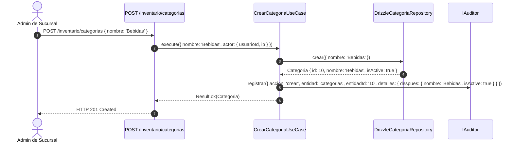
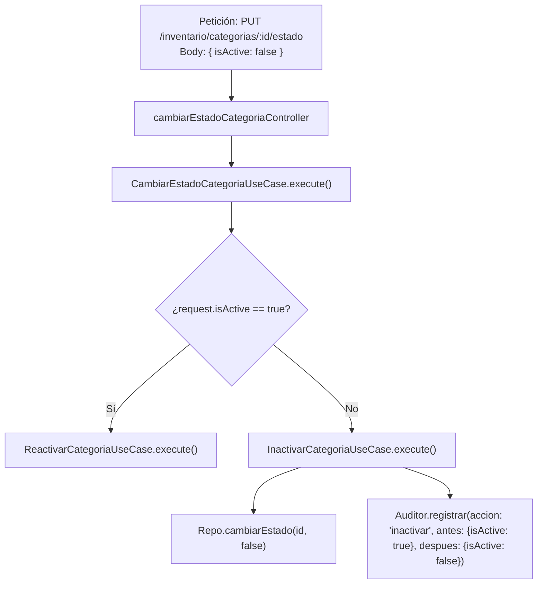

# Módulo de Inventario — Warengine

> **Estado del módulo:** PARCIAL  
> **Stack técnico:** Deno · TypeScript · Drizzle ORM · MySQL 8 · Hono  
> **Arquitectura:** Clean Architecture + Inversión de Dependencias (DIP) + Regla de Oro del Kardex  

---

## Índice

1. [Propósito y Estado](#1-propósito-y-estado)
2. [Cobertura del SRS](#2-cobertura-del-srs)
3. [Mapa de Archivos](#3-mapa-de-archivos)
4. [Dominio](#4-dominio)
5. [Casos de Uso](#5-casos-de-uso)
6. [Persistencia y Reglas de Base de Datos](#6-persistencia-y-reglas-de-base-de-datos)
7. [API REST](#7-api-rest)
8. [Contratos (SHARED)](#8-contratos-shared)
9. [Permisos y Roles](#9-permisos-y-roles)
10. [Pruebas](#10-pruebas)
11. [Flujos Clave](#11-flujos-clave)
12. [Pendientes y Deuda Técnica](#12-pendientes-y-deuda-técnica)
13. [Cómo Probar Manualmente](#13-cómo-probar-manualmente)

---

## 1. Propósito y Estado

**Estado:** `PARCIAL`

El módulo de Inventario es el núcleo operativo de mercancías de Warengine. Su alcance actual y planificado es:
- **Implementado en código:** Catálogo completo de **Categorías** y directorio de **Proveedores** de insumos/productos, incluyendo listados paginados con búsqueda textual, lectura por ID, alta, modificación y activación/inactivación con auditoría de cambios.
- **Pendiente en código (solo definido en esquema SQL):** Catálogo de Productos (`productos`), saldos de existencias por sede (`inventario_sucursal`), entradas por compra, salidas por merma/avería, ajustes de stock y el Kardex valorizado (`movimientos_inventario`).

---

## 2. Cobertura del SRS

| Requerimiento (RF / RNF) | Descripción Corta | Estado | Dónde está en el código |
|---|---|---|---|
| **RF-ADM-B5** | Gestión de categorías de productos (listar, crear, editar, alternar estado) | IMPLEMENTADO | [`CrearCategoriaUseCase.ts`](../../Backend/packages/core/src/modules/inventario/application/use-cases/CrearCategoriaUseCase.ts), [`drizzle-categoria.repository.ts`](../../Backend/packages/database/src/repositories/inventario/drizzle-categoria.repository.ts) |
| **RF-ADM-B6** | Gestión de proveedores de mercancías (listar, crear, editar, alternar estado) | IMPLEMENTADO | [`CrearProveedorUseCase.ts`](../../Backend/packages/core/src/modules/inventario/application/use-cases/CrearProveedorUseCase.ts), [`drizzle-proveedor.repository.ts`](../../Backend/packages/database/src/repositories/inventario/drizzle-proveedor.repository.ts) |
| **RF-ADM-B1** | Catálogo de productos con SKU único y precios base/corporativo | PENDIENTE | Tabla `productos` en SQL; casos de uso pendientes en backend |
| **RF-ADM-B2** | Control de stock actual y mínimo por sucursal | PENDIENTE | Tabla `inventario_sucursal` y trigger `trg_movimientos_actualiza_stock` en SQL |
| **RF-ADM-B7** | Registro de entradas de inventario por compra con proveedor | PENDIENTE | Tabla `movimientos_inventario` en SQL; caso de uso pendiente |
| **RF-ADM-B8** | Registro de salidas manuales por merma o deterioro | PENDIENTE | Tabla `movimientos_inventario` en SQL; caso de uso pendiente |
| **RF-ADM-B9** | Ajustes de inventario auditados (positivo / negativo) | PENDIENTE | Triggers `trg_movimientos_check_stock` y tipos `ajuste_entrada`/`ajuste_salida` en SQL |
| **RF-ADM-B10** | Consulta de Kardex inmutable y movimientos históricos | PENDIENTE | Tabla `movimientos_inventario` protegida por triggers de solo inserción en SQL |
| **RF-ADM-B11** | Reporte y alertas de stock por debajo del mínimo | PENDIENTE | No iniciado |

---

## 3. Mapa de Archivos

```
Backend/
├── packages/
│   ├── core/src/modules/inventario/
│   │   ├── domain/
│   │   │   ├── entities/
│   │   │   │   ├── Categoria.ts
│   │   │   │   └── Proveedor.ts
│   │   │   ├── errors/
│   │   │   │   └── InventarioErrors.ts
│   │   │   └── repositories/
│   │   │       ├── ICategoriaRepository.ts
│   │   │       └── IProveedorRepository.ts
│   │   └── application/
│   │       └── use-cases/
│   │           ├── ListarCategoriasUseCase.ts
│   │           ├── ObtenerCategoriaPorIdUseCase.ts
│   │           ├── CrearCategoriaUseCase.ts
│   │           ├── EditarCategoriaUseCase.ts
│   │           ├── InactivarCategoriaUseCase.ts
│   │           ├── ReactivarCategoriaUseCase.ts
│   │           ├── CambiarEstadoCategoriaUseCase.ts
│   │           ├── ListarProveedoresUseCase.ts
│   │           ├── ObtenerProveedorPorIdUseCase.ts
│   │           ├── CrearProveedorUseCase.ts
│   │           ├── EditarProveedorUseCase.ts
│   │           ├── InactivarProveedorUseCase.ts
│   │           ├── ReactivarProveedorUseCase.ts
│   │           └── CambiarEstadoProveedorUseCase.ts
│   ├── database/src/
│   │   ├── schema/
│   │   │   └── inventario.schema.ts
│   │   ├── repositories/inventario/
│   │   │   ├── drizzle-categoria.repository.ts
│   │   │   └── drizzle-proveedor.repository.ts
│   │   └── mappers/inventario/
│   │       ├── categoria.mapper.ts
│   │       └── proveedor.mapper.ts
│   └── core/tests/inventario/
│       ├── categoria.use-case.test.ts
│       └── proveedor.use-case.test.ts
├── apps/api/src/
│   ├── routes/
│   │   └── inventario.routes.ts
│   └── controllers/inventario/
│       ├── categoria.controller.ts
│       └── proveedor.controller.ts
Shared/
└── contracts/src/
    └── inventario/
        ├── categoria.schema.ts
        └── proveedor.schema.ts
```

---

## 4. Dominio

### 4.1 Entidades

#### `Categoria`
Archivo: [`Categoria.ts`](../../Backend/packages/core/src/modules/inventario/domain/entities/Categoria.ts)
- `id: number`
- `nombre: string`
- `isActive: boolean`
- Métodos: `activar(): Categoria`, `inactivar(): Categoria` (patrón inmutable).

#### `Proveedor`
Archivo: [`Proveedor.ts`](../../Backend/packages/core/src/modules/inventario/domain/entities/Proveedor.ts)
- `id: number`
- `nombre: string`
- `contacto: string | null`
- `isActive: boolean`
- Métodos: `activar(): Proveedor`, `inactivar(): Proveedor`.

### 4.2 Interfaces de Repositorio (Ports)

#### `ICategoriaRepository`
Archivo: [`ICategoriaRepository.ts`](../../Backend/packages/core/src/modules/inventario/domain/repositories/ICategoriaRepository.ts)
```typescript
export interface DatosCrearCategoria { nombre: string; }
export interface DatosActualizarCategoria { nombre?: string; isActive?: boolean; }
export interface FiltrosListarCategorias { busqueda?: string; isActive?: boolean; page: number; limit: number; }
export interface ResultadoPaginado<T> { items: T[]; total: number; page: number; limit: number; totalPages: number; }

export interface ICategoriaRepository {
  listar(filtros: FiltrosListarCategorias): Promise<ResultadoPaginado<Categoria>>;
  listarActivos(): Promise<Categoria[]>;
  findById(id: number): Promise<Categoria | null>;
  crear(datos: DatosCrearCategoria): Promise<Categoria>;
  actualizar(id: number, cambios: DatosActualizarCategoria): Promise<Categoria>;
  cambiarEstado(id: number, isActive: boolean): Promise<Categoria>;
}
```

#### `IProveedorRepository`
Archivo: [`IProveedorRepository.ts`](../../Backend/packages/core/src/modules/inventario/domain/repositories/IProveedorRepository.ts)
```typescript
export interface DatosCrearProveedor { nombre: string; contacto?: string | null; }
export interface DatosActualizarProveedor { nombre?: string; contacto?: string | null; isActive?: boolean; }
export interface FiltrosListarProveedores { busqueda?: string; isActive?: boolean; page: number; limit: number; }

export interface IProveedorRepository {
  listar(filtros: FiltrosListarProveedores): Promise<ResultadoPaginado<Proveedor>>;
  listarActivos(): Promise<Proveedor[]>;
  findById(id: number): Promise<Proveedor | null>;
  crear(datos: DatosCrearProveedor): Promise<Proveedor>;
  actualizar(id: number, cambios: DatosActualizarProveedor): Promise<Proveedor>;
  cambiarEstado(id: number, isActive: boolean): Promise<Proveedor>;
}
```

### 4.3 Errores de Dominio
Archivo: [`InventarioErrors.ts`](../../Backend/packages/core/src/modules/inventario/domain/errors/InventarioErrors.ts)
| Clase de Error | `code` | Mensaje por Defecto | HTTP |
|---|---|---|---|
| `CategoriaNoEncontradaError` | `CATEGORIA_NO_ENCONTRADA` | "La categoría no existe." | 404 Not Found |
| `ProveedorNoEncontradoError` | `PROVEEDOR_NO_ENCONTRADO` | "El proveedor no existe." | 404 Not Found |

---

## 5. Casos de Uso

### 5.1 Categorías
1. **`ListarCategoriasUseCase`**: [`ListarCategoriasUseCase.ts`](../../Backend/packages/core/src/modules/inventario/application/use-cases/ListarCategoriasUseCase.ts). Recibe `{ busqueda?, isActive?, page, limit }`. Retorna `ResultadoPaginado<Categoria>`. No audita (GET ordinario).
2. **`ObtenerCategoriaPorIdUseCase`**: [`ObtenerCategoriaPorIdUseCase.ts`](../../Backend/packages/core/src/modules/inventario/application/use-cases/ObtenerCategoriaPorIdUseCase.ts). Busca por ID; si no existe, devuelve `CategoriaNoEncontradaError`. No audita.
3. **`CrearCategoriaUseCase`**: [`CrearCategoriaUseCase.ts`](../../Backend/packages/core/src/modules/inventario/application/use-cases/CrearCategoriaUseCase.ts). Inyecta `ICategoriaRepository` y `IAuditor`. Registra auditoría con acción `crear`, entidad `categorias`, `detalles.despues: { nombre, isActive: true }`.
4. **`EditarCategoriaUseCase`**: [`EditarCategoriaUseCase.ts`](../../Backend/packages/core/src/modules/inventario/application/use-cases/EditarCategoriaUseCase.ts). Valida existencia y actualiza nombre y/o estado. Audita con acción `editar`, entidad `categorias`, registrando únicamente los campos modificados bajo `{ antes, despues }`.
5. **`InactivarCategoriaUseCase`**: [`InactivarCategoriaUseCase.ts`](../../Backend/packages/core/src/modules/inventario/application/use-cases/InactivarCategoriaUseCase.ts). Cambia estado a `false`. Audita con acción `inactivar`, entidad `categorias`, `{ antes: { isActive: true }, despues: { isActive: false } }`.
6. **`ReactivarCategoriaUseCase`**: [`ReactivarCategoriaUseCase.ts`](../../Backend/packages/core/src/modules/inventario/application/use-cases/ReactivarCategoriaUseCase.ts). Cambia estado a `true`. Audita con acción `activar`, entidad `categorias`, `{ antes: { isActive: false }, despues: { isActive: true } }`.
7. **`CambiarEstadoCategoriaUseCase`**: [`CambiarEstadoCategoriaUseCase.ts`](../../Backend/packages/core/src/modules/inventario/application/use-cases/CambiarEstadoCategoriaUseCase.ts). Caso de uso coordinador: recibe `{ id, isActive, actor }` y delega internamente a `ReactivarCategoriaUseCase` (si `isActive === true`) o a `InactivarCategoriaUseCase` (si `isActive === false`).

### 5.2 Proveedores
Presenta la misma estructura simétrica en 7 casos de uso:
1. **`ListarProveedoresUseCase`**: [`ListarProveedoresUseCase.ts`](../../Backend/packages/core/src/modules/inventario/application/use-cases/ListarProveedoresUseCase.ts).
2. **`ObtenerProveedorPorIdUseCase`**: [`ObtenerProveedorPorIdUseCase.ts`](../../Backend/packages/core/src/modules/inventario/application/use-cases/ObtenerProveedorPorIdUseCase.ts).
3. **`CrearProveedorUseCase`**: [`CrearProveedorUseCase.ts`](../../Backend/packages/core/src/modules/inventario/application/use-cases/CrearProveedorUseCase.ts). Audita acción `crear`, entidad `proveedores`.
4. **`EditarProveedorUseCase`**: [`EditarProveedorUseCase.ts`](../../Backend/packages/core/src/modules/inventario/application/use-cases/EditarProveedorUseCase.ts). Audita acción `editar`, entidad `proveedores`, `{ antes, despues }`.
5. **`InactivarProveedorUseCase`**: [`InactivarProveedorUseCase.ts`](../../Backend/packages/core/src/modules/inventario/application/use-cases/InactivarProveedorUseCase.ts). Audita acción `inactivar`.
6. **`ReactivarProveedorUseCase`**: [`ReactivarProveedorUseCase.ts`](../../Backend/packages/core/src/modules/inventario/application/use-cases/ReactivarProveedorUseCase.ts). Audita acción `activar`.
7. **`CambiarEstadoProveedorUseCase`**: [`CambiarEstadoProveedorUseCase.ts`](../../Backend/packages/core/src/modules/inventario/application/use-cases/CambiarEstadoProveedorUseCase.ts). Despacha a `ReactivarProveedorUseCase` o `InactivarProveedorUseCase`.

#### Coexistencia y Diferencia entre Inactivar, Reactivar y CambiarEstado
- `Inactivar` y `Reactivar` son casos de uso atómicos especializados con su propia semántica de auditoría (`inactivar` vs `activar`).
- `CambiarEstado` es el caso de uso compuesto utilizado directamente por los controladores HTTP de la API REST (`PUT /inventario/categorias/:id/estado` y `PUT /inventario/proveedores/:id/estado`). El controlador recibe un payload unificado `{ "isActive": boolean }`, evitando duplicar rutas HTTP en la API y delegando a la acción atómica correspondiente.

---

## 6. Persistencia y Reglas de Base de Datos

### 6.1 Tablas Drizzle Implementadas
Archivo: [`inventario.schema.ts`](../../Backend/packages/database/src/schema/inventario.schema.ts)
- `categorias`: `id_categoria` (INT PK auto_increment), `nombre` (VARCHAR 100), `is_active` (TINYINT default 1).
- `proveedores`: `id_proveedor` (INT PK auto_increment), `nombre` (VARCHAR 150), `contacto` (VARCHAR 100), `is_active` (TINYINT default 1).

### 6.2 Regla de Oro del Stock (Sección 6.1 de Contexto)
> **La tabla `movimientos_inventario` (Kardex) es la única fuente de verdad del stock.**
Cualquier inserción en esta tabla dispara:
1. `trg_movimientos_check_stock` (BEFORE INSERT): bloquea cualquier salida o ajuste que deje el stock negativo.
2. `trg_movimientos_actualiza_stock` (AFTER INSERT): suma o resta directamente en `inventario_sucursal.stock_actual`.

**Triggers que mueven el stock por sí solos (el backend NUNCA debe insertar movimientos aquí):**
- Venta (`emitir-factura`): `trg_factura_items_genera_salida` inserta la salida en el kardex al crear cada ítem.
- Devolución (`registrar-devolucion`): `trg_devoluciones_genera_entrada` inserta la entrada si `reingresa_stock = 1`.
- Anulación (`anular-factura`): `trg_facturas_anula_reingresa_stock` reingresa el stock no devuelto.

**Kardex de solo inserción:**
- `trg_movimientos_bloquea_update` y `trg_movimientos_bloquea_delete`: Lanzan `SIGNAL SQLSTATE '45000'` ante cualquier intento de UPDATE o DELETE en `movimientos_inventario`.

---

## 7. API REST

Prefijo base registrado en [`main.ts`](../../Backend/apps/api/src/main.ts): `/inventario`

| Método | Ruta Completa | Permiso Requerido | Controlador | Caso de Uso | Schema Zod | Códigos HTTP |
|---|---|---|---|---|---|---|
| `GET` | `/inventario/categorias` | `inventario:leer` | `listarCategoriasController` | `ListarCategoriasUseCase` | `filtrosCategoriasSchema` | 200, 400, 401, 403, 500 |
| `GET` | `/inventario/categorias/:id` | `inventario:leer` | `obtenerCategoriaPorIdController` | `ObtenerCategoriaPorIdUseCase` | Parámetro `id` entero | 200, 400, 401, 403, 404, 500 |
| `POST` | `/inventario/categorias` | `inventario:escribir` | `crearCategoriaController` | `CrearCategoriaUseCase` | `crearCategoriaSchema` | 201, 400, 401, 403, 500 |
| `PUT` | `/inventario/categorias/:id` | `inventario:escribir` | `editarCategoriaController` | `EditarCategoriaUseCase` | `editarCategoriaSchema` | 200, 400, 401, 403, 404, 500 |
| `PUT` | `/inventario/categorias/:id/estado` | `inventario:escribir` | `cambiarEstadoCategoriaController` | `CambiarEstadoCategoriaUseCase` | `cambiarEstadoCategoriaSchema` | 200, 400, 401, 403, 404, 500 |
| `GET` | `/inventario/proveedores` | `inventario:leer` | `listarProveedoresController` | `ListarProveedoresUseCase` | `filtrosProveedoresSchema` | 200, 400, 401, 403, 500 |
| `GET` | `/inventario/proveedores/:id` | `inventario:leer` | `obtenerProveedorPorIdController` | `ObtenerProveedorPorIdUseCase` | Parámetro `id` entero | 200, 400, 401, 403, 404, 500 |
| `POST` | `/inventario/proveedores` | `inventario:escribir` | `crearProveedorController` | `CrearProveedorUseCase` | `crearProveedorSchema` | 201, 400, 401, 403, 500 |
| `PUT` | `/inventario/proveedores/:id` | `inventario:escribir` | `editarProveedorController` | `EditarProveedorUseCase` | `editarProveedorSchema` | 200, 400, 401, 403, 404, 500 |
| `PUT` | `/inventario/proveedores/:id/estado` | `inventario:escribir` | `cambiarEstadoProveedorController` | `CambiarEstadoProveedorUseCase` | `cambiarEstadoProveedorSchema` | 200, 400, 401, 403, 404, 500 |

---

## 8. Contratos (SHARED)

Ubicación: `Shared/contracts/src/inventario/`

- [`categoria.schema.ts`](../../Shared/contracts/src/inventario/categoria.schema.ts):
  - `crearCategoriaSchema`: `nombre` string (mín. 2, máx. 100 caracteres).
  - `editarCategoriaSchema`: `nombre` (opcional), `isActive` (opcional). Al menos un campo obligatorio.
  - `cambiarEstadoCategoriaSchema`: `isActive` boolean obligatorio.
  - `filtrosCategoriasSchema`: `busqueda` opcional, `isActive` opcional, `page` (default 1), `limit` (default 20, máx. 100).
- [`proveedor.schema.ts`](../../Shared/contracts/src/inventario/proveedor.schema.ts):
  - `crearProveedorSchema`: `nombre` (mín. 2, máx. 150), `contacto` (opcional, máx. 100).
  - `editarProveedorSchema`: `nombre` (opcional), `contacto` (opcional), `isActive` (opcional). Al menos un campo obligatorio.
  - `cambiarEstadoProveedorSchema`: `isActive` boolean obligatorio.
  - `filtrosProveedoresSchema`: `busqueda` opcional, `isActive` opcional, `page` (default 1), `limit` (default 20, máx. 100).

---

## 9. Permisos y Roles

| Permiso | Propósito | Roles con Acceso en Seed |
|---|---|---|
| `inventario:leer` | Consulta de catálogo de categorías, proveedores y productos | `super-admin`, `admin-sucursal`, `cajero-vendedor` |
| `inventario:escribir` | Creación, modificación y cambio de estado de categorías y proveedores | `super-admin`, `admin-sucursal` (`cajero-vendedor` recibe 403) |
| `inventario:registrar-movimiento` | Registrar compras y salidas manuales *(pendiente)* | `super-admin`, `admin-sucursal` |
| `inventario:ajustar-stock` | Realizar ajustes de inventario *(pendiente)* | `super-admin`, `admin-sucursal` |
| `inventario:ver-kardex` | Ver historial de movimientos del Kardex *(pendiente)* | `super-admin`, `admin-sucursal` |

---

## 10. Pruebas

- [`categoria.use-case.test.ts`](../../Backend/packages/core/tests/inventario/categoria.use-case.test.ts): 12 tests. Métodos de entidad activar/inactivar, creación con auditoría `despues`, obtención por id existente y error 404, edición con auditoría `antes`/`despues`, inactivación con auditoría, reactivación con auditoría, delegación en `CambiarEstadoCategoriaUseCase` y paginación con filtros.
- [`proveedor.use-case.test.ts`](../../Backend/packages/core/tests/inventario/proveedor.use-case.test.ts): 12 tests. Mismo conjunto exhaustivo de 12 pruebas para la entidad Proveedor.

### Cómo Ejecutar
```bash
cd BACK
deno test packages/core/tests/inventario/
```

---

## 11. Flujos Clave

### Flujo 1: Alta de Categoría con Trazabilidad


### Flujo 2: Despacho Unificado de Estado (Activar / Inactivar)


---

## 12. Pendientes y Deuda Técnica

1. **Catálogo de Productos (`productos` - RF-ADM-B1):** Falta mapear la tabla en `inventario.schema.ts` e implementar casos de uso para creación de productos con SKU, código de barras, precio de venta, costo y precio corporativo.
2. **Existencias por Sede (`inventario_sucursal` - RF-ADM-B2):** Tabla pendiente en Drizzle.
3. **Movimientos y Kardex (`movimientos_inventario` - RF-ADM-B7..B10):** Tabla pendiente en Drizzle. Debe respetarse rigurosamente la regla de oro: nunca modificar existencias a mano donde opera el trigger `trg_movimientos_actualiza_stock`.
4. **Alerta de Stock Bajo (RF-ADM-B11):** Falta caso de uso para consultar productos cuyo `stock_actual <= stock_minimo`.

---

## 13. Cómo Probar Manualmente

Archivo de prueba: [`Http/04-inventario.http`](../../Http/04-inventario.http)

Pasos:
1. Obtener token de Super Admin o Admin de Sucursal en `01-autenticacion.http`.
2. Crear categoría (`POST /inventario/categorias`).
3. Listar categorías con paginación y búsqueda (`GET /inventario/categorias?busqueda=...&page=1&limit=10`).
4. Alternar estado activo/inactivo (`PUT /inventario/categorias/:id/estado`).
5. Repetir operaciones con el directorio de proveedores (`/inventario/proveedores`).
6. Intentar crear categoría con rol `cajero-vendedor` y comprobar respuesta `HTTP 403 Forbidden`.
