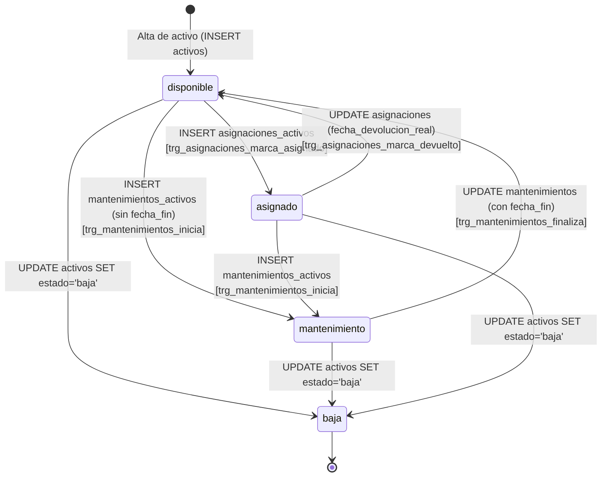

# Módulo de Logística y Activos Fijos — Warengine

> **Propósito y estado:** **SOLO ESQUEMA** (Estructura definida en base de datos; sin código fuente implementado)  
> **Stack:** MySQL 8 (Triggers y Constraints en SQL)  
> **Arquitectura:** Clean Architecture (Estructura de carpetas reservada, pendiente de desarrollo)

---

## Índice

1. [Propósito y estado](#1-propósito-y-estado)
2. [Cobertura del SRS](#2-cobertura-del-srs)
3. [Mapa de archivos](#3-mapa-de-archivos)
4. [Dominio](#4-dominio)
5. [Casos de uso](#5-casos-de-uso)
6. [Persistencia](#6-persistencia)
7. [API REST](#7-api-rest)
8. [Contratos (Shared)](#8-contratos-shared)
9. [Permisos y roles](#9-permisos-y-roles)
10. [Pruebas](#10-pruebas)
11. [Flujos clave](#11-flujos-clave)
12. [Pendientes y deuda técnica](#12-pendientes-y-deuda-técnica)
13. [Cómo probar manualmente](#13-cómo-probar-manualmente)

---

## 1. Propósito y Estado

El módulo de **Logística** tiene como alcance proyectado el inventario de activos fijos internos (maquinaria, computadores, vehículos, mobiliario), el control de custodia y asignación a empleados o áreas, la trazabilidad de devoluciones y la programación de mantenimientos preventivos y correctivos.

**Estado actual:** **SOLO ESQUEMA**  
No existe código fuente implementado en TypeScript ni en el backend ni en el frontend. Las carpetas del módulo son esqueletos con archivos `.gitkeep`. Sin embargo, el modelo relacional, las restricciones de integridad y las máquinas de estados de los activos están **completamente gobernadas y forzadas a nivel de base de datos** mediante triggers y CHECKs en el script de referencia [Docs/database/WARENGINE_FULL_BD.sql](../../Docs/database/WARENGINE_FULL_BD.sql).

---

## 2. Cobertura del SRS

| Requisito | Descripción corta | Estado | Dónde está en el código |
|---|---|---|---|
| **RF-LOG-A1** | Registro y catálogo maestro de activos fijos | SOLO ESQUEMA | Tabla `activos` en SQL; sin código en Backend. |
| **RF-LOG-A2** | Asignación de activos a empleado o área (responsable único) | SOLO ESQUEMA | Tabla `asignaciones_activos` y triggers en SQL; sin código en Backend. |
| **RF-LOG-A3** | Devolución de activos y retorno a disponibilidad | SOLO ESQUEMA | Triggers `trg_asignaciones_autoset_devuelta` y `trg_asignaciones_marca_devuelto` en SQL; sin código en Backend. |
| **RF-LOG-A4** | Registro de mantenimientos y cambio temporal de estado | SOLO ESQUEMA | Tabla `mantenimientos_activos` y triggers en SQL; sin código en Backend. |
| **RF-LOG-A5** | Baja de activos y retiro de servicio | SOLO ESQUEMA | Estado `'baja'` en CHECK de BD; sin código en Backend. |

---

## 3. Mapa de Archivos

El estado real en el working tree refleja únicamente los marcadores de posición de la estructura de Clean Architecture:

```
Backend/
├── packages/
│   ├── core/src/modules/logistica/
│   │   ├── application/
│   │   │   ├── ports/.gitkeep
│   │   │   └── use-cases/.gitkeep
│   │   └── domain/.gitkeep
│   └── database/src/
│       └── repositories/logistica/.gitkeep
├── apps/
│   └── mcp-server/src/tools/logistica/.gitkeep
Shared/contracts/src/
├── permissions.ts               # Define PERMISSIONS.LOGISTICA_*
├── tool-names.ts                # Define TOOL_NAMES.CONSULTA_ACTIVO
└── logistica/.gitkeep
Frontend/src/features/logistica/
├── api/.gitkeep
├── components/.gitkeep
└── hooks/.gitkeep
Docs/database/
└── WARENGINE_FULL_BD.sql        # Tablas activos, asignaciones_activos, mantenimientos_activos
```

*Hallazgo técnico:* A diferencia de los otros módulos, en `Backend/packages/database/src/schema/` no existe todavía un archivo `logistica.schema.ts` en Drizzle ORM; las tablas solo están presentes en el script SQL maestro.

---

## 4. Dominio

*No aplica:* No existen entidades, objetos de valor, interfaces de repositorio ni clases de error implementadas en `packages/core/src/modules/logistica/`.

---

## 5. Casos de Uso

*No aplica:* No existen casos de uso implementados en el código actual.

---

## 6. Persistencia (Reglas Vivas de la Base de Datos)

Aunque el backend no tiene adaptadores de persistencia para logística, el script [Docs/database/WARENGINE_FULL_BD.sql](../../Docs/database/WARENGINE_FULL_BD.sql) impone 7 triggers y 2 restricciones CHECK que gobernarán estrictamente cualquier implementación futura:

### 6.1 Tablas en SQL
- **`activos`**: `id_activo` (PK auto), `sucursal_id` (FK sucursales), `nombre` (varchar 150), `descripcion`, `codigo_interno` (varchar 50 unique), `numero_serie` (varchar 100), `categoria` (varchar 50), `estado` (`'disponible'`, `'asignado'`, `'mantenimiento'`, `'baja'`), `fecha_adquisicion`, `valor_adquisicion`, `creado_en`.
- **`asignaciones_activos`**: `id_asignacion` (PK auto), `activo_id` (FK activos), `empleado_id` (FK empleados nullable), `area_id` (FK areas nullable), `asignado_por` (FK usuarios), `fecha_asignacion`, `fecha_devolucion_esperada`, `fecha_devolucion_real`, `estado` (`'activa'`, `'devuelta'`, `'vencida'`), `observaciones`.
- **`mantenimientos_activos`**: `id_mantenimiento` (PK auto), `activo_id` (FK activos), `registrado_por` (FK usuarios), `tipo` (`'preventivo'`, `'correctivo'`), `descripcion`, `costo`, `fecha_inicio`, `fecha_fin`, `proveedor`.

### 6.2 Triggers de Asignación y Devolución (5)
1. **`trg_asignaciones_check_disponibilidad` (BEFORE INSERT)**:
   - Valida que se asigne a **exactamente un responsable**: (`empleado_id IS NOT NULL AND area_id IS NULL`) O (`empleado_id IS NULL AND area_id IS NOT NULL`). Si ambos están presentes o ambos son nulos, lanza `SIGNAL SQLSTATE '45000'`.
   - Verifica que el activo esté en `estado = 'disponible'`. Si está en otro estado, bloquea la asignación.
2. **`trg_asignaciones_check_responsable_update` (BEFORE UPDATE)**:
   - Aplica la misma regla del responsable único al actualizar una asignación.
3. **`trg_asignaciones_marca_asignado` (AFTER INSERT)**:
   - Si la asignación se inserta con `estado = 'activa'`, actualiza automáticamente `activos.estado = 'asignado'`. **El caso de uso no debe cambiar el estado del activo a mano.**
4. **`trg_asignaciones_autoset_devuelta` (BEFORE UPDATE)**:
   - Si se registra `fecha_devolucion_real IS NOT NULL` y el estado no se cambió explícitamente, modifica automáticamente `NEW.estado = 'devuelta'`.
5. **`trg_asignaciones_marca_devuelto` (AFTER UPDATE)**:
   - Al marcarse como `'devuelta'`, el trigger actualiza automáticamente `activos.estado = 'disponible'` **solo si el activo seguía en estado `'asignado'`** (evita pisar estados de baja o mantenimiento).

### 6.3 Triggers de Mantenimiento (2)
1. **`trg_mantenimientos_inicia` (AFTER INSERT)**:
   - Al registrar un mantenimiento sin `fecha_fin`, actualiza automáticamente `activos.estado = 'mantenimiento'`, a menos que el activo ya estuviese en `'baja'`.
2. **`trg_mantenimientos_finaliza` (AFTER UPDATE)**:
   - Al registrar la `fecha_fin`, si el activo seguía en `'mantenimiento'`, vuelve automáticamente a `activos.estado = 'disponible'`.

### 6.4 Restricciones CHECK
- **`chk_activos_estado`**: `estado IN ('disponible', 'asignado', 'mantenimiento', 'baja')`.
- **`chk_asignaciones_estado`**: `estado IN ('activa', 'devuelta', 'vencida')`.

---

## 7. API REST

*No aplica:* No existen endpoints registrados en `Backend/apps/api/src/routes/` ni en `main.ts` para logística.

---

## 8. Contratos (Shared)

En [Shared/contracts/src/permissions.ts](../../Shared/contracts/src/permissions.ts) se encuentran declaradas las constantes de permisos:
- `LOGISTICA_LEER = 'logistica:leer'`
- `LOGISTICA_GESTIONAR_ACTIVOS = 'logistica:gestionar-activos'`
- `LOGISTICA_ASIGNAR_ACTIVOS = 'logistica:asignar-activos'`
- `LOGISTICA_MANTENIMIENTO = 'logistica:mantenimiento'`

En [Shared/contracts/src/tool-names.ts](../../Shared/contracts/src/tool-names.ts) se define la herramienta conversacional:
- `TOOL_NAMES.CONSULTA_ACTIVO = 'consulta-activo'`

*Hallazgo:* La carpeta [Shared/contracts/src/logistica/](../../Shared/contracts/src/logistica/) solo contiene `.gitkeep`, sin esquemas Zod creados.

---

## 9. Permisos y Roles

Asignación predefinida en el seed institucional ([autenticacion.seed.ts](../../Backend/packages/database/src/seeds/autenticacion.seed.ts)):
- `super-admin`: Posee los 4 permisos de logística.
- `admin-sucursal`: Posee los 4 permisos de logística para operar los activos de su sede.
- `cajero-vendedor`: Posee únicamente `logistica:leer` (consulta básica).

---

## 10. Pruebas

*No aplica:* No existen pruebas unitarias en `packages/core/tests/` relacionadas con logística.

---

## 11. Flujos Clave

### Máquina de Estados del Activo Fijo (Gobernada por Triggers MySQL)



---

## 12. Pendientes y Deuda Técnica

1. **Esquema Drizzle ORM (`logistica.schema.ts`):** Falta mapear las tablas `activos`, `asignaciones_activos` y `mantenimientos_activos` a Drizzle ORM en `packages/database/src/schema/`.
2. **Dominio y Entidades:** Creación de entidades `Activo`, `AsignacionActivo`, `Mantenimiento` en `packages/core/src/modules/logistica/domain/`.
3. **Casos de Uso Principales:**
   - `RegistrarActivoUseCase` (RF-LOG-A1)
   - `AsignarActivoUseCase` (RF-LOG-A2)
   - `DevolverActivoUseCase` (RF-LOG-A3)
   - `RegistrarMantenimientoUseCase` (RF-LOG-A4)
   - `DarDeBajaActivoUseCase` (RF-LOG-A5)
4. **Controladores y Rutas API:** Creación de `logistica.routes.ts` y controladores HTTP.
5. **Esquemas Zod en Contratos:** Creación de DTOs en `Shared/contracts/src/logistica/`.

---

## 13. Cómo Probar Manualmente

*No aplica:* No hay endpoints HTTP habilitados en `Http/`. Las pruebas actuales solo pueden realizarse mediante sentencias SQL directas contra MySQL ejecutando el script maestro de base de datos.
