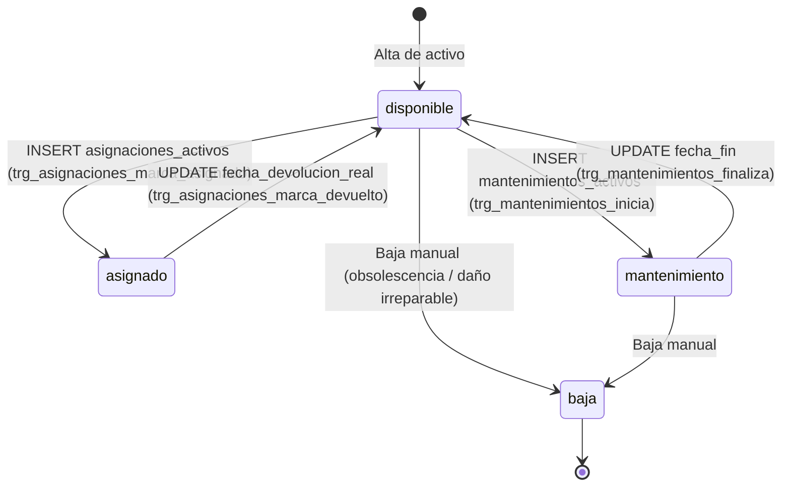

# Módulo de Logística y Activos Fijos — Warengine

> **Estado del módulo:** SOLO ESQUEMA  
> **Stack técnico:** MySQL 8 (Triggers y Constraints en SQL)  
> **Arquitectura:** Ciclo de vida gobernado por el motor de Base de Datos  

---

## Índice

1. [Propósito y Estado](#1-propósito-y-estado)
2. [Cobertura del SRS](#2-cobertura-del-srs)
3. [Mapa de Archivos](#3-mapa-de-archivos)
4. [Dominio](#4-dominio)
5. [Casos de Uso](#5-casos-de-uso)
6. [Persistencia y Reglas de Base de Datos](#6-persistencia-y-reglas-de-base-de-datos)
7. [API REST](#7-api-rest)
8. [Contratos (SHARED)](#8-contratos-shared)
9. [Permisos y Roles](#9-permisos-y-roles)
10. [Pruebas](#10-pruebas)
11. [Flujos Clave](#11-flujos-clave)
12. [Pendientes y Deuda Técnica](#12-pendientes-y-deuda-técnica)
13. [Cómo Probar Manualmente](#13-cómo-probar-manualmente)

---

## 1. Propósito y Estado

**Estado:** `SOLO ESQUEMA`

El módulo de Logística está diseñado para el control de inventario interno y activos fijos empresariales (maquinaria, computadores, vehículos, herramientas).
- **Estado real en el código:** No cuenta con implementación de código fuente TypeScript. Las carpetas en `@warengine/core`, `@warengine/database` y `apps/api` contienen únicamente archivos `.gitkeep`.
- **Estado real en la base de datos:** El esquema relacional completo, las restricciones de verificación (CHECK) y **6 triggers activos** ya están definidos y operativos en el script SQL de referencia ([`Docs/database/WARENGINE_FULL_BD.sql`](../../Docs/database/WARENGINE_FULL_BD.sql)). La base de datos ya gobierna de forma estricta las transiciones de estado de los activos.

---

## 2. Cobertura del SRS

Todos los requerimientos funcionales del módulo se encuentran actualmente **PENDIENTES** de implementación en la capa de aplicación:

| Requerimiento (RF / RNF) | Descripción Corta | Estado | Dónde está en el código |
|---|---|---|---|
| **RF-LOG-01** | Registro y catálogo de activos fijos con código de barras y estado | PENDIENTE (Solo BD) | Tabla `activos` en `WARENGINE_FULL_BD.sql` |
| **RF-LOG-02** | Asignación de activos a empleados o áreas operativas | PENDIENTE (Solo BD) | Tabla `asignaciones_activos` y triggers de asignación en SQL |
| **RF-LOG-03** | Devolución de activos y retorno a disponibilidad | PENDIENTE (Solo BD) | Triggers `trg_asignaciones_autoset_devuelta` y `trg_asignaciones_marca_devuelto` |
| **RF-LOG-04** | Registro de mantenimientos preventivos y correctivos | PENDIENTE (Solo BD) | Tabla `mantenimientos_activos` y triggers de mantenimiento |
| **RF-LOG-05** | Baja definitiva de activos obsoletos o averiados | PENDIENTE (Solo BD) | Estado `baja` protegido por CHECK en BD |

---

## 3. Mapa de Archivos

Estructura real en el working tree (carpetas preparadas para desarrollo futuro):

```
Backend/
├── packages/
│   ├── core/src/modules/logistica/
│   │   ├── domain/.gitkeep
│   │   ├── application/ports/.gitkeep
│   │   └── application/use-cases/.gitkeep
│   └── database/src/
│       ├── schema/                  (logistica.schema.ts NO existe aún en Drizzle)
│       └── repositories/logistica/.gitkeep
Shared/
└── contracts/src/
    ├── permissions.ts               (constantes de permisos declaradas)
    ├── tool-names.ts                (nombre de tool 'consulta-activo' declarado)
    └── logistica/.gitkeep
Docs/
└── database/
    └── WARENGINE_FULL_BD.sql        (única fuente de verdad funcional actual)
```

---

## 4. Dominio

*No aplica:* No existen entidades, value objects, interfaces de repositorio ni clases de error implementadas en `packages/core/src/modules/logistica/`.

---

## 5. Casos de Uso

*No aplica:* No existen casos de uso implementados en código en la capa de aplicación.

---

## 6. Persistencia y Reglas de Base de Datos

Toda la lógica vigente reside en el motor de base de datos MySQL 8.0 ([`Docs/database/WARENGINE_FULL_BD.sql`](../../Docs/database/WARENGINE_FULL_BD.sql)):

### 6.1 Tablas Definidas en SQL
1. `areas`: Subdivisión física dentro de una sucursal (`id_area`, `nombre`, `sucursal_id`).
2. `activos`: Bienes de la empresa (`id_activo`, `codigo_activo` BINARY, `nombre`, `categoria`, `estado`, `sucursal_id`, `valor_adquisicion`, `fecha_adquisicion`).
3. `asignaciones_activos`: Trazabilidad de custodia (`id_asignacion`, `activo_id`, `empleado_id`, `area_id`, `fecha_asignacion`, `fecha_devolucion_esperada`, `fecha_devolucion_real`, `estado`).
4. `mantenimientos_activos`: Bitácora de mantenimiento técnico (`id_mantenimiento`, `activo_id`, `tipo`, `fecha_inicio`, `fecha_fin`, `costo`, `proveedor_id`, `estado`).

### 6.2 Restricciones CHECK
- `chk_activos_estado`: `estado IN ('disponible', 'asignado', 'mantenimiento', 'baja')`.
- `chk_asignaciones_estado`: `estado IN ('activa', 'devuelta', 'vencida')`.

### 6.3 Triggers Activos del Ciclo de Vida del Activo
La base de datos actualiza automáticamente `activos.estado` ante eventos en asignaciones o mantenimientos. Cuando se escriban los casos de uso, **está prohibido actualizar `activos.estado` manualmente en estos flujos**:

1. `trg_asignaciones_check_disponibilidad` (BEFORE INSERT en `asignaciones_activos`):
   - Exige exactamente un responsable: `(empleado_id IS NOT NULL AND area_id IS NULL) OR (empleado_id IS NULL AND area_id IS NOT NULL)`.
   - Exige que el activo esté en estado `disponible`.
2. `trg_asignaciones_check_responsable_update` (BEFORE UPDATE en `asignaciones_activos`):
   - Mantiene la regla del responsable único ante ediciones.
3. `trg_asignaciones_marca_asignado` (AFTER INSERT en `asignaciones_activos`):
   - Al registrar la asignación, **actualiza automáticamente** `activos.estado = 'asignado'`.
4. `trg_asignaciones_autoset_devuelta` (BEFORE UPDATE en `asignaciones_activos`):
   - Al diligenciar `fecha_devolucion_real`, pasa el estado de la asignación a `'devuelta'`.
5. `trg_asignaciones_marca_devuelto` (AFTER UPDATE en `asignaciones_activos`):
   - Al devolver la asignación, **vuelve el activo a `'disponible'` solo si su estado seguía siendo `'asignado'`** (si pasó a mantenimiento o baja, se respeta).
6. `trg_mantenimientos_inicia` (AFTER INSERT en `mantenimientos_activos`):
   - Si se inserta sin `fecha_fin`, **pasa el activo a `'mantenimiento'`** (no sobreescribe el estado si estaba en `'baja'`).
7. `trg_mantenimientos_finaliza` (AFTER UPDATE en `mantenimientos_activos`):
   - Al registrar `fecha_fin`, devuelve el activo a `'disponible'` siempre que continuara en `'mantenimiento'`.

---

## 7. API REST

*No aplica:* No existen controladores ni rutas registradas para logística en `apps/api/src/routes/`.

---

## 8. Contratos (SHARED)

- En [`permissions.ts`](../../Shared/contracts/src/permissions.ts) se encuentran reservados:
  - `PERMISSIONS.LOGISTICA_LEER = 'logistica:leer'`
  - `PERMISSIONS.LOGISTICA_GESTIONAR_ACTIVOS = 'logistica:gestionar-activos'`
  - `PERMISSIONS.LOGISTICA_ASIGNAR_ACTIVOS = 'logistica:asignar-activos'`
  - `PERMISSIONS.LOGISTICA_MANTENIMIENTO = 'logistica:mantenimiento'`
- En [`tool-names.ts`](../../Shared/contracts/src/tool-names.ts) se encuentra reservado el nombre de tool MCP:
  - `TOOL_NAMES.CONSULTA_ACTIVO = 'consulta-activo'`
- La carpeta `Shared/contracts/src/logistica/` contiene únicamente un archivo `.gitkeep` (sin esquemas Zod aún).

---

## 9. Permisos y Roles

Según el seed de base de datos ([`autenticacion.seed.ts`](../../Backend/packages/database/src/seeds/autenticacion.seed.ts)):
- `super-admin`: Posee los 4 permisos de logística.
- `admin-sucursal`: Posee los 4 permisos de logística (`leer`, `gestionar-activos`, `asignar-activos`, `mantenimiento`).
- `cajero-vendedor`: Solo posee `logistica:leer`.

---

## 10. Pruebas

*No aplica:* No existen pruebas unitarias en `Backend/packages/core/tests/` relacionadas con logística.

---

## 11. Flujos Clave

### Ciclo de Estados del Activo Fijo (Gobernado por MySQL)


---

## 12. Pendientes y Deuda Técnica

1. **Esquema Drizzle:** Crear `Backend/packages/database/src/schema/logistica.schema.ts` para mapear `activos`, `areas`, `asignaciones_activos` y `mantenimientos_activos`.
2. **Casos de Uso de Dominio:** Desarrollar `RegistrarActivoUseCase`, `AsignarActivoUseCase`, `DevolverActivoUseCase`, `RegistrarMantenimientoUseCase` y `DarDeBajaActivoUseCase`.
3. **Bordes abiertos de Base de Datos (Sección 6.9 del Contexto):**
   - *Conflicto Asignación / Mantenimiento:* Registrar un mantenimiento sobre un activo `asignado` lo pasa a `mantenimiento` sin cerrar la asignación previa, que permanece `activa`. Al concluir el mantenimiento el trigger lo libera a `disponible`, pudiendo asignarse a un segundo custodio.
   - *Mantenimientos concurrentes:* Si un activo tiene dos mantenimientos abiertos simultáneos, cerrar uno de ellos devuelve el activo a `disponible` aunque el otro siga en curso.

---

## 13. Cómo Probar Manualmente

*No aplica:* No existen endpoints HTTP activos ni archivos `.http` para este módulo. Las pruebas de base de datos se ejecutan directamente ejecutando sentencias SQL en el contenedor Docker contra `WARENGINE_FULL_BD.sql`.
