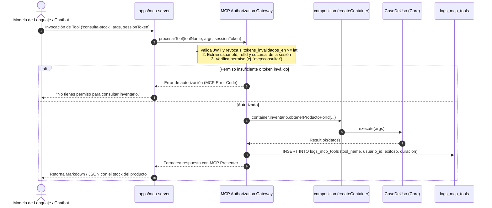

# Servidor MCP y Asistente IA — Warengine

> **Propósito y estado:** **ESQUELETO / PENDIENTE** (Estructura arquitectónica y catálogo de herramientas definidos; servidor en esqueleto)  
> **Stack:** Deno · Model Context Protocol (MCP) · TypeScript  
> **Arquitectura:** Clean Architecture + Gateway de Autorización + ADR 0001 (Regla 6)

---

## Índice

1. [Propósito y estado](#1-propósito-y-estado)
2. [Cobertura del SRS](#2-cobertura-del-srs)
3. [Mapa de archivos](#3-mapa-de-archivos)
4. [Dominio](#4-dominio)
5. [Casos de uso](#5-casos-de-uso)
6. [Persistencia](#6-persistencia)
7. [API y Protocolo MCP](#7-api-y-protocolo-mcp)
8. [Contratos (Shared)](#8-contratos-shared)
9. [Permisos y roles](#9-permisos-y-roles)
10. [Pruebas](#10-pruebas)
11. [Flujos clave](#11-flujos-clave)
12. [Pendientes y deuda técnica](#12-pendientes-y-deuda-técnica)
13. [Cómo probar manualmente](#13-cómo-probar-manualmente)

---

## 1. Propósito y Estado

El servidor **MCP (Model Context Protocol)** de Warengine está concebido como el punto de integración estandarizado entre modelos de inteligencia artificial (asistente conversacional / chatbot) y la plataforma operativa. Su responsabilidad consiste en exponer herramientas especializadas (**Tools**) que permiten consultar el inventario, verificar el estado de comprobantes de pago, evaluar ventas por período y generar reportes analíticos consolidados.

Siguiendo la **Regla 6 del ADR 0001**, las Tools del servidor MCP **no contienen lógica de negocio ni de autorización propia**: delegan siempre a un Gateway de Autorización que comprueba la identidad y los permisos del usuario autenticado, invocando directamente los mismos casos de uso de `@warengine/core` que consume la API REST.

**Estado actual:** **ESQUELETO / PENDIENTE**  
El catálogo de nombres de herramientas y los permisos RBAC correspondientes están tipados en `Shared/contracts`. Sin embargo, la aplicación `Backend/apps/mcp-server/src/main.ts` es un esqueleto pendiente de integración con el SDK oficial de MCP. Las carpetas internas de Tools y el submódulo de auditoría `mcp-audit` en `core` contienen archivos `.gitkeep`.

---

## 2. Cobertura del SRS

| Requisito | Descripción corta | Estado | Dónde está en el código |
|---|---|---|---|
| **RF-SA-i1** | Interfaz de asistente conversacional para consultas operativas | PENDIENTE | Frontend `features/asistente` con `.gitkeep`. |
| **RF-SA-i2** | Servidor basado en el estándar Model Context Protocol (MCP) | PENDIENTE | [Backend/apps/mcp-server/src/main.ts](../../Backend/apps/mcp-server/src/main.ts) (esqueleto con TODO). |
| **RF-SA-i3** | Catálogo formal de Tools disponibles por módulo | PARCIAL | Nombres de herramientas definidos en [Shared/contracts/src/tool-names.ts](../../Shared/contracts/src/tool-names.ts). |
| **RF-SA-i4** | Gateway de autorización centralizado antes de invocar casos de uso | PENDIENTE | Carpeta `Backend/apps/mcp-server/src/gateway/` reservada con `.gitkeep`. |
| **RF-SA-i5** | Inmutabilidad de roles (contexto tomado estrictamente del JWT) | PENDIENTE | Carpeta `Backend/apps/mcp-server/src/session/` reservada con `.gitkeep`. |
| **RF-SA-i6** | Tools de consulta de inventario (`consulta-stock`, `stock-bajo`) | PENDIENTE | Nombre en catálogo; implementación de Tool pendiente. |
| **RF-SA-i7** | Tools de facturación (`ventas-periodo`, `estado-factura`) | PENDIENTE | Nombre en catálogo; implementación de Tool pendiente. |
| **RF-SA-i8** | Tool financiera analítica (`metricas-globales`, solo SuperAdmin) | PENDIENTE | Nombre en catálogo; implementación de Tool pendiente. |
| **RF-SA-i9** | Registro forense de ejecución de Tools en `logs_mcp_tools` | PENDIENTE | Tabla en base de datos (`auditoria.schema.ts`); lógica de emisión en `mcp-audit` pendiente. |
| **RF-SA-i10** | Modo seguro: limitación a herramientas de solo lectura | PENDIENTE | Regla de diseño definida; pendiente de codificar. |
| **RF-SA-i11** | Invalidación inmediata de la sesión del chatbot ante logout | PENDIENTE | Depende de la validación de `tokens_invalidados_en` en el gateway MCP. |
| **RF-SA-i12** | Presenters para serializar resultados a formato Markdown / JSON de MCP | PENDIENTE | Carpeta `Backend/apps/mcp-server/src/presenters/` reservada con `.gitkeep`. |

---

## 3. Mapa de Archivos

```
Backend/
├── apps/mcp-server/
│   ├── README.md
│   ├── deno.json
│   └── src/
│       ├── main.ts                      # Archivo de entrada actual (esqueleto)
│       ├── catalog/.gitkeep             # Registro de Tools y sus JSON schemas
│       ├── gateway/.gitkeep             # Control de acceso y llamada a use-cases
│       ├── presenters/.gitkeep          # Formateo de Result a respuestas MCP
│       ├── session/.gitkeep             # Extracción de usuario/rol desde JWT
│       └── tools/
│           ├── administracion/.gitkeep  # metricas-globales
│           ├── facturacion/.gitkeep     # ventas-periodo, estado-factura
│           ├── inventario/.gitkeep      # consulta-stock, stock-bajo
│           └── logistica/.gitkeep       # consulta-activo
├── packages/
│   ├── core/src/modules/mcp-audit/
│   │   ├── application/
│   │   │   ├── ports/.gitkeep
│   │   │   └── use-cases/.gitkeep
│   │   └── domain/.gitkeep
│   └── database/src/
│       ├── repositories/mcp-audit/.gitkeep
│       └── schema/auditoria.schema.ts   # Define tabla logs_mcp_tools
Shared/contracts/src/
├── permissions.ts                       # Define PERMISSIONS.MCP_*
└── tool-names.ts                        # Catálogo de nombres TOOL_NAMES
Frontend/src/features/asistente/
├── api/.gitkeep
├── components/.gitkeep
└── hooks/.gitkeep
```

---

## 4. Dominio

*Estado actual:* El módulo `core/src/modules/mcp-audit/` solo contiene carpetas con marcadores `.gitkeep`. En su versión definitiva, contendrá la entidad `LogMcpTool` y el puerto `ILogMcpToolRepository`.

---

## 5. Casos de Uso

*Estado actual:* No existen casos de uso codificados en `packages/core/src/modules/mcp-audit/`.  
Las Tools del MCP no crearán casos de uso duplicados: consumirán los casos de uso ya existentes en `@warengine/core` (`ListarProductosUseCase`, `BuscarClientesUseCase`, etc.).

---

## 6. Persistencia

### 6.1 Tabla `logs_mcp_tools` ([auditoria.schema.ts](../../Backend/packages/database/src/schema/auditoria.schema.ts))
La tabla ya se encuentra definida en el esquema Drizzle y en MySQL:
- `id`: bigint autoincremental PK
- `tool_name`: varchar 100 con el nombre exacto de la herramienta invocada
- `usuario_id`: char 36 (FK usuarios) del usuario que interactúa con el chatbot
- `sucursal_id`: int (FK sucursales nullable) sede donde se contextualiza la consulta
- `parametros`: json con los argumentos enviados por el modelo de lenguaje
- `exitoso`: boolean (true si el caso de uso retornó `Result.ok()`)
- `duracion_ms`: int con la latencia total de ejecución
- `error`: text nullable con el código o mensaje si ocurrió una falla
- `fecha`: timestamp def CURRENT_TIMESTAMP

---

## 7. API y Protocolo MCP

El archivo de entrada [Backend/apps/mcp-server/src/main.ts](../../Backend/apps/mcp-server/src/main.ts) cuenta actualmente con la siguiente definición estructural:
```typescript
/**
 * main.ts — Punto de entrada del servidor MCP de Warengine.
 *
 * Responsabilidades de este archivo:
 *  1. Leer la configuración del entorno.
 *  2. Crear el contenedor de dependencias (composition root).
 *  3. Registrar el catálogo de Tools y el gateway de autorización.
 *  4. Arrancar el servidor MCP en el puerto configurado.
 *
 * PROHIBIDO en este archivo:
 *  - Lógica de negocio o de autorización.
 *  - Importaciones directas de Drizzle, repositorios o entidades de dominio.
 *  - Validación de permisos (eso lo hace el gateway, no el main).
 */

// TODO: implementar cuando se integre el SDK del protocolo MCP.
```

El script de ejecución está registrado en `Backend/deno.json` como:
```bash
deno task dev-mcp
```

---

## 8. Contratos (Shared)

En [Shared/contracts/src/tool-names.ts](../../Shared/contracts/src/tool-names.ts) se encuentra tipado el catálogo central de herramientas:
```typescript
export const TOOL_NAMES = {
  // Inventario
  CONSULTA_STOCK: 'consulta-stock',
  STOCK_BAJO: 'stock-bajo',

  // Facturación
  VENTAS_PERIODO: 'ventas-periodo',
  ESTADO_FACTURA: 'estado-factura',

  // Administración (solo super-admin)
  METRICAS_GLOBALES: 'metricas-globales',

  // Logística
  CONSULTA_ACTIVO: 'consulta-activo',
} as const;

export type ToolName = (typeof TOOL_NAMES)[keyof typeof TOOL_NAMES];
```

En [Shared/contracts/src/permissions.ts](../../Shared/contracts/src/permissions.ts) se encuentran los permisos de acceso al MCP:
- `MCP_CONSULTAR = 'mcp:consultar'`
- `MCP_EJECUTAR_HERRAMIENTAS = 'mcp:ejecutar-herramientas'`
- `MCP_HERRAMIENTAS_FINANCIERAS = 'mcp:herramientas-financieras'`

---

## 9. Permisos y Roles

Asignación según el seed institucional ([autenticacion.seed.ts](../../Backend/packages/database/src/seeds/autenticacion.seed.ts)):
- `cajero-vendedor`: Posee `mcp:consultar`. Puede ejecutar consultas operativas de inventario y estado de facturas en modo lectura.
- `admin-sucursal`: Posee `mcp:consultar` y `mcp:ejecutar-herramientas`. Puede consultar stock de su sede y ventas de su período.
- `super-admin`: Posee los 3 permisos, incluyendo de forma exclusiva `mcp:herramientas-financieras` para ejecutar `metricas-globales`.

---

## 10. Pruebas

*No aplica:* No existen pruebas automatizadas para el servidor MCP en el estado actual.

---

## 11. Flujos Clave

### Arquitectura Proyectada del Gateway MCP (Regla 6 de ADR 0001)



---

## 12. Pendientes y Deuda Técnica

1. **Integración con SDK de MCP:** Añadir la dependencia del SDK oficial de Model Context Protocol para Deno / TypeScript (e.g. `@modelcontextprotocol/sdk`).
2. **Implementación del Gateway (`apps/mcp-server/src/gateway/`):** Desarrollar el interceptor de llamadas que extraiga el contexto del usuario del token de sesión y verifique permisos con `ValidarPermisoUseCase`.
3. **Implementación de Tools:**
   - Inventario: `consulta-stock` y `stock-bajo`.
   - Facturación: `ventas-periodo` y `estado-factura`.
   - Administración: `metricas-globales`.
   - Logística: `consulta-activo`.
4. **Presenters MCP (`apps/mcp-server/src/presenters/`):** Mapeo de `Result<T, DomainError>` a bloques de contenido compatibles con MCP (`text` o `embeddedResource`).
5. **Repositorio `drizzle-log-mcp-tool.repository.ts`:** Persistir la telemetría en `logs_mcp_tools`.
6. **Interfaz de Chat en Frontend:** Desarrollar los componentes visuales en `Frontend/src/features/asistente/`.

---

## 13. Cómo Probar Manualmente

Actualmente el comando `deno task dev-mcp` (ejecutado desde la carpeta `Backend/`) invoca el archivo `apps/mcp-server/src/main.ts`, el cual finaliza sin abrir sockets o transportes Stdio/SSE debido al `// TODO` pendiente. Las pruebas funcionales se habilitarán una vez integrado el transporte MCP.
