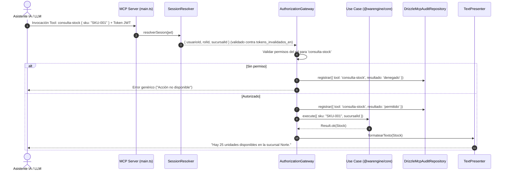

# Módulo de Servidor MCP y Asistente IA — Warengine

> **Estado del módulo:** ESQUELETO (Arquitectura y Catálogo definidos, Lógica pendiente)  
> **Stack técnico:** Deno · Protocolo Model Context Protocol (MCP) · JSON-RPC · TypeScript  
> **Arquitectura:** Gateway de Autorización Centralizado + Reutilización de Casos de Uso del Core  

---

## Índice

1. [Propósito y Estado](#1-propósito-y-estado)
2. [Cobertura del SRS](#2-cobertura-del-srs)
3. [Mapa de Archivos](#3-mapa-de-archivos)
4. [Dominio](#4-dominio)
5. [Casos de Uso](#5-casos-de-uso)
6. [Persistencia y Reglas de Base de Datos](#6-persistencia-y-reglas-de-base-de-datos)
7. [API REST](#7-api-rest)
8. [Contratos (SHARED)](#8-contratos-shared)
9. [Permisos y Roles](#9-permisos-y-roles)
10. [Pruebas](#10-pruebas)
11. [Flujos Clave](#11-flujos-clave)
12. [Pendientes y Deuda Técnica](#12-pendientes-y-deuda-técnica)
13. [Cómo Probar Manualmente](#13-cómo-probar-manualmente)

---

## 1. Propósito y Estado

**Estado:** `ESQUELETO`

El servidor MCP (`apps/mcp-server`) es la segunda puerta de entrada al sistema Warengine. Su objetivo es habilitar interacción en lenguaje natural para un agente de Inteligencia Artificial (LLM), exponiendo capacidades operativas y de consulta como **Tools** seguras.
- **Estado real en el código:** Existe la estructura completa de carpetas, el catálogo oficial de nombres de tools en `@warengine/contracts`, la reserva de permisos en el seed y el punto de entrada [`apps/mcp-server/src/main.ts`](../../Backend/apps/mcp-server/src/main.ts) con un stub inicial (`// TODO: implementar cuando se integre el SDK del protocolo MCP`).
- **Arquitectura prevista (ADR 0001):** Cada Tool MCP no contiene lógica de negocio ni autorización propia; delega estrictamente en un `Gateway` que valida la sesión, comprueba los permisos RBAC, audita la invocación y ejecuta el mismo caso de uso de `@warengine/core` que utiliza la API REST.

---

## 2. Cobertura del SRS

Todos los requerimientos funcionales del asistente IA están actualmente **PENDIENTES** de implementación:

| Requerimiento (RF / RNF) | Descripción Corta | Estado | Dónde está en el código |
|---|---|---|---|
| **RF-SA-i1** | Servidor MCP compatible con especificación Anthropic/Model Context Protocol | PENDIENTE | Estructura en `Backend/apps/mcp-server` |
| **RF-SA-i2** | Autenticación de sesión en MCP reutilizando el mismo JWT del login | PENDIENTE | Carpeta `src/session/` preparada |
| **RF-SA-i3** | Comprobación de `tokens_invalidados_en` en la sesión del LLM | PENDIENTE | Regla de seguridad 7.3 de contexto |
| **RF-SA-i4** | Gateway centralizado de autorización RBAC previo a ejecución de Tools | PENDIENTE | Carpeta `src/gateway/` preparada |
| **RF-SA-i5** | Filtrado del catálogo de Tools expuestas según el rol del usuario | PENDIENTE | Carpeta `src/catalog/` preparada |
| **RF-SA-i6** | Tools de consulta de stock y stock bajo para inventario | PENDIENTE | `TOOL_NAMES.CONSULTA_STOCK`, `TOOL_NAMES.STOCK_BAJO` en contratos |
| **RF-SA-i7** | Tools de resumen de ventas y estado de facturación | PENDIENTE | `TOOL_NAMES.VENTAS_PERIODO`, `TOOL_NAMES.ESTADO_FACTURA` en contratos |
| **RF-SA-i8** | Tools financieras analíticas exclusivas para Super Admin | PENDIENTE | `TOOL_NAMES.METRICAS_GLOBALES`, permiso `mcp:herramientas-financieras` |
| **RF-SA-i9** | Auditoría obligatoria de toda invocación de Tool en `logs_mcp_tools` | PENDIENTE | Tabla `logs_mcp_tools` en SQL; módulo `core/src/modules/mcp-audit` |
| **RF-SA-i10** | Respuestas denegadas genéricas sin exponer esquema interno ni tools ajenas | PENDIENTE | Especificado en ADR 0001 |
| **RF-SA-i11** | Cierre de sesión inmediato al expirar el Access Token | PENDIENTE | Especificado en regla 7.3 |
| **RF-SA-i12** | Extracción obligatoria de `sucursal_id` del token (no de parámetros del prompt) | PENDIENTE | Especificado en regla 7.2 |

---

## 3. Mapa de Archivos

```
Backend/
├── apps/mcp-server/
│   ├── deno.json
│   ├── README.md
│   └── src/
│       ├── main.ts                        (stub del servidor)
│       ├── catalog/.gitkeep               (registro de tools disponibles)
│       ├── gateway/.gitkeep               (autorización + validación Zod)
│       ├── session/.gitkeep               (resolución y validación de JWT)
│       ├── presenters/.gitkeep            (formateo de respuestas para el LLM)
│       └── tools/
│           ├── administracion/.gitkeep
│           ├── facturacion/.gitkeep
│           ├── inventario/.gitkeep
│           └── logistica/.gitkeep
├── packages/
│   └── core/src/modules/mcp-audit/
│       ├── application/
│       │   ├── ports/.gitkeep
│       │   └── use-cases/.gitkeep
│       └── domain/.gitkeep
Shared/
└── contracts/src/
    ├── tool-names.ts                      (constantes oficiales de Tools)
    └── permissions.ts                     (permisos mcp:consultar...)
Docs/
└── database/
    └── WARENGINE_FULL_BD.sql              (tabla logs_mcp_tools)
```

---

## 4. Dominio

*No aplica:* No existen entidades ni errores de dominio implementados en `core/src/modules/mcp-audit/`. La lógica de negocio será suministrada por los casos de uso ya existentes en los módulos de Inventario, Facturación, Logística y Administración.

---

## 5. Casos de Uso

*No aplica:* Pendiente de implementación el caso de uso `RegistrarInvocacionToolUseCase` dentro de `mcp-audit`.

---

## 6. Persistencia y Reglas de Base de Datos

### 6.1 Tabla `logs_mcp_tools`
Fuente: [`Docs/database/WARENGINE_FULL_BD.sql`](../../Docs/database/WARENGINE_FULL_BD.sql)

```sql
CREATE TABLE logs_mcp_tools (
    id_log_mcp      CHAR(36) NOT NULL DEFAULT (UUID()),
    usuario_id      CHAR(36) NULL,
    tool_name       VARCHAR(100) NOT NULL,
    parametros      JSON NULL,
    resultado       VARCHAR(20) NOT NULL,
    fecha           DATETIME NOT NULL DEFAULT CURRENT_TIMESTAMP,
    PRIMARY KEY (id_log_mcp),
    INDEX idx_logsmcp_usuario_id (usuario_id),
    INDEX idx_logsmcp_fecha (fecha),
    CONSTRAINT fk_logsmcp_usuario FOREIGN KEY (usuario_id) REFERENCES usuarios(id_usuario) ON DELETE SET NULL,
    CONSTRAINT chk_logsmcp_resultado CHECK (resultado IN ('permitido', 'denegado'))
) ENGINE=InnoDB;
```

### 6.2 Reglas e Integridad
- `chk_logsmcp_resultado`: El campo `resultado` solo admite `'permitido'` o `'denegado'`.
- `ON DELETE SET NULL`: Si se borra el usuario físico de la BD, el registro analítico de la invocación de IA se preserva intacto.

---

## 7. API REST

*No aplica:* El servidor MCP no expone una API REST tradicional. Opera utilizando el protocolo estándar MCP sobre transporte `stdio` (para CLI/asistentes locales) o Server-Sent Events (SSE) / HTTP JSON-RPC para clientes remotos.

---

## 8. Contratos (SHARED)

Archivo: [`tool-names.ts`](../../Shared/contracts/src/tool-names.ts)

```typescript
export const TOOL_NAMES = {
  // Inventario
  CONSULTA_STOCK: 'consulta-stock',
  STOCK_BAJO: 'stock-bajo',

  // Facturación
  VENTAS_PERIODO: 'ventas-periodo',
  ESTADO_FACTURA: 'estado-factura',

  // Administración (solo super-admin)
  METRICAS_GLOBALES: 'metricas-globales',

  // Logística
  CONSULTA_ACTIVO: 'consulta-activo',
} as const;

export type ToolName = (typeof TOOL_NAMES)[keyof typeof TOOL_NAMES];
```

---

## 9. Permisos y Roles

El seed de base de datos ([`autenticacion.seed.ts`](../../Backend/packages/database/src/seeds/autenticacion.seed.ts)) define tres niveles de acceso para el asistente:

| Permiso | Descripción | Roles con Acceso |
|---|---|---|
| `mcp:consultar` | Ejecutar tools de consulta conversacional (solo lectura) | `super-admin`, `admin-sucursal`, `cajero-vendedor` |
| `mcp:ejecutar-herramientas` | Ejecutar tools operativas automatizadas | `super-admin`, `admin-sucursal` |
| `mcp:herramientas-financieras` | Ejecutar tools analíticas globales y financieras | Exclusivo `super-admin` |

---

## 10. Pruebas

*No aplica:* No existen pruebas unitarias en `Backend/packages/core/tests/` para MCP.

---

## 11. Flujos Clave

### Arquitectura Prevista del Gateway MCP


---

## 12. Pendientes y Deuda Técnica

1. **Integración del SDK de MCP:** Añadir la dependencia oficial `@modelcontextprotocol/sdk` al `deno.json` de `apps/mcp-server` e inicializar el transporte.
2. **Implementación de `session/` y `gateway/`:** Programar la validación estricta de tokens y la capa interceptora de autorización previa a las tools.
3. **Omisión de Parámetros de Seguridad en el LLM (RF-SA-i12):** Garantizar que ninguna Tool reciba `sucursal_id` ni `rol` como argumento desde el LLM; deben ser inyectados imperativamente por el `gateway` desde la sesión verificada.
4. **Discrepancia en Tabla `logs_mcp_tools` (Sección 6.9 del Contexto):** La tabla en `WARENGINE_FULL_BD.sql` no posee columnas para registrar `rol` ni `sucursal_id`, a pesar de que el requerimiento RF-SA-i9 exige auditar el rol con el que se ejecutó la herramienta.

---

## 13. Cómo Probar Manualmente

*No aplica:* El servidor MCP no cuenta con ejecución activa actualmente.
