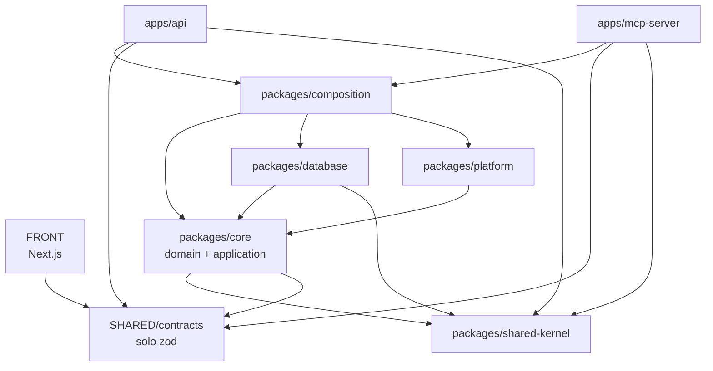

# Contexto del Proyecto Warengine

> **Para el equipo de desarrollo (aprendices ADSO del SENA) y para el asistente
> IA (MCP):** este documento es la guía de referencia obligatoria antes de
> escribir cualquier línea de código. Si no entiendes algo de aquí, pregunta
> antes de improvisar.
>
> **Última actualización:** 10 de octubre de 2026 · **Script SQL de
> referencia:** `docs/database/WARENGINE_FULL_BD.sql` (versión 2: 25 triggers,
> 18 CHECK). Si este documento y el script SQL se contradicen, **gana el
> script**: corrige este archivo y avisa al equipo. Actualiza la fecha de arriba
> cada vez que cambie una regla de arquitectura, se agregue un módulo o se
> modifique el script.

---

## 1. ¿Qué es Warengine?

Warengine es una plataforma de gestión empresarial que cubre inventario,
facturación/POS, administración de personal, activos internos y un asistente
conversacional con IA. Está construida sobre **Clean Architecture** y los
principios **SOLID**, organizada como un monorepo con tres zonas independientes:
`BACK/` (backend en Deno + TypeScript + Drizzle ORM + MySQL 8), `FRONT/`
(frontend en Next.js con App Router) y `SHARED/` (contratos compartidos en
TypeScript + Zod). El backend tiene dos "puertas de entrada" al sistema: la API
REST y el servidor MCP, ambas reutilizando los mismos casos de uso.

---

## 2. Diagrama de dependencias entre capas

**Cada flecha significa "depende de" (importa a).** Las dependencias solo
apuntan hacia el centro: una capa interna jamás conoce a una capa externa.



### Quién puede importar a quién

| Paquete                       | SÍ puede importar                                                                                          | NO puede importar                                                       |
| ----------------------------- | ---------------------------------------------------------------------------------------------------------- | ----------------------------------------------------------------------- |
| `SHARED/contracts`            | Solo `zod`                                                                                                 | Cualquier otra cosa (Deno, Node, React, `BACK/`)                        |
| `shared-kernel`               | Nada (TypeScript puro)                                                                                     | Cualquier librería externa                                              |
| `core`                        | `shared-kernel`, `@warengine/contracts`                                                                    | Drizzle, HTTP, JWT, MySQL, `database`, `platform`                       |
| `database`                    | `core` (ports y entidades), `shared-kernel`, `drizzle-orm`, `mysql2`                                       | `platform`, `apps/*`                                                    |
| `platform`                    | `core` (ports), librerías técnicas (JWT, Argon2, TOTP, correo)                                             | `database`, `apps/*`                                                    |
| `composition`                 | `core`, `database`, `platform`, `shared-kernel`                                                            | `apps/*`                                                                |
| `apps/api`, `apps/mcp-server` | `composition`, `@warengine/contracts`, `shared-kernel` (solo `Result` y `DomainError` para los presenters) | Repositorios, Drizzle, SQL, implementaciones de `database` o `platform` |
| `FRONT`                       | Solo `@warengine/contracts`                                                                                | Cualquier cosa de `BACK/`                                               |

---

## 3. Carpetas principales y módulos de negocio

### Convención de nombres (regla híbrida)

| Qué                                                   | Idioma                                  | Ejemplos                                                                                                                                   |
| ----------------------------------------------------- | --------------------------------------- | ------------------------------------------------------------------------------------------------------------------------------------------ |
| Términos técnicos de arquitectura (carpetas, sufijos) | **Inglés**                              | `use-cases/`, `ports/`, `.use-case.ts`, `.repository.ts`, `.controller.ts`, `.middleware.ts`, `.schema.ts`, `.error.ts`                    |
| Módulos, entidades y acciones de negocio              | **Español**                             | `facturacion`, `Factura`, `emitir-factura`, `stock-insuficiente`                                                                           |
| Formato                                               | kebab-case, minúsculas, sin tildes ni ñ | `emitir-factura.use-case.ts`. Excepciones: clases y entidades en PascalCase (`Factura.ts`); raíz en mayúsculas (`BACK`, `FRONT`, `SHARED`) |

---

### 3.1 `SHARED/contracts/src/`

|                           |                                                                                                                                                                                                  |
| ------------------------- | ------------------------------------------------------------------------------------------------------------------------------------------------------------------------------------------------ |
| **Propósito**             | Única fuente de verdad para la _forma_ de los datos que viajan entre BACK y FRONT.                                                                                                               |
| **Qué SÍ contiene**       | Esquemas Zod (`loginSchema`, `crearProductoSchema`…), tipos TypeScript inferidos (`LoginInput`…), constantes de roles (`ROLES`), permisos (`PERMISSIONS`) y nombres de Tools MCP (`TOOL_NAMES`). |
| **Qué NO contiene**       | Reglas de negocio ("el stock no puede quedar negativo" va en `core/domain`). Código que dependa de Deno, Node, React o cualquier librería que no sea `zod`.                                      |
| **Principio SOLID**       | **SRP**: una sola responsabilidad, definir la forma de los datos. Si empieza a tener lógica de negocio se vuelve imposible de mantener.                                                          |
| **Convención de nombres** | `<accion-o-entidad-en-espanol>.schema.ts`. Ej.: `login.schema.ts`, `crear-producto.schema.ts`.                                                                                                   |
| **Ejemplo real**          | `autenticacion/login.schema.ts` — define `loginSchema` y el tipo `LoginInput`.                                                                                                                   |

---

### 3.2 `packages/shared-kernel/src/`

|                           |                                                                                                                                                                                                                               |
| ------------------------- | ----------------------------------------------------------------------------------------------------------------------------------------------------------------------------------------------------------------------------- |
| **Propósito**             | Bloques de construcción base que todos los demás paquetes de BACK pueden usar.                                                                                                                                                |
| **Qué SÍ contiene**       | `Result<T,E>` (evita lanzar excepciones en el dominio), `DomainError` (clase base de errores de negocio), `Entity<T>`, `ValueObject<T>`, `Money`, `Clock` (abstracción del tiempo), `Pagination`, `ids` (generación de UUID). |
| **Qué NO contiene**       | Ningún import externo. Ni `zod`, ni Drizzle, ni la stdlib de Deno. TypeScript puro.                                                                                                                                           |
| **Principio SOLID**       | **OCP**: con `Result` y `DomainError` definidos aquí, los casos de uso se extienden (nuevos tipos de error) sin modificar el código base.                                                                                     |
| **Convención de nombres** | PascalCase para clases y tipos. Ej.: `Result.ts`, `DomainError.ts`, `Money.ts`.                                                                                                                                               |
| **Ejemplo real**          | `Result.ts` — el caso de uso de login devuelve `Result<AuthToken, DomainError>` en lugar de hacer `throw`.                                                                                                                    |

---

### 3.3 `packages/core/src/modules/<modulo>/domain/`

|                           |                                                                                                                                                                                                                                                     |
| ------------------------- | --------------------------------------------------------------------------------------------------------------------------------------------------------------------------------------------------------------------------------------------------- |
| **Propósito**             | Las reglas de negocio reales de Warengine, independientes de cómo se almacenen o transmitan.                                                                                                                                                        |
| **Qué SÍ contiene**       | Entidades (`Factura`, `Producto`, `Activo`), value objects (`Sku`), invariantes del negocio, los **errores de dominio** en `domain/errors/` (ej. `stock-insuficiente.error.ts`) y las **interfaces de repositorios de entidades** en `domain/repositories/` (ej. `ISucursalRepository.ts`, `IUsuarioRepository.ts`, `ICategoriaRepository.ts`, `IProveedorRepository.ts`). |
| **Qué NO contiene**       | Imports de Drizzle, código HTTP, JWT, ni el nombre de ninguna tabla. Si aparece `SELECT` o `drizzle`, está en el lugar equivocado. Tampoco servicios técnicos de infraestructura externa.                                                                                   |
| **Principio SOLID**       | **DIP (Inversión de Dependencias)**: el dominio define contratos y no depende de ninguna implementación. `database` y `platform` dependen de `core`, no al revés.                                                                                                       |
| **Convención de nombres** | Entidades en PascalCase (`Factura.ts`). Errores: `<nombre-en-espanol>.error.ts`. Repositorios de entidades: `I<Entidad>Repository.ts`.                                                                                                             |
| **Ejemplo real**          | `administracion/domain/repositories/ISucursalRepository.ts` — define `interface ISucursalRepository { findById(id: number): Promise<Sucursal \| null>; ... }`.                                                                                   |

> **Pauta Profesional (DDD & Inversión de Dependencias):**
> Las interfaces de repositorios de entidades se ubican en `domain/repositories/` porque
> en DDD el repositorio representa una colección en memoria del agregado/entidad.
> Ubicarlas en el Dominio garantiza que los Servicios de Dominio (`domain/services/`) puedan
> verificar reglas de negocio sobre repositorios sin violar la regla de capas (el Dominio jamás
> puede importar nada de la capa de Aplicación).

---

### 3.4 `packages/core/src/modules/<modulo>/application/use-cases/`

|                           |                                                                                                                                                                                                                            |
| ------------------------- | -------------------------------------------------------------------------------------------------------------------------------------------------------------------------------------------------------------------------- |
| **Propósito**             | Orquestan el dominio para cumplir un caso de uso concreto del negocio. Son el "cerebro" de Warengine.                                                                                                                      |
| **Qué SÍ contiene**       | Clases o funciones que reciben DTOs de entrada (validados con contracts), usan entidades, llaman a repositorios del dominio o a ports técnicos y devuelven un `Result`.                                                     |
| **Qué NO contiene**       | Imports de Drizzle, código HTTP, datos de sesión leídos "de la nada". Recibe todo por inyección. **Tampoco toca el stock en los flujos que ya mueve un trigger** (ver sección 6.1).                                        |
| **Principio SOLID**       | **SRP + ISP**: cada caso de uso hace exactamente una cosa y usa interfaces pequeñas y específicas.                                                                                                                         |
| **Convención de nombres** | `<accion-en-espanol>.use-case.ts`. Ej.: `emitir-factura.use-case.ts`, `login.use-case.ts`.                                                                                                                                 |
| **Ejemplo real**          | `emitir-factura.use-case.ts` — verifica el turno de caja abierto, arma la `Factura` con sus totales, la persiste con sus ítems y pagos en **una sola transacción**. No inserta el movimiento de stock: lo hace el trigger. |

---

### 3.5 `packages/core/src/modules/<modulo>/application/ports/`

|                           |                                                                                                                                                                                           |
| ------------------------- | ----------------------------------------------------------------------------------------------------------------------------------------------------------------------------------------- |
| **Propósito**             | Definir contratos (interfaces TypeScript) para **servicios técnicos externos y dependencias de orquestación** que el Caso de Uso necesita para cumplir su flujo (puertos técnicos / Driven Ports).                               |
| **Qué SÍ contiene**       | Interfaces de servicios técnicos externos de orquestación: `IAuditor`, `IPasswordHasher`, `ITokenService`, `IMailer`, `ITotpService`, pasarelas de pago (`IPaymentGateway`), generadores de reportes/PDF.              |
| **Qué NO contiene**       | Implementaciones técnicas (van en `platform` o `database`), ni interfaces de repositorios de entidades de dominio (que van en `domain/repositories/`).                                     |
| **Principio SOLID**       | **DIP + ISP**: el caso de uso orquesta el flujo dependiendo de contratos de servicios externos sin acoplarse a librerías técnicas o proveedores de infraestructura.                       |
| **Convención de nombres** | `<servicio-en-espanol-o-ingles>.service.ts` o `<servicio-en-ingles>.ts` (`token-service.ts`, `mailer.service.ts`).                                               |
| **Ejemplo real**          | `auditoria/domain/repositories/IAuditoriaRepository.ts` — `interface IAuditor { registrar(evento: EventoAuditoria): Promise<void>; }`.                                               |

---

### 3.6 `packages/database/src/repositories/<modulo>/` y `src/errors/`

|                           |                                                                                                                                                                                                                                                                                         |
| ------------------------- | --------------------------------------------------------------------------------------------------------------------------------------------------------------------------------------------------------------------------------------------------------------------------------------- |
| **Propósito**             | Implementar los ports de `core` con Drizzle ORM y MySQL, y traducir los errores de MySQL a errores de dominio.                                                                                                                                                                          |
| **Qué SÍ contiene**       | Clases que implementan los ports, queries Drizzle, mapeo fila↔entidad con los mappers. En `src/errors/`: `mysql-error-translator.ts` (único lugar que convierte errores de MySQL en `DomainError`) y `mysql-error-messages.ts` (los mensajes literales de los `SIGNAL` del script SQL). |
| **Qué NO contiene**       | Lógica de negocio. Si un repositorio decide si "se puede hacer la operación", está haciendo el trabajo de un caso de uso. Tampoco strings de error de MySQL repartidos por cada repositorio.                                                                                            |
| **Principio SOLID**       | **DIP + LSP**: implementa una interfaz definida por `core` y es intercambiable con cualquier otra implementación sin que el caso de uso lo note.                                                                                                                                        |
| **Convención de nombres** | `drizzle-<entidad-en-espanol>.repository.ts` (clase `DrizzleUsuarioRepository`). El prefijo `drizzle-` evita que el puerto y su implementación tengan el mismo nombre de archivo.                                                                                                       |
| **Ejemplo real**          | `repositories/inventario/drizzle-producto.repository.ts` — implementa `IProductoRepository`; ante un error de MySQL llama a `translateMysqlError(error)` y devuelve `Result.fail(...)`.                                                                                                 |

---

### 3.7 `packages/database/src/mappers/`

|                           |                                                                                                          |
| ------------------------- | -------------------------------------------------------------------------------------------------------- |
| **Propósito**             | Convertir filas de la base de datos en entidades de dominio y viceversa.                                 |
| **Qué SÍ contiene**       | Funciones puras `fromRow(row) → Entity` y `toRow(entity) → Record`. Solo convierten formatos.            |
| **Qué NO contiene**       | Validaciones de negocio, queries, decisiones con `if` de negocio.                                        |
| **Convención de nombres** | `<entidad-en-espanol>.mapper.ts`. Ej.: `producto.mapper.ts`.                                             |
| **Ejemplo real**          | `producto.mapper.ts` — convierte `{ id_producto, sku, precio_venta, … }` en una instancia de `Producto`. |

---

### 3.8 `packages/platform/src/`

|                           |                                                                                                                                                                                                                               |
| ------------------------- | ----------------------------------------------------------------------------------------------------------------------------------------------------------------------------------------------------------------------------- |
| **Propósito**             | "Fontanería" técnica. Implementa los ports técnicos de `core` sin ninguna lógica de negocio.                                                                                                                                  |
| **Qué SÍ contiene**       | `jwt/` (firma y verificación), `hashing/` (Argon2), `totp/` (códigos TOTP para 2FA **y el cifrado en reposo del secreto**, ver 7.4), `mailer/`, `logger/`, `rate-limit/`, `config/` (variables de entorno validadas con Zod). |
| **Qué NO contiene**       | Nada de Warengine. Si aparece `Factura`, `stock` o `sucursal`, algo está muy mal.                                                                                                                                             |
| **Principio SOLID**       | **SRP**: cada subcarpeta tiene una única responsabilidad técnica.                                                                                                                                                             |
| **Convención de nombres** | `<tecnologia>-<servicio>.ts`. Ej.: `jwt/jwt-token-service.ts`, `hashing/argon2-password-hasher.ts`.                                                                                                                           |
| **Ejemplo real**          | `hashing/argon2-password-hasher.ts` — implementa `IPasswordHasher` con Argon2.                                                                                                                                                |

---

### 3.9 `packages/composition/src/container.ts`

|                           |                                                                                                                                      |
| ------------------------- | ------------------------------------------------------------------------------------------------------------------------------------ |
| **Propósito**             | **Composition Root**: único punto del monorepo donde `core`, `database` y `platform` se conocen. Construye el árbol de dependencias. |
| **Qué SÍ contiene**       | `createContainer(env)`, que instancia repositorios, servicios técnicos y casos de uso, conectando cada port con su implementación.   |
| **Qué NO contiene**       | Lógica de negocio, rutas HTTP, lógica de Tools MCP. Solo `new X(new Y())`.                                                           |
| **Principio SOLID**       | **DIP**: aquí se "resuelve" la inversión de dependencias.                                                                            |
| **Convención de nombres** | Un único `container.ts`. Si crece, se divide en `<modulo>.container.ts`.                                                             |
| **Ejemplo real**          | `const usuarioRepo = new DrizzleUsuarioRepository(db); const login = new LoginUseCase(usuarioRepo, hasher, tokens);`                 |

---

### 3.10 `apps/api/src/`

|                           |                                                                                                                                                                                                                                                                                     |
| ------------------------- | ----------------------------------------------------------------------------------------------------------------------------------------------------------------------------------------------------------------------------------------------------------------------------------- |
| **Propósito**             | Traducir peticiones HTTP en llamadas a casos de uso y devolver respuestas HTTP.                                                                                                                                                                                                     |
| **Qué SÍ contiene**       | Rutas, controllers (validan con contracts → ejecutan el caso de uso → pasan al presenter), middlewares (`authenticate` verifica el JWT **y** `tokens_invalidados_en`, ver 7.3; `authorize` verifica rol/permisos) y presenters (convierten `Result`/`DomainError` en códigos HTTP). |
| **Qué NO contiene**       | Lógica de negocio. Si un controller tiene un `if` que evalúa una regla de negocio ("si el stock es 0"), está en el lugar equivocado.                                                                                                                                                |
| **Principio SOLID**       | **SRP**: cada controller recibe HTTP, delega y responde.                                                                                                                                                                                                                            |
| **Convención de nombres** | Subcarpeta por módulo: `routes/<modulo>.routes.ts`, `controllers/<modulo>/<accion>.controller.ts`, `middlewares/<nombre>.middleware.ts`, `presenters/<nombre>.presenter.ts`.                                                                                                        |
| **Ejemplo real**          | `controllers/autenticacion/login.controller.ts` — valida el body con `loginSchema`, llama a `container.autenticacion.login.execute(input)` y pasa el `Result` al presenter.                                                                                                         |

---

### 3.11 `apps/mcp-server/src/`

|                           |                                                                                                                                                                                                                                                                                                                                        |
| ------------------------- | -------------------------------------------------------------------------------------------------------------------------------------------------------------------------------------------------------------------------------------------------------------------------------------------------------------------------------------- |
| **Propósito**             | Segunda puerta de entrada para el asistente IA. Expone Tools seguras que reutilizan los mismos casos de uso que la API REST.                                                                                                                                                                                                           |
| **Qué SÍ contiene**       | `session/` (valida el **mismo JWT** del login, comprueba `tokens_invalidados_en` y resuelve usuario/rol/sucursal), `gateway/` (autoriza → valida con Zod → audita → ejecuta el caso de uso), `catalog/` (registro de Tools y filtro por rol), `tools/<modulo>/` (una Tool por archivo), `presenters/` (resultado → texto para el LLM). |
| **Qué NO contiene**       | Autorización dentro de cada Tool (la hace el gateway), lógica de negocio, consultas a la BD, parámetros `sucursal_id` o `rol` recibidos del modelo (salen siempre del token).                                                                                                                                                          |
| **Principio SOLID**       | **SRP + OCP**: el gateway centraliza la autorización; agregar una Tool no modifica el gateway.                                                                                                                                                                                                                                         |
| **Convención de nombres** | `<accion-en-espanol>.tool.ts`. Ej.: `consulta-stock.tool.ts`.                                                                                                                                                                                                                                                                          |
| **Ejemplo real**          | `tools/inventario/consulta-stock.tool.ts` — declara nombre, schema Zod de entrada y roles permitidos; el gateway ejecuta el caso de uso.                                                                                                                                                                                               |

---

### 3.12 `FRONT/src/app/` (rutas Next.js)

|                           |                                                                                                                                                       |
| ------------------------- | ----------------------------------------------------------------------------------------------------------------------------------------------------- |
| **Propósito**             | Estructura de URL y layouts. Solo estructura, sin lógica.                                                                                             |
| **Qué SÍ contiene**       | `page.tsx` y `layout.tsx` organizados en grupos de rutas: `(autenticacion)/`, `(panel)/`, `(punto-de-venta)/` (los paréntesis no aparecen en la URL). |
| **Qué NO contiene**       | Llamadas directas a la API, lógica de formularios, estado complejo. Eso va en `features/`.                                                            |
| **Convención de nombres** | Carpetas en español, kebab-case: `(autenticacion)/iniciar-sesion/page.tsx`.                                                                           |
| **Ejemplo real**          | `app/(autenticacion)/iniciar-sesion/page.tsx` importa `LoginForm` desde `features/autenticacion/components/`.                                         |

---

### 3.13 `FRONT/src/features/<modulo>/`

|                           |                                                                                                                                        |
| ------------------------- | -------------------------------------------------------------------------------------------------------------------------------------- |
| **Propósito**             | Toda la presentación de un módulo: formularios, llamadas a la API, estado local.                                                       |
| **Qué SÍ contiene**       | `components/`, `hooks/` (estado, efectos, React Query) y `api/` (funciones que llaman al backend con tipos de `@warengine/contracts`). |
| **Qué NO contiene**       | Lógica de negocio real (calcular totales, validar stock). Los esquemas vienen de `@warengine/contracts`, no se reinventan aquí.        |
| **Principio SOLID**       | **SRP**: cada feature es autónoma; inventario no importa nada de facturación.                                                          |
| **Convención de nombres** | `components/`: PascalCase (`LoginForm.tsx`). `hooks/`: camelCase con prefijo `use` (`useLogin.ts`). `api/`: `<modulo>.api.ts`.         |
| **Ejemplo real**          | `features/autenticacion/components/LoginForm.tsx` valida con `loginSchema` de `@warengine/contracts`.                                  |

---

## 4. Módulos de negocio en `packages/core/src/modules/`

Los casos de uso marcados con ⚙️ tocan reglas que **ya aplica la base de
datos**: lee la sección 6 antes de escribirlos.

### autenticacion

- **domain**: `Usuario`, `Rol`, `Permiso`, `IntentoLogin`, `PoliticaContrasena`,
  `IAuthorizationPolicy`, `IUsuarioRepository`, `IRolRepository`, `IRefreshTokenRepository`
- **use-cases**: `login`, `logout`, `refresh-token`, `solicitar-recuperacion`,
  `restablecer-contrasena`, `verificar-2fa` ⚙️ (ver sección 7)
- **ports**: `password-hasher.ts`, `token-service.ts`, `mailer.ts`, `totp-service.ts`
- **services**: `rbac-authorization-policy.ts`

### inventario

- **domain**: `Producto`, `Sku`, `StockSucursal`, `MovimientoInventario`, `Categoria`, `Proveedor`,
  `ICategoriaRepository`, `IProveedorRepository`
- **use-cases**: `crear-producto`, `registrar-entrada` ⚙️, `registrar-salida` ⚙️
  (salida manual: merma/daño), `ajustar-stock` ⚙️, `listar-stock-bajo`,
  `kardex`, `gestionar-categorias`, `gestionar-proveedores`

### facturacion

- **domain**: `Factura`, `ItemFactura`, `Pago`, `TurnoCaja`, `Cliente`,
  `IFacturaRepository`, `IClienteRepository`, `ITurnoCajaRepository`
- **use-cases**: `abrir-turno`, `cerrar-turno` ⚙️, `emitir-factura` ⚙️,
  `anular-factura` ⚙️, `registrar-devolucion` ⚙️, `registrar-cliente`,
  `buscar-cliente`
- **ports**: `impresora-fiscal.service.ts`, `dian.service.ts` (cuando aplique)

### administracion

- **domain**: `Sucursal`, `Empleado`, `HistorialSalario`, `AlertaAdmin`,
  `ISucursalRepository`, `IGestionUsuarioRepository`
- **use-cases**: `gestionar-sucursales`, `gestionar-usuarios` ⚙️, `asignar-rol`
  ⚙️, `dashboard-metricas`, `crear-alerta`, `atender-alerta`
- **ports**: (servicios técnicos cuando aplique)

### auditoria (transversal)

- **domain**: `LogAuditoria`, `ActorAuditoria`, `ACCIONES_AUDITORIA`, `ENTIDADES_AUDITORIA`,
  `IAuditor`, `IAuditoriaRepository`, `FiltrosAuditoria`, `PaginaAuditoria`, `sanitizarDetalles`
- **use-cases**: `consultar-auditoria`
- **repositories**: `drizzle-auditoria.repository.ts`

### logistica

- **domain**: `Activo`, `AsignacionActivo`, `Mantenimiento`, `Area`
- **use-cases**: `registrar-activo`, `asignar-activo` ⚙️, `devolver-activo` ⚙️,
  `registrar-mantenimiento` ⚙️, `dar-de-baja`

### mcp-audit

- **use-cases**: `registrar-invocacion-tool`
- **ports**: `log-mcp-tool.repository.ts`

---

## 4.1 Sistema de Registro de Auditoría

Warengine cuenta con un sistema unificado y transversal de auditoría con las siguientes directrices arquitectónicas:

1. **Regla de oro:** **Se audita por evento de negocio dentro del caso de uso, no por verbo HTTP.** Está estrictamente prohibido implementar middlewares HTTP globales que auditen automáticamente todas las peticiones entrantes. La auditoría pertenece a la semántica del caso de uso.
2. **Puerto único:** `IAuditor` (definido en `@warengine/core` en `modules/auditoria/domain/repositories/IAuditoriaRepository.ts`). Cualquier caso de uso que ejecute operaciones de mutación o eventos auditables recibe `IAuditor` en su constructor.
3. **Catálogo de Acciones y Entidades:** Definido en `@warengine/contracts` (`auditoria.catalogo.ts`) y disponible en el core:
   - `ACCIONES_AUDITORIA`: `crear`, `editar`, `activar`, `inactivar`, `cambiar_rol`, `acceso_denegado`. Siempre en minúsculas con guion bajo.
   - `ENTIDADES_AUDITORIA`: `sucursales`, `usuarios`, `categorias`, `proveedores`, `clientes`, `acceso` (pseudo-entidad para accesos denegados).
4. **Convención de `detalles`:** Todo evento auditable registra exclusivamente los cambios con la estructura `{ antes: {...}, despues: {...} }` conteniendo únicamente los campos afectados:
   - `crear` → `{ despues: { ...datos creados } }`
   - `editar` → `{ antes: { campo: valorViejo }, despues: { campo: valorNuevo } }`
   - `activar` / `inactivar` → `{ antes: { isActive: bool }, despues: { isActive: bool } }`
   - `cambiar_rol` → `{ antes: { rolId }, despues: { rolId } }`
   - `acceso_denegado` → `{ permisoRequerido, metodo, ruta }`
5. **Qué NUNCA se guarda en detalles:** Contraseñas en texto plano, hashes de contraseña (`argon2`), tokens JWT / refresh tokens, secretos TOTP, códigos OTP ni claves de autenticación.
   - La función pura `sanitizarDetalles` en el dominio de auditoría redacta de forma recursiva con `'[REDACTADO]'` cualquier propiedad cuyo nombre coincida con el patrón `/pass|clave|hash|token|secret|totp|otp/i` antes de que el repositorio de auditoría inserte en la base de datos.
6. **Destinos de persistencia:**
   - `logs_auditoria`: Bitácora de eventos y mutaciones administrativas, de inventario y accesos denegados autenticados. Protegida por triggers MySQL de solo inserción (`trg_logs_auditoria_bloquea_update`, `trg_logs_auditoria_bloquea_delete`).
   - `intentos_login`: Registro de intentos de autenticación exitosos y fallidos vía el puerto `IRegistroIntentosLogin` / `DrizzleIntentoLoginRepository`.
   - `logs_mcp_tools`: Invocaciones de tools por el servidor MCP (cuando se definan).
7. **Política de peticiones GET:** Las peticiones GET convencionales no se auditan (RNF-06 y RNF-ADM-02). Auditar todas las lecturas degradaría el rendimiento y saturaría el almacenamiento. Únicamente se auditan con eventos explícitos: lecturas de datos altamente sensibles (sueldos, reportes financieros), la consulta del propio log de auditoría o accesos denegados (403).

---

## 5. Cómo debe trabajar el agente / MCP en este repositorio

### 5.1 Pasos obligatorios para crear un caso de uso nuevo

```
0. REVISA LA BD
   └─ Si el caso de uso toca facturas, factura_items, factura_pagos, devoluciones_ventas,
      movimientos_inventario, inventario_sucursal, activos, asignaciones_activos,
      mantenimientos_activos, turnos_caja, productos o usuarios: lee la sección 6 y los
      triggers de esas tablas en docs/database/WARENGINE_FULL_BD.sql ANTES de escribir código.

1. CONTRATO (SHARED/contracts)
   └─ Esquema Zod de entrada y DTO de salida en SHARED/contracts/src/<modulo>/
      y exportarlos desde SHARED/contracts/src/index.ts.

2. DOMAIN (si la entidad o el error no existen aún)
   └─ packages/core/src/modules/<modulo>/domain/<Entidad>.ts
   └─ packages/core/src/modules/<modulo>/domain/errors/<nombre>.error.ts

3. PORTS (si el caso de uso necesita una dependencia externa)
   └─ packages/core/src/modules/<modulo>/application/ports/<nombre>.ts
      Solo interfaces.

4. USE CASE
   └─ packages/core/src/modules/<modulo>/application/use-cases/<accion>.use-case.ts
      Usa SOLO ports (interfaces), nunca implementaciones. Devuelve Result<T, DomainError>.

5. IMPLEMENTACIÓN DEL PORT
   └─ packages/database/src/repositories/<modulo>/drizzle-<entidad>.repository.ts  (si es de BD)
   └─ packages/platform/src/<servicio>/                                             (si es técnico)
   └─ Si la BD puede rechazar la operación con un trigger o CHECK, agrega el mensaje a
      packages/database/src/errors/mysql-error-messages.ts y su traducción en
      mysql-error-translator.ts (ver 6.10).

6. COMPOSITION
   └─ Conecta la implementación al port en packages/composition/src/container.ts

7a. API REST
    └─ apps/api/src/routes/<modulo>.routes.ts
    └─ apps/api/src/controllers/<modulo>/<accion>.controller.ts
    └─ Sin lógica de negocio.

7b. TOOL MCP
    └─ apps/mcp-server/src/tools/<modulo>/<accion>.tool.ts
    └─ Regístrala en apps/mcp-server/src/catalog/
    └─ La Tool NO tiene autorización propia: la maneja el gateway.

8. PRUEBAS
   └─ Sigue la sección 8.
```

### 5.2 Señales de alarma — "algo está muy mal"

| Señal                                                                                         | Qué está rompiendo                                                                       |
| --------------------------------------------------------------------------------------------- | ---------------------------------------------------------------------------------------- |
| `import { drizzle }` dentro de `packages/core/`                                               | Violación de DIP: core no puede conocer Drizzle.                                         |
| Un controller con `if (stock < cantidad) throw …`                                             | El controller está haciendo trabajo del dominio.                                         |
| Una Tool que llama directamente a un repositorio                                              | La Tool debe pasar siempre por el gateway y el caso de uso.                              |
| `import { Factura } from '@warengine/core'` dentro de `FRONT/`                                | FRONT solo puede importar DTOs y esquemas de contracts.                                  |
| Un `DomainError` que llega al controller sin pasar por el presenter                           | El presenter convierte errores en respuestas HTTP/MCP.                                   |
| Un esquema de contracts con una regla como `stock >= 0`                                       | Las reglas de negocio van en `domain`, no en contracts.                                  |
| Un mapper con un `if` de negocio                                                              | Los mappers solo convierten formatos.                                                    |
| `console.log` dentro de un caso de uso                                                        | Usar el `logger` de `platform`, inyectado como port.                                     |
| **Un caso de uso que hace `INSERT` en `movimientos_inventario` al vender, devolver o anular** | **El trigger ya lo hace: el stock se descontaría/reingresaría dos veces (sección 6.1).** |
| **Un `UPDATE` directo a `inventario_sucursal.stock_actual`**                                  | **Solo el trigger `trg_movimientos_actualiza_stock` puede moverlo.**                     |
| **Un `UPDATE` o `DELETE` sobre `movimientos_inventario`**                                     | **Tabla de solo inserción: corrige con `ajuste_entrada` o `ajuste_salida`.**             |
| **Un middleware o sesión MCP que solo verifica la firma y `exp` del JWT**                     | **También debe comparar `iat` contra `tokens_invalidados_en` (sección 7.3).**            |
| **`totp_secret` guardado en claro, o hasheado**                                               | **Debe guardarse cifrado de forma reversible (sección 7.4).**                            |
| Un error de MySQL crudo que llega al controller como HTTP 500                                 | Debe traducirlo `mysql-error-translator.ts` (sección 6.10).                              |

### 5.3 Checklist antes de dar por terminada cualquier tarea

- [ ] ¿El caso de uso es alcanzable desde la API REST **y** desde el MCP sin
      duplicar lógica?
- [ ] ¿La Tool valida sus parámetros con Zod (de `@warengine/contracts`) antes
      de llegar al caso de uso, y `sucursal_id`/`rol` salen del token y no de
      parámetros?
- [ ] ¿Lo que se expone al exterior es un DTO y no una entidad de dominio ni una
      fila de BD?
- [ ] ¿La interfaz del repositorio de entidad está declarada en `core/domain/repositories/` como `I<Entidad>Repository.ts`, y su implementación en database como `drizzle-<entidad>.repository.ts`?
- [ ] ¿Los servicios técnicos externos requeridos por el caso de uso están declarados como puertos en `core/application/ports/`?
- [ ] ¿La implementación está conectada en `composition/container.ts`?
- [ ] ¿Los errores de MySQL (45000, 3819, 1213, 1062, 1451/1452) se traducen a
      `DomainError` dentro de `database`?
- [ ] ¿El caso de uso respeta la regla del stock de la sección 6.1 (no mueve el
      stock donde ya lo hace un trigger)?
- [ ] ¿Las operaciones de varias tablas (facturación, anulación, devolución)
      corren en **una sola transacción** con `unit-of-work.ts`?
- [ ] ¿Hay pruebas del caso de uso (y de integración si depende de un trigger)?
- [ ] ¿Pasa `deno check` (BACK) y `tsc --noEmit` (FRONT) sin errores?
- [ ] ¿Los nombres siguen la convención híbrida (negocio en español, sufijo
      técnico en inglés, kebab-case)?

---

## 6. Reglas vivas de la base de datos

> **IMPORTANTE:** MySQL ya aplica estas reglas mediante triggers y CHECK. El
> backend **no debe reimplementarlas como fuente de verdad**: puede pre-validar
> para dar un mensaje más amable, pero siempre debe manejar el rechazo de la BD.
> Antes de tocar una de estas tablas, **vuelve a leer sus triggers en
> `docs/database/WARENGINE_FULL_BD.sql`**. Si dudas de si algo ya lo hace un
> trigger, pregunta antes de escribir una validación duplicada.

### 6.1 Regla de oro: quién mueve el stock

`movimientos_inventario` (el kardex) es la **única fuente de verdad del stock**.
Insertar una fila ahí dispara automáticamente:

1. `trg_movimientos_check_stock` (BEFORE INSERT): rechaza salidas que dejen el
   stock en negativo.
2. `trg_movimientos_actualiza_stock` (AFTER INSERT): suma o resta en
   `inventario_sucursal.stock_actual` (crea la fila si no existía).

Hay tres flujos que **ya generan ese INSERT por sí solos**. El caso de uso
**nunca** debe replicarlo:

| Caso de uso            | Qué hace el caso de uso                                                                                              | Qué hace la BD sola                                                                                                           | Qué NO debe hacer el caso de uso                                 |
| ---------------------- | -------------------------------------------------------------------------------------------------------------------- | ----------------------------------------------------------------------------------------------------------------------------- | ---------------------------------------------------------------- |
| `emitir-factura`       | Inserta `facturas`, luego `factura_items` y `factura_pagos`, todo en una transacción.                                | Por cada ítem (`trg_factura_items_genera_salida`): inserta un movimiento `salida` con motivo "Venta - factura".               | Insertar el movimiento de salida ni tocar `inventario_sucursal`. |
| `registrar-devolucion` | Inserta en `devoluciones_ventas` con `reingresa_stock` 1 o 0.                                                        | Si `reingresa_stock = 1` (`trg_devoluciones_genera_entrada`): inserta un movimiento `entrada`.                                | Insertar la entrada de stock a mano.                             |
| `anular-factura`       | Hace **un solo** `UPDATE facturas SET estado='anulada', anulada_por=<usuario>` (ambos campos en la misma sentencia). | `trg_facturas_anula_reingresa_stock`: inserta una `entrada` por cada línea activa, por (vendido − ya devuelto con reingreso). | Reingresar stock a mano, o cambiar `estado` sin `anulada_por`.   |

Y estos flujos **no tienen trigger propio**: aquí el caso de uso **sí** inserta
el movimiento:

| Caso de uso                                     | Movimiento que inserta             |
| ----------------------------------------------- | ---------------------------------- |
| `registrar-entrada` (compra a proveedor)        | `entrada`, con `proveedor_id`      |
| `registrar-salida` (merma, daño, salida manual) | `salida`, con motivo obligatorio   |
| `ajustar-stock` (corrección)                    | `ajuste_entrada` o `ajuste_salida` |

### 6.2 Tabla resumen de TRIGGERS (25)

| Trigger                                     | Tabla · Momento                          | Regla que protege                                                                                         | Efecto colateral                                      | Qué NO debe hacer el caso de uso                                                             |
| ------------------------------------------- | ---------------------------------------- | --------------------------------------------------------------------------------------------------------- | ----------------------------------------------------- | -------------------------------------------------------------------------------------------- |
| `trg_movimientos_check_stock`               | `movimientos_inventario` · BEFORE INSERT | Una salida o ajuste_salida no puede dejar el stock negativo (RF-ADM-B9)                                   | Ninguno, solo bloquea                                 | Recalcular el stock para decidir si permite el movimiento                                    |
| `trg_movimientos_actualiza_stock`           | `movimientos_inventario` · AFTER INSERT  | El kardex manda                                                                                           | **Actualiza/crea** `inventario_sucursal.stock_actual` | Escribir `stock_actual` directamente                                                         |
| `trg_factura_items_check_stock`             | `factura_items` · BEFORE INSERT          | No vender más de lo que hay en la sucursal de la factura (RF-02)                                          | Ninguno                                               | Usar su propia lectura de stock como única defensa                                           |
| `trg_factura_items_genera_salida`           | `factura_items` · AFTER INSERT           | Al vender se genera la salida en el kardex                                                                | **Inserta** en `movimientos_inventario` (`salida`)    | Insertar la salida manualmente                                                               |
| `trg_factura_pagos_check_total`             | `factura_pagos` · AFTER INSERT           | La suma de pagos no supera el total (pago dividido permitido)                                             | Ninguno                                               | Asumir que la BD exige que los pagos **cubran** el total (solo impide el sobrepago, ver 6.8) |
| `trg_factura_pagos_check_credito`           | `factura_pagos` · BEFORE INSERT          | Crédito corporativo solo para clientes B2B con `credito_habilitado = 1` (RF-FMC-E2)                       | Ninguno                                               | Omitir el manejo de este error; la UI debe además ocultar la opción                          |
| `trg_asignaciones_check_disponibilidad`     | `asignaciones_activos` · BEFORE INSERT   | Un solo responsable (empleado **o** área); el activo debe estar `disponible`                              | Ninguno                                               | Cambiar `activos.estado` para "permitir" la asignación                                       |
| `trg_asignaciones_check_responsable_update` | `asignaciones_activos` · BEFORE UPDATE   | Misma regla del responsable único al editar                                                               | Ninguno                                               | —                                                                                            |
| `trg_asignaciones_marca_asignado`           | `asignaciones_activos` · AFTER INSERT    | Asignación activa ⇒ activo `asignado`                                                                     | **Actualiza** `activos.estado`                        | Actualizar `activos.estado` a mano                                                           |
| `trg_asignaciones_autoset_devuelta`         | `asignaciones_activos` · BEFORE UPDATE   | Con `fecha_devolucion_real`, el estado pasa a `devuelta`                                                  | **Modifica** `NEW.estado`                             | Setear `estado='devuelta'` a mano                                                            |
| `trg_asignaciones_marca_devuelto`           | `asignaciones_activos` · AFTER UPDATE    | Al devolver, el activo vuelve a `disponible` **solo si estaba `asignado`**                                | **Actualiza** `activos.estado`                        | Asumir que el activo quedó `disponible`: releerlo                                            |
| `trg_mantenimientos_inicia`                 | `mantenimientos_activos` · AFTER INSERT  | Mantenimiento sin `fecha_fin` ⇒ activo `mantenimiento` (no pisa `baja`)                                   | **Actualiza** `activos.estado`                        | Cambiar el estado del activo a mano                                                          |
| `trg_mantenimientos_finaliza`               | `mantenimientos_activos` · AFTER UPDATE  | Al poner `fecha_fin`, el activo vuelve a `disponible` si seguía en `mantenimiento`                        | **Actualiza** `activos.estado`                        | Cambiar el estado del activo a mano                                                          |
| `trg_historial_salarios_sync`               | `historial_salarios` · AFTER INSERT      | Cada cambio de sueldo actualiza el sueldo vigente                                                         | **Actualiza** `empleados.sueldo_actual`               | Hacer `UPDATE empleados SET sueldo_actual`                                                   |
| `trg_devoluciones_check_cantidad`           | `devoluciones_ventas` · BEFORE INSERT    | Factura y sucursal correctas, factura no anulada, cantidad devuelta ≤ vendida, reembolso ≤ valor devuelto | Ninguno                                               | Re-implementar esas comparaciones como fuente de verdad                                      |
| `trg_devoluciones_genera_entrada`           | `devoluciones_ventas` · AFTER INSERT     | Si `reingresa_stock = 1`, entra al kardex                                                                 | **Inserta** en `movimientos_inventario` (`entrada`)   | Insertar la entrada a mano                                                                   |
| `trg_turnos_caja_calcula_diferencia`        | `turnos_caja` · BEFORE UPDATE            | Al cerrar: exige `fondo_final` y calcula la diferencia con el efectivo de facturas `emitida`              | **Calcula y escribe** `turnos_caja.diferencia`        | Calcular ni enviar `diferencia`                                                              |
| `trg_facturas_bloquea_reversion`            | `facturas` · BEFORE UPDATE               | Una factura anulada no vuelve a `emitida`; anular exige `anulada_por`                                     | Ninguno                                               | Intentar reactivar una factura anulada                                                       |
| `trg_facturas_anula_reingresa_stock`        | `facturas` · AFTER UPDATE                | Al anular, reingresa lo vendido menos lo ya devuelto con reingreso                                        | **Inserta** en `movimientos_inventario` (`entrada`)   | Reingresar stock a mano                                                                      |
| `trg_movimientos_bloquea_update`            | `movimientos_inventario` · BEFORE UPDATE | Kardex de solo inserción                                                                                  | Bloquea siempre                                       | Modificar un movimiento                                                                      |
| `trg_movimientos_bloquea_delete`            | `movimientos_inventario` · BEFORE DELETE | Kardex de solo inserción                                                                                  | Bloquea siempre                                       | Borrar un movimiento                                                                         |
| `trg_productos_precio_corporativo_fecha`    | `productos` · BEFORE UPDATE              | Registra cuándo cambió el precio corporativo (RF-FMC-C6)                                                  | **Actualiza** `precio_corporativo_actualizado_en`     | Escribir esa columna                                                                         |
| `trg_usuarios_marca_invalidacion_token`     | `usuarios` · BEFORE UPDATE               | Cambio de rol o de estado ⇒ invalida los JWT anteriores (RF-SA-D11)                                       | **Actualiza** `tokens_invalidados_en = NOW()`         | Olvidar que **el middleware debe comprobarlo** (7.3)                                         |
| `trg_usucursales_marca_invalidacion_insert` | `usuario_sucursales` · AFTER INSERT      | Asignar sucursal invalida los JWT anteriores                                                              | **Actualiza** `usuarios.tokens_invalidados_en`        | Ídem                                                                                         |
| `trg_usucursales_marca_invalidacion_delete` | `usuario_sucursales` · AFTER DELETE      | Quitar sucursal invalida los JWT anteriores                                                               | **Actualiza** `usuarios.tokens_invalidados_en`        | Ídem                                                                                         |

### 6.3 Tabla resumen de CHECK (18)

| Tabla                    | Constraint                     | Condición                                                                                              |
| ------------------------ | ------------------------------ | ------------------------------------------------------------------------------------------------------ |
| `empleados`              | `chk_empleados_tipo_documento` | `tipo_documento` solo `CC` o `CE` (**suposición** del equipo, confirmar con el cliente)                |
| `inventario_sucursal`    | `chk_inventario_stock_actual`  | `stock_actual >= 0`                                                                                    |
| `inventario_sucursal`    | `chk_inventario_stock_minimo`  | `stock_minimo >= 0`                                                                                    |
| `movimientos_inventario` | `chk_movimientos_tipo`         | `entrada`, `salida`, `ajuste_entrada` o `ajuste_salida`                                                |
| `movimientos_inventario` | `chk_movimientos_cantidad`     | `cantidad > 0`                                                                                         |
| `activos`                | `chk_activos_estado`           | `disponible`, `asignado`, `mantenimiento` o `baja`                                                     |
| `asignaciones_activos`   | `chk_asignaciones_estado`      | `activa`, `devuelta` o `vencida`                                                                       |
| `clientes`               | `chk_clientes_tipo`            | `B2C` o `B2B`                                                                                          |
| `clientes`               | `chk_clientes_tipo_documento`  | `CC`, `NIT` o `RUT`                                                                                    |
| `clientes`               | `chk_clientes_datos_b2b`       | Si es B2B, `direccion` y `telefono` no pueden ser NULL (una cadena vacía sí pasa: valida en contracts) |
| `facturas`               | `chk_facturas_estado`          | `emitida` o `anulada`                                                                                  |
| `factura_items`          | `chk_facturaitems_cantidad`    | `cantidad > 0`                                                                                         |
| `factura_pagos`          | `chk_facturapagos_medio`       | `efectivo`, `tarjeta`, `transferencia` o `credito_corporativo`                                         |
| `factura_pagos`          | `chk_facturapagos_monto`       | `monto > 0`                                                                                            |
| `devoluciones_ventas`    | `chk_devoluciones_cantidad`    | `cantidad > 0`                                                                                         |
| `alertas_admin`          | `chk_alertas_prioridad`        | `urgente` o `normal`                                                                                   |
| `alertas_admin`          | `chk_alertas_estado`           | `pendiente`, `visto` o `atendido`                                                                      |
| `logs_mcp_tools`         | `chk_logsmcp_resultado`        | `permitido` o `denegado`                                                                               |

### 6.4 Foreign Keys con `ON DELETE` distinto de RESTRICT

> ⚠️ **Las acciones en cascada (`CASCADE`, `SET NULL`) NO disparan triggers en
> MySQL.** Por eso, por ejemplo, borrar una sucursal no invalida tokens ni
> reingresa nada. Usa siempre **soft delete** (`is_active`, `deleted_at`) en vez
> de `DELETE` físico en tablas de negocio.

| FK                            | Tabla padre           | Qué pasa si se borra físicamente el padre                                                                                                            |
| ----------------------------- | --------------------- | ---------------------------------------------------------------------------------------------------------------------------------------------------- |
| `fk_rolpermisos_rol`          | `roles`               | **CASCADE**: se borran sus filas en `rol_permisos`.                                                                                                  |
| `fk_rolpermisos_permiso`      | `permisos`            | **CASCADE**: se borra de todos los roles.                                                                                                            |
| `fk_historial_empleado`       | `empleados`           | **CASCADE**: se borra todo su historial de salarios (usar soft delete en la práctica).                                                               |
| `fk_refresh_usuario`          | `usuarios`            | **CASCADE**: se borran sus refresh tokens.                                                                                                           |
| `fk_pwreset_usuario`          | `usuarios`            | **CASCADE**: se borran sus tokens de recuperación.                                                                                                   |
| `fk_usucursales_usuario`      | `usuarios`            | **CASCADE**: se borran sus asignaciones de sucursal.                                                                                                 |
| `fk_usucursales_sucursal`     | `sucursales`          | **CASCADE**: se borran las asignaciones de usuarios a esa sucursal.                                                                                  |
| `fk_inventario_producto`      | `productos`           | **CASCADE**: se borra su stock en todas las sucursales.                                                                                              |
| `fk_empleados_area`           | `areas`               | **SET NULL**: `empleados.area_id` queda NULL.                                                                                                        |
| `fk_movimientos_proveedor`    | `proveedores`         | **SET NULL**: el movimiento pierde la referencia al proveedor.                                                                                       |
| `fk_movimientos_devolucion`   | `devoluciones_ventas` | **SET NULL**: si se borra **físicamente** una devolución, el movimiento pierde la referencia (un soft delete con `deleted_at` no activa ninguna FK). |
| `fk_logsauditoria_usuario`    | `usuarios`            | **SET NULL**: el log se conserva con `usuario_id` NULL.                                                                                              |
| `fk_logsmcp_usuario`          | `usuarios`            | **SET NULL**: el log se conserva con `usuario_id` NULL.                                                                                              |
| `fk_asignaciones_empleado`    | `empleados`           | **SET NULL**: la asignación queda sin empleado.                                                                                                      |
| `fk_asignaciones_area`        | `areas`               | **SET NULL**: la asignación queda sin área.                                                                                                          |
| `fk_mantenimientos_proveedor` | `proveedores`         | **SET NULL**: el mantenimiento queda sin proveedor.                                                                                                  |

Las FK de `factura_items`, `factura_pagos` y `movimientos_inventario.factura_id`
hacia `facturas` son **RESTRICT**: una factura con líneas, pagos o movimientos
no se puede borrar. Se anula con `estado = 'anulada'`.

### 6.5 Columnas con `COLLATE utf8mb4_bin` (comparación exacta)

Se comparan byte a byte: son sensibles a mayúsculas y tildes. **El backend no
debe normalizarlas** antes de consultarlas. (`usuarios.email`, en cambio, es
insensible a mayúsculas por diseño.)

| Tabla                   | Columna            | Por qué                                                                                                                   |
| ----------------------- | ------------------ | ------------------------------------------------------------------------------------------------------------------------- |
| `permisos`              | `codigo`           | El código de permiso debe coincidir exactamente.                                                                          |
| `empleados`             | `numero_documento` | Los documentos deben coincidir tal cual.                                                                                  |
| `clientes`              | `numero_documento` | Igual que en empleados.                                                                                                   |
| `usuarios`              | `password_hash`    | Un hash es una cadena exacta.                                                                                             |
| `usuarios`              | `totp_secret`      | Guarda el secreto TOTP **cifrado** (base64 del texto cifrado); se compara y se descifra tal cual, sin alterarlo. Ver 7.4. |
| `refresh_tokens`        | `token_hash`       | Hash exacto.                                                                                                              |
| `password_reset_tokens` | `token_hash`       | Hash exacto.                                                                                                              |
| `productos`             | `sku`              | `SKU-001` ≠ `sku-001`.                                                                                                    |
| `activos`               | `codigo_activo`    | Identificador exacto, como el SKU.                                                                                        |

### 6.6 Tabla de solo inserción (append-only)

> ⚠️ Un `UPDATE` o `DELETE` sobre estas tablas provoca un error de MySQL
> (`SQLSTATE '45000'`). La corrección siempre es **insertar una fila nueva**.

| Tabla                    | Triggers que la protegen                                            | Qué hacer en lugar de editar o borrar                                                                                |
| ------------------------ | ------------------------------------------------------------------- | -------------------------------------------------------------------------------------------------------------------- |
| `movimientos_inventario` | `trg_movimientos_bloquea_update` y `trg_movimientos_bloquea_delete` | Insertar un `ajuste_entrada` o `ajuste_salida` que corrija el saldo. La tabla **no tiene `deleted_at` a propósito**. |

`ajustar-stock` y cualquier caso de uso de corrección crean movimientos nuevos,
nunca modifican los existentes.

### 6.7 Ciclos de vida que la BD ya gobierna

**Factura** (`emitida` → `anulada`, irreversible)

- `anular-factura`: valida permisos y que la factura esté `emitida`; hace **un
  solo** `UPDATE` con `estado='anulada'` y `anulada_por=<usuario que autoriza>`;
  **no** toca stock ni `movimientos_inventario`.
- Sobre una factura anulada no se puede registrar una devolución.
- `usuario_id` de la factura es quien la **emitió**; `anulada_por` es quien la
  **anuló**. No mezclar.

**Activo y asignaciones** (`disponible` / `asignado` / `mantenimiento` / `baja`)

- Los cambios de `activos.estado` los hacen los triggers (asignar, devolver,
  iniciar y cerrar mantenimiento). El caso de uso **no** escribe
  `activos.estado` en esos flujos.
- `devolver-activo`: registra `fecha_devolucion_real`; el trigger marca la
  asignación `devuelta` y solo libera el activo si seguía `asignado`. **Vuelve a
  leer el activo** antes de informar su estado: si estaba en `mantenimiento` o
  `baja`, sigue así.
- `registrar-mantenimiento`: insertar sin `fecha_fin` pone el activo en
  `mantenimiento`; cerrarlo es un `UPDATE` de `fecha_fin` (el activo vuelve a
  `disponible`). Un activo en mantenimiento no se puede asignar. Un activo en
  `baja` nunca se pisa.
- Ver los bordes abiertos en 6.9.

**Turno de caja**

- `cerrar-turno` debe **exigir el conteo físico (`fondo_final`) antes** del
  `UPDATE`, para dar un mensaje amable en vez de dejar que rechace el trigger.
- `diferencia` la calcula el trigger, solo con facturas `emitida` pagadas en
  efectivo. El descuento de reembolsos en efectivo está pendiente (6.9).

**Precio corporativo:** `precio_corporativo_actualizado_en` lo llena el trigger
al cambiar `precio_corporativo`. El backend no lo escribe.

**Sueldo:** se inserta en `historial_salarios`; el trigger actualiza
`empleados.sueldo_actual`. Nunca se actualiza a mano.

### 6.8 Lo que la BD NO hace (no asumas que está cubierto)

| Regla                                                                                                | Quién debe garantizarla                                |
| ---------------------------------------------------------------------------------------------------- | ------------------------------------------------------ |
| Generar el **consecutivo** de factura (el `UNIQUE (sucursal_id, consecutivo)` solo evita duplicados) | Backend, dentro de la transacción (pendiente, ver 6.9) |
| Que `subtotal`, `iva` y `total` de la factura coincidan con la suma de sus ítems                     | Dominio (`Factura.calcularTotales()`) y sus pruebas    |
| Que los pagos **cubran** el total (la BD solo impide el sobrepago)                                   | Caso de uso `emitir-factura`                           |
| Que exista un **turno abierto** antes de facturar; un solo turno abierto por usuario                 | Caso de uso                                            |
| Permisos por rol y **alcance por sucursal**                                                          | `IAuthorizationPolicy` (middleware y gateway MCP)      |
| Coherencia de sucursal entre tablas (asignación vs activo, turno vs factura)                         | Caso de uso                                            |
| Límite o saldo de crédito corporativo (no existe en el esquema)                                      | No implementado                                        |
| Bloqueo por intentos fallidos de login                                                               | `platform/rate-limit` usando `intentos_login`          |
| Formato de datos (correo, longitud de contraseña)                                                    | `@warengine/contracts`                                 |
| Comprobar `iat` contra `tokens_invalidados_en`                                                       | Middleware `authenticate` y `session` del MCP (7.3)    |
| Registro en `logs_auditoria` (no hay triggers de auditoría)                                          | Backend, en cada operación de escritura                |

### 6.9 Deuda técnica y pendientes conocidos (script v2)

No asumas que estos puntos están resueltos. Si trabajas cerca de alguno,
**pregunta antes de decidir**.

| Pendiente                                        | Dónde                                                         | Descripción                                                                                                                                                                                                                                                                                                                                                                                        |
| ------------------------------------------------ | ------------------------------------------------------------- | -------------------------------------------------------------------------------------------------------------------------------------------------------------------------------------------------------------------------------------------------------------------------------------------------------------------------------------------------------------------------------------------------- |
| Reembolsos en efectivo en el cierre de turno     | `trg_turnos_caja_calcula_diferencia` (marcado `-- PENDIENTE`) | La diferencia descuenta el efectivo vendido pero **no** los reembolsos en efectivo. Falta decidir si se registran como pago negativo, tabla propia o campo en `devoluciones_ventas`. Hasta entonces `diferencia` puede ser inexacta.                                                                                                                                                               |
| Consecutivo de facturas                          | `facturas`                                                    | No hay mecanismo de generación. Con `MAX+1` dos cajeros pueden chocar. Propuesta: tabla `consecutivos_factura` leída con `SELECT … FOR UPDATE` dentro de la transacción.                                                                                                                                                                                                                           |
| Mantenimiento de activos                         | `trg_mantenimientos_inicia/finaliza`                          | (a) Registrar un mantenimiento sobre un activo `asignado` lo pasa a `mantenimiento` sin cerrar la asignación, que sigue `activa`; al terminar el activo queda `disponible` y podría asignarse de nuevo. (b) Con dos mantenimientos abiertos del mismo activo, cerrar uno lo libera aunque el otro siga. (c) Un soft delete de un mantenimiento abierto deja el activo atascado en `mantenimiento`. |
| Tope de reembolso                                | `trg_devoluciones_check_cantidad`                             | Compara con `precio_unitario × cantidad` e **ignora `descuento`**: permitiría reembolsar más de lo pagado. Debería usar el `subtotal` de la línea proporcional a la cantidad devuelta.                                                                                                                                                                                                             |
| Fecha del precio corporativo en productos nuevos | `trg_productos_precio_corporativo_fecha`                      | Solo existe para `UPDATE`: un producto creado con precio corporativo queda con la fecha en NULL.                                                                                                                                                                                                                                                                                                   |
| Auditoría MCP                                    | `logs_mcp_tools`                                              | No tiene `rol` ni `sucursal_id`, y RF-SA-i9 exige registrar el rol.                                                                                                                                                                                                                                                                                                                                |
| Turnos de caja                                   | `turnos_caja`                                                 | Nada impide dos turnos abiertos por usuario ni facturar contra un turno cerrado (debe validarlo el caso de uso).                                                                                                                                                                                                                                                                                   |
| Sucursal en el JWT                               | `usuario_sucursales` (N:N)                                    | RF-SA-D4 habla de **una** sucursal; el esquema permite varias (ver 7.2).                                                                                                                                                                                                                                                                                                                           |
| Cajero vs vendedor B2B                           | roles                                                         | El SRS los distingue (el cajero abre turno; el vendedor B2B es solo lectura) pero hay un solo rol `cajero-vendedor`. Falta decidir si son dos roles o un permiso.                                                                                                                                                                                                                                  |
| Tipos de documento de empleados                  | `chk_empleados_tipo_documento`                                | `CC`/`CE` es una suposición; confirmar (pasaporte, PPT, etc.).                                                                                                                                                                                                                                                                                                                                     |
| Códigos de respaldo de 2FA                       | `usuarios`                                                    | El esquema no tiene dónde guardarlos.                                                                                                                                                                                                                                                                                                                                                              |

### 6.10 Manejo de errores de MySQL en el backend

La capa `packages/database` **captura, traduce y devuelve** los errores; nunca
los deja subir crudos.

```
MySQL rechaza la operación
  ↓
DrizzleXRepository captura el error (según la versión de Drizzle, el error de mysql2 puede venir en error.cause)
  ↓
translateMysqlError(error)  →  packages/database/src/errors/mysql-error-translator.ts
  ↓
Result.fail(new StockInsuficienteError(...))
  ↓
El caso de uso propaga el Result.fail (sin lanzar excepciones)
  ↓
El controller (o la Tool MCP) lo pasa al presenter
  ↓
Presenter: HTTP 409 con mensaje legible  /  mensaje conversacional para el asistente
```

**Tipos de error que debe reconocer el traductor** (campo `errno` de mysql2):

| Error                                            | `errno`     | Cuándo aparece                                                                                                                                                                                                                                     | Tratamiento                                                                                                                        |
| ------------------------------------------------ | ----------- | -------------------------------------------------------------------------------------------------------------------------------------------------------------------------------------------------------------------------------------------------- | ---------------------------------------------------------------------------------------------------------------------------------- |
| Excepción de trigger (`SIGNAL SQLSTATE '45000'`) | 1644        | Un trigger rechazó la operación                                                                                                                                                                                                                    | Buscar `sqlMessage` en la tabla de abajo                                                                                           |
| CHECK violado                                    | 3819        | Un CHECK falló. Ej. `chk_inventario_stock_actual` cuando **dos ventas simultáneas** intentan llevarse el último producto (la validación del trigger usa una lectura sin bloqueo; el CHECK más el bloqueo de fila del `UPDATE` es la garantía real) | Leer el nombre del constraint en el mensaje. `chk_inventario_stock_actual` ⇒ `StockInsuficienteError`; otros ⇒ error de validación |
| Deadlock / espera de bloqueo                     | 1213 / 1205 | Dos transacciones se bloquean entre sí                                                                                                                                                                                                             | **Reintentar la transacción completa** (máx. 3 veces, con espera corta). Si persiste ⇒ `ServicioNoDisponibleError` (503)           |
| Clave duplicada                                  | 1062        | `uq_productos_sku`, `uq_usuarios_email`, `uq_clientes_documento`, `uq_empleados_documento`, `uq_activos_codigo`, `uq_facturas_consecutivo_sucursal`                                                                                                | `DuplicadoError` (409), indicando qué campo                                                                                        |
| Fila referenciada por otras                      | 1451        | Un `DELETE` físico bloqueado por una FK `RESTRICT`                                                                                                                                                                                                 | `EntidadEnUsoError` (409). Recordar: usar soft delete                                                                              |
| Padre inexistente                                | 1452        | Se insertó con una FK a algo que no existe                                                                                                                                                                                                         | `ReferenciaInvalidaError` (422); si el caso de uso ya había verificado la existencia, es un bug: registrar en el log               |
| Cualquier otro                                   | —           | —                                                                                                                                                                                                                                                  | `ErrorInesperadoError` (500). **Nunca mostrar SQL ni `sqlMessage` al usuario**                                                     |

**Mensajes de los triggers (`errno` 1644)**: son el contrato entre el script SQL
y el backend. Si cambias un mensaje en el script, actualiza
`mysql-error-messages.ts` y la prueba de integración.

| Mensaje del script SQL (o su inicio)                                                   | DomainError                     | HTTP | Mensaje sugerido al usuario / asistente                           |
| -------------------------------------------------------------------------------------- | ------------------------------- | ---- | ----------------------------------------------------------------- |
| `Stock insuficiente: el movimiento dejaria el inventario en negativo`                  | `StockInsuficienteError`        | 409  | "No hay stock suficiente en esta sucursal."                       |
| `Stock insuficiente para completar la venta de este producto`                          | `StockInsuficienteError`        | 409  | "No hay stock suficiente de este producto para la venta."         |
| `La suma de los pagos supera el total de la factura`                                   | `PagoExcedeTotalError`          | 422  | "Los pagos superan el total de la factura."                       |
| `El credito corporativo solo esta disponible para clientes B2B con credito habilitado` | `CreditoNoHabilitadoError`      | 422  | "Este cliente no tiene crédito corporativo habilitado."           |
| `La asignacion debe tener exactamente un responsable…`                                 | `AsignacionInvalidaError`       | 422  | "La asignación debe tener un responsable: un empleado o un área." |
| `El activo no esta disponible para una nueva asignacion`                               | `ActivoNoDisponibleError`       | 409  | "El activo no está disponible para asignarse."                    |
| `La devolucion indica una factura distinta…`                                           | `DevolucionInvalidaError`       | 422  | "La devolución no corresponde a esa factura."                     |
| `La sucursal de la devolucion no coincide…`                                            | `DevolucionInvalidaError`       | 422  | "La devolución no corresponde a la sucursal de la factura."       |
| `No se puede registrar una devolucion sobre una factura anulada`                       | `FacturaAnuladaError`           | 409  | "La factura está anulada: no admite devoluciones."                |
| `La cantidad devuelta supera la cantidad vendida…`                                     | `DevolucionExcedeCantidadError` | 422  | "Se intenta devolver más de lo que se vendió."                    |
| `El monto de reembolso supera el valor…`                                               | `ReembolsoExcedeError`          | 422  | "El reembolso supera el valor de lo devuelto."                    |
| `No se puede cerrar el turno sin registrar el fondo_final…`                            | `TurnoIncompletoError`          | 422  | "Registra el efectivo contado antes de cerrar el turno."          |
| `Una factura anulada no puede volver a quedar como emitida`                            | `FacturaYaAnuladaError`         | 409  | "La factura ya fue anulada."                                      |
| `Para anular una factura debe indicarse el usuario…`                                   | _(bug del caso de uso)_         | 500  | Registrar en el log. No debería ocurrir nunca.                    |
| `movimientos_inventario es de solo insercion…`                                         | _(bug del caso de uso)_         | 500  | Registrar en el log. No debería ocurrir nunca.                    |

Código HTTP por familia: validación de contracts ⇒ **400**; no autenticado o
token invalidado ⇒ **401**; sin permiso ⇒ **403**; no encontrado ⇒ **404**;
conflicto de estado o de stock ⇒ **409**; regla de negocio violada ⇒ **422**;
falla técnica ⇒ **500/503**. En el MCP, el mismo error se traduce a un mensaje
conversacional claro; la denegación por permisos es siempre **genérica** (sin
revelar Tools de otros roles ni el esquema).

---

## 7. Roles, sesión (JWT) y seguridad

### 7.1 Roles

| Rol (constante en `contracts/roles.ts`) | Quién es                                                                                                        | Alcance                                                                                                                                      |
| --------------------------------------- | --------------------------------------------------------------------------------------------------------------- | -------------------------------------------------------------------------------------------------------------------------------------------- |
| `super-admin`                           | SuperAdmin / Propietario                                                                                        | Global: métricas financieras de todas las sucursales, sucursales, usuarios y roles, auditoría. Tools financieras del MCP solo para este rol. |
| `admin-sucursal`                        | Administrador de Almacén / de Sucursal (el SRS usa ambos nombres para el mismo rol; el nombre canónico es este) | Inventario, entradas/salidas, proveedores, personal y activos **de su(s) sucursal(es)**.                                                     |
| `cajero-vendedor`                       | Cajero y vendedor B2B                                                                                           | Facturación, clientes y consulta de inventario. Solo lectura en el MCP.                                                                      |

### 7.2 Contenido del JWT

Se entrega en una cookie `httpOnly`, `secure` y `SameSite`. Payload propuesto:
`sub` (id del usuario), `rol`, `sucursalIds` (de `usuario_sucursales`), `iat`,
`exp`.

- **Decisión pendiente:** RF-SA-D4 habla de una sola sucursal y el esquema
  permite varias. Mientras no se decida, no asumas una sucursal "activa" por tu
  cuenta: pregunta.
- Tanto el REST como el MCP toman `rol` y `sucursal` **del token**, jamás de un
  parámetro enviado por el cliente o generado por el modelo.

### 7.3 Invalidación de tokens (RF-SA-D11)

El trigger solo **marca** `usuarios.tokens_invalidados_en`. **No sirve de nada
si el backend no lo comprueba.** En cada petición protegida,
`authenticate.middleware` (REST) y `session/` (MCP) deben:

1. Verificar firma y `exp` del JWT.
2. Cargar del usuario `is_active` y `tokens_invalidados_en`.
3. Responder **401** si `is_active = 0` o si `tokens_invalidados_en` no es NULL
   y `iat <= tokens_invalidados_en`.

Detalles que importan:

- Ambos valores tienen **granularidad de segundos**: por eso se usa `<=` (falla
  del lado seguro).
- Mantén todo en **UTC**: el contenedor MySQL corre con `TZ=UTC` y la conexión
  `mysql2` debe configurarse con `timezone: 'Z'`, o compararás horas de zonas
  distintas.
- No cachees esta consulta más de unos pocos segundos; si no, la invalidación
  deja de ser inmediata.
- Si el token expira o el usuario cierra sesión, la sesión del chatbot MCP se
  invalida en el mismo instante (RF-SA-i11).
- **Recomendado:** `restablecer-contrasena` también debe fijar
  `tokens_invalidados_en = NOW()` y revocar los `refresh_tokens` del usuario (el
  trigger no cubre el cambio de contraseña). `refresh-token` debe comprobar
  `is_active` y leer el rol vigente al emitir el nuevo token.

### 7.4 Segundo factor (TOTP)

- `usuarios.totp_secret` guarda el secreto base32 **cifrado de forma
  reversible** (AES-256-GCM, clave en una variable de entorno validada en
  `platform/config`). **No se hashea**: hay que poder descifrarlo para validar
  cada código. No se registra en logs.
- `requiere_2fa = 1` solo debe activarse **después** de que el usuario confirme
  un código válido; si no, queda bloqueado sin poder entrar.
- El esquema no tiene códigos de respaldo (pendiente, ver 6.9).

### 7.5 Contraseñas y errores de autenticación

Contraseñas con Argon2 (o bcrypt), nunca en texto plano. Todo error de login es
genérico ("credenciales incorrectas"): no distingue usuario inexistente,
contraseña errónea ni cuenta inactiva.

### 7.6 Política de bloqueo por intentos fallidos (RF-SA-F1, RF-SA-F2, RF-SA-F3)

Para mitigar ataques de fuerza bruta y adivinación de contraseñas:

- **Fuente única de verdad:** Tabla `intentos_login` (email, ip, exitoso, fecha), usando los índices `idx_intentos_login_email` e `idx_intentos_login_ip`.
- **Por cuenta (email):** Máximo 5 intentos fallidos en una ventana deslizante de 5 minutos.
  - El conteo se reinicia con el último intento exitoso de ese email (un login válido reinicia el contador).
  - Se aplica al texto del email incluso si no existe en la base de datos (previene enumeración de usuarios).
- **Por IP:** Máximo 20 intentos fallidos en una ventana deslizante de 15 minutos.
  - **NO** se reinicia con un éxito (evita que un atacante intercale logins válidos propios para resetear el límite de su IP).
  - Si la IP es `null` o `'desconocida'`, no se activa el límite por IP para evitar agrupar a todos los clientes no identificados en un solo bloqueo global.
- **Respuesta ante bloqueo:** Error de dominio `LoginBloqueadoError` (`LOGIN_BLOQUEADO`) mapeado a HTTP 429 ("Demasiados intentos fallidos. Intenta de nuevo en unos minutos.").
- **Protección contra DoS permanente:** Los intentos rechazados por estar bloqueados **NO** se insertan en `intentos_login` para evitar extender indefinidamente el bloqueo a usuarios legítimos.
- **Configuración inyectada:** Objeto `PoliticaBloqueoLogin` configurable mediante variables opcionales:
  `LOGIN_MAX_INTENTOS_CUENTA` (def: 5), `LOGIN_VENTANA_CUENTA_MIN` (def: 5),
  `LOGIN_MAX_INTENTOS_IP` (def: 20) y `LOGIN_VENTANA_IP_MIN` (def: 15). Todas validadas como enteros positivos > 0 al arrancar en el container.

### 7.7 Logout real y revocación de sesión (RF-SA-G1)

- `LogoutUseCase` recibe el refresh token de la cookie de sesión y lo marca como `revocado = 1` en la tabla `refresh_tokens`.
- Es idempotente: token ausente, desconocido o ya revocado devuelve éxito (200 OK) y limpia las cookies `access_token` y `refresh_token`.
- Solo revoca la sesión actual (no invalida `tokens_invalidados_en` de todas las demás sesiones del usuario).
- No se audita en `logs_auditoria` (ADR 0002, sección 6: gestión de sesión no es mutación de negocio).
- El access token (15 minutos) sigue siendo válido hasta su expiración natural porque es stateless.

### 7.8 Refresh tokens protegidos con hash SHA-256

- La columna `refresh_tokens.token_hash` almacena el hash criptográfico SHA-256 (en formato hexadecimal, 64 caracteres) generado con `crypto.subtle`.
- El token en claro viaja únicamente en la cookie `refresh_token` (`httpOnly`, `SameSite=Lax`, `secure`).
- Ante una fuga de base de datos, los tokens almacenados no pueden utilizarse directamente.

### 7.9 CORS y cookies seguras

- **CORS restrictivo:** `apps/api/src/main.ts` valida el origen de la petición contra una lista blanca leída de `CORS_ORIGENES` (por defecto `http://localhost:3000`). Si el origen no está en la lista, no se emiten cabeceras CORS.
- **Cookies seguras:** En `utils/cookie.ts`, el flag `secure` se evalúa como `true` a menos que `NODE_ENV` sea explícitamente `'development'`.
- **JWT_SECRET obligatorio:** Debe tener al menos 32 caracteres y se valida en `platform/src/config/jwt.config.ts`. Si no está definido o es menor a 32 caracteres, la API se niega a arrancar.

---

## 8. Pruebas

Meta del SRS (RNF-14): **70% de cobertura mínima** en los casos críticos
(facturación, inventario, autenticación).

| Tipo                    | Dónde                                                     | Cómo                                                                                                                                                                                                                                                                                                                                                                                                                                       |
| ----------------------- | --------------------------------------------------------- | ------------------------------------------------------------------------------------------------------------------------------------------------------------------------------------------------------------------------------------------------------------------------------------------------------------------------------------------------------------------------------------------------------------------------------------------ |
| Casos de uso            | `__tests__/` junto al código, `<accion>.use-case.test.ts` | Con repositorios **falsos en memoria** (`__tests__/fakes/`), sin tocar MySQL                                                                                                                                                                                                                                                                                                                                                               |
| Repositorios y triggers | `packages/database`, `__tests__/`                         | **Integración contra MySQL real en Docker**: los triggers viven en la BD y no se pueden simular. Mínimo: una venta descuenta el stock **una sola vez**; anular reingresa lo correcto (descontando devoluciones); una devolución con reingreso suma una vez; `movimientos_inventario` rechaza UPDATE/DELETE; el crédito corporativo se rechaza a clientes B2C; el traductor de errores devuelve el `DomainError` esperado para cada mensaje |
| Gateway MCP             | `apps/mcp-server`, `__tests__/`                           | Un rol no autorizado se rechaza **antes** de ejecutar el caso de uso; `sucursal_id` sale del token aunque el modelo intente enviar otro                                                                                                                                                                                                                                                                                                    |
| Autenticación           | `apps/api` y `session/`, `__tests__/`                     | Un token emitido antes de `tokens_invalidados_en` responde 401                                                                                                                                                                                                                                                                                                                                                                             |

Comando: `deno task test`.
