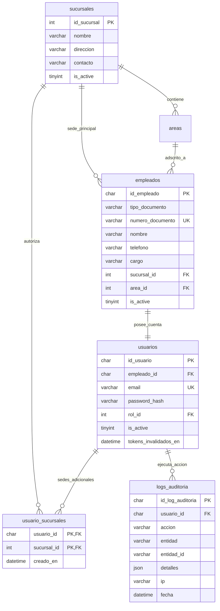
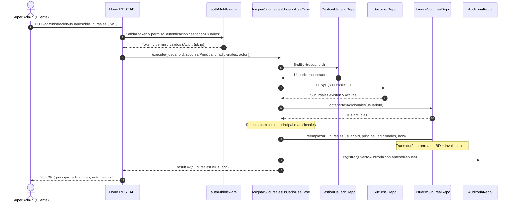

# Módulo de Administración y Auditoría — Warengine

> **Versión documentada:** Implementación completa (RF-ADM-C1 a C10 + RNF-ADM-02)  
> **Stack:** Deno · TypeScript · Drizzle ORM · MySQL 8 · Hono · Zod · Argon2  
> **Arquitectura:** Clean Architecture + SOLID + Ports & Adapters + Auditoría Inmutable

---

## Índice

1. [Visión general](#1-visión-general)
2. [Diagrama de capas y dependencias](#2-diagrama-de-capas-y-dependencias)
3. [Base de Datos — Esquema y Triggers](#3-base-de-datos)
4. [Core — Dominio y Casos de Uso](#4-core)
5. [Database — Repositorios e Infraestructura](#5-database-repositorios)
6. [Composition — Contenedor de Inyección de Dependencias](#6-composition)
7. [API REST — Rutas, Controladores y Contratos](#7-api-rest)
8. [Auditoría Inmutable y Sanitización de Datos](#8-auditoría-inmutable)
9. [RBAC — Permisos Requeridos](#9-rbac)
10. [Flujos de Datos Extremo a Extremo](#10-flujos-de-datos)
11. [Pruebas Automatizadas y Archivos HTTP](#11-pruebas-automatizadas)
12. [Reglas Críticas de Negocio y Seguridad](#12-reglas-críticas-de-negocio-y-seguridad)

---

## 1. Visión General

El módulo de **Administración** centraliza la gestión estructural de la empresa en Warengine: organización física (**sucursales**), talento humano y accesos (**usuarios y empleados**), asignación multisede (**sucursales autorizadas**), y trazabilidad forense (**auditoría inmutable**).

### Matriz de Requerimientos Funcionales

| Código | Funcionalidad | Descripción |
|---|---|---|
| **RF-ADM-C1** | Listar Sucursales | Consulta el catálogo completo de sucursales con su estado operativo. |
| **RF-ADM-C2** | Crear Sucursal | Alta de nuevos puntos físicos. Valida unicidad de nombre (*case-insensitive*) y registra auditoría. |
| **RF-ADM-C3** | Editar Sucursal | Modificación de nombre, dirección, contacto o estado activo/inactivo con auditoría diferencial (antes/después). |
| **RF-ADM-C5** | Listar Usuarios | Consulta de usuarios con filtros combinables por `rolId` y `sucursalId` (incluyendo sucursales adicionales). |
| **RF-ADM-C6** | Crear Usuario | Creación atómica en BD del registro de `empleados` y su cuenta `usuarios` con hash Argon2id y auditoría. |
| **RF-ADM-C7** | Cambiar Rol de Usuario | Modificación del rol asignado. Bloquea la revocación del último `super-admin` activo del sistema. |
| **RF-ADM-C8** | Cambiar Estado de Usuario | Activación/desactivación. Invalida tokens de sesión activos de inmediato e impide desactivar al último `super-admin`. |
| **RF-ADM-C9** | Restablecer Contraseña | Cambio forzado o administrativo de clave. Hashea con Argon2id e invalida todas las sesiones previas. |
| **RF-ADM-C10** | Asignación Multisede | Asignación de sucursal principal y adicionales en `usuario_sucursales`. Invalida tokens y audita cambios. |
| **RNF-ADM-02** | Registro de Auditoría | Trazabilidad inmutable de toda operación de creación/modificación/eliminación con usuario, IP, entidad y diferencias JSON. |

---

## 2. Diagrama de Capas y Dependencias

```
┌──────────────────────────────────────────────────────────┐
│                    apps/api (Hono)                       │
│  administracion.routes  →  controllers  →  middlewares   │
└──────────────────────┬───────────────────────────────────┘
                       │ usa
┌──────────────────────▼───────────────────────────────────┐
│           packages/composition / container.ts            │
│         (cableado central de inyección de dependencias)  │
└────┬──────────────────┬──────────────────┬───────────────┘
     │                  │                  │
┌────▼──────┐  ┌────────▼───────┐  ┌──────▼────────────────┐
     │          │    platform    │  │        core            │
│  database  │  │ Argon2Hasher   │  │ domain (entities/ports)│
│ Drizzle    │  │                │  │ use-cases              │
│ repos      │  └────────────────┘  │ (sin librerías ext.)   │
└────┬───────┘                      └──────┬─────────────────┘
     │                                     │
     └──────────────┬──────────────────────┘
                    │ dependen de
          ┌─────────▼──────────┐
          │  shared-kernel     │
          │  Result · Errors   │
          └────────────────────┘
```

- **Inversión de dependencias:** Los casos de uso de `core` se comunican con puertos abstractos (`ISucursalRepository`, `IGestionUsuarioRepository`, `IUsuarioSucursalRepository`, `IAuditor`).
- **Aislamiento del Dominio:** `core` no conoce Drizzle, MySQL, Hono ni HTTP.

---

## 3. Base de Datos

### 3.1 Tablas y Relaciones (Drizzle ORM)

**Rutas:**
- [`packages/database/src/schema/administracion.schema.ts`](file:///c:/Users/USUARIO/OneDrive/Pictures/Desktop/WARENGINE/Warengine/BACK/packages/database/src/schema/administracion.schema.ts)
- [`packages/database/src/schema/auditoria.schema.ts`](file:///c:/Users/USUARIO/OneDrive/Pictures/Desktop/WARENGINE/Warengine/BACK/packages/database/src/schema/auditoria.schema.ts)
- [`packages/database/src/schema/autenticacion.schema.ts`](file:///c:/Users/USUARIO/OneDrive/Pictures/Desktop/WARENGINE/Warengine/BACK/packages/database/src/schema/autenticacion.schema.ts)



### 3.2 Triggers de Protección e Inmutabilidad

1. **`trg_logs_auditoria_bloquea_update` / `delete`**: Protegen la tabla `logs_auditoria` impidiendo cualquier `UPDATE` o `DELETE` a nivel de motor MySQL, garantizando cumplimiento de **RNF-ADM-02**.
2. **`ON DELETE SET NULL`** en `logs_auditoria.usuario_id`: Si un usuario llega a ser eliminado, el registro histórico persiste sin violar la integridad referencial.
3. **Invalidación por triggers en BD**: Cambios en `usuario_sucursales` disparan la actualización de `tokens_invalidados_en` y revocación de `refresh_tokens`.

---

## 4. Core

**Ruta:** [`packages/core/src/modules/administracion/`](file:///c:/Users/USUARIO/OneDrive/Pictures/Desktop/WARENGINE/Warengine/BACK/packages/core/src/modules/administracion/)

### 4.1 Entidades de Dominio

- **`Sucursal`**: Modela un establecimiento físico (`id`, `nombre`, `direccion`, `contacto`, `isActive`).
- **`UsuarioGestionado`**: Modela el usuario en su vista administrativa completa (`id`, `nombre`, `email`, `rolId`, `rolNombre`, `sucursalId`, `sucursalNombre`, `isActive`).

### 4.2 Errores de Dominio (`AdministracionErrors.ts`)

| Error | Código | HTTP | Escenario |
|---|---|---|---|
| `SucursalNoEncontradaError` | `SUCURSAL_NO_ENCONTRADA` | 404 | ID de sucursal no existe en BD. |
| `SucursalDuplicadaError` | `SUCURSAL_DUPLICADA` | 400 | Intento de crear o renombrar con un nombre ya existente. |
| `SucursalInactivaError` | `SUCURSAL_INACTIVA` | 400 | Asignar a un usuario una sucursal inactiva que no tenía previamente. |
| `UsuarioNoEncontradoError` | `USUARIO_NO_ENCONTRADO` | 404 | ID de usuario no existe. |
| `EmailYaExisteError` | `EMAIL_DUPLICADO` | 400 | El correo electrónico ya está registrado. |
| `DocumentoYaExisteError` | `DOCUMENTO_DUPLICADO` | 400 | La combinación tipo y número de documento ya existe. |
| `RolInvalidoError` | `ROL_INVALIDO` | 400 | El `rolId` especificado no existe en el catálogo de roles. |
| `UltimoSuperAdminError` | `ULTIMO_SUPER_ADMIN` | 400 | Bloquea cambiar rol o desactivar al único super-admin activo restante. |
| `FiltroInvalidoError` | `FILTRO_INVALIDO` | 400 | Parámetros de consulta no conformes a las reglas. |

### 4.3 Puertos / Interfaces (`domain/repositories/`)

- [`ISucursalRepository`](file:///c:/Users/USUARIO/OneDrive/Pictures/Desktop/WARENGINE/Warengine/BACK/packages/core/src/modules/administracion/domain/repositories/ISucursalRepository.ts): `listar()`, `findById()`, `findByNombre()`, `crear()`, `actualizar()`.
- [`IGestionUsuarioRepository`](file:///c:/Users/USUARIO/OneDrive/Pictures/Desktop/WARENGINE/Warengine/BACK/packages/core/src/modules/administracion/domain/repositories/IGestionUsuarioRepository.ts): `listar(filtros)`, `findById()`, `existeEmail()`, `existeDocumento()`, `rolExiste()`, `contarSuperAdminsActivos()`, `crear()`, `actualizarRol()`, `actualizarEstado()`, `actualizarPassword()`.
- [`IUsuarioSucursalRepository`](file:///c:/Users/USUARIO/OneDrive/Pictures/Desktop/WARENGINE/Warengine/BACK/packages/core/src/modules/administracion/domain/repositories/IUsuarioSucursalRepository.ts): `obtenerIdsAdicionales()`, `reemplazarSucursales()`.
- [`IAuditoriaRepository`](file:///c:/Users/USUARIO/OneDrive/Pictures/Desktop/WARENGINE/Warengine/BACK/packages/core/src/modules/administracion/domain/repositories/IAuditoriaRepository.ts) / `IAuditor`: `registrar(evento)`, `consultar(filtros)`.

### 4.4 Casos de Uso Implementados

```
packages/core/src/modules/administracion/application/use-cases/
├── ListarSucursalesUseCase.ts
├── CrearSucursalUseCase.ts
├── EditarSucursalUseCase.ts
├── ListarUsuariosUseCase.ts
├── CrearUsuarioUseCase.ts
├── CambiarRolUsuarioUseCase.ts
├── CambiarEstadoUsuarioUseCase.ts
├── RestablecerPasswordUsuarioUseCase.ts
├── AsignarSucursalesUsuarioUseCase.ts
├── ObtenerSucursalesUsuarioUseCase.ts
└── ConsultarAuditoriaUseCase.ts
```

---

## 5. Database — Repositorios

**Ruta:** [`packages/database/src/repositories/administracion/`](file:///c:/Users/USUARIO/OneDrive/Pictures/Desktop/WARENGINE/Warengine/BACK/packages/database/src/repositories/administracion/)

1. **`DrizzleSucursalRepository`**: Consultas optimizadas con ordenamiento alfabético y soporte para búsquedas exactas/normalizadas.
2. **`DrizzleGestionUsuarioRepository`**:
   - `listar(filtros)`: Realiza `INNER JOIN` entre `usuarios`, `empleados`, `roles` y `sucursales`. Soporta filtrado por `sucursalId` contemplando tanto la principal (`empleados.sucursal_id`) como las adicionales (`usuario_sucursales.sucursal_id`).
   - `crear(datos)`: Ejecuta una **transacción Drizzle atómica** (`tx.insert(empleados)` y `tx.insert(usuarios)`).
3. **`DrizzleUsuarioSucursalRepository`**:
   - `reemplazarSucursales(...)`: En una sola transacción actualiza la sede principal en `empleados`, borra e inserta las nuevas adicionales en `usuario_sucursales`, actualiza `tokens_invalidados_en` y revoca los `refresh_tokens`.
4. **`DrizzleAuditoriaRepository`**:
   - `registrar(...)`: Persiste eventos sanitizados en `logs_auditoria`.
   - `consultar(...)`: Aplica paginación (`limit`, `offset`) y filtros dinámicos por `usuarioId`, `entidad`, `accion` y rango de fechas.

---

## 6. Composition

**Ruta:** [`packages/composition/src/container.ts`](file:///c:/Users/USUARIO/OneDrive/Pictures/Desktop/WARENGINE/Warengine/BACK/packages/composition/src/container.ts)

El contenedor instancia la base de datos, los repositorios y servicios de plataforma (`Argon2PasswordHasher`), inyectándolos en cada caso de uso:

```typescript
// Repositorios
const sucursalRepository = new DrizzleSucursalRepository(db);
const gestionUsuarioRepository = new DrizzleGestionUsuarioRepository(db);
const usuarioSucursalRepository = new DrizzleUsuarioSucursalRepository(db);
const auditoriaRepository = new DrizzleAuditoriaRepository(db);

// Casos de Uso Administración
const listarSucursalesUseCase = new ListarSucursalesUseCase(sucursalRepository);
const crearSucursalUseCase = new CrearSucursalUseCase(sucursalRepository, auditoriaRepository);
const editarSucursalUseCase = new EditarSucursalUseCase(sucursalRepository, auditoriaRepository);
const listarUsuariosUseCase = new ListarUsuariosUseCase(gestionUsuarioRepository);
const crearUsuarioUseCase = new CrearUsuarioUseCase(
  gestionUsuarioRepository,
  sucursalRepository,
  passwordHasher,
  auditoriaRepository,
);
const cambiarRolUsuarioUseCase = new CambiarRolUsuarioUseCase(gestionUsuarioRepository, auditoriaRepository);
const cambiarEstadoUsuarioUseCase = new CambiarEstadoUsuarioUseCase(gestionUsuarioRepository, auditoriaRepository);
const restablecerPasswordUsuarioUseCase = new RestablecerPasswordUsuarioUseCase(
  gestionUsuarioRepository,
  passwordHasher,
  auditoriaRepository,
);
const asignarSucursalesUsuarioUseCase = new AsignarSucursalesUsuarioUseCase(
  gestionUsuarioRepository,
  sucursalRepository,
  usuarioSucursalRepository,
  auditoriaRepository,
);
const obtenerSucursalesUsuarioUseCase = new ObtenerSucursalesUsuarioUseCase(
  gestionUsuarioRepository,
  sucursalRepository,
  usuarioSucursalRepository,
);
const consultarAuditoriaUseCase = new ConsultarAuditoriaUseCase(auditoriaRepository);
```

---

## 7. API REST

**Ruta:** [`apps/api/src/routes/administracion.routes.ts`](file:///c:/Users/USUARIO/OneDrive/Pictures/Desktop/WARENGINE/Warengine/BACK/apps/api/src/routes/administracion.routes.ts)  
**Contratos Zod:** [`SHARED/contracts/src/index.ts`](file:///c:/Users/USUARIO/OneDrive/Pictures/Desktop/WARENGINE/Warengine/SHARED/contracts/src/index.ts)

### Endpoints Expuestos

| Método | Endpoint | Permiso Requerido | Controlador |
|---|---|---|---|
| `GET` | `/administracion/sucursales` | `administracion:gestionar-sucursales` | `listarSucursalesController` |
| `POST` | `/administracion/sucursales` | `administracion:gestionar-sucursales` | `crearSucursalController` |
| `PUT` | `/administracion/sucursales/:id` | `administracion:gestionar-sucursales` | `editarSucursalController` |
| `GET` | `/administracion/usuarios` | `autenticacion:gestionar-usuarios` | `listarUsuariosController` |
| `POST` | `/administracion/usuarios` | `autenticacion:gestionar-usuarios` | `crearUsuarioController` |
| `PUT` | `/administracion/usuarios/:id/rol` | `autenticacion:asignar-roles` | `cambiarRolUsuarioController` |
| `PUT` | `/administracion/usuarios/:id/estado` | `autenticacion:gestionar-usuarios` | `cambiarEstadoUsuarioController` |
| `PUT` | `/administracion/usuarios/:id/password` | `autenticacion:gestionar-usuarios` | `restablecerPasswordUsuarioController` |
| `GET` | `/administracion/usuarios/:id/sucursales` | `autenticacion:gestionar-usuarios` | `obtenerSucursalesUsuarioController` |
| `PUT` | `/administracion/usuarios/:id/sucursales` | `autenticacion:gestionar-usuarios` | `asignarSucursalesUsuarioController` |
| `GET` | `/administracion/auditoria` | `autenticacion:ver-auditoria` | `consultarAuditoriaController` |

---

## 8. Auditoría Inmutable

Cada mutación en el módulo de administración genera un `EventoAuditoria` estructurado:

```typescript
export interface EventoAuditoria {
  accion: 'crear' | 'editar' | 'inactivar' | 'reactivar' | 'restablecer_password';
  entidad: 'sucursales' | 'usuarios';
  entidadId: string;
  actor: { usuarioId: string; ip: string };
  detalles?: {
    antes?: Record<string, unknown>;
    despues?: Record<string, unknown>;
  };
}
```

### Reglas de Sanitización de Auditoría
- **Contraseñas y Tokens:** **NUNCA** se persisten contraseñas en texto claro ni hashes en los logs de auditoría. El cambio de contraseña solo registra la acción (`restablecer_password`) sin payloads de credenciales.
- **Auditoría Diferencial:** Las ediciones solo guardan las claves que cambiaron efectivamente (comparación de estado anterior vs. nuevo). Si un PUT no produce cambios, no se genera log redundante.

---

## 9. RBAC

El acceso está restringido mediante el middleware `authMiddleware(container, permisoRequerido)`:

```typescript
// Constantes de permisos en BD
const PERMISO_SUCURSALES = 'administracion:gestionar-sucursales';
const PERMISO_USUARIOS   = 'autenticacion:gestionar-usuarios';
const PERMISO_ROLES      = 'autenticacion:asignar-roles';
const PERMISO_AUDITORIA  = 'autenticacion:ver-auditoria';
```

---

## 10. Flujos de Datos

### Flujo: Asignación de Sucursales a Usuario (RF-ADM-C10)



---

## 11. Pruebas Automatizadas

### 11.1 Pruebas Unitarias de Casos de Uso (`deno test`)

- [`asignar-sucursales-usuario.use-case.test.ts`](file:///c:/Users/USUARIO/OneDrive/Pictures/Desktop/WARENGINE/Warengine/BACK/packages/core/tests/administracion/asignar-sucursales-usuario.use-case.test.ts)
- [`auditoria-operaciones.use-case.test.ts`](file:///c:/Users/USUARIO/OneDrive/Pictures/Desktop/WARENGINE/Warengine/BACK/packages/core/tests/administracion/auditoria-operaciones.use-case.test.ts)
- [`consultar-auditoria.use-case.test.ts`](file:///c:/Users/USUARIO/OneDrive/Pictures/Desktop/WARENGINE/Warengine/BACK/packages/core/tests/administracion/consultar-auditoria.use-case.test.ts)
- [`restablecer-password-usuario.use-case.test.ts`](file:///c:/Users/USUARIO/OneDrive/Pictures/Desktop/WARENGINE/Warengine/BACK/packages/core/tests/administracion/restablecer-password-usuario.use-case.test.ts)

Para ejecutar todas las pruebas:
```bash
deno test --allow-all
```

### 11.2 Colecciones HTTP (REST Client)

- [`http/02-sucursales.http`](file:///c:/Users/USUARIO/OneDrive/Pictures/Desktop/WARENGINE/Warengine/http/02-sucursales.http): Casos de creación, edición, unicidad insensible a mayúsculas y validaciones.
- [`http/03-usuarios.http`](file:///c:/Users/USUARIO/OneDrive/Pictures/Desktop/WARENGINE/Warengine/http/03-usuarios.http): Creación de empleados/usuarios, cambio de rol, bloqueo de último super-admin y reseteo de clave.
- [`http/04-auditoria.http`](file:///c:/Users/USUARIO/OneDrive/Pictures/Desktop/WARENGINE/Warengine/http/04-auditoria.http): Consulta de logs, filtros combinados y verificación de inmutabilidad.
- [`http/05-usuario-sucursales.http`](file:///c:/Users/USUARIO/OneDrive/Pictures/Desktop/WARENGINE/Warengine/http/05-usuario-sucursales.http): Asignación y consulta de sucursales autorizadas e invalidación de sesiones.

---

## 12. Reglas Críticas de Negocio y Seguridad

1. **Protección del Super Admin:** La regla de negocio `contarSuperAdminsActivos() > 1` es inviolable: el sistema jamás permite degradar el rol ni inactivar la cuenta del último superadministrador activo.
2. **Invalidación Inmediata de Sesiones:** Cuando a un usuario se le desactiva, se le cambia la contraseña o se le modifican sus sucursales autorizadas, el backend actualiza `tokens_invalidados_en = CURRENT_TIMESTAMP` y revoca los registros en `refresh_tokens`, expulsando inmediatamente sesiones comprometidas o desactualizadas.
3. **Unicidad Normalizada:** Los nombres de sucursales se comparan de forma insensible a mayúsculas/minúsculas para evitar duplicados como `"Sede Norte"` y `"SEDE NORTE"`.
4. **Inmutabilidad Absoluta de Auditoría:** Ningún endpoint ni usuario (ni siquiera el superadministrador) puede alterar ni suprimir registros de `logs_auditoria`.
